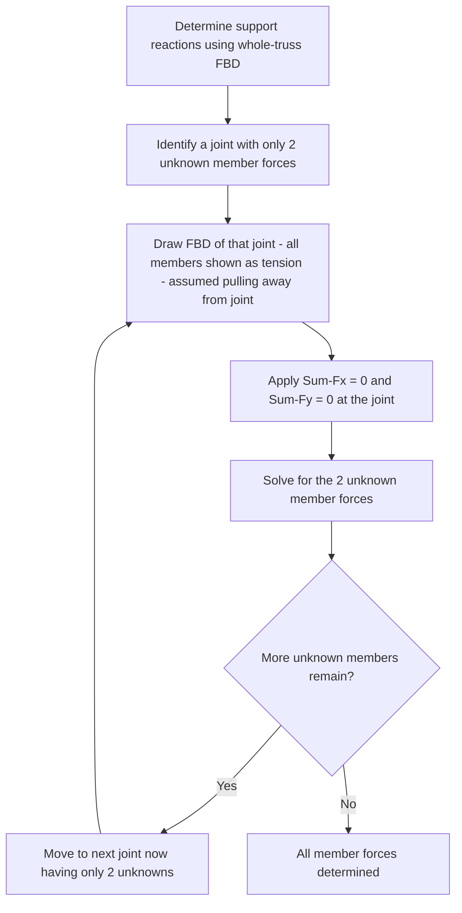

## Analysis of Trusses


### Definition and Scope

A truss is a structural system composed of straight, slender members connected at their ends by joints (idealized as frictionless pins), arranged so that loads are carried purely as axial tension or compression within each member, with no internal bending, shear, or moment. This idealization makes trusses highly material-efficient for spanning long distances (bridges, roof structures, towers) and reduces the analysis to a system of concurrent-force particle equilibrium problems at each joint.

### Fundamental Assumptions of Simple Truss Analysis

**Key Points:**

- All members are **two-force members**: loaded only at their two end joints, with no load applied along their length — this is what forces each member to carry purely axial force (tension or compression), per the two-force member principle (see Equilibrium of Particles and Rigid Bodies).
- All joints are treated as **frictionless pins**, transmitting force but not moment between connected members. Real riveted, bolted, or welded connections have some rotational stiffness, but the pin-joint idealization is standard practice and generally provides acceptable accuracy for typical truss geometries and loading. [Inference: the accuracy of the pin-joint idealization versus a more rigorous rigid-joint (frame) analysis depends on specific joint stiffness and member proportions; this is a standard simplifying assumption in introductory statics rather than a universally exact physical description.]
- All external loads and support reactions are applied **only at joints**, never along the length of a member — if a real load must be applied mid-member, an additional joint is typically introduced at that location in the idealized model.
- Members are assumed weightless, or, if self-weight is considered, it is typically approximated by splitting each member's weight equally between its two end joints.

### Classification of Trusses

**Simple Truss**: Constructed by starting with a basic triangular unit and successively adding two new members and one new joint at a time — this construction method guarantees a statically stable, determinate configuration (assuming appropriate external support conditions).

**Compound Truss**: Formed by connecting two or more simple trusses together, typically via a common joint plus an additional connecting member, or via three non-parallel, non-concurrent connecting members/links.

**Complex Truss**: A truss configuration that is neither simple nor compound by the above construction definitions — these often require more advanced solution techniques than the standard method of joints or sections alone.

### Statical Determinacy of Trusses

For a **simple, statically determinate, stable planar truss**, the following relationship between members ($m$), joints ($j$), and reaction components ($r$) must hold:

$$m + r = 2j$$

- If $m + r = 2j$: statically determinate (solvable by statics alone).
- If $m + r > 2j$: statically indeterminate (excess members/reactions; requires compatibility/deformation methods beyond statics).
- If $m + r < 2j$: unstable (insufficient members/reactions to maintain equilibrium as a rigid assembly).

**Key Points:** This member-joint-reaction count is a **necessary but not sufficient** condition for stability — a truss can satisfy $m + r = 2j$ numerically while still being unstable due to improper member arrangement (e.g., members arranged such that a joint or sub-region can still mechanism/collapse despite the correct total count). Geometric stability must always be checked in addition to the counting formula. [Inference: the counting formula is a standard, well-established necessary condition; it does not replace careful geometric/stability inspection of the specific truss arrangement.]

**Worked Example: Determinacy Check**

A truss has 5 joints, 7 members, and is supported by a pin (2 reactions) and a roller (1 reaction), giving $r = 3$.

$$m + r = 7 + 3 = 10, \quad 2j = 2(5) = 10$$

Since $m + r = 2j$, the truss is statically determinate (pending confirmation of proper geometric arrangement).

### Method of Joints

The method of joints solves for member forces by successively applying particle equilibrium ($\sum F_x = 0$, $\sum F_y = 0$) at each joint, proceeding from a joint with only two unknown member forces to the next.



**Key Points:**

- Because each joint provides only 2 independent equations (2D), the method proceeds joint-by-joint, always selecting the next joint such that no more than 2 unknown member forces remain at that joint.
- Standard sign convention: assume every unknown member force is **tension** (pulling away from the joint) when drawing each joint FBD. A resulting **positive** value confirms tension; a **negative** value indicates the member is actually in **compression**.
- **Zero-force members** can often be identified by inspection, without any calculation, using two special-case rules:
  1. If only **two non-collinear members** meet at a joint with **no external load or reaction** applied at that joint, both members are zero-force members.
  2. If **three members** meet at a joint with **no external load**, and **two of the three members are collinear**, the third (non-collinear) member is a zero-force member (the two collinear members carry equal force to each other).

**Worked Example: Method of Joints**

Consider a simple triangular truss with joint $A$ at the left support (pin), joint $B$ at the right support (roller), and joint $C$ at the apex, with a vertical load $P = 20$ kN applied downward at $C$. Members $AC$ and $BC$ each make $50°$ with the horizontal; span $AB = 8$ m.

**Step 1 — Support reactions** (whole-truss FBD, by symmetry since the load is at the apex and geometry is symmetric):

$$A_y = B_y = \frac{P}{2} = 10 \text{ kN}, \quad A_x = 0$$

**Step 2 — Joint C (apex, two unknowns: $F_{AC}$, $F_{BC}$):**

By symmetry, $F_{AC} = F_{BC}$ in magnitude. Vertical equilibrium at joint $C$:

$$\sum F_y = 0: \quad -F_{AC}\sin(50°) - F_{BC}\sin(50°) - (-P) = 0$$

(with both members assumed in tension, pulling away from C, i.e., downward-and-outward components must balance the applied downward load — proper sign handling depends on geometry orientation; magnitude result:)

$$2F_{AC}\sin(50°) = P \implies F_{AC} = \frac{20}{2\sin(50°)} = \frac{20}{1.532} = 13.05 \text{ kN}$$

Since the members must push outward/upward at C to support the downward load when C is the apex above the supports, both $F_{AC}$ and $F_{BC}$ are found to be **compressive** (negative under the assumed-tension convention) — physically consistent with a simple triangular truss where the inclined top members are in compression under a downward apex load, resisted by tension in the bottom chord.

**Step 3 — Joint A (now one remaining unknown, $F_{AB}$):**

$$\sum F_x = 0: \quad F_{AB} + F_{AC}\cos(50°) = 0 \implies F_{AB} = -F_{AC}\cos(50°) = -(-13.05)(0.643) = 8.39 \text{ kN (tension)}$$

[Illustrative worked example demonstrating method; specific sign handling depends on precisely defined joint FBD orientation and assumed positive directions, which should be drawn explicitly and consistently in practice.]

### Method of Sections

The method of sections solves for the force in a **specific member of interest**, without needing to solve for every member sequentially from a support, by making an imaginary cut through the truss (severing no more than 3 members, generally, since only 3 independent equilibrium equations are available for the resulting rigid-body section) and applying rigid-body equilibrium ($\sum F_x = 0$, $\sum F_y = 0$, $\sum M = 0$) to one of the two resulting sections.

```mermaid
flowchart TD
    A[Determine support reactions using whole-truss FBD] --> B[Choose a section cutting through no more than 3 members, including the member of interest]
    B --> C[Isolate one side of the cut section as a rigid body FBD]
    C --> D[Show internal member forces at the cut, assumed tension]
    D --> E[Apply Sum-Fx=0, Sum-Fy=0, Sum-M=0 - choosing moment point strategically to isolate one unknown per equation]
    E --> F[Solve directly for member force(s) of interest]
```

**Key Points:**

- The method of sections is generally more efficient than the method of joints when only one or a few specific member forces (often in the middle of a large truss) are required, since it avoids sequentially solving through every joint from a support to reach the member of interest.
- **Strategic moment point selection** is the key technique: choosing the moment reference point as the intersection of two of the three cut members' lines of action eliminates those two unknowns from that particular moment equation, directly solving for the third member's force in one step.
- If a section must cut more than 3 members to isolate the member of interest, the method of sections alone (with only 3 equilibrium equations available) cannot uniquely solve for all cut member forces directly; either a different section location must be found, or the method must be combined with additional joint analysis.

**Worked Example: Method of Sections**

A horizontal (Pratt-type) truss, top chord and bottom chord parallel and separated by height $h = 3$ m, with a section cut through the top chord member $CD$, diagonal member $CG$, and bottom chord member $FG$. The left portion of the truss (after cutting) carries known support reaction $A_y = 15$ kN and an applied load, and the cut is located such that we want to find $F_{CD}$ (top chord force).

Taking moments about point $G$ (the intersection of the diagonal $CG$ and bottom chord $FG$ lines of action, eliminating both from this equation):

$$\sum M_G = 0: \quad -A_y(x_{AG}) + F_{CD} \cdot h = 0$$

where $x_{AG}$ is the horizontal distance from support $A$ to point $G$. Solving directly gives $F_{CD}$ without needing $F_{CG}$ or $F_{FG}$.

[Illustrative structure of the method; specific numeric values depend on the particular truss geometry and loading, which vary by problem — the technique of strategic moment-point selection to eliminate two of three unknowns is the generalizable principle.]

### Illustration: Zero-Force Member Identification Rules

<svg xmlns="http://www.w3.org/2000/svg" viewBox="0 0 560 260">
<title>Zero-Force Member Rules (svg_diagram)</title>
<rect width="560" height="260" fill="#ffffff" />
<text x="20" y="25" fill="#333" font-size="14" font-family="sans-serif" font-weight="bold">Rule 1: Two non-collinear members, no load at joint</text>
<circle cx="100" cy="110" r="5" fill="#333" />
<line x1="100" y1="110" x2="180" y2="60" stroke="#555" stroke-width="4" />
<line x1="100" y1="110" x2="180" y2="160" stroke="#555" stroke-width="4" />
<text x="60" y="200" fill="#c81e1e" font-size="13" font-family="sans-serif">Both members = zero force</text>
<text x="300" y="25" fill="#333" font-size="14" font-family="sans-serif" font-weight="bold">Rule 2: Two collinear + one non-collinear, no load</text>
<circle cx="380" cy="110" r="5" fill="#333" />
<line x1="300" y1="110" x2="380" y2="110" stroke="#555" stroke-width="4" />
<line x1="380" y1="110" x2="460" y2="110" stroke="#555" stroke-width="4" />
<line x1="380" y1="110" x2="440" y2="60" stroke="#555" stroke-width="4" />
<text x="320" y="200" fill="#c81e1e" font-size="13" font-family="sans-serif">Non-collinear member = zero force</text>
</svg>

### Space Trusses (3D Extension)

**Key Points:**

- 3D truss analysis extends the same fundamental principles: each joint is a particle in 3D equilibrium, providing 3 equations ($\sum F_x, \sum F_y, \sum F_z = 0$) rather than 2, allowing up to 3 unknown member forces to be solved per joint.
- Member forces are typically constructed via the position-vector (two-point) unit vector method (see Force Systems and Vector Operations), since direction angles for spatial members are rarely given directly.
- The determinacy condition extends to $m + r = 3j$ for a statically determinate, stable space truss, analogous to the 2D formula.

### Compressive Buckling Consideration (Brief Note)

**Key Points:** While the equilibrium analysis of a truss determines the *magnitude* of axial force in each member (tension or compression) based purely on statics, a member found to carry **compressive** force additionally requires separate checking against **buckling** capacity (a mechanics-of-materials/structural-design consideration governed by member slenderness, not by statics equilibrium alone) — a truss analysis solution provides the required design force, but adequacy of a specific member's cross-section against that compressive force is a distinct subsequent design step outside the scope of the statics equilibrium solution itself.

### Related Topics

- Equilibrium of Particles and Rigid Bodies
- Free Body Diagrams
- Force Systems and Vector Operations
- Analysis of Frames and Machines
- Statical Determinacy and Stability of Structures
- Buckling of Compression Members (Mechanics of Materials)
- Shear Force and Bending Moment Diagrams