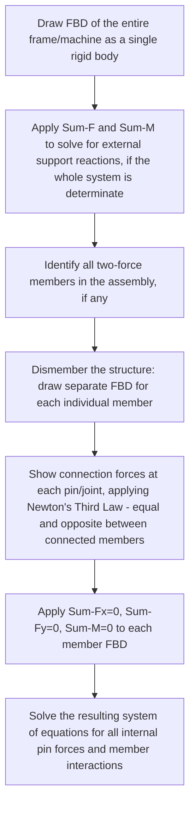

## Analysis of Frames and Machines

### Definition and Scope

Frames and machines are structures composed of connected rigid members, distinguished from trusses by containing at least one **multi-force member** — a member acted upon by three or more forces, or subjected to load along its length rather than only at its two end joints. This fundamental distinction means individual members can no longer be assumed to carry purely axial force; they may experience bending and shear in addition to axial load, requiring a member-by-member equilibrium analysis rather than the simple joint/section methods applicable to pure trusses.

**Key Points:**

- **Frames**: Generally stationary structures designed to support applied loads (e.g., a bracket, a support structure, a building frame subassembly).
- **Machines**: Structures containing moving parts, designed to transmit and modify forces or motion (e.g., pliers, clamps, hydraulic lifting mechanisms, hoisting devices).
- Both are analyzed using the same fundamental approach: because at least one member carries load at more than two points, the two-force-member simplification (central to truss analysis) does not apply to that member, and full rigid-body equilibrium ($\sum F_x = 0$, $\sum F_y = 0$, $\sum M = 0$) must be applied to each individual member.

### Fundamental Analysis Strategy

**Key Points:**

- The overall (whole-system) FBD is analyzed first, when the external support arrangement permits, to determine external reactions using the same rigid-body equilibrium principles covered under Equilibrium of Rigid Bodies.
- The structure is then **dismembered**: each individual multi-force member is isolated with its own FBD, showing every force acting on it, including forces transmitted through pin connections to adjacent members.
- **Newton's Third Law** governs the relationship between connected member FBDs: the force that member $A$ exerts on member $B$ at their shared pin connection must be drawn equal in magnitude and opposite in direction to the force member $B$ exerts on member $A$ at that same pin.
- Any **two-force members** within the assembly (members loaded only at their two end connections, with no other applied load) can still be treated using the simplified two-force-member principle (force purely along the line connecting the two end points) — a frame or machine can contain a mixture of two-force members and multi-force members, and correctly identifying which is which significantly simplifies the analysis.

### Distinguishing Two-Force Members Within a Frame

**Key Points:**

- A member is a two-force member **only if** it has exactly two points of force application (typically pin connections at each end) and **no other load** (no applied force along its length, no self-weight considered, no directly applied moment) between those two points.
- If a member has a load applied at a third point along its length (even if pinned at both ends), it is **not** a two-force member and must be treated as a multi-force member, requiring the full 3-equation rigid-body equilibrium treatment.
- Correctly distinguishing these member types before beginning detailed analysis is the single most important strategic step in solving frame and machine problems efficiently — misclassifying a multi-force member as a two-force member (or vice versa) leads directly to an incorrect solution.

### Worked Example: Simple Frame with One Multi-Force Member

Consider a frame consisting of member $AB$ (pinned to a wall at $A$ and pinned to member $BC$ at $B$) and member $BC$ (pinned to member $AB$ at $B$ and supported by a roller at $C$), with an external vertical load $P$ applied at the midpoint of member $AB$.

**Classification:**

- Member $AB$: has the applied load $P$ along its length (not just at its two end pins) → **multi-force member**, requires full equilibrium ($\sum F_x, \sum F_y, \sum M$).
- Member $BC$: loaded only at its two ends (pin at $B$, roller at $C$) with no other load → **two-force member**, force along line $BC$ only.

**Solution Strategy:**

Because $BC$ is a two-force member, the pin force at $B$ acting on member $AB$ (from member $BC$) is known to act along the line $BC$ — this immediately reduces the unknowns in member $AB$'s FBD, since only the magnitude of this force (not its direction) remains unknown, in addition to the pin reactions at $A$.

**FBD of member $AB$:**

$$\sum M_A = 0: \quad -P\left(\frac{L_{AB}}{2}\right) + F_{BC}\sin\theta \cdot L_{AB} = 0$$

where $\theta$ is the angle member $BC$ makes with member $AB$, and $L_{AB}$ is the length of member $AB$. Solving:

$$F_{BC} = \frac{P}{2\sin\theta}$$

Once $F_{BC}$ is known, the remaining reactions at $A$ ($A_x$, $A_y$) follow directly from $\sum F_x = 0$ and $\sum F_y = 0$ on member $AB$'s FBD.

[Illustrative structure of the method; specific angle and geometry values determine final numeric results — the key generalizable technique is recognizing $BC$ as a two-force member to simplify the unknowns before writing equilibrium equations for the multi-force member $AB$.]

### Worked Example: Machine — Pliers/Clamping Mechanism

A pair of pliers (or a bolt cutter, clamp, or similar toggle mechanism) is a classic machine analysis problem: two handle members are pinned together at a central pivot, with a jaw or clamping surface at one end and an applied hand-grip force at the other.

**Analysis approach:**

1. Draw the FBD of one handle member alone (isolating it from the pivot pin and from the workpiece/jaw contact).
2. Show the applied grip force, the pin reaction at the central pivot, and the clamping force exerted on the workpiece at the jaw.
3. Apply $\sum M$ about the pivot pin (this eliminates the pivot pin reaction from the equation, since it passes through the moment point), directly relating the applied grip force to the resulting clamping force via the ratio of lever-arm distances:

$$\sum M_{pivot} = 0: \quad F_{grip} \cdot d_{grip} = F_{clamp} \cdot d_{clamp}$$

$$F_{clamp} = F_{grip} \times \frac{d_{grip}}{d_{clamp}}$$

**Key Points:** This illustrates the core mechanical-advantage principle exploited by nearly all hand-tool machines (pliers, bolt cutters, wrenches, clamps): a small applied force over a long lever arm produces a much larger output force over a short lever arm, governed entirely by moment equilibrium about the pivot — this is a direct, practical application of rigid-body moment balance rather than a separate distinct principle.

### Illustration: Dismemberment Technique for a Frame

<svg xmlns="http://www.w3.org/2000/svg" viewBox="0 0 560 260">
<title>Frame Dismemberment - Newton's Third Law at Shared Pin (svg_diagram)</title>
<rect width="560" height="260" fill="#ffffff" />
<text x="20" y="25" fill="#333" font-size="14" font-family="sans-serif" font-weight="bold">Member AB (isolated)</text>
<line x1="40" y1="150" x2="200" y2="80" stroke="#555" stroke-width="8" stroke-linecap="round" />
<circle cx="40" cy="150" r="6" fill="#333" />
<circle cx="200" cy="80" r="6" fill="#333" />
<text x="10" y="175" fill="#333" font-size="12" font-family="sans-serif">A</text>
<text x="210" y="80" fill="#333" font-size="12" font-family="sans-serif">B</text>
<line x1="200" y1="80" x2="240" y2="40" stroke="#1a56db" stroke-width="2" />
<polygon points="240,40 222,44 230,54" fill="#1a56db" />
<text x="240" y="35" fill="#1a56db" font-size="12" font-family="sans-serif">Force from BC on AB</text>
<text x="300" y="25" fill="#333" font-size="14" font-family="sans-serif" font-weight="bold">Member BC (isolated)</text>
<line x1="360" y1="80" x2="500" y2="150" stroke="#555" stroke-width="8" stroke-linecap="round" />
<circle cx="360" cy="80" r="6" fill="#333" />
<circle cx="500" cy="150" r="6" fill="#333" />
<text x="365" y="75" fill="#333" font-size="12" font-family="sans-serif">B</text>
<text x="505" y="150" fill="#333" font-size="12" font-family="sans-serif">C</text>
<line x1="360" y1="80" x2="320" y2="120" stroke="#c81e1e" stroke-width="2" />
<polygon points="320,120 338,116 330,106" fill="#c81e1e" />
<text x="230" y="130" fill="#c81e1e" font-size="12" font-family="sans-serif">Force from AB on BC (equal, opposite)</text>
</svg>

### Determinacy Considerations for Frames and Machines

**Key Points:**

- Unlike simple trusses, there is no single universal counting formula analogous to $m + r = 2j$ for general frames and machines, because multi-force members introduce additional unknown internal force components (typically 2 unknowns per pin connection between two members, rather than a single axial force as in a truss).
- Determinacy is instead typically assessed by comparing the total number of unknowns (external reactions plus internal pin-connection force components) against the total number of independent equilibrium equations available (3 per rigid member, since each member individually provides $\sum F_x, \sum F_y, \sum M$).
- If a frame or machine is properly modeled, dismembered, and each member's equilibrium equations are written, a determinate system will yield exactly enough independent equations to solve for all unknowns simultaneously — often solved as a system of linear equations across multiple member FBDs, rather than the more sequential, joint-by-joint approach usable for simple determinate trusses.

### Special Case: Pin Connecting More Than Two Members

**Key Points:** When three or more members (or a member plus an external load/support) meet at a single common pin, care must be taken in how the pin force is distributed among the connected members in the dismembered FBDs — a common approach is to introduce the pin itself as a separate small FBD (a zero-size "particle" in equilibrium) if the force distribution among the multiple connected members is not otherwise obvious from the problem's geometry and loading, ensuring consistent force accounting across all connected members. [Inference: the specific handling technique (treating the pin as its own FBD vs. directly assigning forces) is a modeling choice suited to the specific connection configuration, applied as needed for clarity rather than as a single universally mandated procedure.]

### Comparative Summary: Trusses vs. Frames/Machines

| Aspect | Truss | Frame/Machine |
| --- | --- | --- |
| Member force type | Purely axial (tension/compression) | Axial, shear, and bending possible |
| Governing member assumption | All members two-force | At least one multi-force member |
| Load application | Only at joints | Along member length permitted |
| Solution equations per member/joint | 2 (joint, particle equilibrium) | 3 (member, full rigid-body equilibrium) |
| Typical solution method | Method of joints / method of sections | Dismemberment + rigid-body equilibrium per member |

### Related Topics

- Equilibrium of Particles and Rigid Bodies
- Analysis of Trusses
- Free Body Diagrams
- Force Systems and Vector Operations
- Shear Force and Bending Moment Diagrams (Mechanics of Materials)
- Statical Determinacy and Stability of Structures
- Mechanical Advantage and Simple Machines