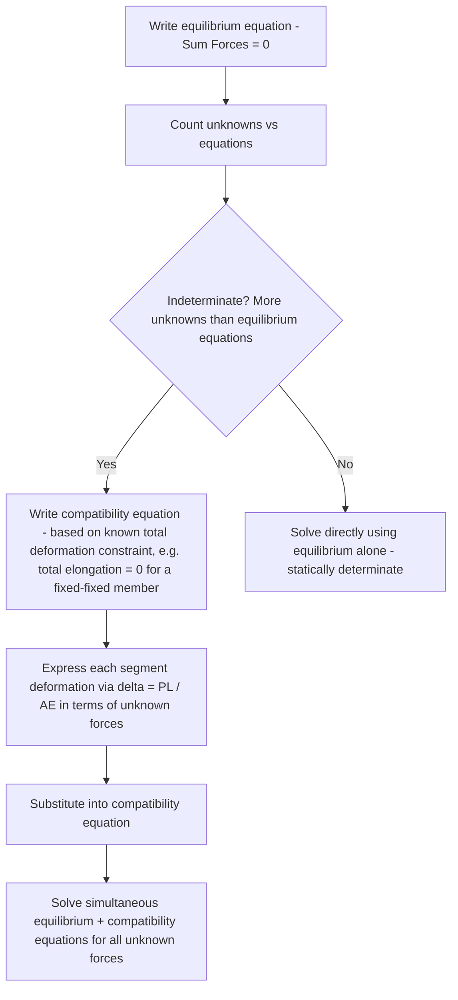

## Axial Loading and Deformation

### Definition and Scope

Axial loading refers to forces applied along the longitudinal centroidal axis of a straight structural member, producing a uniform normal stress distribution across the cross-section and corresponding axial deformation (elongation under tension, shortening under compression). This topic bridges statics (which determines the axial force magnitude via equilibrium) and mechanics of materials proper (which relates that force to internal stress, strain, and resulting deformation) — forming the foundation for analyzing truss members, columns, tie rods, bolts, and any member subjected primarily to tension or compression along its length.

### Normal Stress Under Axial Load

**Definition**

$$\sigma = \frac{P}{A}$$

where $\sigma$ is the normal stress (assumed uniform across the cross-section), $P$ is the internal axial force (tension positive, compression negative, by common convention), and $A$ is the cross-sectional area.

**Key Points:**

- This uniform-stress-distribution assumption is valid provided the load is applied through the centroid of the cross-section (true axial loading, with no accompanying bending) and **away from immediate load-application points** — near concentrated load points (bolt holes, connection plates, abrupt cross-section changes), stress distribution becomes non-uniform due to **stress concentration** effects, and the simple $P/A$ formula does not accurately describe local stress in those immediate regions (see Saint-Venant's Principle below).
- Units: stress carries dimensions of force per unit area (Pa, MPa, psi, ksi).

### Saint-Venant's Principle

**Key Points:** Saint-Venant's Principle states that the specific manner in which a load is applied (concentrated point load, distributed load, load through a pin, etc.) affects the stress distribution significantly only in the immediate vicinity of the load application point; at a distance from the load application point roughly comparable to the largest cross-sectional dimension of the member, the stress distribution becomes essentially uniform (approaching the simple $P/A$ result) regardless of the precise loading detail. This principle justifies applying the simple average-stress formula $\sigma = P/A$ throughout most of a member's length, while requiring more detailed (and typically higher) stress consideration only near load application points, holes, and abrupt geometric changes.

### Normal Strain Under Axial Load

$$\epsilon = \frac{\delta}{L}$$

where $\epsilon$ is normal strain (dimensionless, or expressed as length/length), $\delta$ is the total elongation (or shortening) of the member, and $L$ is the original (undeformed) length.

**Key Points:** Strain represents the *fractional* change in length, making it a dimensionless quantity independent of the member's original size — this normalization allows meaningful comparison of deformation behavior across members of different lengths subjected to the same stress level.

### Hooke's Law and the Stress-Strain Relationship

For materials behaving in a **linearly elastic** manner (within the proportional limit of the material's stress-strain curve):

$$\sigma = E\epsilon$$

where $E$ is the **modulus of elasticity** (Young's modulus), a material property representing the slope of the linear (initial) portion of the stress-strain curve.

**Key Points:**

- $E$ has the same units as stress (Pa, MPa, GPa, psi, ksi) since strain is dimensionless.
- Typical structural material values (representative, not universal): steel $E \approx 200$ GPa, aluminum $E \approx 70$ GPa, and concrete $E$ varies considerably (commonly in the range of roughly 20–30 GPa) depending on specific mix design and strength — concrete's modulus is notably more variable between specific mixes than steel's, which is a comparatively consistent, well-controlled manufactured material property. [Unverified: specific modulus values depend on exact material grade, temperature, and (for concrete) mix design and curing; design calculations should reference the specific material's tested or code-specified value rather than these representative figures.]

### Axial Deformation Formula

Combining $\sigma = P/A$, $\epsilon = \delta/L$, and Hooke's law $\sigma = E\epsilon$:

$$\delta = \frac{PL}{AE}$$

**Key Points:** This is the single most frequently applied formula in axial loading problems, valid for a **prismatic** member (constant cross-section along its length) subjected to a **constant** internal axial force throughout that length, and made of a material behaving within its linear-elastic range.

### Members with Varying Cross-Section or Axial Force

When either the cross-sectional area $A(x)$ or the internal axial force $P(x)$ varies along the member's length (e.g., a stepped shaft with different diameters along its length, or a hanging bar under self-weight where internal force varies with position), the total deformation requires either:

**1. Segment-wise summation** (for members composed of discrete uniform segments, each with constant $P$ and $A$):

$$\delta = \sum_i \frac{P_i L_i}{A_i E_i}$$

**2. Integration** (for continuously varying $P(x)$ or $A(x)$):

$$\delta = \int_0^L \frac{P(x)}{A(x)E} \, dx$$

**Worked Example: Stepped Shaft (Segment-wise Summation)**

A steel shaft ($E = 200$ GPa) consists of two segments in series: Segment 1 ($L_1 = 0.5$ m, $A_1 = 500$ mm²) carries an internal axial force of $P_1 = 40$ kN (tension), and Segment 2 ($L_2 = 0.3$ m, $A_2 = 300$ mm²) carries $P_2 = 40$ kN (tension, same force, since the shaft carries a single end load with no intermediate applied loads along its length in this example).

$$\delta_1 = \frac{(40{,}000)(0.5)}{(500\times10^{-6})(200\times10^9)} = \frac{20{,}000}{1\times10^8} = 2.0\times10^{-4} \text{ m} = 0.20 \text{ mm}$$

$$\delta_2 = \frac{(40{,}000)(0.3)}{(300\times10^{-6})(200\times10^9)} = \frac{12{,}000}{6\times10^7} = 2.0\times10^{-4} \text{ m} = 0.20 \text{ mm}$$

$$\delta_{total} = \delta_1 + \delta_2 = 0.40 \text{ mm}$$

### Statically Indeterminate Axial Members

When the number of unknown reactions/internal forces exceeds the number of available equilibrium equations, the axial member is **statically indeterminate**, requiring an additional **compatibility equation** (based on the geometry of deformation) alongside equilibrium.

**Worked Example: Fixed-Fixed Axial Member with Intermediate Load**

A bar of length $L$ is fixed at both ends ($A$ and $B$) and subjected to a single axial point load $P$ applied at an intermediate point $C$, dividing the bar into segment $AC$ (length $a$) and segment $CB$ (length $b$, with $a + b = L$). The bar has uniform cross-section $A$ and modulus $E$ throughout.

**Equilibrium** (one equation, two unknown reactions $R_A$ and $R_B$):

$$\sum F = 0: \quad R_A + R_B = P$$

**Compatibility**: since both ends are fixed, the *total* elongation of the bar must equal zero (the bar cannot get longer or shorter overall, since both ends are rigidly restrained):

$$\delta_{AC} + \delta_{CB} = 0$$

Expressing each segment's deformation in terms of the reactions (segment $AC$ carries internal force $R_A$ in tension if $R_A$ is assumed to pull point $C$ toward $A$; segment $CB$ carries internal force $-R_B$, with sign conventions carefully tracked relative to a consistent internal force diagram):

$$\frac{R_A \cdot a}{AE} - \frac{R_B \cdot b}{AE} = 0 \implies R_A \cdot a = R_B \cdot b$$

Solving simultaneously with the equilibrium equation $R_A + R_B = P$:

$$R_A = \frac{Pb}{a+b} = \frac{Pb}{L}, \quad R_B = \frac{Pa}{a+b} = \frac{Pa}{L}$$

**Key Points:** This result shows that the reaction at each fixed end is inversely related to its own distance from the load and directly proportional to the distance of the *other* end from the load — a classic and generalizable result for a fixed-fixed axial member under a single intermediate point load, directly analogous in structure to simple lever/moment-arm proportionality despite arising here from an axial deformation compatibility argument rather than a moment equilibrium argument.

### Thermal Effects on Axial Deformation

A temperature change $\Delta T$ induces a **free thermal strain** in an unrestrained member:

$$\epsilon_T = \alpha \Delta T, \quad \delta_T = \alpha \Delta T L$$

where $\alpha$ is the material's **coefficient of thermal expansion** (units of $1/°C$ or $1/°F$).

**Key Points:**

- If the member is **free to expand/contract** (statically determinate, unrestrained), thermal strain produces deformation but **no stress** — the material simply changes length freely.
- If the member is **restrained** (statically indeterminate, e.g., fixed at both ends), thermal expansion/contraction is prevented from occurring freely, inducing **thermal stress** even though no external mechanical load is applied — solved using the same equilibrium-plus-compatibility approach as mechanical indeterminate problems, but with the compatibility equation now incorporating the free thermal deformation term alongside the mechanical $PL/AE$ term:

$$\delta_{mechanical} + \delta_{thermal} = \delta_{constraint} \quad (\text{often} = 0 \text{ for a fully fixed-fixed member})$$

**Worked Example: Fully Restrained Thermal Stress**

A steel bar ($E = 200$ GPa, $\alpha = 12\times10^{-6}$ /°C) is rigidly fixed at both ends and experiences a temperature increase $\Delta T = 40°C$. Find the induced compressive stress.

Since the bar is fully restrained (cannot elongate), the compatibility condition requires the mechanical (compressive) deformation to exactly cancel the free thermal expansion that would otherwise occur:

$$\delta_{mechanical} + \delta_{thermal} = 0 \implies \frac{PL}{AE} = -\alpha\Delta T L$$

$$\frac{\sigma}{E} = -\alpha\Delta T \implies \sigma = -E\alpha\Delta T = -(200\times10^3 \text{ MPa})(12\times10^{-6})(40) = -96 \text{ MPa}$$

(negative indicating compressive stress, consistent with the physical expectation that a restrained bar heated and prevented from expanding develops internal compression)

### Poisson's Ratio and Lateral Strain

Under axial load, a member also deforms laterally (perpendicular to the load axis): elongation under tension is accompanied by lateral contraction, and shortening under compression by lateral expansion.

$$\nu = -\frac{\epsilon_{lateral}}{\epsilon_{axial}}$$

**Key Points:** Poisson's ratio $\nu$ is a dimensionless material property, typically ranging roughly between 0.25–0.35 for common structural metals and approximately 0.15–0.20 for concrete, though exact values are material- and, for concrete, mix-specific. [Unverified: specific Poisson's ratio values vary by material grade and, for concrete, by mix design; designers should reference material-specific test data or applicable design code values.] This lateral strain effect becomes relevant in multiaxial stress states and pressure vessel analysis but does not affect the basic uniaxial $\delta = PL/AE$ formula itself.

### Illustration: Axial Member Deformation Under Tension

<svg xmlns="http://www.w3.org/2000/svg" viewBox="0 0 500 200">
<title>Axial Elongation Under Tensile Load (svg_diagram)</title>
<rect width="500" height="200" fill="#ffffff" />
<rect x="80" y="80" width="240" height="40" fill="#dbeafe" stroke="#1a56db" stroke-width="2" />
<rect x="80" y="80" width="240" height="40" fill="none" stroke="#1a56db" stroke-width="2" stroke-dasharray="2,2" transform="translate(20,0) scale(1.1,1)" opacity="0.5" />
<text x="170" y="105" fill="#1a56db" font-size="14" font-family="sans-serif">L (original)</text>
<line x1="30" y1="100" x2="80" y2="100" stroke="#c81e1e" stroke-width="3" />
<polygon points="30,100 48,94 48,106" fill="#c81e1e" />
<line x1="320" y1="100" x2="380" y2="100" stroke="#c81e1e" stroke-width="3" />
<polygon points="380,100 362,94 362,106" fill="#c81e1e" />
<text x="20" y="130" fill="#c81e1e" font-size="13" font-family="sans-serif">P</text>
<text x="365" y="130" fill="#c81e1e" font-size="13" font-family="sans-serif">P</text>
<text x="150" y="160" fill="#333" font-size="14" font-family="sans-serif">delta = PL / AE</text>
</svg>

### Related Topics

- Equilibrium of Particles and Rigid Bodies
- Analysis of Trusses
- Stress-Strain Diagrams and Material Behavior
- Statically Indeterminate Structures
- Torsion of Circular Shafts
- Thermal Stress Analysis
- Buckling of Compression Members
- Poisson's Ratio and Multiaxial Stress States