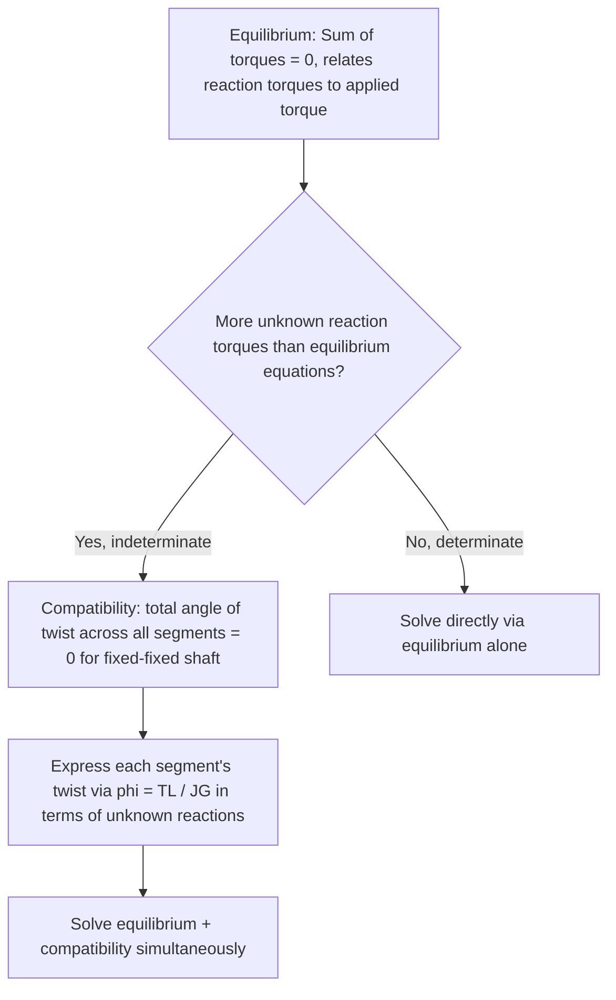

## Torsion of Circular Shafts

### Definition and Scope

Torsion refers to the twisting deformation and internal shear stress that develops in a member (most commonly a circular shaft) subjected to a moment applied about its longitudinal axis — a **torque** or **twisting moment**. Circular shafts are analyzed as a special case within torsion theory because their circular symmetry allows a mathematically exact solution: plane cross-sections remain plane and simply rotate rigidly relative to one another, an assumption that does *not* hold for non-circular cross-sections (which experience warping, a more advanced topic outside the standard circular-shaft treatment). Torsion analysis is foundational for drive shafts, machine shafts, and torsional loading components in structural and mechanical systems.

### Kinematic Assumption: Plane Sections Remain Plane

**Key Points:** The fundamental assumption underlying circular shaft torsion theory is that cross-sections, originally plane and perpendicular to the shaft axis, remain plane and perpendicular after twisting — they do not warp or distort out of their own plane, but simply rotate rigidly about the shaft's longitudinal axis relative to one another. This assumption is valid specifically for **circular** (solid or hollow) cross-sections due to their axisymmetric geometry; non-circular sections (rectangular, I-shaped) violate this assumption and warp under torsion, requiring more advanced theory (e.g., thin-walled open/closed section torsion theory) not covered by the standard circular-shaft formulas presented here.

### Shear Strain Distribution

Because plane sections remain plane and simply rotate, shear strain varies **linearly** with radial distance from the shaft's central axis:

$$\gamma(\rho) = \rho \frac{d\phi}{dx}$$

where $\rho$ is the radial distance from the shaft's center (ranging from 0 at the center to $c$, the outer radius, at the surface), and $d\phi/dx$ is the **rate of twist** (angle of twist per unit length along the shaft).

**Key Points:** Shear strain is **zero at the central axis** (no relative rotation between infinitesimally close points located exactly at the center) and **maximum at the outer surface** ($\rho = c$) — this linear variation is a direct kinematic consequence of the plane-sections-remain-plane assumption, independent of the material's stress-strain behavior.

### Shear Stress Distribution (Elastic, Linear Material)

For a linearly elastic material obeying Hooke's law in shear ($\tau = G\gamma$, where $G$ is the shear modulus), the linear shear strain distribution translates directly into a **linear shear stress distribution**:

$$\tau(\rho) = \frac{T\rho}{J}$$

where $T$ is the internal resisting torque at the section of interest, $\rho$ is the radial distance from the center, and $J$ is the **polar moment of inertia** of the cross-section.

**Maximum shear stress** occurs at the outer surface ($\rho = c$):

$$\tau_{max} = \frac{Tc}{J}$$

**Polar Moment of Inertia for Standard Circular Cross-Sections**

| Cross-Section | Polar Moment of Inertia $J$ |
| --- | --- |
| Solid circular shaft (radius $c$) | $J = \dfrac{\pi c^4}{2}$ |
| Hollow circular shaft (outer radius $c_o$, inner radius $c_i$) | $J = \dfrac{\pi}{2}(c_o^4 - c_i^4)$ |

**Key Points:**

- The torsion shear stress formula $\tau = T\rho/J$ is directly analogous in mathematical structure to the flexure formula $\sigma = My/I$ from bending theory — both describe a linear stress distribution across a cross-section, scaled by an internal resultant (torque or moment) divided by a cross-sectional geometric property (polar or rectangular moment of inertia).
- Since material is entirely removed from the immediate vicinity of the central axis in a **hollow shaft** — precisely the region carrying the *least* shear stress in a solid shaft — a hollow shaft can achieve a substantially higher torque capacity (and higher stiffness) per unit mass of material compared to a solid shaft of equivalent outer diameter, making hollow shafts a materially efficient design choice for torsion-dominated applications, at the cost of increased outer diameter for a given cross-sectional area if manufacturing/space constraints require matching solid-shaft capacity in a smaller footprint. [Inference: whether a hollow or solid shaft is more efficient overall for a specific application also depends on manufacturing cost, buckling/local stability considerations for thin-walled hollow sections, and specific space constraints — the mass-efficiency argument applies specifically to pure torsional load-carrying capacity per unit mass.]

### Angle of Twist

For a shaft segment of length $L$ with constant internal torque $T$, constant polar moment of inertia $J$, and shear modulus $G$ throughout:

$$\phi = \frac{TL}{JG}$$

where $\phi$ is the total angle of twist (in radians) between the two ends of the segment.

**Key Points:** This formula is the torsional analog of the axial deformation formula $\delta = PL/AE$ (see Axial Loading and Deformation) — both describe a linear elastic deformation proportional to internal load and length, and inversely proportional to a cross-sectional stiffness property ($JG$ for torsion, analogous to $AE$ for axial loading).

### Members with Varying Torque or Cross-Section

Analogous to the axial loading case, when torque or cross-sectional properties vary along the shaft's length (e.g., a stepped shaft with multiple diameters, or multiple applied torques at different points along a shaft):

**Segment-wise summation:**

$$\phi_{total} = \sum_i \frac{T_i L_i}{J_i G_i}$$

**Integration (continuously varying torque or section):**

$$\phi = \int_0^L \frac{T(x)}{J(x)G}\,dx$$

**Key Points:** As with axial loading, an internal torque diagram (analogous to an axial force diagram) should first be constructed along the shaft's length — using sections and equilibrium of the free-body portion of the shaft at each point — before applying the segment-wise summation or integration to find total angle of twist.

### Worked Example: Stepped Shaft Under Multiple Torques

A steel shaft ($G = 80$ GPa) has two segments: Segment $AB$ (length $L_1 = 0.8$ m, solid circular, diameter $50$ mm) and Segment $BC$ (length $L_2 = 0.6$ m, solid circular, diameter $40$ mm), fixed at end $A$, with a torque $T_B = 500$ N·m applied at $B$ and an additional torque $T_C = 300$ N·m applied at the free end $C$ (both torques acting in the same rotational sense).

**Internal torque diagram** (via sections, from the free end inward):

- Segment $BC$: internal torque $= T_C = 300$ N·m
- Segment $AB$: internal torque $= T_C + T_B = 300 + 500 = 800$ N·m

**Polar moments of inertia:**

$$J_{AB} = \frac{\pi(0.025)^4}{2} = 6.14\times10^{-7} \text{ m}^4$$

$$J_{BC} = \frac{\pi(0.020)^4}{2} = 2.51\times10^{-7} \text{ m}^4$$

**Angle of twist for each segment:**

$$\phi_{AB} = \frac{(800)(0.8)}{(6.14\times10^{-7})(80\times10^9)} = \frac{640}{4.91\times10^4} = 0.01303 \text{ rad}$$

$$\phi_{BC} = \frac{(300)(0.6)}{(2.51\times10^{-7})(80\times10^9)} = \frac{180}{2.01\times10^4} = 0.00897 \text{ rad}$$

**Total angle of twist at free end C** (relative to fixed end A):

$$\phi_{C/A} = \phi_{AB} + \phi_{BC} = 0.01303 + 0.00897 = 0.0220 \text{ rad} \approx 1.26°$$

### Power Transmission by Shafts

A common practical application: relating transmitted power to torque and rotational speed.

$$P = T\omega$$

where $P$ is power (Watts, if $T$ is in N·m and $\omega$ is in rad/s), and $\omega = 2\pi f$ (with $f$ the rotational frequency in Hz, or $\omega = 2\pi n/60$ if rotational speed $n$ is given in rpm).

**Worked Example: Shaft Sizing for Power Transmission**

A shaft must transmit $P = 15$ kW at a rotational speed of $n = 1200$ rpm. Find the required torque, then the minimum shaft diameter if the allowable shear stress is $\tau_{allow} = 60$ MPa.

$$\omega = \frac{2\pi(1200)}{60} = 125.7 \text{ rad/s}$$

$$T = \frac{P}{\omega} = \frac{15{,}000}{125.7} = 119.3 \text{ N·m}$$

Using $\tau_{max} = Tc/J$ with $J = \pi c^4/2$ for a solid shaft:

$$\tau_{allow} = \frac{T c}{\pi c^4/2} = \frac{2T}{\pi c^3} \implies c^3 = \frac{2T}{\pi \tau_{allow}} = \frac{2(119.3)}{\pi(60\times10^6)} = 1.266\times10^{-6} \text{ m}^3$$

$$c = 0.01084 \text{ m} = 10.84 \text{ mm} \implies d_{min} = 2c \approx 21.7 \text{ mm}$$

### Statically Indeterminate Torsion Members

Analogous to axial loading, when a shaft is fixed at both ends (or otherwise over-constrained) and subjected to an intermediate applied torque, the problem becomes statically indeterminate, requiring a compatibility equation (typically, the sum of angles of twist across all segments equals zero for a shaft fixed at both ends) in addition to equilibrium (sum of reaction torques equals the applied torque).

**Key Points:** This mirrors precisely the solution strategy for statically indeterminate axial members (see Axial Loading and Deformation) — the identical logical structure (equilibrium plus deformation compatibility) applies across axial, torsional, and (as covered in subsequent bending topics) flexural indeterminate problems, differing only in which deformation formula ($PL/AE$ vs. $TL/JG$ vs. beam deflection equations) is used to express the compatibility condition.

### Torsional Failure Modes

**Key Points:**

- **Ductile materials** (most structural steels) subjected to torsion typically fail by shearing on a plane perpendicular to the shaft's longitudinal axis, since the maximum shear stress under pure torsion occurs on that plane.
- **Brittle materials** (cast iron, some ceramics) subjected to torsion typically fail along a helical path oriented at approximately $45°$ to the shaft axis, because pure torsional shear stress corresponds to an equal-magnitude tensile stress at $45°$ (via Mohr's circle stress transformation), and brittle materials characteristically fail in tension rather than shear — this behavior is a well-documented and widely illustrated distinction in torsion testing between ductile and brittle material fracture patterns. [Inference: while this ductile-vs-brittle failure orientation distinction is a standard, well-established observation in mechanics of materials, the exact failure angle and mode for any specific real material and loading rate should be confirmed via material-specific testing rather than assumed universally exact for every material sample.]

### Illustration: Shear Stress Distribution Across a Circular Shaft Cross-Section

<svg xmlns="http://www.w3.org/2000/svg" viewBox="0 0 480 260">
<title>Torsional Shear Stress Distribution (svg_diagram)</title>
<rect width="480" height="260" fill="#ffffff" />
<circle cx="150" cy="130" r="90" fill="#dbeafe" stroke="#1a56db" stroke-width="2" />
<circle cx="150" cy="130" r="3" fill="#333" />
<line x1="150" y1="130" x2="150" y2="40" stroke="#c81e1e" stroke-width="2" />
<line x1="150" y1="130" x2="219" y2="61" stroke="#c81e1e" stroke-width="2" />
<line x1="150" y1="130" x2="240" y2="130" stroke="#c81e1e" stroke-width="2" />
<text x="20" y="20" fill="#333" font-size="13" font-family="sans-serif">Cross-section (shear stress = 0 at center, max at surface)</text>
<line x1="300" y1="220" x2="450" y2="220" stroke="#333" stroke-width="2" />
<line x1="300" y1="220" x2="300" y2="40" stroke="#333" stroke-width="2" />
<text x="255" y="230" fill="#333" font-size="12" font-family="sans-serif">0</text>
<text x="440" y="235" fill="#333" font-size="12" font-family="sans-serif">rho = c</text>
<line x1="300" y1="220" x2="450" y2="60" stroke="#0f7a3d" stroke-width="3" />
<text x="310" y="60" fill="#0f7a3d" font-size="13" font-family="sans-serif">tau(rho) - linear</text>
<text x="270" y="30" fill="#333" font-size="13" font-family="sans-serif">Shear stress vs. radial position</text>
</svg>

### Related Topics

- Axial Loading and Deformation
- Statically Indeterminate Structures
- Stress Transformation and Mohr's Circle
- Centroids and Moments of Inertia (Polar Moment of Inertia)
- Combined Loading (Torsion with Bending and Axial Load)
- Shaft Design for Power Transmission
- Non-Circular Section Torsion and Thin-Walled Member Theory