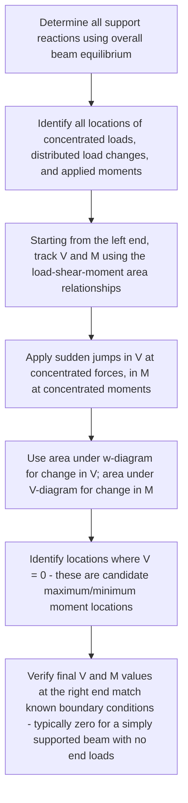

## Shear Force and Bending Moment Diagrams

### Definition and Scope

Shear force and bending moment diagrams are graphical representations showing how the internal shear force $V(x)$ and internal bending moment $M(x)$ vary along the length of a beam subjected to transverse loading. These diagrams are the essential precursor to beam design: the maximum bending moment governs required flexural (bending) strength, the maximum shear force governs required shear strength, and the complete moment diagram is needed as input for beam deflection calculations — making this topic the critical link between statics-derived support reactions and mechanics-of-materials-based stress and deflection analysis.

### Sign Convention

**Standard beam sign convention:**

- **Positive shear force**: causes a clockwise rotation tendency of the beam element under consideration (equivalently, the net transverse force on the left portion of a cut section is upward, or on the right portion is downward).
- **Positive bending moment**: causes the beam to bend concave upward ("sagging"), placing the top fiber in compression and the bottom fiber in tension.

**Key Points:** While alternative but equivalent sign convention descriptions exist across different textbooks (right-hand-rule based, or differently defined clockwise/counterclockwise references), the sagging-positive/hogging-negative moment convention and its associated positive shear convention is the most nearly universal standard in beam analysis — consistent application of a single chosen convention throughout a given problem is essential, since inconsistent sign handling is a common source of diagram errors.

### Method of Sections for Internal Shear and Moment

At any location $x$ along the beam, the internal shear force and bending moment are found by making an imaginary cut at that location, isolating either the left or right portion as a free body, and applying equilibrium:

$$V(x) = \sum (\text{transverse forces on the isolated portion, with appropriate sign})$$

$$M(x) = \sum (\text{moments of forces on the isolated portion, about the cut section})$$

**Key Points:** Using the **left portion** of the beam (from the left end up to the cut location $x$) is the conventional default approach: $V(x)$ equals the sum of all upward forces (including support reactions) minus downward forces to the left of the cut, and $M(x)$ equals the sum of moments of all those left-side forces about the cut section, with counterclockwise-positive-moment-of-forces (producing sagging, positive $M$) convention consistently applied.

### Relationships Between Load, Shear, and Moment

A set of fundamental differential relationships connects the distributed load $w(x)$, shear force $V(x)$, and bending moment $M(x)$:

$$\frac{dV}{dx} = -w(x), \quad \frac{dM}{dx} = V(x)$$

(sign convention for $w(x)$: downward distributed load taken as positive $w$, consistent with the negative sign in the shear relationship)

**Key Points:**

- These differential relationships translate into powerful graphical/area-based rules for constructing diagrams without needing to write and evaluate separate equilibrium equations at every point:
  - The **change in shear** between two points equals the negative of the **area under the load diagram** between those points: $\Delta V = -\int w(x)\,dx$.
  - The **change in moment** between two points equals the **area under the shear diagram** between those points: $\Delta M = \int V(x)\,dx$.
  - The **slope of the shear diagram** at any point equals $-w(x)$ (the negative of the distributed load intensity at that point).
  - The **slope of the moment diagram** at any point equals $V(x)$ (the shear force at that point).
- A **concentrated force** produces a **sudden jump (discontinuity)** in the shear diagram, equal in magnitude to the applied force (upward force → upward jump in $V$).
- A **concentrated moment (couple)** produces a **sudden jump (discontinuity)** in the moment diagram, equal in magnitude to the applied moment, with **no effect on the shear diagram** at that point.
- Where the shear diagram crosses zero (changes sign), the moment diagram has a **local maximum or minimum** — this is a direct consequence of $dM/dx = V$, since a zero slope in the moment diagram occurs exactly where $V = 0$, making these zero-shear-crossing locations the critical points to check for maximum bending moment.

### Standard Procedure for Constructing Diagrams

### Worked Example: Simply Supported Beam with Point Load

A simply supported beam, span $L = 6$ m, pin at $A$ (left, $x=0$) and roller at $B$ (right, $x=6$ m), carries a single concentrated downward load $P = 12$ kN at $x = 4$ m.

**Support reactions** (from overall equilibrium, method as in Equilibrium of Rigid Bodies):

$$\sum M_A = 0: \quad -P(4) + B_y(6) = 0 \implies B_y = \frac{12(4)}{6} = 8 \text{ kN}$$

$$\sum F_y = 0: \quad A_y + B_y - P = 0 \implies A_y = 12 - 8 = 4 \text{ kN}$$

**Shear diagram construction:**

- At $x=0^+$ (just right of support $A$): $V = +A_y = +4$ kN (jump up due to the upward reaction).
- From $x=0$ to $x=4$ m: no distributed load, so $V$ remains constant at $+4$ kN.
- At $x=4$ m: sudden downward jump of $-P = -12$ kN due to the applied load: $V$ jumps from $+4$ kN to $4 - 12 = -8$ kN.
- From $x=4$ m to $x=6$ m: no distributed load, $V$ remains constant at $-8$ kN.
- At $x=6^-$ (just left of support B): $V = -8$ kN; the upward reaction $B_y = +8$ kN brings $V$ back to zero at $x=6^+$, confirming consistency with the free (zero-load) right end.

**Moment diagram construction (using area-under-shear-diagram):**

- $M(0) = 0$ (simply supported end, no applied moment).
- $M(4) = M(0) + (\text{area under V from 0 to 4}) = 0 + (4 \text{ kN})(4 \text{ m}) = 16 \text{ kN·m}$.
- $M(6) = M(4) + (\text{area under V from 4 to 6}) = 16 + (-8 \text{ kN})(2 \text{ m}) = 16 - 16 = 0 \text{ kN·m}$ ✓ (correctly returns to zero at the free right end, confirming diagram consistency).

**Key Points:** Since the shear diagram changes sign exactly at $x = 4$ m (the point load location, jumping from $+4$ to $-8$ kN), the maximum bending moment occurs at that location: $M_{max} = 16$ kN·m — consistent with the general rule that maximum moment occurs where shear crosses zero, which for a single point load on a simply supported beam always occurs directly beneath the point load itself.

### Worked Example: Simply Supported Beam with Uniformly Distributed Load

A simply supported beam, span $L = 8$ m, carries a uniformly distributed downward load $w = 5$ kN/m over its entire length.

**Support reactions** (by symmetry): $A_y = B_y = \dfrac{wL}{2} = \dfrac{5(8)}{2} = 20$ kN.

**Shear diagram**: Since $w$ is constant, $V(x)$ varies **linearly**:

$$V(x) = A_y - wx = 20 - 5x$$

$V(0) = 20$ kN, $V(8) = 20 - 40 = -20$ kN (confirms correct symmetric linear variation, crossing zero at midspan $x=4$ m).

**Moment diagram**: Since $V(x)$ is linear, $M(x)$ varies **parabolically** (quadratically):

$$M(x) = \int_0^x V(x)\,dx = 20x - \frac{5x^2}{2}$$

**Maximum moment** occurs at $x=4$ m (where $V=0$, confirming the zero-shear-crossing rule):

$$M(4) = 20(4) - \frac{5(4)^2}{2} = 80 - 40 = 40 \text{ kN·m}$$

This matches the well-known standard result for a simply supported beam under uniform load: $M_{max} = wL^2/8 = 5(8)^2/8 = 40$ kN·m ✓.

**Key Points:** This example illustrates the general pattern relating load, shear, and moment diagram *shapes*: a **constant** distributed load produces a **linear** shear diagram and a **parabolic** (quadratic) moment diagram — a pattern that extends further (linearly varying load → parabolic shear → cubic moment) and is a useful qualitative check on diagram shape correctness even before detailed numeric calculation.

### Diagram Shape Relationships Summary

| Load $w(x)$ | Shear Diagram $V(x)$ Shape | Moment Diagram $M(x)$ Shape |
| --- | --- | --- |
| No load (zero, between point loads) | Constant (horizontal) | Linear |
| Uniform distributed load | Linear | Parabolic (quadratic) |
| Linearly varying distributed load | Parabolic (quadratic) | Cubic |
| Concentrated point force | Sudden jump (discontinuity) | Corner (slope discontinuity, but M itself continuous) |
| Concentrated applied moment | No effect | Sudden jump (discontinuity) |

### Illustration: Shear and Moment Diagram for Simply Supported Beam with Central Point Load

<svg xmlns="http://www.w3.org/2000/svg" viewBox="0 0 560 340">
<title>Shear Force and Bending Moment Diagrams (svg_diagram)</title>
<rect width="560" height="340" fill="#ffffff" />
<line x1="60" y1="50" x2="500" y2="50" stroke="#555" stroke-width="4" />
<polygon points="60,50 45,75 75,75" fill="#333" />
<circle cx="500" cy="65" r="8" fill="#333" />
<line x1="280" y1="50" x2="280" y2="20" stroke="#c81e1e" stroke-width="2" />
<polygon points="280,20 274,35 286,35" fill="#c81e1e" />
<text x="285" y="20" fill="#c81e1e" font-size="12" font-family="sans-serif">P</text>
<text x="20" y="45" fill="#333" font-size="12" font-family="sans-serif">A</text>
<text x="510" y="60" fill="#333" font-size="12" font-family="sans-serif">B</text>
<text x="20" y="115" fill="#333" font-size="13" font-family="sans-serif" font-weight="bold">V(x)</text>
<line x1="60" y1="150" x2="500" y2="150" stroke="#999" stroke-width="1" />
<line x1="60" y1="120" x2="280" y2="120" stroke="#1a56db" stroke-width="3" />
<line x1="280" y1="120" x2="280" y2="180" stroke="#1a56db" stroke-width="2" stroke-dasharray="3,3" />
<line x1="280" y1="180" x2="500" y2="180" stroke="#1a56db" stroke-width="3" />
<text x="20" y="240" fill="#333" font-size="13" font-family="sans-serif" font-weight="bold">M(x)</text>
<line x1="60" y1="290" x2="500" y2="290" stroke="#999" stroke-width="1" />
<path d="M 60 290 Q 280 210 500 290" fill="none" stroke="#0f7a3d" stroke-width="3" />
<text x="270" y="205" fill="#0f7a3d" font-size="12" font-family="sans-serif">M_max</text>
</svg>

### Application: Beam Design Criteria

**Key Points:**

- **Maximum bending moment** ($M_{max}$, from the moment diagram) is used with the flexure formula $\sigma = Mc/I$ to determine the maximum bending stress, which must not exceed the material's allowable bending stress — this typically governs the required cross-sectional moment of inertia (and thus beam size/shape) for most ordinary beams.
- **Maximum shear force** ($V_{max}$, from the shear diagram) is used with the shear formula $\tau = VQ/Ib$ to determine maximum shear stress — this governs shear-critical design checks, which are typically secondary to flexural design for long-span beams (where bending dominates) but can become critical for short, heavily-loaded beams or at points of concentrated load near supports. [Inference: whether shear or bending governs a specific beam's design depends on span-to-depth ratio and loading configuration — for most ordinary long-span beams bending typically governs, but this is not a universal rule for every geometry and loading case.]
- The complete moment diagram $M(x)$, not just its maximum value, is required as input for beam **deflection** calculations (via double integration, moment-area method, or virtual work methods), since deflection depends on the moment distribution along the entire beam length, not merely its peak value.

### Related Topics

- Equilibrium of Rigid Bodies
- Free Body Diagrams
- Flexure Formula and Bending Stress
- Shear Stress in Beams
- Beam Deflection Methods (Double Integration, Moment-Area, Virtual Work)
- Centroids and Moments of Inertia
- Statically Indeterminate Beams