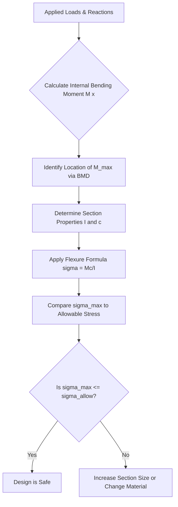

## Bending Stress in Beams

### Definition and Physical Concept

Bending stress is the normal stress ($\sigma$) induced in a beam's cross-section as a result of an applied bending moment. When a beam is subjected to transverse loads, internal bending moments develop, causing the beam to curve. This curvature stretches fibers on one side of the beam (tension) and compresses fibers on the opposite side (compression).

Between these two zones lies the **neutral axis**, a longitudinal plane/line within the cross-section where bending stress is zero, since fibers along this axis neither elongate nor shorten.

### Assumptions of Simple Bending Theory (Euler-Bernoulli)

The standard flexure formula relies on several idealizations:

- The beam is initially straight, and has a constant cross-section along its length (prismatic).
- The material is homogeneous and isotropic, obeying Hooke's Law (stress is proportional to strain within the elastic limit).
- The beam is subjected to pure bending (transverse shear effects on plane sections are neglected in this simple theory).
- Plane sections perpendicular to the neutral axis before bending remain plane and perpendicular to the neutral axis after bending (the "plane sections remain plane" hypothesis).
- The radius of curvature is large compared to the cross-sectional dimensions.
- Young's Modulus ($E$) is the same in tension and compression.

### The Flexure Formula

The fundamental relationship governing bending stress combines geometry, material stiffness, and internal forces into a single equation known as the flexure formula:

$$\frac{M}{I} = \frac{\sigma}{y} = \frac{E}{R}$$

Where:

- $M$ = Internal bending moment at the section (N·mm or lb·in)
- $I$ = Second moment of area (moment of inertia) of the cross-section about the neutral axis (mm⁴ or in⁴)
- $\sigma$ = Bending stress at a distance $y$ from the neutral axis (MPa or psi)
- $y$ = Perpendicular distance from the neutral axis to the point of interest
- $E$ = Modulus of Elasticity of the material
- $R$ = Radius of curvature of the neutral axis

For calculating the specific bending stress at a fiber, the formula is typically rearranged as:

$$\sigma = \frac{My}{I}$$

**Sign Convention:** In most engineering conventions, a positive bending moment (sagging) induces compressive stress ($-\sigma$) in the top fibers and tensile stress ($+\sigma$) in the bottom fibers, though this can vary by textbook convention.

### Maximum Bending Stress and Section Modulus

The maximum stress occurs at the extreme fiber, where $y = c$ (the distance from the neutral axis to the outermost fiber).

$$\sigma_{max} = \frac{Mc}{I}$$

To simplify design calculations, the term $I/c$ is combined into a single geometric property called the **Section Modulus** ($S$ or $Z$):

$$S = \frac{I}{c}$$

$$\sigma_{max} = \frac{M}{S}$$

The section modulus represents the strength of the shape independent of the material, allowing engineers to quickly compare the bending efficiency of different structural shapes (e.g., an I-beam vs. a rectangular beam of the same area).

### Cross-Sectional Properties

<svg xmlns="http://www.w3.org/2000/svg" viewBox="0 0 500 300">
<title>Bending Stress Distribution (svg_diagram)</title>
<rect x="50" y="50" width="100" height="150" fill="#e0e0e0" stroke="#333" stroke-width="2" />

<line x1="30" y1="125" x2="170" y2="125" stroke="red" stroke-width="1.5" stroke-dasharray="5,5" />
<text x="35" y="120" font-size="12" fill="red">N.A.</text>

<line x1="200" y1="50" x2="200" y2="200" stroke="#333" stroke-width="1" />
<line x1="200" y1="125" x2="350" y2="50" stroke="blue" stroke-width="2" />
<line x1="200" y1="125" x2="350" y2="200" stroke="blue" stroke-width="2" />
<line x1="200" y1="125" x2="380" y2="125" stroke="black" stroke-width="1" stroke-dasharray="2,2" />

<polygon points="200,50 350,50 200,125" fill="blue" opacity="0.1" />
<polygon points="200,200 350,200 200,125" fill="blue" opacity="0.1" />

<text x="355" y="55" font-size="12" fill="blue">+σ (Tension)</text>

<text x="355" y="205" font-size="12" fill="blue">-σ (Compression)</text>

<text x="205" y="145" font-size="12" fill="black">y=0</text>

<line x1="180" y1="50" x2="180" y2="125" stroke="green" stroke-width="1" marker-end="url(#arrow)" marker-start="url(#arrow)" />
<text x="155" y="90" font-size="12" fill="green">c (or y)</text>

<text x="100" y="230" font-size="14" text-anchor="middle" font-weight="bold">Cross-Section</text>

<text x="290" y="230" font-size="14" text-anchor="middle" font-weight="bold">Linear Stress Distribution</text>

</svg>

For common shapes, the moment of inertia $I$ about the centroidal (neutral) axis is calculated as follows:

**Rectangular Section** (width $b$, height $h$):

$$I = \frac{bh^3}{12}$$

**Circular Section** (diameter $d$):

$$I = \frac{\pi d^4}{64}$$

**Hollow Circular Section** (outer diameter $D$, inner diameter $d$):

$$I = \frac{\pi (D^4 - d^4)}{64}$$

For composite or built-up sections (like I-beams or T-sections), the **Parallel Axis Theorem** is required to find the moment of inertia about the neutral axis if the individual shapes' centroids do not align with the section's neutral axis:

$$I_{NA} = I_{centroid} + Ad^2$$

Where $A$ is the area of the sub-component and $d$ is the distance between the sub-component's own centroidal axis and the overall section's neutral axis.

### Locating the Neutral Axis

For a beam under pure bending with no axial load, the neutral axis passes through the **centroid** of the cross-sectional area. For symmetric sections (rectangles, circles, I-beams), this location is straightforward (the geometric center). For asymmetric sections (L-shapes, T-shapes), the centroid must be calculated first:

$$\bar{y} = \frac{\sum A_i y_i}{\sum A_i}$$

### Relationship to Curvature

The term $E/R$ in the flexure formula relates the bending stress to the deformed shape of the beam. Rearranging gives:

$$R = \frac{EI}{M}$$

This shows that stiffer beams (high $E$ or $I$) or lower moments result in a larger radius of curvature (a "flatter" bend), while flexible beams or high moments result in a smaller radius (a "tighter" bend). The term $EI$ is commonly referred to as the **Flexural Rigidity** of the beam.

### Worked Example

**Problem:** A simply supported rectangular timber beam has a width of 100 mm and a depth of 200 mm. It is subjected to a maximum bending moment of 15 kN·m. Calculate the maximum bending stress.

**Step 1: Calculate the Moment of Inertia ($I$)**

$$I = \frac{bh^3}{12} = \frac{(100)(200)^3}{12} = 66.67 \times 10^6 \text{ mm}^4$$

**Step 2: Determine the distance to the extreme fiber ($c$)**

Since the section is symmetric, the neutral axis is at the mid-height.

$$c = \frac{h}{2} = \frac{200}{2} = 100 \text{ mm}$$

**Step 3: Convert Moment to consistent units**

$$M = 15 \text{ kN·m} = 15 \times 10^6 \text{ N·mm}$$

**Step 4: Apply the Flexure Formula**

$$\sigma_{max} = \frac{Mc}{I} = \frac{(15 \times 10^6)(100)}{66.67 \times 10^6}$$

$$\sigma_{max} = 22.5 \text{ MPa}$$

**Output:** The maximum bending stress in the beam is 22.5 MPa, occurring at both the top fiber (compression) and bottom fiber (tension) since the section is symmetric.

### Bending Stress Distribution Along a Beam

While the flexure formula gives stress at a *specific cross-section*, the magnitude of the bending moment $M$ typically varies along the length of the beam depending on the loading and support conditions. Engineers use Bending Moment Diagrams (BMD) to identify the location of $M_{max}$, which dictates where the beam is most likely to fail in bending.

### Unsymmetrical Bending

Simple bending theory assumes the load is applied along a principal axis of the cross-section. If a beam is loaded at an angle, or if the cross-section is unsymmetrical (like an L-shape) and the load does not pass through the **shear center**, the beam experiences **unsymmetrical bending**, which combines bending about both the x and y axes:

$$\sigma = \frac{M_x y}{I_x} + \frac{M_y x}{I_y}$$

[Inference] This scenario often requires resolving the applied moment into components along the principal axes of inertia to solve accurately, particularly for asymmetric sections like angle iron.

### Bending Stress vs. Shear Stress

While bending stress is a *normal* stress (perpendicular to the cross-section), transverse loading also induces *shear* stress (parallel to the cross-section), governed by the shear formula ($\tau = VQ/Ib$). At the extreme fibers (top/bottom), bending stress is maximum but shear stress is zero. At the neutral axis, shear stress is maximum but bending stress is zero. Combined stress states (bending + shear) are often analyzed using Mohr's Circle to determine principal stresses, which is critical for beams with thin webs (like I-beams) prone to shear buckling.

### Design Applications and Allowable Stress

In practical civil engineering design, the calculated $\sigma_{max}$ is compared against the material's **allowable bending stress** ($\sigma_{allow}$), which incorporates a factor of safety (FS) relative to the yield strength ($\sigma_y$) or ultimate strength ($\sigma_u$):

$$\sigma_{allow} = \frac{\sigma_y}{FS}$$

The primary design check ensures:

$$\sigma_{max} \leq \sigma_{allow}$$

This principle governs the selection of standard steel sections (e.g., W-shapes) from design manuals, where the required section modulus $S$ is calculated first ($S_{req} = M_{max}/\sigma_{allow}$), and then a standard shape with $S \geq S_{req}$ is selected from a table.

### Limitations of the Simple Bending Theory

- **Shear Deformation:** The theory ignores shear deformation, which becomes significant in "deep beams" (where the span-to-depth ratio is small).
- **Local Effects:** It does not account for stress concentrations at points of load application or abrupt cross-sectional changes (holes, notches).
- **Lateral-Torsional Buckling:** For long, unsupported compression flanges (common in steel I-beams), the beam may fail due to buckling before the theoretical bending stress limit is reached. [Unverified] The specific critical buckling moment depends on unbraced length, boundary conditions, and material properties, which vary by design code (e.g., AISC vs. Eurocode).
- **Non-linear Material Behavior:** Beyond the elastic limit, the linear stress-strain relationship assumed by $\sigma = My/I$ no longer holds, and plastic analysis (using the Plastic Section Modulus) is required instead.

**Related Topics**

- Shear Stress in Beams and the Shear Formula ($\tau = VQ/Ib$)
- Bending Moment and Shear Force Diagrams
- Deflection of Beams (Double Integration Method)
- Combined Stresses and Mohr's Circle
- Plastic Analysis and Ultimate Moment Capacity
- Lateral-Torsional Buckling of Steel Beams
- Reinforced Concrete Beam Design (Working Stress vs. Ultimate Strength)