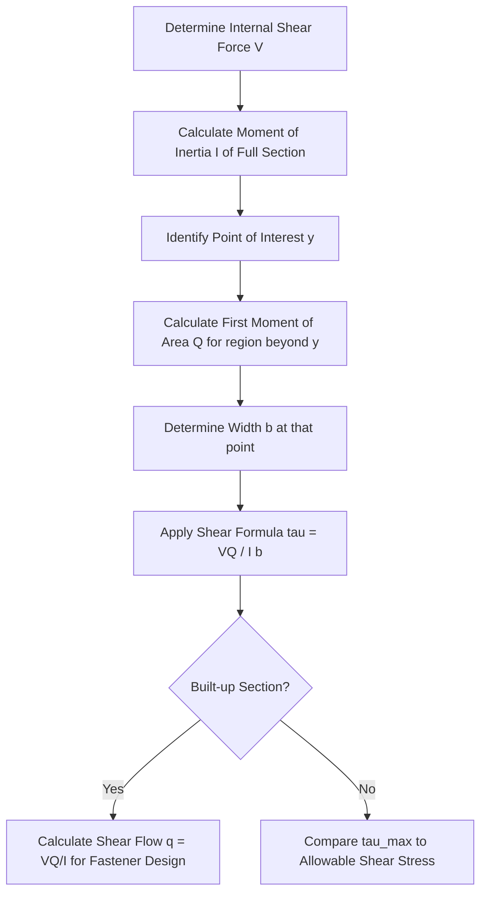

## Shear Stress in Beams

### Definition and Physical Concept

Shear stress in beams is the internal stress that acts parallel (tangential) to a cross-sectional plane, arising from the transverse shear force ($V$) present at that section. While bending stress resists the tendency of a beam to rotate/curve, shear stress resists the tendency of adjacent cross-sections to slide relative to one another (vertical shear) and, by complementary action, the tendency of longitudinal fibers to slide past each other (horizontal shear).

Unlike bending stress, which is maximum at the outer fibers and zero at the neutral axis, transverse shear stress is generally **zero at the extreme fibers and maximum at the neutral axis** for most common cross-sections.

### The Shear Formula (Zhuravskii/Jourawski Formula)

The distribution of shear stress across a cross-section is governed by:

$$\tau = \frac{VQ}{Ib}$$

Where:

- $\tau$ = Shear stress at the point of interest (MPa or psi)
- $V$ = Internal transverse shear force at the section (N or lb)
- $Q$ = First moment of area of the region beyond (above or below) the point of interest, taken about the neutral axis (mm³ or in³)
- $I$ = Moment of inertia of the entire cross-section about the neutral axis (mm⁴ or in⁴)
- $b$ = Width of the cross-section at the point where shear stress is being calculated (mm or in)

### The First Moment of Area ($Q$)

$Q$ represents the moment of the area lying outside (further from the neutral axis than) the point of interest, about the neutral axis itself:

$$Q = A' \bar{y}'$$

Where:

- $A'$ = The partial area between the point of interest and the extreme fiber (top or bottom)
- $\bar{y}'$ = The distance from the neutral axis to the centroid of that partial area $A'$

**Key characteristic:** $Q = 0$ at the extreme fibers (since $A' = 0$ there) and $Q$ is maximum at the neutral axis, which is why shear stress follows the opposite trend to bending stress.

### Complementary Shear Stress

A fundamental principle in mechanics of materials states that shear stresses on perpendicular planes at a point are always equal in magnitude and act either toward or away from the common edge:

$$\tau_{xy} = \tau_{yx}$$

This means the vertical shear stress ($\tau_{xy}$) calculated by the shear formula is numerically equal to the **horizontal (longitudinal) shear stress** ($\tau_{yx}$) at the same point. This longitudinal shear stress is critical in the design of built-up sections (e.g., plated girders, glued laminated timber) where fasteners must resist the horizontal sliding tendency between layers.

### Shear Stress Distribution Diagram

<svg xmlns="http://www.w3.org/2000/svg" viewBox="0 0 500 300">
<title>Parabolic Shear Stress Distribution in a Rectangular Section (svg_diagram)</title>

<rect x="50" y="50" width="100" height="150" fill="#e0e0e0" stroke="#333" stroke-width="2" />

<line x1="30" y1="125" x2="170" y2="125" stroke="red" stroke-width="1.5" stroke-dasharray="5,5" />
<text x="35" y="120" font-size="12" fill="red">N.A.</text>

<line x1="200" y1="50" x2="200" y2="200" stroke="#333" stroke-width="1" />
<line x1="180" y1="50" x2="380" y2="50" stroke="black" stroke-width="1" stroke-dasharray="2,2" />
<line x1="180" y1="200" x2="380" y2="200" stroke="black" stroke-width="1" stroke-dasharray="2,2" />

<path d="M 200 50 Q 340 125 200 200" fill="#2c7fb8" opacity="0.15" stroke="#2c7fb8" stroke-width="2" />

<text x="345" y="130" font-size="12" fill="`#2c7fb8`">τ_max (at N.A.)</text>

<text x="205" y="45" font-size="12" fill="black">τ = 0 (top fiber)</text>

<text x="205" y="215" font-size="12" fill="black">τ = 0 (bottom fiber)</text>

<text x="100" y="230" font-size="14" text-anchor="middle" font-weight="bold">Cross-Section</text>

<text x="290" y="230" font-size="14" text-anchor="middle" font-weight="bold">Parabolic τ Distribution</text>

</svg>

### Maximum Shear Stress for Common Cross-Sections

**Rectangular Section** (width $b$, height $h$, Area $A = bh$):

The distribution is parabolic, and the maximum shear stress at the neutral axis is:

$$\tau_{max} = \frac{3V}{2A}$$

This shows the maximum shear stress is 1.5 times the *average* shear stress ($V/A$).

**Circular Section** (radius $r$, Area $A = \pi r^2$):

$$\tau_{max} = \frac{4V}{3A}$$

**Thin-Walled I-Beams (Wide Flange Sections):**

For I-beams, the shear stress distribution is non-linear across the flanges and web, but the web carries the overwhelming majority of the vertical shear force. Because the web is thin and roughly constant in width, engineers commonly use a simplified **average web shear** approximation for design:

$$\tau_{avg} \approx \frac{V}{A_{web}} = \frac{V}{d \cdot t_w}$$

Where $d$ is the overall depth and $t_w$ is the web thickness. [Inference] This approximation is widely accepted in structural steel design codes because the exact parabolic variation within the web is small (typically within 10-15% of the average), making the simplification practical for design purposes.

### Worked Example

**Problem:** A rectangular timber beam (width $b$ = 100 mm, depth $h$ = 200 mm) carries a maximum transverse shear force $V$ = 20 kN. Determine the maximum shear stress and the shear stress at a point 50 mm from the neutral axis.

**Step 1: Calculate Section Properties**

$$I = \frac{bh^3}{12} = \frac{(100)(200)^3}{12} = 66.67 \times 10^6 \text{ mm}^4$$

**Step 2: Calculate Maximum Shear Stress (at N.A., y = 0)**

Using the simplified formula for a rectangle:

$$A = bh = (100)(200) = 20{,}000 \text{ mm}^2$$

$$\tau_{max} = \frac{3V}{2A} = \frac{3(20{,}000 \text{ N})}{2(20{,}000 \text{ mm}^2)} = 1.5 \text{ MPa}$$

**Step 3: Calculate Shear Stress at y = 50 mm from N.A.**

First, find $Q$ for the area *above* y = 50 mm (from y=50 to y=100):

$$A' = b \times (100 - 50) = 100 \times 50 = 5{,}000 \text{ mm}^2$$

$$\bar{y}' = 50 + \frac{50}{2} = 75 \text{ mm}$$

$$Q = A' \bar{y}' = (5{,}000)(75) = 375{,}000 \text{ mm}^3$$

Apply the shear formula:

$$\tau = \frac{VQ}{Ib} = \frac{(20{,}000)(375{,}000)}{(66.67 \times 10^6)(100)}$$

$$\tau = 1.125 \text{ MPa}$$

**Output:** The maximum shear stress at the neutral axis is 1.5 MPa, decreasing to 1.125 MPa at a point 50 mm away, and reducing to zero at the extreme fibers (y = ±100 mm).

### Shear Flow ($q$)

For built-up or composite sections (e.g., a beam made of multiple plates or boards fastened together), the concept of **shear flow** quantifies the horizontal shear force per unit length that must be transferred across a joint:

$$q = \frac{VQ}{I}$$

Shear flow (units of N/mm or lb/in) is directly used to design fasteners (bolts, welds, nails, or glue) connecting the components, ensuring the connection can transmit the required force per unit length without slipping.

### Shear Stress in Non-Rectangular and Flanged Sections

For sections like I-beams or T-beams, $Q$ and $b$ change abruptly at the junction between the flange and the web, causing a **jump discontinuity** in the shear stress diagram at the flange-web interface (since $b$ decreases sharply while $Q$ remains nearly continuous). This is a critical concept for identifying why the web—not the flange—governs shear capacity in I-shaped sections.

### Relationship Between Shear Force and Bending Moment

Shear stress is intrinsically linked to the *rate of change* of the bending moment along the beam's length:

$$V = \frac{dM}{dx}$$

This calculus relationship confirms that the maximum bending moment (and consequently, zero shear) occurs where the shear force diagram crosses zero—a principle heavily used when constructing Shear Force and Bending Moment Diagrams (SFD/BMD) to locate critical design sections.

### Design Applications and Allowable Stress

Similar to bending stress design, the calculated maximum shear stress must satisfy:

$$\tau_{max} \leq \tau_{allow}$$

Where $\tau_{allow}$ is derived from the material's shear strength with an appropriate factor of safety. In reinforced concrete design, since concrete has low tensile/shear capacity, shear reinforcement (stirrups) is explicitly designed using the shear flow concept to resist the diagonal tension cracks induced by combined shear and bending stresses.

### Limitations and Practical Considerations

- **Saint-Venant's Principle:** The shear formula provides accurate results only at sections sufficiently far from points of concentrated load application or support reactions, where stress distributions can be highly localized and non-uniform.
- **Thin-Walled Assumption:** The formula assumes the width $b$ is small relative to the depth; for very wide, shallow sections, the shear stress may vary significantly across the width, which the basic 1D formula does not capture.
- **Stress Concentrations:** Holes, notches, or sudden changes in cross-section (e.g., bolt holes in a steel beam web) create localized stress concentrations not accounted for by the basic Jourawski formula.
- **Combined Loading:** [Unverified] In sections experiencing simultaneous high bending and high shear (common near supports of heavily loaded beams), the combined stress state should be checked using principal stress analysis (Mohr's Circle), as behavior at that critical point can depend on specific loading geometry and material ductility.

**Related Topics**

- Bending Stress in Beams and the Flexure Formula
- Shear Force and Bending Moment Diagrams (SFD/BMD)
- Combined Stresses and Mohr's Circle for Beams
- Design of Shear Connectors and Fasteners in Composite Beams
- Shear Reinforcement (Stirrups) in Reinforced Concrete Beams
- Torsional Shear Stress in Circular Shafts
- Deep Beam Theory and Shear Deformation Effects