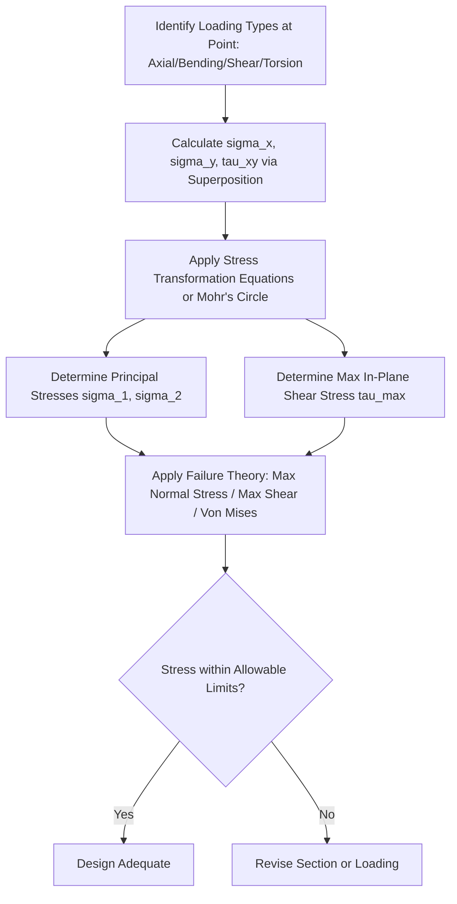

## Combined Stresses and Stress Transformation

### Definition and Physical Concept

In real structural members, a point may simultaneously experience multiple types of internal stress—axial, bending, shear, and torsional—acting together. **Combined stress** refers to the resultant stress state produced by superimposing these individual stress components at a single point. **Stress transformation** is the mathematical procedure used to determine the normal and shear stresses acting on planes oriented at *any* angle through that point, given the stresses on a known reference plane (typically the x-y coordinate axes).

This is critical because a material may fail not on the plane where stress appears highest in the original coordinate system, but on some other inclined plane where the transformed stress reaches a critical value (e.g., diagonal tension cracking in concrete beams, or 45° shear failure in ductile materials).

### The General State of Plane Stress

For a 2D (plane stress) element, the stress state at a point is fully defined by three components:

- $\sigma_x$ = Normal stress in the x-direction
- $\sigma_y$ = Normal stress in the y-direction
- $\tau_{xy}$ = Shear stress on the x-face, acting in the y-direction (equal to $\tau_{yx}$ by complementary shear)

<svg xmlns="http://www.w3.org/2000/svg" viewBox="0 0 400 300">
<title>General Plane Stress Element (svg_diagram)</title>
<rect x="150" y="100" width="100" height="100" fill="#f0f0f0" stroke="#333" stroke-width="2" />

<line x1="250" y1="150" x2="290" y2="150" stroke="blue" stroke-width="2" marker-end="url(#arrowhead)" />
<text x="295" y="155" font-size="14" fill="blue">σx</text>
<line x1="150" y1="150" x2="110" y2="150" stroke="blue" stroke-width="2" marker-end="url(#arrowhead)" />
<text x="75" y="155" font-size="14" fill="blue">σx</text>

<line x1="200" y1="100" x2="200" y2="60" stroke="green" stroke-width="2" marker-end="url(#arrowhead)" />
<text x="205" y="55" font-size="14" fill="green">σy</text>
<line x1="200" y1="200" x2="200" y2="240" stroke="green" stroke-width="2" marker-end="url(#arrowhead)" />
<text x="205" y="255" font-size="14" fill="green">σy</text>

<line x1="250" y1="115" x2="250" y2="90" stroke="red" stroke-width="2" marker-end="url(#arrowhead)" />
<text x="255" y="95" font-size="12" fill="red">τxy</text>
<line x1="150" y1="185" x2="150" y2="210" stroke="red" stroke-width="2" marker-end="url(#arrowhead)" />
<text x="115" y="215" font-size="12" fill="red">τxy</text>
<line x1="185" y1="100" x2="210" y2="100" stroke="red" stroke-width="2" marker-end="url(#arrowhead)" />
<line x1="165" y1="200" x2="190" y2="200" stroke="red" stroke-width="2" marker-end="url(#arrowhead)" transform="rotate(180 177 200)" />

<text x="200" y="280" font-size="14" text-anchor="middle" font-weight="bold">Plane Stress Element (x-y axes)</text>

</svg>

### Stress Transformation Equations

To find the normal stress ($\sigma_{x'}$) and shear stress ($\tau_{x'y'}$) on a plane rotated by angle $\theta$ (measured counterclockwise from the original x-axis) from the reference element, the following transformation equations apply:

$$\sigma_{x'} = \frac{\sigma_x + \sigma_y}{2} + \frac{\sigma_x - \sigma_y}{2}\cos(2\theta) + \tau_{xy}\sin(2\theta)$$

$$\tau_{x'y'} = -\frac{\sigma_x - \sigma_y}{2}\sin(2\theta) + \tau_{xy}\cos(2\theta)$$

The normal stress on the perpendicular plane ($\sigma_{y'}$) can be found by substituting $\theta + 90°$, or more simply by using the invariant relationship:

$$\sigma_x + \sigma_y = \sigma_{x'} + \sigma_{y'}$$

This shows that the **sum of normal stresses on any two perpendicular planes is constant** (stress invariant), regardless of orientation.

### Principal Stresses

**Principal stresses** are the maximum and minimum normal stresses that occur at a point, found on planes where the shear stress is exactly zero. These are calculated as:

$$\sigma_{1,2} = \frac{\sigma_x + \sigma_y}{2} \pm \sqrt{\left(\frac{\sigma_x - \sigma_y}{2}\right)^2 + \tau_{xy}^2}$$

Where $\sigma_1$ is the maximum (major) principal stress and $\sigma_2$ is the minimum (minor) principal stress.

The orientation of the principal planes ($\theta_p$) is found from:

$$\tan(2\theta_p) = \frac{2\tau_{xy}}{\sigma_x - \sigma_y}$$

**Key Points:**

- On principal planes, shear stress $\tau_{x'y'} = 0$.
- Principal planes are always oriented 90° apart from each other.
- The two solutions for $\theta_p$ (from the tangent equation) are 90° apart, corresponding to $\sigma_1$ and $\sigma_2$.

### Maximum In-Plane Shear Stress

The maximum shear stress at a point occurs on planes oriented 45° from the principal planes, with magnitude:

$$\tau_{max} = \sqrt{\left(\frac{\sigma_x - \sigma_y}{2}\right)^2 + \tau_{xy}^2}$$

This is a critical parameter in ductile material failure theories (like the Maximum Shear Stress / Tresca criterion), since many ductile materials fail via shear (slip) rather than direct tension. The orientation of the maximum shear plane is found from:

$$\tan(2\theta_s) = -\frac{\sigma_x - \sigma_y}{2\tau_{xy}}$$

Note that on the plane of maximum shear stress, the normal stress is generally **not zero**; it equals the average normal stress:

$$\sigma_{avg} = \frac{\sigma_x + \sigma_y}{2}$$

### Mohr's Circle for Plane Stress

**Mohr's Circle** is a graphical method that represents all possible stress transformations at a point as a circle in $\sigma$-$\tau$ coordinate space, providing an intuitive visual alternative to the transformation equations.

**Construction procedure:**

1. Plot the point $(\sigma_x, \tau_{xy})$ representing the x-face.
2. Plot the point $(\sigma_y, -\tau_{xy})$ representing the y-face.
3. Draw a line connecting these two points; its intersection with the $\sigma$-axis is the center, $C = \left(\frac{\sigma_x + \sigma_y}{2}, 0\right)$.
4. The radius of the circle equals $\tau_{max}$ (the maximum in-plane shear stress, calculated above).
5. Principal stresses are found at the circle's intersections with the $\sigma$-axis ($\sigma_1$ = rightmost point, $\sigma_2$ = leftmost point).

**Critical Rule:** Angles on Mohr's Circle are **double** the actual physical angles on the stress element, and rotation direction on the circle matches the physical rotation direction (both use the same convention, but the doubling must be tracked carefully).

<svg xmlns="http://www.w3.org/2000/svg" viewBox="0 0 400 350">
<title>Mohr's Circle Construction (svg_diagram)</title>

<line x1="50" y1="175" x2="380" y2="175" stroke="#333" stroke-width="1" />
<line x1="200" y1="30" x2="200" y2="320" stroke="#333" stroke-width="1" />
<text x="385" y="180" font-size="14">σ</text>
<text x="205" y="25" font-size="14">τ</text>

<circle cx="230" cy="175" r="100" fill="none" stroke="blue" stroke-width="2" />

<circle cx="230" cy="175" r="3" fill="black" />
<text x="215" y="195" font-size="11">C (σavg, 0)</text>

<circle cx="150" cy="120" r="4" fill="red" />
<text x="110" y="115" font-size="12" fill="red">X (σx, τxy)</text>

<circle cx="310" cy="230" r="4" fill="green" />
<text x="315" y="245" font-size="12" fill="green">Y (σy, -τxy)</text>

<line x1="150" y1="120" x2="310" y2="230" stroke="gray" stroke-width="1" stroke-dasharray="3,3" />

<circle cx="330" cy="175" r="3" fill="purple" />
<text x="325" y="165" font-size="11" fill="purple">σ1</text>
<circle cx="130" cy="175" r="3" fill="purple" />
<text x="105" y="165" font-size="11" fill="purple">σ2</text>

<text x="200" y="345" font-size="14" text-anchor="middle" font-weight="bold">Mohr's Circle for Plane Stress</text>

</svg>

### Combined Loading: Superposition of Stress Types

The starting stresses $\sigma_x$, $\sigma_y$, and $\tau_{xy}$ used in transformation are frequently **combinations** of stresses arising from different simultaneous loading types on a structural member:

**Axial + Bending (Eccentric Loading):**

$$\sigma_x = \frac{P}{A} \pm \frac{My}{I}$$

**Bending + Transverse Shear:**

$$\sigma_x = \frac{My}{I}, \quad \tau_{xy} = \frac{VQ}{Ib}$$

**Torsion + Axial/Bending (common in shafts, pipes, and some beam-column members):**

$$\sigma_x = \frac{P}{A} \pm \frac{My}{I}, \quad \tau_{xy} = \frac{Tc}{J}$$

Where $T$ is the applied torque and $J$ is the polar moment of inertia. This combination is common in mechanical drive shafts and pipe systems under simultaneous bending and torsional loads.

### Worked Example

**Problem:** At a point on the surface of a loaded beam, the stress state is: $\sigma_x = 80$ MPa (tension), $\sigma_y = -30$ MPa (compression), $\tau_{xy} = 40$ MPa. Determine the principal stresses and the maximum in-plane shear stress.

**Step 1: Calculate average normal stress**

$$\sigma_{avg} = \frac{\sigma_x + \sigma_y}{2} = \frac{80 + (-30)}{2} = 25 \text{ MPa}$$

**Step 2: Calculate the radius term**

$$R = \sqrt{\left(\frac{\sigma_x - \sigma_y}{2}\right)^2 + \tau_{xy}^2} = \sqrt{\left(\frac{80-(-30)}{2}\right)^2 + 40^2}$$

$$R = \sqrt{(55)^2 + (40)^2} = \sqrt{3025 + 1600} = \sqrt{4625} = 68.0 \text{ MPa}$$

**Step 3: Calculate Principal Stresses**

$$\sigma_1 = 25 + 68.0 = 93.0 \text{ MPa (tension)}$$

$$\sigma_2 = 25 - 68.0 = -43.0 \text{ MPa (compression)}$$

**Step 4: Calculate Maximum In-Plane Shear Stress**

$$\tau_{max} = R = 68.0 \text{ MPa}$$

**Output:** The principal stresses are $\sigma_1 = 93.0$ MPa and $\sigma_2 = -43.0$ MPa, with a maximum in-plane shear stress of 68.0 MPa occurring at 45° to the principal planes.

### Absolute Maximum Shear Stress (3D Consideration)

For a true three-dimensional stress state, the **absolute maximum shear stress** must also consider the out-of-plane principal stress ($\sigma_3 = 0$ for plane stress, since there is no stress on the free surface). The absolute maximum shear is the largest value among the three possible Mohr's circles formed by pairing $\sigma_1$, $\sigma_2$, and $\sigma_3$:

$$\tau_{abs\ max} = \frac{\sigma_{max} - \sigma_{min}}{2}$$

[Inference] This distinction is important because the in-plane maximum shear stress calculated from the 2D transformation equations can sometimes be smaller than the true absolute maximum shear stress when one principal stress is zero and the other two share the same sign (both tension or both compression), a scenario common in pressure vessel analysis.

### Failure Theories Utilizing Combined Stress

Combined/principal stresses feed directly into material failure criteria used in design:

- **Maximum Normal Stress Theory (Rankine):** Failure occurs when $\sigma_1$ or $\sigma_2$ exceeds the material's ultimate strength. Best suited for brittle materials.
- **Maximum Shear Stress Theory (Tresca):** Failure occurs when $\tau_{max}$ exceeds half the yield strength ($\sigma_y/2$). Suited for ductile materials, and generally conservative.
- **Distortion Energy Theory (Von Mises):** Failure occurs based on a combined effective stress:

  $$\sigma_{von} = \sqrt{\sigma_1^2 - \sigma_1\sigma_2 + \sigma_2^2}$$

  This is widely used for ductile metals as it more accurately predicts yielding under combined loading compared to the Tresca criterion.

### Applications in Civil Engineering

- **Diagonal Tension Cracking:** In reinforced concrete beams, combined bending and shear stress creates principal tensile stresses oriented diagonally, which is why shear cracks propagate at an angle (typically near 45°) rather than vertically, informing the diagonal placement or spacing of stirrups.
- **Pressure Vessels and Pipes:** Combined hoop stress, longitudinal stress, and any torsional/shear stress require transformation analysis to find critical principal stresses at welds or nozzle connections.
- **Combined Footings and Retaining Walls:** Soil-structure interfaces often experience combined normal and shear (frictional) stresses, analyzed using similar transformation principles for stability checks (e.g., sliding and bearing capacity).
- **Steel Connections:** Bolted and welded connections frequently experience combined shear and tension (bolt prying, weld group eccentric loading), requiring interaction equations often derived from principal stress concepts.

### Limitations and Practical Considerations

- **Plane Stress Assumption:** Most transformation analysis in beams assumes a 2D (plane stress) condition, valid for thin elements or surface points; true 3D stress states require more complex tensor transformations.
- **Stress Concentration Zones:** Near holes, notches, or sudden geometric changes, the simple superposition of $\sigma = P/A \pm My/I$ and $\tau = VQ/Ib$ may significantly underestimate local combined stress due to concentration effects.
- **Material Behavior Assumption:** [Unverified] The applicability of a specific failure theory (Tresca vs. Von Mises vs. Rankine) depends on whether the material is ductile or brittle, and can vary in accuracy depending on the specific loading path and material composition.

**Related Topics**

- Bending Stress in Beams and the Flexure Formula
- Shear Stress in Beams and the Shear Formula
- Mohr's Circle Construction and Interpretation
- Failure Theories (Tresca, Von Mises, Rankine, Mohr-Coulomb)
- Torsion of Circular Shafts
- Thin-Walled Pressure Vessels (Hoop and Longitudinal Stress)
- Diagonal Tension and Shear Design in Reinforced Concrete