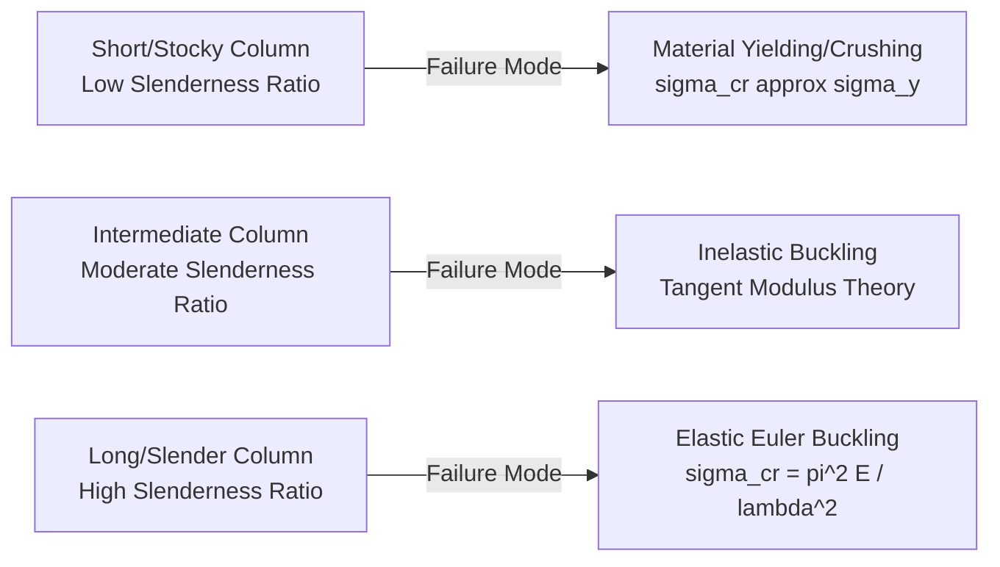

## Column Buckling

### Definition and Physical Concept

Column buckling is a mode of structural failure in which a slender member under axial compressive load suddenly deflects laterally (sideways) rather than failing by direct material crushing. Unlike simple compressive failure (governed by material strength, $\sigma = P/A$), buckling is a **stability failure**—a geometric/equilibrium phenomenon governed by the member's stiffness ($EI$) and slenderness, and it can occur at stress levels well below the material's yield strength.

Buckling is characterized by a sudden, often catastrophic transition from a stable straight configuration to a bent (unstable or newly stable bent) configuration once the applied load reaches a critical value.

### Euler's Critical Buckling Load

For an ideal, slender, initially straight column made of a linear-elastic material with no initial imperfections, loaded perfectly concentrically, the theoretical critical buckling load was derived by Leonhard Euler:

$$P_{cr} = \frac{\pi^2 EI}{L_e^2}$$

Where:

- $P_{cr}$ = Critical (Euler) buckling load, the maximum axial load the column can support before buckling
- $E$ = Modulus of Elasticity of the material
- $I$ = Moment of inertia of the cross-section about the axis of buckling (the **minimum** or weakest moment of inertia governs)
- $L_e$ = Effective length of the column (accounts for end support conditions)

**Critical Design Note:** Since a column will always buckle about the axis of *least* resistance, $I$ in the formula must be the **minimum moment of inertia** of the cross-section, not necessarily the one aligned with the applied load direction.

### Effective Length and End Conditions

The effective length $L_e$ modifies the actual unsupported length $L$ of the column to account for how the end supports restrain rotation and translation:

$$L_e = KL$$

Where $K$ is the **effective length factor**, dependent on end conditions:

| End Condition | Theoretical K | Recommended Design K (AISC) |
| --- | --- | --- |
| Both ends pinned | 1.0 | 1.0 |
| Both ends fixed | 0.5 | 0.65 |
| One fixed, one pinned | 0.7 | 0.80 |
| One fixed, one free (cantilever) | 2.0 | 2.10 |
| One fixed, one free-to-translate (guided) | 1.0 | 1.0 |
| Both fixed, free to translate (sidesway) | 1.0 | 1.2 |

[Unverified] The "Recommended Design K" values are commonly published in structural steel design references (such as AISC) to account for the fact that perfectly ideal fixed or pinned conditions rarely exist in real construction, though the exact recommended values can vary slightly between different codes and editions.

<svg xmlns="http://www.w3.org/2000/svg" viewBox="0 0 500 320">
<title>Euler Buckling Modes and Effective Length (svg_diagram)</title>

<g transform="translate(50,20)">
<line x1="0" y1="0" x2="0" y2="200" stroke="#333" stroke-width="1" stroke-dasharray="4,4" />
<path d="M 0,0 Q 30,100 0,200" fill="none" stroke="blue" stroke-width="3" />
<circle cx="0" cy="0" r="5" fill="black" />
<circle cx="0" cy="200" r="5" fill="black" />
<text x="-15" y="220" font-size="12">K=1.0</text>
<text x="-25" y="235" font-size="11">Pinned-Pinned</text>
</g>

<g transform="translate(180,20)">
<rect x="-15" y="195" width="30" height="10" fill="#333" />
<path d="M 0,200 Q -40,100 -40,0" fill="none" stroke="green" stroke-width="3" />
<text x="-25" y="220" font-size="12">K=2.0</text>
<text x="-35" y="235" font-size="11">Fixed-Free</text>
</g>

<g transform="translate(320,20)">
<rect x="-15" y="-5" width="30" height="10" fill="#333" />
<rect x="-15" y="195" width="30" height="10" fill="#333" />
<path d="M 0,0 Q 25,50 0,100 Q -25,150 0,200" fill="none" stroke="red" stroke-width="3" />
<text x="-15" y="220" font-size="12">K=0.5</text>
<text x="-30" y="235" font-size="11">Fixed-Fixed</text>
</g>

<g transform="translate(440,20)">
<rect x="-15" y="-5" width="30" height="10" fill="#333" />
<path d="M 0,0 Q 20,80 0,150 L 0,200" fill="none" stroke="purple" stroke-width="3" />
<circle cx="0" cy="200" r="5" fill="black" />
<text x="-15" y="220" font-size="12">K=0.7</text>
<text x="-30" y="235" font-size="11">Fixed-Pinned</text>
</g>

<text x="250" y="280" font-size="14" text-anchor="middle" font-weight="bold">Euler Buckling Mode Shapes by End Condition</text>

</svg>

### Critical Buckling Stress and Slenderness Ratio

Dividing the Euler load by the cross-sectional area gives the **critical buckling stress**:

$$\sigma_{cr} = \frac{P_{cr}}{A} = \frac{\pi^2 E}{(L_e/r)^2}$$

Where $r$ is the **radius of gyration**:

$$r = \sqrt{\frac{I}{A}}$$

The term $L_e/r$ is called the **slenderness ratio**, a critical dimensionless parameter that determines whether a column will fail by elastic buckling or by material yielding/crushing:

$$\lambda = \frac{L_e}{r}$$

- **High slenderness ratio (long, slender columns):** Failure governed by elastic (Euler) buckling; $\sigma_{cr}$ is relatively low and independent of material strength ($\sigma_y$).
- **Low slenderness ratio (short, stocky columns):** Failure governed by material yielding/crushing, not buckling; Euler's formula becomes invalid since it would predict a stress higher than the material can actually sustain.

### The Column Curve and Transition Zone

Plotting critical stress against slenderness ratio produces the classic **column curve**, which distinguishes elastic and inelastic buckling regimes:

The boundary between elastic and inelastic behavior occurs at the **critical slenderness ratio** ($\lambda_c$ or $C_c$), where the Euler stress equals the material's proportional limit (approximated by yield stress $\sigma_y$ for design purposes):

$$\lambda_c = \sqrt{\frac{2\pi^2 E}{\sigma_y}}$$

- If $\lambda > \lambda_c$: The column is "long," and Euler's elastic buckling formula applies directly.
- If $\lambda < \lambda_c$: The column is "intermediate" or "short," and inelastic buckling theories (such as the **Tangent Modulus Theory** or empirical formulas like the AISC/Johnson parabolic formula) must be used instead, since the material has already begun to yield locally before the theoretical elastic buckling load is reached.

### Worked Example

**Problem:** A pin-ended steel column (E = 200 GPa) has a length of 4 m and a rectangular cross-section of 50 mm × 100 mm. Determine the Euler critical buckling load.

**Step 1: Determine the Minimum Moment of Inertia**

The column will buckle about the axis with the smaller moment of inertia (the weak axis, using the smaller dimension as the "height" in bending terms):

$$I_{min} = \frac{(100)(50)^3}{12} = 1.0417 \times 10^6 \text{ mm}^4$$

**Step 2: Determine Effective Length**

For pinned-pinned ends, $K = 1.0$:

$$L_e = KL = (1.0)(4000 \text{ mm}) = 4000 \text{ mm}$$

**Step 3: Apply Euler's Formula**

$$P_{cr} = \frac{\pi^2 EI}{L_e^2} = \frac{\pi^2 (200{,}000 \text{ N/mm}^2)(1.0417 \times 10^6 \text{ mm}^4)}{(4000 \text{ mm})^2}$$

$$P_{cr} = \frac{2{,}056{,}400{,}000{,}000}{16{,}000{,}000} \approx 128{,}525 \text{ N} \approx 128.5 \text{ kN}$$

**Output:** The Euler critical buckling load is approximately 128.5 kN. If the applied axial load exceeds this value, the column will buckle about its weak axis before any other failure mode governs (assuming the slenderness ratio confirms elastic behavior—verified in the next step).

**Verification of Elastic Buckling Assumption (assuming $\sigma_y = 250$ MPa):**

$$A = 50 \times 100 = 5000 \text{ mm}^2, \quad r_{min} = \sqrt{\frac{1.0417 \times 10^6}{5000}} = 14.43 \text{ mm}$$

$$\lambda = \frac{L_e}{r_{min}} = \frac{4000}{14.43} = 277.2$$

$$\lambda_c = \sqrt{\frac{2\pi^2(200{,}000)}{250}} = 125.7$$

Since $\lambda (277.2) > \lambda_c (125.7)$, the column is indeed "long," confirming that Euler's elastic buckling formula is valid for this case.

### Boundary Conditions and Real-World Imperfections

Euler's formula assumes an idealized, perfectly straight column with a perfectly concentric (centroidal) axial load. In practice, real columns always have:

- **Initial crookedness** (slight out-of-straightness from manufacturing/construction)
- **Load eccentricity** (imperfect load application)
- **Residual stresses** (from manufacturing processes like rolling or welding)

These imperfections mean actual columns typically buckle at loads **lower** than the theoretical Euler load, which is why design codes apply **factors of safety** and use empirically-calibrated design curves (rather than the pure Euler formula) for practical column design.

### Eccentric Loading: The Secant Formula

When axial load is applied with a known eccentricity $e$ from the column's centroidal axis, bending stresses are induced in addition to buckling effects. The maximum stress is given by the **Secant Formula**:

$$\sigma_{max} = \frac{P}{A}\left[1 + \frac{ec}{r^2}\sec\left(\frac{L_e}{2r}\sqrt{\frac{P}{EA}}\right)\right]$$

Where $c$ is the distance from the neutral axis to the extreme fiber. [Inference] This formula is inherently non-linear in $P$ (since $P$ appears both outside and inside the secant term), so it is typically solved iteratively or through design charts rather than direct algebraic rearrangement, and its complexity is why simplified interaction equations are preferred in most modern design codes.

### Design Approaches in Practice (AISC/Design Codes)

Modern structural steel design codes (such as AISC 360) do not use the pure Euler formula directly for design. Instead, they employ unified column curves that transition smoothly between inelastic and elastic behavior, typically expressed in terms of a **critical stress** ($F_{cr}$) that already incorporates safety margins and imperfection effects:

- For low slenderness (stocky columns): An inelastic buckling equation (often exponential in form) governs, approaching the yield stress as slenderness decreases.
- For high slenderness (slender columns): The elastic Euler equation governs directly.

[Unverified] The specific mathematical form of these unified curves (e.g., exact exponents and transition points) is code-specific and has evolved across different code editions, so designers should consult the current applicable code (AISC, Eurocode 3, etc.) rather than relying on the classical Euler formula alone for final design.

### Buckling in Different Structural Contexts

- **Reinforced Concrete Columns:** Buckling (slenderness) effects are addressed through **moment magnification methods**, which amplify the design bending moment to account for secondary (P-Delta) effects in slender columns.
- **Timber Columns:** Design codes apply a **column stability factor** ($C_P$) derived from a modified Euler-based approach that also accounts for the wood's variability and the buckling-crushing interaction.
- **Built-up and Battened Columns:** Columns made of multiple laced or battened members require special consideration of shear deformation in the connecting elements, which reduces the effective stiffness compared to a solid section of equivalent moment of inertia.
- **Local Buckling:** Distinct from overall (global) column buckling, thin plate elements within a cross-section (such as thin flanges or webs) can buckle locally under compressive stress, governed by plate buckling theory rather than the column (Euler) formula.

### Limitations of Euler's Theory

- **Small Deflection Assumption:** The derivation assumes small deflections, and the formula only predicts the *onset* of buckling (bifurcation point), not the post-buckling behavior/load-carrying capacity beyond that point.
- **Perfect Column Assumption:** Real columns with imperfections do not exhibit a sharp bifurcation but rather a gradual increase in lateral deflection as load approaches $P_{cr}$, following the **Southwell Plot** relationship in experimental testing.
- **Material Linearity:** The formula is invalid once stress exceeds the material's proportional limit; inelastic buckling theories (Engesser's Tangent Modulus or Shanley's theory) are required for intermediate-length columns.
- **Connection/Support Idealization:** Real end conditions rarely match the pure theoretical cases (pinned, fixed, free); the "Recommended Design K" values are themselves engineering approximations intended to provide conservative, practical estimates for actual construction conditions.

**Related Topics**

- Slenderness Ratio and Radius of Gyration
- Inelastic Buckling and the Tangent Modulus Theory
- Combined Axial and Bending Stress (Beam-Columns)
- P-Delta Effects and Moment Magnification in Concrete Columns
- Local Buckling of Thin-Walled Plate Elements
- Lateral-Torsional Buckling of Beams
- AISC/Eurocode Column Design Curves and Interaction Equations