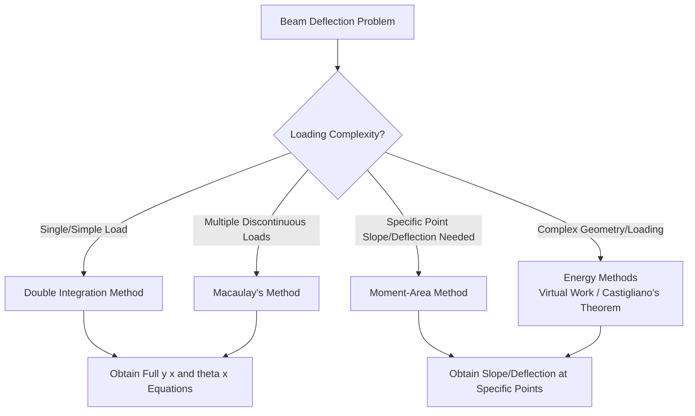

## Beam Deflection Methods

### Definition and Physical Concept

Beam deflection refers to the displacement of a point along a beam's neutral axis from its original (undeformed) position, occurring as a result of applied transverse loads. While stress analysis (bending/shear) governs *strength* (whether a member fails), deflection analysis governs **serviceability**—ensuring a structure does not deform excessively under service loads, even if it remains well within allowable stress limits.

Deflection is characterized by two primary quantities at any point along the beam:

- **Deflection ($y$ or $v$):** The linear (transverse) displacement from the original position.
- **Slope ($\theta$ or $dy/dx$):** The angular rotation of the tangent to the deflected curve at that point.

### The Governing Differential Equation

Beam deflection theory is founded on the relationship between bending moment and curvature, derived from the same flexure assumptions used in bending stress analysis:

$$\frac{d^2y}{dx^2} = \frac{M(x)}{EI}$$

This is the fundamental **Euler-Bernoulli beam equation**, valid for small deflections and assuming plane sections remain plane. Integrating this equation forms the basis of nearly all classical deflection methods:

- **First integration** yields the slope: $\theta(x) = \frac{dy}{dx} = \int \frac{M(x)}{EI}dx + C_1$
- **Second integration** yields the deflection: $y(x) = \int\int \frac{M(x)}{EI}dx\,dx + C_1x + C_2$

The constants of integration ($C_1$, $C_2$) are evaluated using known **boundary conditions** (e.g., zero deflection at a pin/roller support, zero slope at a fixed support).

### Method 1: Double Integration Method

The **Double Integration Method** directly applies the governing differential equation by writing a single expression for $M(x)$ (or piecewise expressions for beams with discontinuous loading) and integrating twice.

**Procedure:**

1. Establish a coordinate system and write the bending moment equation $M(x)$ for the beam (using sections if loading is discontinuous).
2. Integrate $M(x)/EI$ once to obtain the slope equation $\theta(x)$, introducing a constant $C_1$.
3. Integrate again to obtain the deflection equation $y(x)$, introducing a constant $C_2$.
4. Apply boundary conditions (known deflection/slope values at supports) to solve for $C_1$ and $C_2$.
5. For beams with multiple loading segments, apply **continuity conditions** (matching slope and deflection at the boundaries between segments) to solve for all constants simultaneously.

**Advantages:** Provides an exact, closed-form equation for deflection and slope at *any* point along the beam.

**Limitations:** Becomes algebraically cumbersome for beams with multiple discontinuous loads (point loads, moments, or partial UDLs), since each new "region" requires a new moment expression and additional continuity constants.

### Worked Example: Double Integration

**Problem:** A simply supported beam of length $L$ carries a uniformly distributed load $w$ over its entire span. Determine the maximum deflection using double integration. (Assume constant $EI$.)

**Step 1: Determine Reactions and Moment Equation**

By symmetry, each support reaction is $R = wL/2$. Taking a section at distance $x$ from the left support:

$$M(x) = \frac{wL}{2}x - \frac{wx^2}{2}$$

**Step 2: First Integration (Slope)**

$$EI\frac{d^2y}{dx^2} = \frac{wL}{2}x - \frac{wx^2}{2}$$

$$EI\frac{dy}{dx} = \frac{wL}{4}x^2 - \frac{w}{6}x^3 + C_1$$

**Step 3: Second Integration (Deflection)**

$$EIy = \frac{wL}{12}x^3 - \frac{w}{24}x^4 + C_1x + C_2$$

**Step 4: Apply Boundary Conditions**

At $x=0$, $y=0$ (pin support): $C_2 = 0$

At $x=L$, $y=0$ (roller support):

$$0 = \frac{wL}{12}L^3 - \frac{w}{24}L^4 + C_1L$$

$$0 = \frac{wL^4}{12} - \frac{wL^4}{24} + C_1L$$

$$C_1 = -\frac{wL^3}{24}$$

**Step 5: Determine Maximum Deflection (at midspan, x = L/2, by symmetry)**

$$EIy_{max} = \frac{wL}{12}\left(\frac{L}{2}\right)^3 - \frac{w}{24}\left(\frac{L}{2}\right)^4 - \frac{wL^3}{24}\left(\frac{L}{2}\right)$$

Simplifying yields the well-known standard result:

$$y_{max} = -\frac{5wL^4}{384EI}$$

**Output:** The maximum downward deflection at midspan is $\dfrac{5wL^4}{384EI}$, occurring at $x = L/2$. This is one of the most frequently referenced standard beam deflection formulas in design practice.

### Method 2: Macaulay's Method (Singularity Functions)

**Macaulay's Method** streamlines the double integration approach for beams with multiple discontinuous loads by using **singularity functions** (Macaulay brackets), allowing a *single* moment equation to represent the entire beam.

**Macaulay Bracket Notation:**

$$\langle x - a \rangle^n = \begin{cases} 0 & \text{if } x < a \\ (x-a)^n & \text{if } x \geq a \end{cases}$$

**Key Integration Rule:** Macaulay brackets integrate like ordinary polynomials, but the bracket notation `⟨ ⟩` is retained (rather than switching to standard parentheses) to preserve the "switching on/off" behavior at each term's location:

$$\int \langle x-a \rangle^n dx = \frac{\langle x-a \rangle^{n+1}}{n+1} + C$$

**Advantages:** Requires only **one** set of integration constants ($C_1$, $C_2$) for the *entire* beam, regardless of how many discontinuous loads are present, making it significantly more efficient than segment-by-segment double integration for complex loading.

**Special handling for distributed loads:** A UDL that does *not* extend to the end of the beam must be "continued" to the end using an equal and opposite UDL, since Macaulay's method requires that once a load type is applied, it (or its cancelling counterpart) continues to the beam's end.

### Method 3: Moment-Area Method

The **Moment-Area Method** is a semi-graphical technique based on two geometric theorems relating the area under the $M/EI$ diagram to slope and deflection changes between two points on the beam.

**First Moment-Area Theorem:** The change in slope between two points A and B equals the area under the $M/EI$ diagram between those points:

$$\theta_{B} - \theta_{A} = \int_{A}^{B} \frac{M}{EI}dx = \text{Area}_{AB}$$

**Second Moment-Area Theorem:** The vertical deviation (tangential deviation) of point B from the tangent drawn at point A equals the moment of the $M/EI$ diagram area (between A and B) taken about point B:

$$t_{B/A} = \int_{A}^{B} \frac{M}{EI}(x_B - x)dx = \text{Area}_{AB} \times \bar{x}_B$$

**Advantages:** Highly effective for finding slope/deflection at *specific* points (especially at free ends of cantilevers or at midspan of symmetric beams) without deriving a full equation for the entire beam. Particularly efficient when the $M/EI$ diagram can be decomposed into simple geometric shapes (rectangles, triangles, parabolas).

**Limitations:** Requires careful sign convention and geometric interpretation (tangential deviations do not directly equal the actual beam deflection except in specific configurations, such as cantilevers where one end has a known zero slope).

### Method 4: Conjugate Beam Method

The **Conjugate Beam Method** reformulates the moment-area theorems into an analogy with standard beam analysis: an imaginary "conjugate beam" is loaded with the $M/EI$ diagram (as if it were a distributed load), and the **shear** and **moment** in this conjugate beam directly correspond to the **slope** and **deflection**, respectively, of the real beam.

**Key correspondence:**

| Real Beam | Conjugate Beam |
| --- | --- |
| Slope ($\theta$) | Shear ($V$) |
| Deflection ($y$) | Moment ($M$) |
| $M/EI$ diagram | Applied load |

**Support Conversion Rules:** Real supports must be converted to conjugate supports that satisfy the corresponding boundary conditions (e.g., a real fixed support, which has zero slope/deflection, becomes a conjugate free end, since a free end naturally has zero shear/moment; a real pin/roller, which has zero deflection but nonzero slope, remains a pin/roller in the conjugate beam).

**Advantages:** Converts a calculus-based problem into a statics problem (calculating "reactions," "shear," and "moment" using familiar equilibrium equations), which can be more intuitive for engineers already skilled in beam analysis.

### Method 5: Energy Methods (Virtual Work / Castigliano's Theorem)

**Unit Load Method (Virtual Work):** Deflection at a specific point is found by applying a unit (virtual) load at that point in the direction of desired deflection, then equating the external virtual work to the internal virtual strain energy:

$$\Delta = \int_{0}^{L} \frac{M(x)\,m(x)}{EI}dx$$

Where $M(x)$ is the moment due to actual loads, and $m(x)$ is the moment due to the unit virtual load.

**Castigliano's Second Theorem:** The deflection at the point of application of a load $P$, in the direction of that load, equals the partial derivative of the total strain energy ($U$) with respect to that load:

$$\Delta = \frac{\partial U}{\partial P} = \int_{0}^{L} \frac{M}{EI}\frac{\partial M}{\partial P}dx$$

**Advantages:** Highly versatile—applicable to trusses, frames, and beams with complex geometry, and can handle deflection due to combined axial, bending, shear, and torsional strain energy simultaneously. Particularly powerful for analyzing statically indeterminate structures (combined with compatibility conditions).

**Limitations:** [Inference] Can require more setup (writing multiple moment equations, one for actual loads and one for the virtual/unit load) compared to direct methods, making it less efficient for simple determinate beams where double integration or standard tables suffice, though its generality makes it valuable for complex or indeterminate systems.

### Standard Deflection Formulas (Design Reference Table)

For common determinate loading cases, deflection formulas are pre-derived and tabulated for quick design reference:

| Beam Configuration | Loading | Maximum Deflection |
| --- | --- | --- |
| Simply Supported | Central Point Load $P$ | $\dfrac{PL^3}{48EI}$ |
| Simply Supported | Uniform Load $w$ | $\dfrac{5wL^4}{384EI}$ |
| Cantilever | End Point Load $P$ | $\dfrac{PL^3}{3EI}$ |
| Cantilever | Uniform Load $w$ | $\dfrac{wL^4}{8EI}$ |
| Cantilever | End Moment $M_0$ | $\dfrac{M_0L^2}{2EI}$ |
| Simply Supported | Off-center Point Load $P$ (at distance $a$ from support, $b = L-a$) | $\dfrac{Pb(L^2-b^2)^{1.5}}{9\sqrt{3}\,EIL}$ (at specific location) |

### Serviceability Design Applications

Deflection calculations are essential for satisfying **serviceability limit states**, distinct from strength (ultimate limit state) checks. Building codes typically impose maximum allowable deflection limits, commonly expressed as a fraction of the span length:

- Floor beams (general): commonly limited to $L/360$ under live load (to prevent cracking of plaster/finishes)
- Roof beams: commonly limited to $L/240$ under live load
- Total (dead + live) load deflection: often limited to $L/240$ or $L/180$ depending on the element and code

[Unverified] Specific deflection limits vary considerably by building code (IBC, Eurocode, local standards), element type, and the presence of brittle finishes, so designers must consult the governing code for exact applicable limits rather than relying on general rules of thumb alone.

### Deflection in Statically Indeterminate Beams

For beams with redundant supports (more reactions than available equilibrium equations), deflection methods play a dual role: they are used not only to check serviceability but also as the primary tool to **solve** for the redundant reactions themselves, using **compatibility equations** (e.g., setting deflection at a redundant support equal to zero, or matching deflection/slope with adjacent spans). Common approaches include:

- **Superposition Method:** Breaking the indeterminate beam into a determinate primary structure plus redundant reactions, then enforcing compatibility.
- **Three-Moment Theorem (Clapeyron's Equation):** Specifically suited for continuous beams over multiple supports.
- **Force Method (Flexibility Method):** A generalized matrix-based approach for higher-degree indeterminate structures.

### Limitations of Classical Deflection Theory

- **Small Deflection Assumption:** All methods above assume deflections are small relative to the span (linear theory); large deflections require nonlinear geometric analysis.
- **Shear Deformation Neglected:** The Euler-Bernoulli equation neglects shear deformation's contribution to total deflection, which becomes significant for deep beams (low span-to-depth ratio); the **Timoshenko beam theory** incorporates shear deformation for such cases.
- **Elastic Material Assumption:** These methods assume linear-elastic material behavior; deflection under loads causing inelastic (plastic) material response requires different analytical approaches.
- **Constant EI Assumption:** Standard formulas often assume constant flexural rigidity ($EI$) along the beam length; beams with varying cross-sections (haunched or tapered beams) require modified integration approaches or numerical methods.

**Related Topics**

- Bending Stress in Beams and the Flexure Formula
- Shear Deformation and Timoshenko Beam Theory
- Statically Indeterminate Beam Analysis (Three-Moment Theorem, Force Method)
- Castigliano's Theorems and Strain Energy Methods
- Moment Distribution Method for Continuous Beams
- Serviceability Limit States in Structural Design Codes
- Column Buckling and Beam-Column Interaction