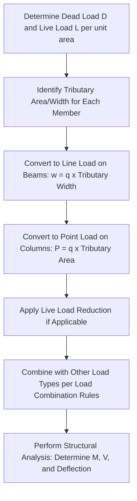

## Dead Loads and Live Loads

### Definition and Physical Concept

Structural loads are the forces, deformations, or accelerations applied to a structure that its components must resist. Among the various load types considered in design, **Dead Loads (D)** and **Live Loads (L)** represent the two most fundamental gravity load categories, forming the baseline for nearly all structural load combinations.

**Dead Load (D):** The permanent, static weight of the structure itself and all fixed, permanently attached components. Dead loads are essentially constant in magnitude throughout the structure's service life.

**Live Load (L):** Loads produced by the use and occupancy of the structure, which are transient, variable in magnitude, and not permanently attached to the structure. Live loads account for the dynamic and unpredictable nature of how a structure is actually used.

### Characteristics of Dead Loads

Dead loads include:

- **Self-weight of structural members:** Beams, columns, slabs, girders, trusses, and foundations.
- **Permanent non-structural elements:** Roofing materials, flooring/finishes, ceilings, permanent partitions, fixed mechanical/electrical/plumbing (MEP) equipment, and cladding/facades.
- **Superimposed dead loads (SDL):** Additional permanent loads applied after initial construction, such as HVAC ductwork, fixed built-in furniture, or permanent architectural finishes.

**Key Points:**

- Dead loads are calculated based on the actual (or specified) material unit weights and the geometry/volume of each component.
- Unlike live loads, dead loads are largely **deterministic**—they can be calculated with high precision once the design (materials and dimensions) is finalized.
- Dead loads generally have a **lower load factor** in ultimate strength design (e.g., 1.2D in many LRFD combinations) compared to live loads, reflecting their lower variability and higher predictability.

### Calculating Dead Loads

Dead load calculation involves multiplying the **unit weight (density)** of each material by its volume (or area, for surface-applied loads), summed across all permanent components:

$$D = \sum (\gamma_i \times V_i)$$

Where $\gamma_i$ is the unit weight of material $i$ and $V_i$ is its volume (or the area for a given thickness, when expressed per unit area).

**Typical Unit Weights (for reference/estimation):**

| Material | Approx. Unit Weight |
| --- | --- |
| Reinforced Concrete | 23.5–24 kN/m³ (150 lb/ft³) |
| Structural Steel | 77 kN/m³ (490 lb/ft³) |
| Timber (softwood) | 5–7 kN/m³ (35–45 lb/ft³) |
| Brick Masonry | 18–22 kN/m³ (115–140 lb/ft³) |
| Concrete Masonry Units (CMU, hollow) | 12–14 kN/m³ (75–90 lb/ft³) |

[Unverified] Exact unit weights vary based on specific material composition, moisture content (for timber), and regional standards, so actual design should reference the governing building code or manufacturer/material test data rather than generalized approximate values.

### Worked Example: Dead Load Calculation

**Problem:** Calculate the dead load per square meter for a reinforced concrete slab, 150 mm thick, with a 50 mm thick screed/finish (unit weight 22 kN/m³) and a suspended ceiling (assumed 0.15 kN/m²).

**Step 1: Self-weight of concrete slab**

$$D_{slab} = \gamma_{concrete} \times t_{slab} = 24 \text{ kN/m}^3 \times 0.150 \text{ m} = 3.6 \text{ kN/m}^2$$

**Step 2: Weight of screed/finish**

$$D_{screed} = 22 \text{ kN/m}^3 \times 0.050 \text{ m} = 1.1 \text{ kN/m}^2$$

**Step 3: Suspended ceiling (given directly)**

$$D_{ceiling} = 0.15 \text{ kN/m}^2$$

**Step 4: Total Dead Load**

$$D_{total} = 3.6 + 1.1 + 0.15 = 4.85 \text{ kN/m}^2$$

**Output:** The total superimposed and self-weight dead load for this floor system is 4.85 kN/m², which would then be applied to the tributary area of each supporting beam or column to determine the total dead load force on that member.

### Characteristics of Live Loads

Live loads arise from the intended occupancy and use of a structure and include:

- **Occupancy loads:** People, furniture, movable equipment, and stored materials in residential, office, retail, or industrial spaces.
- **Roof live loads:** Loads from maintenance personnel, equipment, or materials temporarily placed on a roof (distinct from environmental loads like snow).
- **Vehicular loads:** For parking structures and bridges (though bridge live loads often follow specialized vehicular load models, distinct from building occupancy live loads).
- **Construction loads:** Temporary loads during the construction process (formwork, stacked materials, construction equipment).

**Key characteristics distinguishing live loads from dead loads:**

- **Variability:** Magnitude changes over time depending on occupancy and use patterns.
- **Movability:** Not permanently fixed in position (unlike a fixed partition wall, which would be dead load).
- **Probabilistic Nature:** Live loads are typically defined by building codes as *minimum uniformly distributed loads* representing a statistically reasonable maximum expected load for a given occupancy type, rather than an exact deterministic value.

### Specified Minimum Live Loads (Typical Code-Based Values)

Building codes (such as ASCE 7 in the US, or equivalent national codes) prescribe minimum design live loads based on occupancy classification:

| Occupancy/Use | Typical Minimum Uniform Live Load |
| --- | --- |
| Residential (dwelling units) | 1.9 kN/m² (40 psf) |
| Office buildings | 2.4–4.8 kN/m² (50–100 psf) |
| Classrooms | 1.9–2.9 kN/m² (40–60 psf) |
| Corridors/Public spaces (first floor) | 4.8 kN/m² (100 psf) |
| Retail (first floor) | 4.8 kN/m² (100 psf) |
| Light Storage/Warehouse | 6.0 kN/m² (125 psf) |
| Heavy Storage/Warehouse | 12.0 kN/m² (250 psf) |
| Assembly areas (fixed seating) | 2.9 kN/m² (60 psf) |
| Roof (ordinary, minimum) | 0.96 kN/m² (20 psf) |

[Unverified] These values are illustrative approximations for common occupancy categories; actual minimum design live loads are governed strictly by the applicable local or national building code (e.g., ASCE 7, National Structural Code, Eurocode 1), which should always be consulted directly, as specific values, occupancy classifications, and reduction provisions vary by jurisdiction and code edition.

### Live Load Reduction

Because it is statistically improbable that the *full* specified live load will act simultaneously across a very large tributary area (e.g., an entire multi-story column's cumulative floor area), most codes permit a **live load reduction factor** for members supporting large tributary areas:

$$L = L_0 \left(0.25 + \frac{4.57}{\sqrt{K_{LL}A_T}}\right)$$

(A common form based on ASCE 7, where $L_0$ is the unreduced design live load, $K_{LL}$ is the live load element factor, and $A_T$ is the tributary area.)

[Unverified] Specific reduction formulas, applicable limits (e.g., minimum reduction caps, occupancy exclusions such as assembly areas often being non-reducible), and coefficients differ between code editions and jurisdictions, so the exact governing formula must be verified against the applicable code.

### Load Path and Tributary Area Concept

Both dead and live loads (expressed as pressure/area loads, e.g., kN/m² or psf) must be converted into **line loads** (for beams, in kN/m) or **point loads** (for columns, in kN) using the concept of **tributary area**—the portion of the total floor/roof area that is assumed to be supported by a specific structural member.

### Worked Example: Tributary Area and Beam Load

**Problem:** A floor beam spans 6 m and supports a tributary width of 3 m. The floor dead load is 4.85 kN/m² (from the earlier example) and the design live load is 2.4 kN/m² (office occupancy). Determine the total unfactored uniformly distributed load on the beam.

**Step 1: Convert Dead Load to Line Load**

$$w_D = D \times \text{Tributary Width} = 4.85 \text{ kN/m}^2 \times 3 \text{ m} = 14.55 \text{ kN/m}$$

**Step 2: Convert Live Load to Line Load**

$$w_L = L \times \text{Tributary Width} = 2.4 \text{ kN/m}^2 \times 3 \text{ m} = 7.2 \text{ kN/m}$$

**Step 3: Total Service (Unfactored) Load**

$$w_{total} = w_D + w_L = 14.55 + 7.2 = 21.75 \text{ kN/m}$$

**Output:** The beam experiences an unfactored (service-level) uniformly distributed load of 21.75 kN/m, which would then be used directly for deflection/serviceability checks, or combined with load factors (e.g., 1.2D + 1.6L) for ultimate strength design checks.

### Dead Load vs. Live Load in Load Combinations

Because dead and live loads have different degrees of predictability/variability, design codes assign them **different load factors** in Load and Resistance Factor Design (LRFD)/Ultimate Limit State approaches. A commonly referenced basic combination (illustrative form, consistent with typical LRFD philosophy) is:

$$U = 1.2D + 1.6L$$

The higher factor on live load (1.6 vs. 1.2 for dead load) reflects the greater statistical uncertainty and variability inherent in live loads compared to the more predictable, permanent dead load. [Unverified] Exact load factors and the full set of applicable combinations (including wind, seismic, snow, and other environmental loads) are prescribed by the governing structural design code and can differ between codes (e.g., ASCE 7 vs. Eurocode) and even between editions of the same code.

### Distinguishing Dead Load from Live Load: Edge Cases

Some loads require careful judgment to classify correctly:

- **Movable Partitions:** Often treated as a live load surcharge (a nominal additional uniform load, e.g., 0.5–1.0 kN/m²) rather than true dead load, since their exact position can change, even though they are not as transient as occupant loads.
- **Fixed Heavy Equipment:** Permanently installed mechanical equipment (e.g., a rooftop HVAC unit bolted in place) is generally classified as dead load, since its weight and location do not vary once installed.
- **Snow and Rain Loads:** Though environmental in origin (and thus often coded separately as "S" or "R"), these are conceptually similar to live loads in that they are variable/transient, but they follow distinct code provisions (e.g., ground snow maps, drift calculations) separate from occupancy live load tables.
- **Vehicle/Crane Loads:** Often classified separately as their own load category (with associated impact factors) due to their dynamic nature, rather than being lumped into standard occupancy live loads.

### Applications in Structural Design Process

Dead and live loads form the foundation of the overall structural analysis and design workflow:

1. Establish the load path from the point of application (slab) through supporting members (beams, girders, columns) down to the foundation.
2. Calculate service-level (unfactored) loads for serviceability checks (deflection, vibration).
3. Apply appropriate load factors and combine with other load types (wind, seismic, snow) per code-specified load combinations for strength/ultimate limit state design.
4. Size structural members (beams, columns, slabs, foundations) to safely resist the governing (critical) load combination, checking both individual member capacity and overall structural stability.

### Limitations and Practical Considerations

- **Future Use Changes:** Live load classifications are based on the *intended* occupancy at design time; a change in building use (e.g., converting office space to storage) can invalidate the original live load assumptions, requiring re-evaluation of structural capacity.
- **Concentrated Live Loads:** In addition to uniform live loads, codes often specify minimum concentrated live loads (applied over a small area) that must also be checked, particularly for critical local effects (e.g., punching shear in slabs).
- **Dynamic Effects:** Standard "live load" tables represent equivalent static loads; for loads with genuine dynamic character (machinery vibration, impact loads, moving vehicles), separate dynamic amplification factors or specialized analysis may be required beyond the basic static live load value.
- **Code Dependency:** [Unverified] Because specific load magnitudes, reduction formulas, and classification rules are entirely code-dependent and subject to periodic revision, this content should be treated as a conceptual framework, with final numeric design values always verified against the current, applicable local building code.

**Related Topics**

- Load Combinations (LRFD/ASD Methods)
- Environmental Loads: Wind, Seismic, and Snow Loads
- Tributary Area and Load Path Analysis
- Live Load Reduction Provisions
- Impact and Dynamic Load Factors
- Serviceability Limit States and Deflection Criteria
- Foundation Design and Load Transfer to Soil