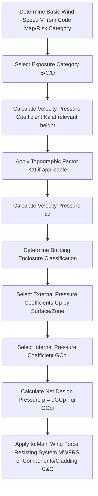

## Wind Load Determination

### Definition and Physical Concept

Wind load refers to the dynamic pressure exerted on a structure's surfaces due to moving air. Unlike gravity loads (dead/live), wind load is an **environmental, lateral (and sometimes uplift) load** whose magnitude depends on complex interactions between wind speed, structure geometry, height, surrounding terrain, and exposure conditions. Wind loading is critical for lateral stability design, cladding/component design, and overall building drift/serviceability checks.

Wind effects on a structure generally produce:

- **External pressure** on windward faces (positive/pushing pressure) and leeward faces (negative/suction).
- **Internal pressure** within enclosed buildings, depending on the permeability of the building envelope (openings).
- **Uplift forces** on roofs, particularly for flat or low-slope roofs, due to aerodynamic suction.
- **Dynamic effects** including gust buffeting and, for very tall or flexible structures, aeroelastic phenomena (vortex shedding, flutter).

### The Fundamental Wind Pressure Equation

Most modern wind design codes (e.g., ASCE 7 in the US) derive design wind pressure using a form of the **velocity pressure equation**, based on the kinetic energy of moving air:

$$q_z = 0.613 K_z K_{zt} K_d K_e V^2 \quad \text{(SI units, N/m}^2\text{, V in m/s)}$$

or in imperial units:

$$q_z = 0.00256 K_z K_{zt} K_d K_e V^2 \quad \text{(psf, V in mph)}$$

Where:

- $q_z$ = Velocity pressure at height $z$
- $V$ = Basic wind speed (from code wind speed maps, based on regional climate/hazard data)
- $K_z$ = Velocity pressure exposure coefficient (accounts for height and terrain roughness)
- $K_{zt}$ = Topographic factor (accounts for wind speed-up over hills, ridges, escarpments)
- $K_d$ = Wind directionality factor (accounts for reduced probability of maximum winds from all directions simultaneously)
- $K_e$ = Ground elevation factor (accounts for air density variation with altitude, in some code versions)

[Unverified] The exact numerical constant (0.613 or 0.00256) and the specific set of coefficients included depend on the governing code and its edition; some codes combine or omit certain factors, so the precise formula must be verified against the applicable design standard.

### Basic Wind Speed

The **basic wind speed** ($V$) is a fundamental input obtained from code-specified wind speed maps or hazard tools, representing a statistically-derived extreme wind speed (typically a 3-second gust speed at 10 m/33 ft above ground in open terrain) associated with a specified **mean recurrence interval (MRI)** or annual probability of exceedance (e.g., 700-year, 1700-year, or 3000-year MRI, depending on the structure's Risk Category).

**Risk Category Influence:** Higher-consequence structures (hospitals, emergency facilities—Risk Category IV) are designed for wind speeds with a lower annual probability of exceedance (longer MRI) compared to ordinary structures (Risk Category II), reflecting the greater consequence of failure.

### Exposure Categories

Wind speed near the ground is significantly influenced by upstream terrain roughness, captured through **Exposure Categories**:

| Exposure Category | Description |
| --- | --- |
| Exposure B | Urban/suburban areas, wooded terrain, numerous closely spaced obstructions |
| Exposure C | Open terrain with scattered obstructions (flat open country, grasslands) |
| Exposure D | Flat, unobstructed areas facing large bodies of water (coastal areas) |

Rougher terrain (Exposure B) reduces wind speed near the ground due to increased friction/turbulence, while smoother terrain (Exposure D) allows higher wind speeds to reach lower elevations, generally resulting in higher design pressures for the same basic wind speed.

<svg xmlns="http://www.w3.org/2000/svg" viewBox="0 0 500 300">
<title>Wind Velocity Profile by Exposure Category (svg_diagram)</title>

<line x1="50" y1="250" x2="450" y2="250" stroke="#333" stroke-width="2" />

<rect x="200" y="100" width="60" height="150" fill="#ccc" stroke="#333" />

<path d="M 200,250 C 150,200 120,150 100,100 C 90,80 85,60 82,40" fill="none" stroke="blue" stroke-width="2" />
<text x="60" y="35" font-size="11" fill="blue">Exposure C (open)</text>

<path d="M 200,250 C 180,220 165,190 155,150 C 148,120 145,90 143,50" fill="none" stroke="green" stroke-width="2" />
<text x="145" y="45" font-size="11" fill="green">Exposure B (urban)</text>

<line x1="270" y1="230" x2="330" y2="230" stroke="red" stroke-width="1.5" marker-end="url(#arrowW)" />
<line x1="270" y1="150" x2="360" y2="150" stroke="red" stroke-width="1.5" marker-end="url(#arrowW)" />
<line x1="270" y1="90" x2="400" y2="90" stroke="red" stroke-width="1.5" marker-end="url(#arrowW)" />
<text x="250" y="280" font-size="14" text-anchor="middle" font-weight="bold">Wind Speed Increases with Height (Boundary Layer Effect)</text>

</svg>

### Design Wind Pressure

The velocity pressure $q_z$ (or $q_h$, evaluated at mean roof height for many building components) is converted to a **design pressure** ($p$) using pressure/force coefficients specific to the building's shape, surface, and the wind's angle of attack:

$$p = q G C_p - q_i (GC_{pi})$$

Where:

- $G$ = Gust-effect factor (accounts for wind turbulence and dynamic amplification; often ≈ 0.85 for rigid structures, calculated more precisely for flexible/dynamically-sensitive structures)
- $C_p$ = External pressure coefficient (depends on building geometry, surface location—windward wall, leeward wall, side wall, roof—and wind direction)
- $GC_{pi}$ = Internal pressure coefficient (depends on building enclosure classification: enclosed, partially enclosed, or open)
- $q_i$ = Velocity pressure for internal pressure evaluation (may differ from $q_z$ based on enclosure classification rules)

**External Pressure Coefficients ($C_p$):** Typically tabulated based on wall/roof location and geometric ratios (length-to-width ratio, roof slope). Representative values often used for illustration:

- Windward wall: $C_p \approx +0.8$ (positive/pushing pressure)
- Leeward wall: $C_p \approx -0.2$ to $-0.5$ (negative/suction, depends on L/B ratio)
- Side walls: $C_p \approx -0.7$ (suction)
- Roof (varies significantly with slope and location, often negative/uplift near windward edge)

[Unverified] These are simplified illustrative values; actual design pressure coefficients require detailed tables (often varying by roof zone, slope, and distance from edges/corners) from the governing wind code and cannot be generalized reliably without consulting the specific code provisions.

### Building Enclosure Classification

Internal pressure depends heavily on how "open" the building envelope is, since larger openings allow wind pressure to build up (or vent) inside the structure:

- **Enclosed Building:** Total area of openings in each wall is limited (small percentage of wall area); $GC_{pi}$ is relatively small (e.g., ±0.18, illustrative).
- **Partially Enclosed Building:** Has a dominant opening (such as a large door left open, or an opening significantly larger than the sum of openings in other walls) that allows significant internal pressurization; $GC_{pi}$ is larger (e.g., ±0.55, illustrative), often governing design for these structures.
- **Open Building:** Each wall is at least 80% open; internal pressure effects are treated differently (often minimal internal pressure buildup due to free-flowing air).

**Key Points:** Partially enclosed classification is a critical design consideration for structures with large door openings (e.g., aircraft hangars, warehouses, fire stations) since sudden internal pressurization during a storm (e.g., wind entering through a failed garage door) can substantially increase net design pressures on the building envelope.

### Worked Example: Simplified Design Pressure Calculation

**Problem:** Determine the design wind pressure on the windward wall of an enclosed, rigid, low-rise building at mean roof height, given: Basic wind speed $V$ = 45 m/s, $K_z$ = 0.85 (Exposure C, moderate height), $K_{zt}$ = 1.0 (flat terrain), $K_d$ = 0.85, Gust factor $G$ = 0.85, $C_p$ = 0.8 (windward wall), internal pressure coefficient $GC_{pi}$ = ±0.18 (enclosed building).

**Step 1: Calculate Velocity Pressure**

$$q_z = 0.613 \times K_z \times K_{zt} \times K_d \times V^2$$

$$q_z = 0.613 \times 0.85 \times 1.0 \times 0.85 \times (45)^2$$

$$q_z = 0.613 \times 0.7225 \times 2025 = 897.2 \text{ N/m}^2 \approx 0.897 \text{ kN/m}^2$$

**Step 2: Calculate External Pressure Component**

$$p_{external} = q_z \times G \times C_p = 0.897 \times 0.85 \times 0.8 = 0.610 \text{ kN/m}^2$$

**Step 3: Determine Net Design Pressure (worst case, adding positive internal pressure for combined suction check, or considering both signs)**

For maximum outward-acting combined pressure on the windward wall (internal suction, $GC_{pi} = -0.18$):

$$p_{net} = p_{external} - q_z(GC_{pi}) = 0.610 - (0.897)(-0.18) = 0.610 + 0.161 = 0.771 \text{ kN/m}^2$$

**Output:** The net design wind pressure on the windward wall is approximately 0.771 kN/m² for this internal pressure case. The alternate case (positive internal pressure, $GC_{pi} = +0.18$) would need to be checked separately, as different components may govern under different combinations of external and internal pressure signs.

### Main Wind Force Resisting System (MWFRS) vs. Components and Cladding (C&C)

Wind design is typically split into two distinct analysis procedures with different pressure coefficients and load application methods:

- **MWFRS (Main Wind Force Resisting System):** The structural system that transfers overall wind loads to the foundation (e.g., moment frames, shear walls, braced frames). Pressures are applied over larger tributary areas, representing the combined effect of pressure across multiple surfaces.
- **Components and Cladding (C&C):** Individual elements directly receiving wind pressure (windows, wall panels, roof decking, fasteners) that transfer load to the MWFRS but do not themselves distribute load throughout the structure. C&C pressures use higher, more localized pressure coefficients (particularly at corners, edges, and ridges where local turbulence increases suction), since these elements experience more concentrated peak pressures than the overall building structure.

[Inference] This distinction exists because a small cladding panel can experience a very high localized peak pressure (from a small vortex at a roof corner, for instance) that would not meaningfully affect the overall structural response, whereas the MWFRS design must account for the combined, spatially-averaged effect across the whole building envelope.

### Dynamic and Aeroelastic Considerations

For **flexible structures** (typically defined as having a fundamental natural frequency less than approximately 1 Hz, or a height-to-width ratio exceeding certain thresholds), simplified static gust-effect factors may be inadequate, and more advanced dynamic analysis may be required:

- **Gust Response Factor Calculation:** A more detailed, frequency-dependent gust factor accounting for the structure's dynamic properties (natural frequency, damping ratio, mode shapes).
- **Vortex Shedding:** For slender structures (chimneys, towers, tall flexible buildings), wind flowing around the structure can create alternating vortices, inducing across-wind oscillation that may require specialized dynamic analysis, particularly if the vortex shedding frequency approaches the structure's natural frequency (resonance risk).
- **Wind Tunnel Testing:** For unusually shaped, very tall, or dynamically sensitive structures, code-prescribed analytical procedures may be insufficient, and physical (or computational) wind tunnel testing is often used to determine more accurate design pressures.

### Special Topographic and Site-Specific Considerations

- **Topographic Speed-Up Effects ($K_{zt}$):** Wind speed accelerates over isolated hills, ridges, and escarpments; code provisions provide formulas to calculate the speed-up factor based on hill height, slope, and the structure's position relative to the crest.
- **Hurricane-Prone Regions:** Additional provisions often apply in these zones, such as enhanced wind-borne debris impact resistance requirements for glazing.
- **Directional Procedure vs. Envelope Procedure:** Some codes offer simplified "envelope" methods (using pre-combined, direction-independent pressure coefficients) as an alternative to the more detailed "directional" procedure, trading some accuracy for calculation simplicity, particularly for low-rise, regularly-shaped buildings.

### Applications in Structural Design

- **Lateral Force Resisting System Design:** Wind loads (combined with seismic, whichever governs) size shear walls, braced frames, and moment frames.
- **Foundation Overturning and Uplift:** Wind-induced overturning moments must be checked against the structure's resisting moment (self-weight), particularly critical for lightweight structures or tall, slender buildings.
- **Cladding and Glazing Design:** C&C pressures directly size window systems, curtain walls, and roof fastening patterns, especially at high-suction corner/edge zones.
- **Serviceability (Drift) Checks:** Beyond strength design, wind-induced lateral drift must often be limited to prevent damage to non-structural elements and occupant discomfort, using unfactored (service-level) wind loads.

### Limitations and Practical Considerations

- **Code and Regional Dependency:** [Unverified] Wind speed maps, exposure definitions, and pressure coefficients are highly region- and code-specific (differing significantly, for example, between ASCE 7, Eurocode 1, and various national codes), so this content should be treated as a conceptual framework requiring verification against the governing local code for any actual design.
- **Static Approximation:** Standard code procedures largely approximate a fundamentally dynamic phenomenon (turbulent wind) using equivalent static pressures via the gust-effect factor; this approximation may not fully capture behavior for unusual or highly flexible structures.
- **Complex Geometry:** Standard tabulated pressure coefficients are derived for common, regular building shapes; irregular or complex geometries may require wind tunnel testing or computational fluid dynamics (CFD) analysis for reliable results.
- **Climate Change and Map Updates:** [Speculation] Design wind speed maps are periodically revised based on updated meteorological data and statistical analysis; designers should always verify they are using the current, code-adopted map edition rather than outdated data.

**Related Topics**

- Seismic Load Determination and Response Spectrum Analysis
- Load Combinations (LRFD/ASD Methods)
- Lateral Force Resisting Systems (Shear Walls, Braced Frames, Moment Frames)
- Building Drift and Serviceability Criteria
- Components and Cladding Design for Wind Pressure
- Vortex Shedding and Dynamic Response of Tall Structures
- Snow Load Determination and Roof Drift Loads