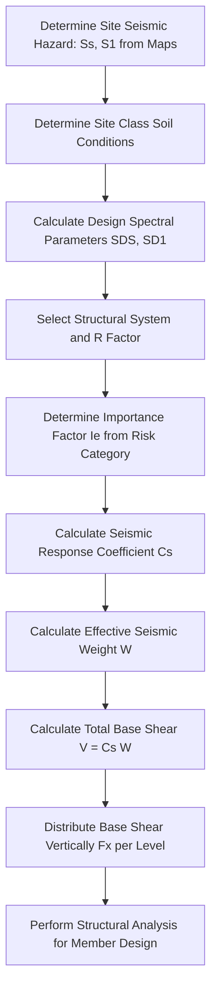

## Seismic Load Determination

### Definition and Physical Concept

Seismic load refers to the inertial forces induced in a structure when the ground beneath it moves suddenly due to an earthquake. Unlike wind load (a directly applied surface pressure), seismic load is fundamentally an **inertial phenomenon**: as the ground accelerates, a structure's mass resists that acceleration (per Newton's Second Law, $F = ma$), generating internal forces throughout the structure proportional to its mass and the acceleration experienced at each level.

This distinction is critical—reducing a structure's **mass** directly reduces seismic demand (unlike wind load, where mass reduction generally has no beneficial effect and lighter structures can even be more vulnerable to wind-induced motion).

### Fundamental Concept: Base Shear

The primary quantity in seismic design is the **base shear** ($V$)—the total lateral force assumed to act at the base of the structure, representing the cumulative inertial effect of the entire building mass responding to ground shaking:

$$V = C_s W$$

Where:

- $V$ = Design base shear
- $C_s$ = Seismic response coefficient (dimensionless, representing the fraction of building weight applied as lateral force)
- $W$ = Effective seismic weight of the structure (total dead load plus applicable portions of other loads, such as partitions or stored materials, per code definition)

### Seismic Response Coefficient

The seismic response coefficient $C_s$ is derived from the design response spectrum and is influenced by several key parameters:

$$C_s = \frac{S_{DS}}{R/I_e}$$

Where:

- $S_{DS}$ = Design spectral response acceleration parameter at short periods (derived from site-specific seismic hazard maps and site soil classification)
- $R$ = Response modification coefficient (reflects the structural system's inherent ductility and energy dissipation capacity)
- $I_e$ = Importance factor (reflects the structure's risk category/occupancy importance)

[Unverified] This is a simplified representative form of the equivalent lateral force procedure; actual code formulas (e.g., ASCE 7) include additional upper and lower bound limits on $C_s$ based on the structure's fundamental period, and the exact formulation varies between code editions and jurisdictions.

### The Response Modification Coefficient (R)

The **R-factor** is one of the most consequential parameters in seismic design, representing the structural system's capacity to dissipate seismic energy through ductile, inelastic deformation without collapse:

- **High R-values** (e.g., R = 8, for special moment-resisting steel frames): Assigned to highly ductile systems capable of sustaining large inelastic deformations, allowing design for significantly reduced (elastically-inconsistent) forces, since the system is expected to yield and dissipate energy safely.
- **Low R-values** (e.g., R = 1.5–3, for plain/ordinary unreinforced masonry or plain concrete): Assigned to brittle systems with little ductility, requiring design for much higher forces since little energy dissipation capacity exists before failure.

[Inference] This large range in R-values (often spanning a factor of 5 or more between systems) reflects the philosophy that ductile systems are permitted to experience controlled damage/yielding during a major earthquake (life-safety performance) rather than remaining fully elastic, which would be economically impractical for most conventional structures.

### Effective Seismic Weight (W)

Unlike wind load (based on surface area), seismic weight is based on the building's **mass**, converted to weight via gravity:

$$W = \sum (D + \text{applicable portions of other loads})$$

Typical inclusions per code provisions:

- Full dead load (structure self-weight and permanent fixtures)
- A specified percentage of storage live load (in areas used for storage)
- Partition load allowances (even where actual partitions are movable, a nominal load is often included since partitions contribute mass during an earthquake)
- Snow load exceeding a specified threshold (in high-snow regions, since accumulated snow adds significant mass)
- Weight of permanent equipment

**Key Point:** Ordinary (non-storage) live loads are typically **excluded** from seismic weight, based on the statistical reasoning that full live load is unlikely to be present during a design-level seismic event, unlike dead load, which is always present.

### Site Classification and Soil Effects

Local soil conditions dramatically influence how seismic waves are amplified as they travel from bedrock to the ground surface, captured through **Site Class** designations (typically A through F, from hard rock to soft/problematic soils):

| Site Class | General Description |
| --- | --- |
| A | Hard rock |
| B | Rock |
| C | Very dense soil / soft rock |
| D | Stiff soil (most common default) |
| E | Soft clay soil |
| F | Soils requiring site-specific evaluation (liquefiable soils, highly organic clays, etc.) |

Softer soils (Site Class D, E) generally **amplify** ground motion at certain periods compared to rock sites, often resulting in significantly higher design forces for structures founded on soft soil, all else being equal.

<svg xmlns="http://www.w3.org/2000/svg" viewBox="0 0 500 300">
<title>Seismic Load Path: Ground Motion to Base Shear (svg_diagram)</title>

<rect x="200" y="60" width="100" height="180" fill="#e0e0e0" stroke="#333" stroke-width="2" />
<line x1="200" y1="100" x2="300" y2="100" stroke="#666" />
<line x1="200" y1="140" x2="300" y2="140" stroke="#666" />
<line x1="200" y1="180" x2="300" y2="180" stroke="#666" />

<line x1="200" y1="80" x2="150" y2="80" stroke="red" stroke-width="2" marker-end="url(#arrowS)" />
<text x="100" y="85" font-size="11" fill="red">F3 (largest)</text>
<line x1="200" y1="120" x2="165" y2="120" stroke="red" stroke-width="2" marker-end="url(#arrowS)" />
<text x="115" y="125" font-size="11" fill="red">F2</text>
<line x1="200" y1="160" x2="180" y2="160" stroke="red" stroke-width="2" marker-end="url(#arrowS)" />
<text x="130" y="165" font-size="11" fill="red">F1 (smallest)</text>
<line x1="100" y1="240" x2="400" y2="240" stroke="#333" stroke-width="3" />
<path d="M 110,245 l 10,10 M 130,245 l 10,10 M 150,245 l 10,10" stroke="#333" stroke-width="1" />

<line x1="200" y1="240" x2="150" y2="240" stroke="blue" stroke-width="3" marker-end="url(#arrowS)" />
<text x="90" y="260" font-size="12" fill="blue" font-weight="bold">V (Base Shear)</text>

<line x1="350" y1="245" x2="420" y2="245" stroke="green" stroke-width="2" marker-end="url(#arrowS)" />
<text x="345" y="270" font-size="11" fill="green">Ground Acceleration</text>

<text x="250" y="290" font-size="14" text-anchor="middle" font-weight="bold">Increasing Inertial Force with Height</text>

</svg>

### Vertical Distribution of Seismic Force

Once the total base shear $V$ is determined, it must be distributed vertically among the building's floor levels, since inertial force at each floor depends on both the mass at that level and its distance from the base (higher floors experience greater relative acceleration/displacement in the fundamental mode of vibration):

$$F_x = C_{vx} V, \quad C_{vx} = \frac{w_x h_x^k}{\sum_{i=1}^{n} w_i h_i^k}$$

Where:

- $F_x$ = Lateral force at level $x$
- $w_x, w_i$ = Weight assigned to level $x$ or $i$
- $h_x, h_i$ = Height from the base to level $x$ or $i$
- $k$ = Distribution exponent related to the building's fundamental period (typically $k=1$ for shorter/stiffer buildings, transitioning toward $k=2$ for taller/longer-period buildings, per code-specific interpolation)

This formula reflects that upper floors, being farther from the base and experiencing greater displacement in the fundamental mode shape, are assigned proportionally larger seismic forces relative to their weight.

### Worked Example: Equivalent Lateral Force Procedure

**Problem:** A 3-story office building has $S_{DS} = 1.0$, $R = 5$ (ordinary reinforced concrete shear wall system, illustrative), $I_e = 1.0$. The effective seismic weight is 8,000 kN, distributed as 3,000 kN at Level 1 (h=3.5m), 3,000 kN at Level 2 (h=7.0m), and 2,000 kN at Level 3 (roof, h=10.5m). Assume $k=1$. Determine the base shear and force distribution.

**Step 1: Calculate Seismic Response Coefficient**

$$C_s = \frac{S_{DS}}{R/I_e} = \frac{1.0}{5/1.0} = 0.20$$

**Step 2: Calculate Base Shear**

$$V = C_s W = 0.20 \times 8000 \text{ kN} = 1600 \text{ kN}$$

**Step 3: Calculate Vertical Distribution Factors (k=1)**

$$\sum w_i h_i = (3000)(3.5) + (3000)(7.0) + (2000)(10.5) = 10{,}500 + 21{,}000 + 21{,}000 = 52{,}500$$

$$C_{v1} = \frac{(3000)(3.5)}{52{,}500} = 0.20, \quad C_{v2} = \frac{(3000)(7.0)}{52{,}500} = 0.40, \quad C_{v3} = \frac{(2000)(10.5)}{52{,}500} = 0.40$$

**Step 4: Calculate Force at Each Level**

$$F_1 = 0.20 \times 1600 = 320 \text{ kN}$$

$$F_2 = 0.40 \times 1600 = 640 \text{ kN}$$

$$F_3 = 0.40 \times 1600 = 640 \text{ kN}$$

**Output:** The total base shear is 1600 kN, distributed as 320 kN at Level 1, 640 kN at Level 2, and 640 kN at Level 3 (roof), reflecting the increasing force demand per unit weight at higher elevations.

### Analysis Procedures: Equivalent Lateral Force vs. Dynamic Analysis

Codes typically permit multiple levels of analytical rigor depending on structural regularity, height, and seismic risk:

- **Equivalent Lateral Force (ELF) Procedure:** A simplified static method (as demonstrated above) suitable for most regular, low-to-moderate height structures. Represents the dynamic earthquake response using an equivalent static force distribution.
- **Modal Response Spectrum Analysis:** A more refined dynamic method that considers multiple vibration modes (not just the fundamental mode) combined using statistical combination rules (e.g., Square Root of Sum of Squares - SRSS, or Complete Quadratic Combination - CQC), typically required for taller or more irregular structures where higher mode effects are significant.
- **Response History (Time-History) Analysis:** The most rigorous approach, applying actual (or synthetic) ground motion records directly to a detailed structural model, typically reserved for critical, unusual, or highly irregular structures, or in high-seismic regions for tall buildings.

[Unverified] The specific height/irregularity thresholds triggering mandatory dynamic analysis vary by code and jurisdiction, so applicability must be verified against the governing seismic design code.

### Structural Irregularities

Seismic codes place significant emphasis on identifying **structural irregularities**, since irregular structures often perform poorly during earthquakes due to concentrated damage or unpredictable force paths:

**Vertical Irregularities** (examples):

- **Soft Story:** A story with significantly less lateral stiffness than adjacent stories (common in buildings with open ground floors, e.g., parking or retail with large openings), often the most critical and historically damaging irregularity in past earthquakes.
- **Mass Irregularity:** A story with significantly more mass than adjacent stories.
- **Vertical Geometric Irregularity:** Significant setbacks in the lateral force-resisting system between adjacent stories.

**Plan (Horizontal) Irregularities** (examples):

- **Torsional Irregularity:** Occurs when the center of mass and center of rigidity are significantly offset, causing the building to twist under seismic loading in addition to translating.
- **Re-entrant Corners:** L-shaped, T-shaped, or similarly irregular building plans, which can concentrate stress at the re-entrant corner.
- **Diaphragm Discontinuity:** Significant openings or discontinuities in floor/roof diaphragms that disrupt the load path.

Structures with significant irregularities often require more rigorous analysis (dynamic procedures) and may face additional design penalties (increased force amplification factors) compared to regular structures.

### Ductility, Detailing, and Capacity Design

A defining philosophy of modern seismic design is **capacity design**: rather than designing every element to remain fully elastic (which would be economically prohibitive for large earthquakes), the structure is designed with a deliberate hierarchy of strength, ensuring ductile, controlled yielding occurs in specific, detailed locations (e.g., beam ends in a moment frame) while more brittle failure modes (e.g., shear failure, column failure, connection failure) are suppressed by providing them with excess strength relative to the ductile elements ("strong column-weak beam" philosophy, for example).

[Inference] This approach directly explains why the R-factor varies so significantly between structural systems—systems with well-detailed ductile mechanisms (specially reinforced concrete moment frames, steel special moment frames) can safely absorb much more energy through controlled inelastic action than systems without such detailing, justifying their higher R-values and correspondingly lower design force requirements.

### Drift Limitations

In addition to strength design (base shear and force distribution), seismic design mandates checking **story drift** (relative lateral displacement between adjacent floors) against code-specified limits, since excessive drift can cause damage to non-structural elements, P-Delta instability, and, in extreme cases, contribute to structural collapse:

$$\Delta = \delta_x - \delta_{x-1} \leq \Delta_a$$

Where $\Delta_a$ is the allowable story drift limit, often expressed as a fraction of story height (e.g., 0.010–0.025 times story height, varying by structure type and risk category). [Unverified] Specific allowable drift limits vary by code, structure type, and risk category, requiring verification against the applicable design standard.

### Applications in Structural Design

- **Lateral Force Resisting System Selection:** Seismic demand heavily influences the choice between moment frames, shear walls, braced frames, or dual systems, based on the desired R-factor, stiffness, and architectural constraints.
- **Foundation and Overturning Design:** Seismic base shear generates overturning moments that must be resisted by the foundation system, often requiring careful consideration of foundation uplift and soil-structure interaction.
- **Non-structural Component Design:** Mechanical equipment, partitions, and architectural elements require separate seismic design provisions (often using different force equations scaled to component weight and location within the building).
- **Base Isolation and Energy Dissipation Systems:** For critical or high-performance structures, advanced technologies (seismic isolators, dampers) can be used to reduce seismic demand transmitted to the superstructure, representing an alternative to conventional ductile detailing.

### Limitations and Practical Considerations

- **Code and Region Dependency:** [Unverified] Seismic hazard maps, response spectra, R-factors, and drift limits are highly code- and region-specific (varying substantially between, for example, ASCE 7, Eurocode 8, and other national seismic codes), so this content represents a conceptual framework requiring verification against the governing local code.
- **Simplified Static Approximation:** The ELF procedure approximates inherently dynamic, multi-modal structural response using an equivalent static force system; this simplification may be inadequate for irregular or dynamically complex structures, necessitating more rigorous dynamic analysis.
- **Nonlinear Behavior Assumption:** The R-factor approach implicitly assumes the structure will behave in a specific, well-detailed ductile manner during a major earthquake; inadequate detailing or construction quality can invalidate the assumed ductility, potentially leading to brittle failure at forces below the design intent.
- **Site-Specific Hazard Uncertainty:** [Speculation] Seismic hazard assessment involves significant scientific uncertainty in predicting future ground motion characteristics, and hazard maps are periodically updated as seismological understanding and recorded earthquake data improve.

**Related Topics**

- Wind Load Determination
- Load Combinations (LRFD/ASD Methods)
- Structural Irregularities and Their Design Implications
- Capacity Design and Ductile Detailing Principles
- Base Isolation and Supplemental Damping Systems
- Response Spectrum and Modal Analysis Methods
- P-Delta Effects and Story Drift Limitations