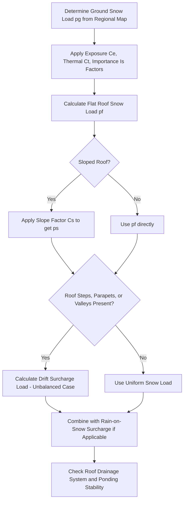

## Snow, Rain, and Environmental Loads

### Definition and Physical Concept

Snow, rain, and other environmental loads represent gravity-based (vertical) loads arising from climatic and atmospheric conditions, distinct from occupancy-driven live loads and from lateral environmental loads (wind, seismic). These loads primarily affect **roof design**, since roofs are the structural elements most directly exposed to precipitation accumulation. Unlike standard live loads, environmental loads are governed by regional climatic data, roof geometry, and drainage characteristics, making them highly site- and configuration-dependent.

This category typically includes:

- **Snow Load (S):** Weight of accumulated snow on roof surfaces.
- **Rain Load (R):** Weight of accumulated water from rainfall, particularly critical when drainage is impaired.
- **Ice Load:** Weight of ice accumulation, often combined with wind-on-ice effects in specific climates.
- **Ponding:** A progressive, potentially catastrophic instability phenomenon caused by rainwater accumulation on flexible roofs.

### Snow Load: Fundamental Concept

Snow load design begins with a **ground snow load** ($p_g$), a regionally-mapped value representing the statistically-expected snow load on the ground (based on historical climatic data and a specified mean recurrence interval, analogous in concept to the basic wind speed map).

The **flat roof snow load** ($p_f$) is derived from the ground snow load, adjusted for roof-specific factors:

$$p_f = 0.7 C_e C_t I_s p_g$$

Where:

- $p_f$ = Flat roof snow load
- $C_e$ = Exposure factor (accounts for wind exposure of the roof; windier, more exposed roofs tend to have snow blown off, reducing accumulated load)
- $C_t$ = Thermal factor (accounts for heat loss through the roof; heated structures melt snow faster, reducing accumulation, while unheated/cold structures retain more snow)
- $I_s$ = Importance factor (reflects the structure's risk category, similar in concept to wind/seismic importance factors)
- $p_g$ = Ground snow load (from regional snow load maps)
- $0.7$ = An empirical conversion factor accounting for the general tendency of snow to be somewhat less on a roof than on the ground (due to wind scouring/redistribution effects)

[Unverified] The specific value of the conversion factor (0.7) and the exact definitions/ranges of $C_e$, $C_t$, and $I_s$ are code-specific (e.g., as defined in ASCE 7) and may differ in other national codes, so exact coefficients must be verified against the governing design standard.

### Sloped Roof Snow Load

Since snow can slide off steeper roofs, the flat roof snow load is further adjusted for roof slope using a **slope factor** ($C_s$):

$$p_s = C_s p_f$$

**General trends in slope factor behavior:**

- Slope factor $C_s = 1.0$ for roofs up to a certain minimum slope (varies by roof surface type—slippery surfaces like metal roofing typically have a higher slope threshold before reduction begins).
- Slope factor decreases progressively as roof slope increases, reaching $C_s = 0$ (no snow load considered) at very steep slopes (since snow cannot accumulate on extremely steep surfaces).
- **Slippery vs. non-slippery surfaces:** Roofs with slippery surfaces (metal, slate) allow snow to shed more readily at lower slopes compared to rougher surfaces (asphalt shingles, gravel-ballasted membranes), resulting in different slope factor curves for each surface type.

<svg xmlns="http://www.w3.org/2000/svg" viewBox="0 0 500 300">
<title>Snow Load Reduction with Roof Slope (svg_diagram)</title>

<line x1="60" y1="250" x2="450" y2="250" stroke="#333" stroke-width="1.5" />
<line x1="60" y1="250" x2="60" y2="40" stroke="#333" stroke-width="1.5" />
<text x="230" y="280" font-size="13">Roof Slope (degrees)</text>
<text x="15" y="150" font-size="13" transform="rotate(-90 15 150)">Slope Factor Cs</text>

<path d="M 60,60 L 180,60 L 380,240" fill="none" stroke="blue" stroke-width="2.5" />
<text x="270" y="150" font-size="11" fill="blue">Non-slippery surface</text>

<path d="M 60,60 L 130,60 L 330,240" fill="none" stroke="green" stroke-width="2.5" />
<text x="140" y="200" font-size="11" fill="green">Slippery surface</text>

<text x="65" y="55" font-size="10">Cs=1.0</text>

<text x="380" y="255" font-size="10">Cs≈0</text>

<text x="250" y="30" font-size="14" text-anchor="middle" font-weight="bold">Snow Slope Factor vs. Roof Slope</text>

</svg>

### Snow Drift Loads

**Unbalanced/drift snow loads** occur when wind redistributes snow from one roof area to another, commonly at:

- **Roof steps:** Where a lower roof adjoins a taller adjacent structure, wind can deposit substantially more snow on the lower roof near the step (drift accumulation), often governing the design of that roof area far more than the uniform flat roof snow load.
- **Parapets and roof projections:** Similar drift accumulation occurs adjacent to parapet walls or other roof obstructions.
- **Valleys and unbalanced loading on gable/hip roofs:** Wind can shift snow from the windward slope to the leeward slope, creating an asymmetric (unbalanced) loading condition rather than a uniform distribution across the entire roof.

Drift loads are typically modeled as a **triangular surcharge** superimposed on the base uniform snow load, with height and extent of the drift calculated based on the height differential between roof levels and the length of the upper (source) roof contributing to the drift.

[Inference] Drift loads are often more critical to structural design than the uniform "background" snow load because they concentrate a much higher load intensity over a relatively localized roof area, which can govern the design of specific structural members (such as a beam near a roof step) even when the overall building's average snow load appears modest.

### Worked Example: Flat Roof Snow Load

**Problem:** Determine the flat roof snow load for a heated commercial building (Risk Category II) in a region with a ground snow load $p_g$ = 1.5 kN/m². Assume $C_e$ = 1.0 (partially exposed), $C_t$ = 1.0 (heated structure), $I_s$ = 1.0 (Risk Category II).

**Step 1: Apply the Flat Roof Snow Load Formula**

$$p_f = 0.7 \times C_e \times C_t \times I_s \times p_g$$

$$p_f = 0.7 \times 1.0 \times 1.0 \times 1.0 \times 1.5 \text{ kN/m}^2$$

$$p_f = 1.05 \text{ kN/m}^2$$

**Output:** The design flat roof snow load is 1.05 kN/m². This value would then be adjusted using the appropriate slope factor if the actual roof has a pitch, and drift loads would need to be separately calculated and superimposed at any roof steps or obstructions.

### Rain Load and Ponding Instability

**Rain load** design addresses two related but distinct concerns:

**1. Static Rain Load:** The weight of water that accumulates on a roof due to the **design rainfall intensity** combined with the **hydraulic head** created if primary roof drains become blocked and only secondary (overflow) drainage remains functional:

$$R = 0.0098(d_s + d_h)$$ (illustrative form, kN/m², SI units, where $d_s$ and $d_h$ are static and hydraulic heads at the secondary drainage system, in mm)

[Unverified] This is a representative simplified form; actual rain load calculations depend on the specific drainage system design (primary and secondary/overflow drain locations and capacities) and the governing code's specific rainfall intensity data for the site.

**2. Ponding Instability:** A more insidious, progressive failure mode where a flexible roof structure deflects under initial rainwater load, creating a "bowl" shape that collects *additional* water, which causes further deflection, collecting even more water—a potentially unstable feedback loop that can lead to progressive collapse if the structure lacks sufficient stiffness or adequate drainage (particularly if primary drains become blocked by debris).

$$\text{Ponding instability check: } \quad C_p + 0.9C_s \leq 0.25 \quad \text{(illustrative simplified form)}$$

Where $C_p$ and $C_s$ are flexibility coefficients related to the primary and secondary structural framing members' stiffness. [Inference] The fundamental design principle to prevent ponding instability is ensuring roof framing has sufficient stiffness (and that adequate, redundant drainage is provided) such that any incremental deflection from accumulated water does not create enough additional water-collection capacity to trigger runaway (unstable) deflection growth.

### Rain-on-Snow Surcharge

In certain climatic regions, an additional consideration is the **rain-on-snow surcharge load**, which accounts for the scenario where rainfall occurs on top of an existing snowpack. Since snow can act like a sponge (absorbing water) while also potentially blocking drainage paths, this combined condition can create loads exceeding either snow or rain load calculated independently. [Unverified] Applicability and magnitude of this surcharge depend on regional climate classification, roof slope, and ground snow load thresholds specified in the governing code, and are not universally required in all locations.

### Ice Loads and Combined Ice-Wind Effects

In regions prone to freezing rain/ice storms, structures (particularly transmission towers, communication structures, and exposed structural elements) may require design for:

- **Ice weight loads:** Direct weight of ice accretion on structural surfaces, often modeled as a uniform radial ice thickness around exposed members.
- **Wind-on-ice loads:** Combined effect of wind pressure acting on the enlarged surface area created by ice accretion, which can significantly increase both the projected area (for wind load calculation) and the total dead weight the structure must support simultaneously.

[Unverified] Ice load provisions are highly specialized and regionally specific (often most critical for lattice towers, guyed structures, and overhead line structures), with specific design ice thicknesses and concurrent wind speeds defined by regional maps in the governing code.

### Combining Environmental Loads in Load Combinations

Snow, rain, and other environmental loads are combined with other load types (dead, live, wind, seismic) according to code-specified **load combination** rules, since it is generally not realistic (or economically necessary) to assume multiple extreme environmental events occur simultaneously at their full design intensity. Representative illustrative combinations (LRFD philosophy) might include terms such as:

$$1.2D + 1.6S + (0.5L \text{ or } 0.8W)$$

$$1.2D + 1.6W + 0.5L + 0.5S$$

$$1.2D + 1.0E + 0.2S + L$$ (E = seismic)

[Unverified] Exact load combination equations, load factors, and applicable modifiers (such as reduced factors for one type of environmental load when another governs) are entirely code-specific (e.g., ASCE 7) and subject to revision between code editions, so the governing structural code must be consulted directly for the applicable combinations in any real design.

### Applications in Structural Design

- **Roof Framing Design:** Snow (including drift) and rain loads directly govern the sizing of roof beams, joists, purlins, and roof deck/sheathing, particularly in regions with significant snowfall.
- **Drainage System Design:** Rain load and ponding considerations directly influence the required capacity and redundancy (primary plus secondary/overflow) of roof drainage systems.
- **Long-Span and Flexible Roof Structures:** Ponding instability is a particular concern for long-span, relatively flexible roof systems (e.g., steel joist roofs), requiring specific stiffness checks beyond simple strength design.
- **Regional Climate-Specific Design:** Structures in mountainous, northern, or high-altitude regions require careful attention to ground snow load maps (which can vary dramatically over short distances due to elevation effects), while coastal/tropical regions may prioritize rain intensity and drainage capacity instead.

### Limitations and Practical Considerations

- **High Regional Variability:** [Unverified] Ground snow loads, rainfall intensities, and ice load provisions are extremely location-dependent and can vary significantly even within a small geographic area (particularly due to elevation and local microclimate effects), so site-specific mapped values (rather than generalized regional averages) should always be used, per the governing code.
- **Roof Geometry Complexity:** Complex roof geometries (multiple steps, valleys, dormers) can create multiple simultaneous drift-load scenarios that must each be checked individually, as the controlling case is not always immediately obvious without systematic evaluation of all applicable configurations.
- **Drainage System Reliability:** Static rain load and ponding calculations often assume a specific drainage failure scenario (e.g., primary drains blocked); actual performance depends on proper maintenance and design of the physical drainage system, which is a serviceability/maintenance consideration beyond pure structural calculation.
- **Climate Change Considerations:** [Speculation] Historical climatic data underlying current snow and rain load maps may face increasing scrutiny as long-term climate patterns evolve, potentially influencing future map revisions, though current design practice remains based on the currently adopted code provisions and historical statistical data.

**Related Topics**

- Wind Load Determination
- Dead Loads and Live Loads
- Load Combinations (LRFD/ASD Methods)
- Roof Drainage System Design
- Beam Deflection Methods and Serviceability Limits
- Structural Steel Roof Framing (Joists, Purlins, Deck)
- Long-Span Roof Structure Stability Considerations