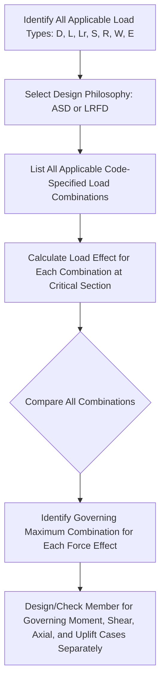

## Load Combinations per Design Codes

### Definition and Physical Concept

Load combinations are code-prescribed equations that specify how individual load types (dead, live, wind, seismic, snow, rain, etc.) must be simultaneously combined, each scaled by an appropriate factor, to determine the governing (critical) design condition for a structural member or system. Since it is statistically improbable for all loads to reach their individual maximum values at the same instant, load combinations balance conservatism with economic practicality by applying differentiated factors that reflect each load's variability, likelihood of simultaneous occurrence, and consequence of underestimation.

Two fundamentally different design philosophies exist for structuring these combinations:

- **Allowable Stress Design (ASD)** — also called Working Stress Design (WSD)
- **Load and Resistance Factor Design (LRFD)** — also called Ultimate Strength Design (USD) or Limit State Design (LSD)

### Allowable Stress Design (ASD) Philosophy

In ASD, **service-level (unfactored, or minimally factored)** loads are combined and compared against an **allowable stress**, which is the material's nominal strength divided by a factor of safety:

$$\sigma_{applied} \leq \sigma_{allow} = \frac{\sigma_{nominal}}{FS}$$

Representative ASD load combinations (illustrative form, consistent with common code philosophy) include:

$$D$$

$$D + L$$

$$D + (L_r \text{ or } S \text{ or } R)$$

$$D + 0.75L + 0.75(L_r \text{ or } S \text{ or } R)$$

$$D + (0.6W \text{ or } 0.7E)$$

$$D + 0.75L + 0.75(0.6W) + 0.75(L_r \text{ or } S \text{ or } R)$$

$$0.6D + 0.6W$$

$$0.6D + 0.7E$$

**Key Points:**

- A single factor of safety is embedded in the allowable stress, applied uniformly regardless of which loads are present.
- Reduction factors (like 0.75 on combined transient loads) reflect the reduced probability of multiple variable loads reaching their peak simultaneously.
- The 0.6D combinations (with wind or seismic) specifically check for **overturning and uplift**, where a reduced dead load counteracts lateral/uplift forces—critical for stability checks.

### Load and Resistance Factor Design (LRFD) Philosophy

In LRFD, individual loads are each multiplied by their own **load factor** (reflecting that load's specific variability), summed to produce a **factored (ultimate) load demand**, which is compared against the member's **nominal strength reduced by a resistance factor** ($\phi$):

$$\sum \gamma_i Q_i \leq \phi R_n$$

Where $\gamma_i$ are individual load factors, $Q_i$ are the nominal load effects, $\phi$ is the strength reduction factor (accounting for uncertainty in material strength, construction quality, and failure mode), and $R_n$ is the nominal resistance.

Representative LRFD/Strength Design combinations (illustrative form) include:

$$1.4D$$

$$1.2D + 1.6L + 0.5(L_r \text{ or } S \text{ or } R)$$

$$1.2D + 1.6(L_r \text{ or } S \text{ or } R) + (L \text{ or } 0.5W)$$

$$1.2D + 1.0W + L + 0.5(L_r \text{ or } S \text{ or } R)$$

$$1.2D + 1.0E + L + 0.2S$$

$$0.9D + 1.0W$$

$$0.9D + 1.0E$$

[Unverified] These are representative illustrative combinations consistent with common LRFD philosophy (similar in structure to ASCE 7); exact load factors, combination equations, and applicable modifiers are code-specific and subject to revision between editions, so the governing structural code must be consulted directly for any actual design.

### Comparing ASD and LRFD Approaches

| Aspect | ASD (Working Stress) | LRFD (Ultimate Strength) |
| --- | --- | --- |
| Load level used | Service (unfactored/lightly factored) loads | Factored (amplified) loads |
| Safety margin location | Applied to allowable stress (divide capacity) | Applied to both load (amplify) and resistance (reduce) |
| Load factor differentiation | Generally uniform treatment, with combination-level reduction factors | Individual factors per load type reflecting specific variability |
| Historical usage | Traditional method, still used in some codes/materials (masonry, geotechnical) | Dominant modern approach for steel, concrete, and most structural materials |
| Consistency of reliability | Less consistent reliability across different load combinations | More statistically consistent target reliability across load types |

[Inference] LRFD is generally considered to provide a more rational and consistent level of structural reliability across different loading scenarios because it explicitly calibrates each load factor to that load type's statistical variability, whereas ASD's single factor of safety applied uniformly to allowable stress does not differentiate between the inherent uncertainty of, for example, dead load versus live load versus wind load.

### Governing Load Combination Concept

For any given structural member, multiple load combinations must be checked, and the design must satisfy **all applicable combinations**—the member is sized based on whichever combination produces the most critical (governing) demand for the specific force effect being checked (e.g., maximum positive moment, maximum shear, maximum axial compression, or maximum uplift/tension).

### Worked Example: Comparing Governing Combinations

**Problem:** A beam experiences the following unfactored service load moments: Dead Load moment $M_D$ = 80 kN·m, Live Load moment $M_L$ = 100 kN·m, Wind Load moment $M_W$ = 60 kN·m (can act in either direction). Determine the governing factored moment using representative LRFD combinations.

**Combination 1:** $1.4D$

$$M_{u1} = 1.4(80) = 112 \text{ kN·m}$$

**Combination 2:** $1.2D + 1.6L$

$$M_{u2} = 1.2(80) + 1.6(100) = 96 + 160 = 256 \text{ kN·m}$$

**Combination 3:** $1.2D + 1.0W + L$

$$M_{u3} = 1.2(80) + 1.0(60) + 100 = 96 + 60 + 100 = 256 \text{ kN·m}$$

**Combination 4 (uplift/reversal check):** $0.9D + 1.0W$

$$M_{u4} = 0.9(80) - 1.0(60) = 72 - 60 = 12 \text{ kN·m (or, if wind reverses sign)}$$

$$M_{u4,alt} = 0.9(80) + 1.0(60) = 72 + 60 = 132 \text{ kN·m}$$

**Output:** Comparing all combinations, Combination 2 ($1.2D + 1.6L$) and Combination 3 ($1.2D + 1.0W + L$) tie as the governing case, both producing $M_u$ = 256 kN·m, which would be used for the primary strength design of this beam. The reduced dead load combination (0.9D ± W) would separately govern any check for net uplift or moment reversal, which is particularly critical in connection design and overall stability checks.

### Load Combinations for Serviceability (Not Strength)

Distinct from strength (ultimate limit state) combinations, **serviceability combinations** use unfactored (service-level) loads to check deflection, vibration, cracking, and drift, since these checks are concerned with actual, real-world performance under everyday loading rather than a safety margin against collapse:

$$D + L \quad \text{(typical serviceability check, illustrative)}$$

$$D + 0.5L + 0.7W \quad \text{(a representative example for a specific serviceability limit state, such as long-term deflection)}$$

[Unverified] Specific serviceability combination requirements (and whether reduced load factors apply) vary considerably by code, material type (concrete creep/long-term deflection often uses different combinations than immediate steel beam deflection), and the specific serviceability criterion being checked.

### Special Considerations: Overturning and Sliding Stability

Global stability checks (overturning of retaining walls, uplift of light structures, sliding resistance of foundations) often use **distinct combinations** from member-level strength design, frequently emphasizing a **minimum** (reduced) dead load to represent a conservative, worst-case resisting force:

$$0.6D + 1.0W \quad \text{(illustrative overturning check)}$$

This reflects the principle that when checking whether a destabilizing force (wind or seismic) can overturn or slide a structure, the *stabilizing* dead load should be conservatively **reduced** (not amplified), since a lower dead load provides less resistance to overturning—the opposite treatment compared to typical strength design, where dead load is amplified because higher dead load usually increases demand on a member.

### Load Combination Sequencing in Design Practice

In professional practice, load combination checking is typically automated within structural analysis software, but understanding the underlying logic remains essential for:

1. **Verifying software output:** Ensuring the governing combination identified by software is physically reasonable and correctly reflects the load path.
2. **Manual spot-checks:** Performing hand calculations for critical members to validate automated results.
3. **Identifying which loads genuinely govern:** Recognizing, for instance, that in a low-rise residential building, gravity combinations (D+L) often govern typical floor beams, while lateral combinations (D+W or D+E) typically govern the lateral force-resisting system (shear walls, braced frames) and foundation overturning checks.

### Applications Across Structural Materials

- **Reinforced Concrete:** Nearly universally uses LRFD/Strength Design (Ultimate Strength Design) philosophy, incorporating material-specific strength reduction factors ($\phi$) that vary by failure mode (flexure, shear, compression-controlled vs. tension-controlled sections).
- **Structural Steel:** Modern codes typically permit both ASD and LRFD methods as parallel design options, with the engineer selecting one consistent method throughout a given project.
- **Timber:** Often uses a hybrid approach with adjustment factors specific to wood behavior (load duration factors, since wood strength varies with how long a load is sustained), applied within either ASD or LRFD frameworks depending on the governing code.
- **Geotechnical/Foundation Design:** Historically dominated by ASD approaches (due to greater inherent uncertainty in soil properties), though LRFD-based geotechnical design has become increasingly adopted in many current codes.

### Limitations and Practical Considerations

- **Code and Jurisdiction Dependency:** [Unverified] Exact load combination equations, load factors, and applicable exceptions/modifiers are entirely governed by the specific structural code adopted in a given jurisdiction (e.g., ASCE 7, Eurocode 0/1990, or other national standards) and are periodically revised between code editions, so this content represents a conceptual framework requiring direct verification against the applicable current code for any real design.
- **Combination Completeness:** Missing an applicable load combination (e.g., overlooking an uplift check, or a specific combination required for a particular structure type such as tanks or bridges) can lead to unconservative, unsafe designs; systematic checking of *all* applicable combinations is essential rather than relying on intuition about which combination "should" govern.
- **Interaction with Material-Specific Provisions:** Load combination results (factored moments, shears, axial forces) must still be checked against material-specific interaction equations (e.g., combined axial-flexure interaction for columns), which introduces additional complexity beyond the load combination step alone.
- **Special Structure Types:** [Unverified] Specialized structures (bridges, tanks, silos, offshore structures) often have distinct, specialized load combination requirements beyond standard building code provisions, governed by their own specific design standards (e.g., AASHTO for bridges).

**Related Topics**

- Dead Loads and Live Loads
- Wind Load Determination
- Seismic Load Determination
- Snow, Rain, and Environmental Loads
- Strength Reduction Factors and Material-Specific Design Codes
- Overturning and Sliding Stability of Foundations
- Serviceability Limit States and Deflection Criteria