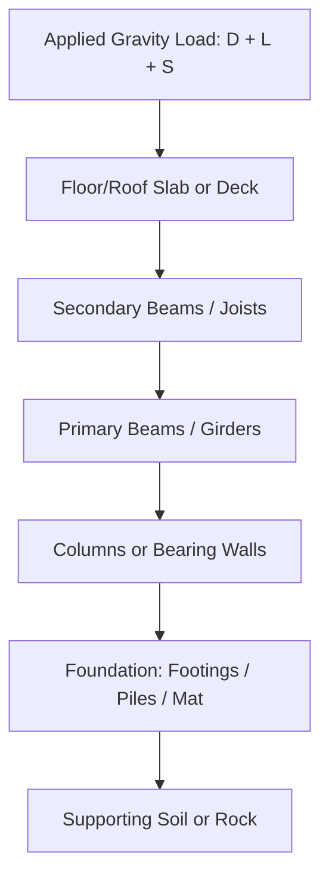

## Load Paths and Structural Systems

### Definition and Physical Concept

A **load path** is the continuous, unbroken sequence of structural elements through which applied loads travel from their point of origin (where they act on the structure) down to the foundation and ultimately into the supporting soil or rock. Every load—whether gravity (dead, live, snow) or lateral (wind, seismic)—must have a complete, verified path of connected structural elements capable of transferring that load safely to the ground; a discontinuity anywhere in this chain constitutes a critical design deficiency, regardless of how adequately individual members elsewhere are sized.

The governing principle can be summarized as: **a structure is only as strong as the weakest link in its load path**, since even a single undersized or missing connection can render an otherwise well-designed structural system unable to safely transfer load.

### Gravity Load Path

For vertical (gravity) loads, the typical hierarchical load path proceeds as follows:

$$\text{Applied Load (D, L, S)} \rightarrow \text{Slab/Deck} \rightarrow \text{Beam/Joist} \rightarrow \text{Girder} \rightarrow \text{Column/Wall} \rightarrow \text{Foundation} \rightarrow \text{Soil/Rock}$$

Each element in this chain must be:

1. **Adequately sized** to resist the loads it directly supports (via bending, shear, and axial capacity checks).
2. **Properly connected** to the elements above and below it, with connections capable of transferring the full design load.
3. **Compatible in stiffness and deformation** with adjacent elements, avoiding unintended load concentration due to relative stiffness mismatches.

<svg xmlns="http://www.w3.org/2000/svg" viewBox="0 0 500 350">
<title>Gravity Load Path Through a Building Frame (svg_diagram)</title>

<rect x="100" y="40" width="300" height="15" fill="#ccc" stroke="#333" />
<text x="410" y="52" font-size="11">Slab</text>

<line x1="130" y1="20" x2="130" y2="38" stroke="red" stroke-width="1.5" marker-end="url(#arrL)" />
<line x1="200" y1="20" x2="200" y2="38" stroke="red" stroke-width="1.5" marker-end="url(#arrL)" />
<line x1="270" y1="20" x2="270" y2="38" stroke="red" stroke-width="1.5" marker-end="url(#arrL)" />
<line x1="340" y1="20" x2="340" y2="38" stroke="red" stroke-width="1.5" marker-end="url(#arrL)" />
<rect x="120" y="65" width="260" height="10" fill="#999" stroke="#333" />
<text x="390" y="73" font-size="11">Beam</text>

<rect x="120" y="75" width="12" height="220" fill="#666" stroke="#333" />
<rect x="368" y="75" width="12" height="220" fill="#666" stroke="#333" />
<text x="140" y="180" font-size="11">Column</text>

<polygon points="100,295 154,295 154,330 100,330" fill="#555" stroke="#333" />
<polygon points="346,295 400,295 400,330 346,330" fill="#555" stroke="#333" />
<text x="160" y="345" font-size="11">Footing</text>

<line x1="60" y1="330" x2="440" y2="330" stroke="#333" stroke-width="2" />
<path d="M 70,335 l 8,8 M 90,335 l 8,8 M 110,335 l 8,8" stroke="#333" stroke-width="1" />

<text x="250" y="20" font-size="13" text-anchor="middle" font-weight="bold">Load Applied to Slab</text>

</svg>

### Lateral Load Path

Lateral loads (wind, seismic) follow a conceptually parallel but distinct path, requiring elements specifically designed to resist **horizontal** forces and transfer them, ultimately, back to the ground:

$$\text{Lateral Load (W, E)} \rightarrow \text{Wall Cladding/Windows} \rightarrow \text{Horizontal Diaphragm (floor/roof)} \rightarrow \text{Vertical Lateral System (shear wall/frame)} \rightarrow \text{Foundation} \rightarrow \text{Soil}$$

**Key Points:**

- **Diaphragms** (typically floor and roof slabs/decks) act as horizontal "beams" that collect distributed lateral loads (e.g., wind pressure on exterior walls) and deliver them to vertical lateral-force-resisting elements.
- **Vertical lateral systems** (shear walls, braced frames, moment frames) act as vertical "cantilevers" transferring the collected diaphragm forces down to the foundation.
- **Collector/drag elements** are often required to gather diaphragm forces and deliver them specifically to the location of vertical lateral elements, particularly when those elements do not span the full length of the diaphragm edge.

### Horizontal Diaphragms: Rigid vs. Flexible

The behavior assumption for how a diaphragm distributes lateral force to multiple vertical resisting elements significantly affects the analysis approach:

- **Rigid Diaphragm:** Assumed to be infinitely stiff in-plane (common assumption for concrete slabs), distributing lateral force to vertical elements in proportion to their relative **stiffness**, and inducing torsional effects if the center of mass and center of rigidity do not coincide.
- **Flexible Diaphragm:** Assumed to distribute load to vertical elements based on **tributary area** (similar to a simple beam on multiple supports), typically applicable to lightweight wood or metal deck diaphragms without a structural concrete topping.
- **Semi-Rigid Diaphragm:** An intermediate behavior, sometimes requiring more detailed finite element analysis to accurately capture actual force distribution, particularly relevant for diaphragms with significant openings or irregular shapes.

[Inference] Correctly identifying diaphragm rigidity is essential because it directly determines how much lateral force each vertical resisting element receives—assuming rigid behavior when a diaphragm is actually flexible (or vice versa) can lead to significantly incorrect force distribution and unconservative design of individual lateral elements.

### Common Vertical Lateral-Force-Resisting Systems

| System Type | Load Transfer Mechanism | Typical Characteristics |
| --- | --- | --- |
| Shear Walls | In-plane shear and flexure of a solid (or perforated) wall panel | High stiffness, commonly used in concrete/masonry/wood construction |
| Braced Frames | Axial force in diagonal brace members (concentric or eccentric) | Efficient, but bracing can conflict with architectural openings |
| Moment-Resisting Frames | Flexural continuity at beam-column joints | High ductility potential, but generally more flexible (larger drift) than shear walls/braced frames |
| Dual Systems | Combination of moment frames with shear walls/braced frames | Combines ductility of moment frames with stiffness of walls/braces; often required or incentivized in high-seismic design |

### Worked Example: Tracing a Load Path

**Problem:** A wind pressure of 1.2 kN/m² acts on an exterior wall panel, 4 m wide by 3 m tall (tributary height from mid-story above and below), which is part of a building using flexible roof/floor diaphragms and shear walls as the lateral system. Determine the force delivered to the diaphragm level, then to the shear wall.

**Step 1: Calculate Total Wind Force on the Wall Panel**

$$F_{wall} = p \times A = 1.2 \text{ kN/m}^2 \times (4 \text{ m} \times 3 \text{ m}) = 14.4 \text{ kN}$$

**Step 2: Distribute Force to Diaphragm Levels (assuming tributary height split evenly above/below, if this is a mid-height panel)**

For this simplified example, assume the wall panel's full tributary height corresponds to a single-story wall spanning between the floor below and roof diaphragm above, with the panel supported at both, each receiving half:

$$F_{diaphragm} = \frac{14.4}{2} = 7.2 \text{ kN (delivered to each adjacent diaphragm level)}$$

**Step 3: Diaphragm Delivers Force to Shear Wall (flexible diaphragm, tributary distribution)**

Assuming this 7.2 kN, combined with contributions from other wall panels along the same diaphragm edge, is collected and (via a flexible diaphragm's simple-beam behavior) delivered entirely to the nearest shear wall line, the shear wall must be designed to resist the cumulative collected force from its full tributary diaphragm area—this final total depends on the complete building geometry and all contributing wall panels, not solely this single panel.

**Output:** This example demonstrates the essential *load path concept*: force originates at the wall surface (14.4 kN total), is distributed to the diaphragm(s) above and below (7.2 kN to each in this simplified case), and must ultimately be fully accounted for and resisted by the shear wall(s) receiving the collected diaphragm force—each step in the path must be explicitly verified for continuity and adequate capacity.

### Discontinuities and Load Path Failures

A **discontinuous load path** occurs when an expected structural element or connection is missing, undersized, or interrupted, forcing load to seek an alternate (often unintended and inadequate) path:

- **Missing Collectors:** If a shear wall does not extend the full length of a diaphragm edge, a "collector" (drag strut) element is required to gather force from the remaining diaphragm length and deliver it to the wall; omitting this element creates a load path discontinuity.
- **Transfer Structures:** When a vertical lateral or gravity element (column, shear wall) does not continue straight down to the foundation (e.g., due to an architectural feature requiring a column to shift location at a lower floor), a **transfer beam or transfer diaphragm** must be explicitly designed to redirect that load path; failure to properly design this transfer element is a historically significant cause of structural failures.
- **Inadequate Connections:** Even when all primary members (beams, columns, walls) are adequately sized, connections (bolts, welds, embedded plates) that fail to transfer the full design force represent a load path break, since a chain's capacity is governed by its weakest link.

[Inference] Historical structural failures frequently trace back not to inadequate member sizing but to overlooked or underdesigned connections and transfer elements, which is why systematic load path verification—tracing every load type from its origin to the foundation—is considered a fundamental discipline in structural engineering practice, distinct from simply sizing individual members in isolation.

### Redundancy and Alternate Load Paths

**Structural redundancy** refers to a system's ability to maintain overall stability and prevent progressive/disproportionate collapse even if a single element or connection fails, by redistributing load through alternate paths:

- **Redundant Systems:** Multiple parallel load paths exist (e.g., a continuous beam over several supports, multiple shear walls resisting lateral load), such that the loss of one element does not necessarily cause overall structural failure, as load can redistribute to adjacent, still-functioning elements.
- **Non-Redundant Systems:** A single load path exists for a given load type (e.g., a single transfer girder supporting an entire column above), meaning failure of that one critical element could trigger disproportionate collapse of the supported structure above.

[Unverified] Many modern design codes include specific redundancy factors or requirements (particularly in high-seismic design) that penalize (require higher design forces for) structural systems lacking adequate redundancy, though the specific numerical redundancy provisions and applicability thresholds vary by code and jurisdiction.

### Structural Systems Classification

Beyond the load path concept itself, buildings are broadly classified by their primary structural system, which fundamentally shapes both gravity and lateral load paths:

- **Bearing Wall Systems:** Vertical loads carried by load-bearing walls (rather than a discrete column/beam frame); lateral loads often resisted by the same walls acting as shear walls.
- **Building Frame Systems:** A skeletal frame (columns and beams/girders) carries gravity loads, while a separate, dedicated lateral system (shear walls or braced frames) resists lateral forces.
- **Moment-Resisting Frame Systems:** The same frame elements (columns and beams) resist both gravity and lateral loads through rigid (moment-transferring) connections, without dedicated separate shear walls or braces.
- **Dual Systems:** Combine a moment frame with shear walls or braced frames, sharing lateral load resistance between the two systems according to their relative stiffness (and often subject to specific code-prescribed minimum force-sharing requirements).

### Applications in Design Practice

- **Structural System Selection:** Understanding load path principles directly informs the architect-engineer collaboration on structural system selection early in design, balancing architectural openness (which may limit shear wall/brace placement) against efficient, direct load paths.
- **Progressive Collapse Prevention:** Load path and redundancy analysis is central to design strategies aimed at preventing disproportionate collapse following an abnormal loading event (blast, vehicle impact, localized failure), often through alternate load path analysis methods that explicitly check whether the structure can bridge over a notionally removed critical element.
- **Peer Review and Quality Assurance:** Systematic load path tracing (verifying every load type has a complete, adequately-designed path from application point to foundation) is a standard and critical component of structural design review processes.
- **Renovation and Retrofit Projects:** Understanding the existing load path is essential before modifying or removing any structural element in an existing building, since even seemingly minor changes (removing a wall, cutting an opening) can disrupt a critical load path not immediately obvious from a superficial review.

### Limitations and Practical Considerations

- **Complexity in Irregular Structures:** Load path identification becomes significantly more complex in irregular or unusual building geometries, sometimes requiring detailed finite element modeling rather than simplified hand-tracing methods to accurately capture actual force distribution.
- **Assumption Sensitivity:** [Inference] The assumed diaphragm rigidity (rigid vs. flexible) and relative element stiffness values used in load path/distribution analysis are themselves engineering approximations; actual force distribution in a real structure can differ from idealized assumptions, particularly as materials crack, yield, or otherwise change stiffness during extreme loading events.
- **Coordination Requirements:** Because load path continuity depends on the correct sizing and detailing of connections (which are often designed and detailed at a later stage, or even by different parties such as steel fabricators), maintaining load path integrity requires careful coordination throughout the design and construction documentation process, not merely during initial structural framing layout.
- **Verification Scope:** [Unverified] The specific extent of formal load path verification required (e.g., explicit calculation packages, peer review requirements) varies by code, jurisdiction, project risk category, and specific regulatory requirements, so applicable requirements should be confirmed for each specific project.

**Related Topics**

- Dead Loads and Live Loads
- Wind Load Determination
- Seismic Load Determination
- Diaphragm Design (Rigid vs. Flexible Behavior)
- Shear Walls, Braced Frames, and Moment Frames
- Progressive Collapse and Structural Redundancy
- Foundation Systems and Soil-Structure Interaction