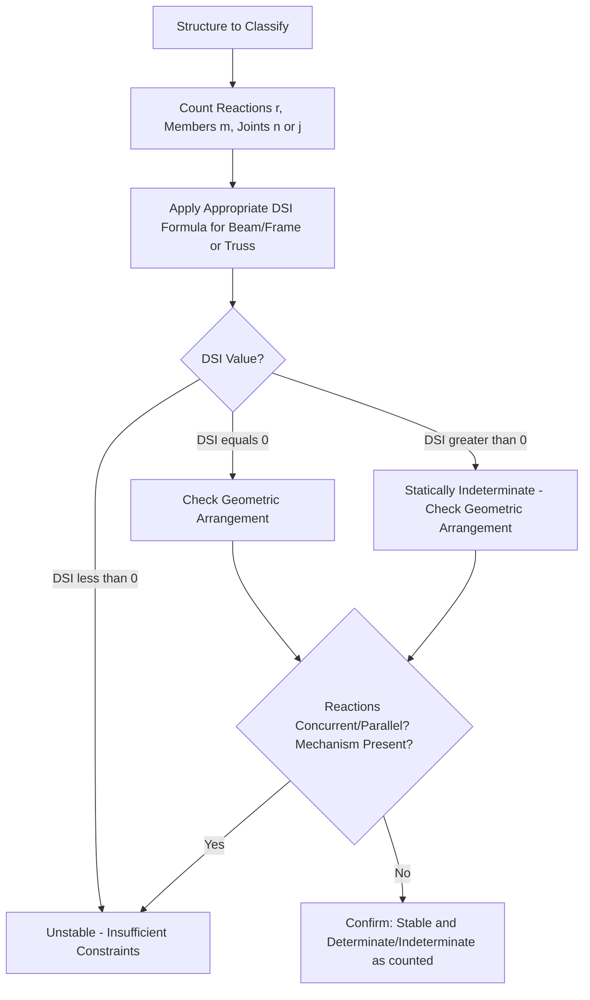

## Determinacy and Stability of Structures

### Definition and Physical Concept

Before any structural analysis can proceed, an engineer must first classify a structure according to two fundamental characteristics: **stability** (whether the structure can maintain equilibrium under any conceivable loading without collapsing as a mechanism) and **determinacy** (whether the equations of static equilibrium alone are sufficient to solve for all unknown reactions and internal forces).

- **Stable Structure:** Capable of supporting any general loading condition without undergoing rigid-body motion (collapse) or excessive uncontrolled deformation due to insufficient support or internal connectivity.
- **Statically Determinate Structure:** All reactions and internal forces can be found using only the equations of static equilibrium ($\sum F_x = 0$, $\sum F_y = 0$, $\sum M = 0$, plus condition equations at internal hinges/rollers where applicable).
- **Statically Indeterminate Structure:** Contains more unknown reactions/forces than available equilibrium equations, requiring additional **compatibility equations** (based on deformation/geometry) to fully solve, typically via methods such as force method, displacement method, or computer-based matrix analysis.

### Degree of Static Indeterminacy for Beams and Frames

For a general 2D beam or frame structure, the degree of static indeterminacy is determined by comparing the total number of unknown reaction/force components to the available equilibrium equations:

$$DSI = r + m - 3n - c$$

Where (for a general 2D frame):

- $r$ = Number of unknown reaction components (support reactions)
- $m$ = Number of members
- $3n$ = Number of equilibrium equations available (3 per rigid joint/node, from $\sum F_x=0$, $\sum F_y=0$, $\sum M=0$)
- $c$ = Number of condition (release) equations from internal hinges or other connections that introduce additional known-zero-moment (or force) conditions

For simpler beam-only analysis (no frame action), a more direct form is often used:

$$DSI = r - 3 - c_{eq}$$

Where $r$ is the total number of reaction components and $c_{eq}$ accounts for additional equations available from internal hinges (each internal hinge in a beam typically provides one additional condition equation, since the internal moment at a hinge is known to be zero).

**Classification based on DSI:**

- $DSI < 0$: Structure is **unstable** (insufficient reactions/connectivity to maintain equilibrium)
- $DSI = 0$: Structure is **statically determinate**
- $DSI > 0$: Structure is **statically indeterminate**, with $DSI$ representing the degree of indeterminacy (number of redundant unknowns beyond what equilibrium alone can solve)

### Support Types and Reaction Components

Correctly counting unknown reactions requires understanding how many force/moment components each support type restrains:

| Support Type | Restrained Components | Unknown Reactions |
| --- | --- | --- |
| Roller | Translation perpendicular to rolling surface | 1 (force) |
| Pin (Hinge) | Translation in both x and y directions | 2 (forces) |
| Fixed Support | Translation (x, y) and rotation | 3 (2 forces + 1 moment) |
| Internal Hinge (Beam) | Moment = 0 (allows relative rotation) | Provides 1 additional condition equation, not a reaction |

<svg xmlns="http://www.w3.org/2000/svg" viewBox="0 0 500 250">
<title>Common Support Types and Reaction Components (svg_diagram)</title>

<g transform="translate(60,60)">
<line x1="-30" y1="40" x2="30" y2="40" stroke="#333" stroke-width="2" />
<polygon points="0,0 -20,30 20,30" fill="none" stroke="#333" stroke-width="2" />
<circle cx="-10" cy="35" r="5" fill="none" stroke="#333" />
<circle cx="10" cy="35" r="5" fill="none" stroke="#333" />
<line x1="0" y1="0" x2="0" y2="-30" stroke="red" stroke-width="2" marker-end="url(#ar1)" />
<text x="-25" y="60" font-size="11">Roller (1)</text>
</g>

<g transform="translate(220,60)">
<line x1="-30" y1="30" x2="30" y2="30" stroke="#333" stroke-width="2" />
<polygon points="0,0 -20,30 20,30" fill="none" stroke="#333" stroke-width="2" />
<line x1="0" y1="0" x2="0" y2="-30" stroke="red" stroke-width="2" marker-end="url(#ar1)" />
<line x1="0" y1="0" x2="30" y2="0" stroke="blue" stroke-width="2" marker-end="url(#ar1)" />
<text x="-20" y="55" font-size="11">Pin (2)</text>
</g>

<g transform="translate(380,60)">
<rect x="-30" y="0" width="60" height="12" fill="#666" />
<line x1="0" y1="0" x2="0" y2="-30" stroke="red" stroke-width="2" marker-end="url(#ar1)" />
<line x1="0" y1="0" x2="30" y2="0" stroke="blue" stroke-width="2" marker-end="url(#ar1)" />
<path d="M 15,-10 A 15 15 0 0 1 15,10" fill="none" stroke="green" stroke-width="2" marker-end="url(#ar1)" />
<text x="-25" y="35" font-size="11">Fixed (3)</text>
</g>
<text x="250" y="150" font-size="14" text-anchor="middle" font-weight="bold">Support Types: Roller, Pin, Fixed</text>

</svg>

### Worked Example: Beam Determinacy Classification

**Problem:** Classify the following beams by static determinacy.

**Case A:** A simply supported beam with a pin support at one end and a roller support at the other end (no internal hinges).

$$r = 2 (\text{pin}) + 1 (\text{roller}) = 3$$

$$DSI = r - 3 = 3 - 3 = 0 \quad \rightarrow \quad \textbf{Statically Determinate}$$

**Case B:** A propped cantilever beam: fixed support at one end, roller support at the other end.

$$r = 3 (\text{fixed}) + 1 (\text{roller}) = 4$$

$$DSI = r - 3 = 4 - 3 = 1 \quad \rightarrow \quad \textbf{Statically Indeterminate to the 1st Degree}$$

**Case C:** A fixed-fixed beam (both ends fixed), with one internal hinge at midspan.

$$r = 3 (\text{fixed}) + 3 (\text{fixed}) = 6$$

$$c_{eq} = 1 (\text{one internal hinge})$$

$$DSI = r - 3 - c_{eq} = 6 - 3 - 1 = 2 \quad \rightarrow \quad \textbf{Statically Indeterminate to the 2nd Degree}$$

**Output:** Case A requires only equilibrium equations to solve (determinate). Case B has one redundant reaction beyond what equilibrium can solve (1st degree indeterminate, requiring one compatibility equation). Case C has two redundant reactions (2nd degree indeterminate), even though the internal hinge provides an extra condition equation that partially offsets the additional fixity at both ends.

### Determinacy for Trusses

For pin-jointed truss structures, a distinct but analogous formula applies, based on the assumption that truss members carry only axial force (two-force members) and joints behave as frictionless pins:

$$DSI_{truss} = (m + r) - 2j$$

Where:

- $m$ = Number of members
- $r$ = Number of external reaction components
- $2j$ = Number of equilibrium equations available (2 per joint, from $\sum F_x = 0$ and $\sum F_y = 0$ at each pin joint)

**Classification:**

- $(m + r) < 2j$: Unstable (insufficient members to form a stable truss configuration)
- $(m + r) = 2j$: Statically determinate
- $(m + r) > 2j$: Statically indeterminate (either externally, internally, or both)

[Inference] This formula's validity relies on the truss actually being a proper, stable arrangement of triangulated members; a truss can satisfy the counting formula ($m+r=2j$) numerically while still being geometrically unstable if the members are arranged in a non-triangulated or otherwise improper configuration (see "Geometric Instability" below), which is why the formula alone is a **necessary but not sufficient** condition for stability.

### Worked Example: Truss Determinacy

**Problem:** A simple triangular truss has 3 members, 3 joints, and is supported by one pin support and one roller support.

**Step 1: Count Reactions**

$$r = 2 (\text{pin}) + 1 (\text{roller}) = 3$$

**Step 2: Apply the Truss Determinacy Formula**

$$m + r = 3 + 3 = 6$$

$$2j = 2(3) = 6$$

$$DSI = 6 - 6 = 0 \quad \rightarrow \quad \textbf{Statically Determinate}$$

**Output:** This simple triangulated truss with 3 members and appropriate support conditions is exactly statically determinate—consistent with the fundamental principle that a single triangle is the simplest inherently stable, determinate truss configuration.

### Static Stability: External and Internal

Beyond the numerical counting formulas, actual **stability** must be verified through careful consideration of both external and internal support/connectivity arrangements, since a structure can satisfy the numerical determinacy count while still being geometrically or physically unstable:

**External Instability** occurs when:

- Insufficient reaction components exist to prevent rigid-body translation or rotation (e.g., a beam supported only by rollers, with no support restraining horizontal translation).
- Reaction lines of action are **concurrent** (all pass through a single point) or **parallel**, even if the total count of reaction components appears numerically sufficient—since concurrent or parallel reactions cannot resist a moment about that common point, or cannot resist force perpendicular to their common parallel direction, respectively.

**Internal Instability (Geometric Instability)** occurs when:

- Members within the structure are arranged such that a mechanism (an internal collapse mode) can form, even if overall member/reaction counts satisfy the numerical determinacy formula. Common in trusses with improperly arranged panels (e.g., a rectangular truss panel without a diagonal member, which acts as a mechanism (parallelogram collapse) even though the numerical count might otherwise suggest determinacy).

### Geometric Instability Examples

**Concurrent Reactions:** If a beam has a pin support and a roller support, but the roller's line of action happens to pass directly through the pin support's location, the structure cannot resist any moment about that common point, resulting in instability despite satisfying the numerical reaction count.

**Parallel Reactions:** If all reaction forces in a structure are oriented parallel to each other (e.g., all vertical rollers with no reaction restraining horizontal movement), the structure remains free to translate horizontally, regardless of how many vertical reaction components exist.

**Truss Mechanism (Missing Diagonal):** A rectangular panel within a truss, framed only with four members forming a rectangle (no diagonal), can freely deform into a parallelogram shape under load—this is a mechanism, not a stable, load-resisting configuration, even though the joint/member count might separately appear to satisfy the numerical determinacy formula for the truss as a whole.

[Inference] These geometric instability cases illustrate why static determinacy analysis must always be a two-step process: first, verify the numerical count of reactions/members against required equilibrium equations, and second, independently verify the actual geometric arrangement to rule out concurrent/parallel reaction lines and internal mechanisms, since numerical adequacy alone does not guarantee genuine structural stability.

### Determinacy of Frames

For rigid frame structures (where members are connected by moment-resisting joints rather than pins), the general formula introduced earlier applies:

$$DSI = r + 3m - 3n - c$$

(Note: this form explicitly counts 3 unknown internal force components per member—axial, shear, and moment at a cut—for a frame, though various equivalent formulations exist depending on how the counting is structured; some texts present this using joint-based equilibrium counting instead.)

[Unverified] Multiple equivalent formulations for frame determinacy exist across different textbooks (some based on member-force counting, others on joint displacement/equilibrium counting), and care must be taken to consistently apply the specific formula's associated counting convention (what counts as $r$, $m$, $n$, and $c$) rather than mixing conventions from different sources.

### Kinematic Indeterminacy (Degrees of Freedom)

While static determinacy concerns the number of unknown forces relative to equilibrium equations, **kinematic indeterminacy** (relevant primarily to displacement-based analysis methods, such as the stiffness/displacement method) concerns the number of unknown **displacement** degrees of freedom (joint translations and rotations) required to fully describe the structure's deformed shape:

$$DKI = \text{(Total possible joint DOFs)} - \text{(Number of restrained DOFs from supports)}$$

**Key Point:** Statically determinate structures are not necessarily kinematically determinate (having zero unknown displacements)—in fact, most determinate structures still have significant kinematic indeterminacy (many unknown joint displacements), which is precisely why displacement-based methods (like the stiffness method) remain useful and necessary even for statically determinate structures.

### Applications in Structural Analysis Practice

- **Method Selection:** Confirming static determinacy is the essential first step before choosing an analysis method—determinate structures can be solved directly via equilibrium, while indeterminate structures require either force methods (compatibility-based) or displacement methods (stiffness-based, typically via computer analysis for anything beyond simple cases).
- **Preliminary Design Sanity Checks:** Before running detailed computer analysis, manually verifying a structure's determinacy and stability serves as an essential sanity check, helping catch modeling errors (missing supports, disconnected members, or unintended mechanisms) that might otherwise produce erroneous computer-generated results without obvious warning.
- **Redundancy and Robustness:** Statically indeterminate structures generally provide greater redundancy (alternate load paths), improving resistance to progressive collapse compared to determinate structures, where the loss of a single member or support can more readily lead to a full mechanism/collapse.
- **Construction Sequencing:** Understanding a structure's determinacy is also relevant during construction, since a structure may pass through temporary determinate or even unstable configurations at intermediate construction stages before final indeterminate connections are completed.

### Limitations and Practical Considerations

- **Numerical Formula Limitations:** As emphasized above, the numerical DSI/truss determinacy formulas are **necessary but not sufficient** conditions for stability; geometric arrangement must always be independently verified, since a structure can satisfy the count while still containing a hidden mechanism.
- **3D Structures:** The formulas presented here apply to 2D (planar) structures; three-dimensional structural systems require expanded formulas (6 equilibrium equations per joint for rigid frames, 3 per joint for trusses/pin-connected space frames) with correspondingly more complex counting.
- **Software Reliance and Verification:** [Inference] Modern structural analysis is almost universally performed via computer software (which handles arbitrarily indeterminate structures without requiring manual classification), but foundational understanding of determinacy and stability concepts remains essential for engineers to critically evaluate whether software-generated results are physically reasonable, rather than blindly trusting output from a potentially mis-modeled structure.
- **Partial/Special Releases:** Structures with unusual internal connections (partial moment releases, spring supports, or other non-standard conditions) may require careful, case-specific adaptation of the standard determinacy counting formulas rather than direct, unmodified application.

**Related Topics**

- Analysis of Statically Determinate Beams (Reactions, Shear, and Moment Diagrams)
- Analysis of Statically Determinate Trusses (Method of Joints, Method of Sections)
- Statically Indeterminate Structures: Force Method and Displacement Method
- Load Paths and Structural Systems
- Influence Lines for Determinate Structures
- Matrix/Stiffness Method of Structural Analysis
- Structural Redundancy and Progressive Collapse Prevention