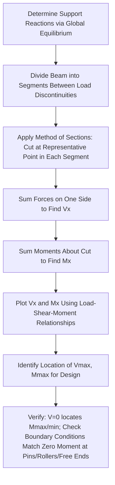

## Analysis of Statically Determinate Beams

### Definition and Physical Concept

Analysis of statically determinate beams is the process of finding all unknown support reactions and the resulting internal forces (shear force and bending moment) at every section along the beam's length, using only the equations of static equilibrium. Because determinate beams have exactly enough reactions to satisfy equilibrium (as established through determinacy classification), no compatibility or material-property information is needed—the analysis is purely a statics problem.

The primary outputs of beam analysis are:

- **Support Reactions:** Forces and moments provided by supports to maintain equilibrium.
- **Shear Force Diagram (SFD):** A plot of internal shear force $V(x)$ along the beam length.
- **Bending Moment Diagram (BMD):** A plot of internal bending moment $M(x)$ along the beam length.

These diagrams directly inform subsequent design steps (bending stress, shear stress, and deflection calculations covered elsewhere), making beam analysis a foundational skill preceding all beam design work.

### Common Determinate Beam Types

| Beam Type | Support Configuration | Key Characteristics |
| --- | --- | --- |
| Simply Supported Beam | Pin at one end, roller at the other | Most common determinate case; zero moment at both ends |
| Cantilever Beam | Fixed at one end, free at the other | Maximum moment at the fixed end; zero shear/moment at free end |
| Overhanging Beam | Simple supports with a beam segment extending beyond one or both supports | Combines features of simple and cantilever behavior |
| Compound (Hinged) Beam | Multiple determinate segments connected by internal hinges | Requires splitting the beam at each hinge for separate analysis |

### Step 1: Calculating Support Reactions

Reactions are found by applying the three fundamental equilibrium equations to the entire beam (treated as a free body):

$$\sum F_x = 0, \quad \sum F_y = 0, \quad \sum M = 0$$

**General Procedure:**

1. Draw a free-body diagram (FBD) of the entire beam, replacing all supports with their corresponding unknown reaction components.
2. Sum moments about one support (eliminating that support's reactions from the equation) to solve for the reaction(s) at the other support.
3. Sum vertical forces to solve for remaining vertical reaction(s).
4. Sum horizontal forces to solve for any horizontal reaction (relevant only if inclined or horizontal loads are present).

For beams with internal hinges (compound beams), an **additional step** is required: the beam must be separated into individual rigid segments at each hinge, since the hinge provides an additional equilibrium condition (zero moment at the hinge) but also introduces internal force unknowns (shear and axial force transferred through the hinge) that must be solved using the equilibrium of the individual segments.

### Step 2: The Method of Sections for Internal Forces

Once reactions are known, internal shear force $V(x)$ and bending moment $M(x)$ at any location $x$ are found by making an imaginary "cut" at that section and considering the equilibrium of one resulting segment (whichever side is more convenient):

$$V(x) = \sum (\text{transverse forces on one side of the cut})$$

$$M(x) = \sum (\text{moments of forces on one side of the cut, taken about the cut location})$$

**Sign Convention (standard beam convention):**

- **Positive shear:** Tends to rotate the beam segment clockwise (equivalently, the left portion of a segment shears upward relative to the right portion).
- **Positive moment:** Causes the beam to sag (concave up), producing tension in the bottom fiber and compression in the top fiber.

<svg xmlns="http://www.w3.org/2000/svg" viewBox="0 0 450 250">
<title>Sign Convention for Shear and Moment (svg_diagram)</title>

<g transform="translate(50,40)">
<rect x="0" y="20" width="150" height="8" fill="#ddd" stroke="#333" />
<line x1="75" y1="28" x2="75" y2="60" stroke="#333" stroke-dasharray="3,3" />
<line x1="0" y1="20" x2="10" y2="0" stroke="blue" stroke-width="2" marker-end="url(#arS)" />
<line x1="150" y1="28" x2="140" y2="48" stroke="blue" stroke-width="2" marker-end="url(#arS)" />
<text x="30" y="75" font-size="12" fill="blue">Positive Shear (V+)</text>
</g>
<g transform="translate(50,140)">
<path d="M 0,20 Q 75,-10 150,20" fill="none" stroke="red" stroke-width="3" />
<text x="60" y="-15" font-size="11" fill="red">Compression (top)</text>
<text x="45" y="45" font-size="11" fill="red">Tension (bottom)</text>
<text x="30" y="65" font-size="12" fill="red" font-weight="bold">Positive Moment (M+) - Sagging</text>
</g>

<text x="225" y="230" font-size="13" text-anchor="middle" font-weight="bold">Standard Beam Sign Convention</text>

</svg>

### Relationship Between Load, Shear, and Moment

A powerful set of differential relationships connects distributed load, shear, and moment, forming the basis for efficient diagram construction without needing to write separate equations at every point:

$$\frac{dV}{dx} = -w(x)$$

$$\frac{dM}{dx} = V(x)$$

**Key Interpretive Rules Derived from These Relationships:**

- The **slope of the shear diagram** at any point equals the negative of the distributed load intensity at that point.
- The **slope of the moment diagram** at any point equals the shear value at that point.
- The **change in shear** between two points equals the negative of the area under the load diagram between those points.
- The **change in moment** between two points equals the area under the shear diagram between those points.
- **Maximum (or minimum) moment occurs where shear equals zero** (or changes sign)—a critical rule for efficiently locating the governing design moment without checking every point along the beam.
- A **concentrated load** causes an abrupt (step) discontinuity in the shear diagram, with the jump magnitude equal to the load magnitude.
- A **concentrated moment (applied couple)** causes an abrupt (step) discontinuity in the moment diagram, with the jump magnitude equal to the applied moment.

### Worked Example: Simply Supported Beam with Point Load

**Problem:** A simply supported beam of length $L$ = 6 m has a pin support at A (left end) and roller support at B (right end), carrying a single concentrated load $P$ = 30 kN at 2 m from support A. Determine the reactions and construct the shear and moment diagrams.

**Step 1: Calculate Reactions**

Sum moments about A:

$$\sum M_A = 0: \quad R_B(6) - 30(2) = 0 \quad \rightarrow \quad R_B = 10 \text{ kN}$$

Sum vertical forces:

$$\sum F_y = 0: \quad R_A + R_B - 30 = 0 \quad \rightarrow \quad R_A = 30 - 10 = 20 \text{ kN}$$

**Step 2: Shear Force Diagram**

From A (x=0) to the load point (x=2 m):

$$V(x) = R_A = 20 \text{ kN (constant)}$$

From the load point (x=2 m) to B (x=6 m), after the abrupt drop caused by the point load:

$$V(x) = R_A - P = 20 - 30 = -10 \text{ kN (constant)}$$

(Verification: $V$ at B should equal $-R_B = -10$ kN, confirming consistency.)

**Step 3: Bending Moment Diagram**

From A to the load point, moment increases linearly (since shear is constant at +20 kN, representing a constant positive slope):

$$M(x) = R_A \cdot x = 20x \quad \text{for } 0 \leq x \leq 2$$

$$M(2) = 20(2) = 40 \text{ kN·m (maximum moment, at the point load)}$$

From the load point to B, moment decreases linearly (since shear is now constant at -10 kN):

$$M(x) = 20x - 30(x-2) \quad \text{for } 2 \leq x \leq 6$$

$$M(6) = 20(6) - 30(4) = 120 - 120 = 0 \text{ kN·m (confirms zero moment at the roller, as expected)}$$

**Output:** The maximum bending moment is 40 kN·m, occurring directly beneath the point load (consistent with the rule that maximum moment occurs where shear changes sign, since $V$ jumps from +20 kN to -10 kN precisely at that location). The shear diagram consists of two constant "steps" (+20 kN, then -10 kN), while the moment diagram consists of two straight line segments meeting at the peak beneath the load.

### Worked Example: Cantilever Beam with Uniformly Distributed Load

**Problem:** A cantilever beam, fixed at A and free at the tip B, has length $L$ = 4 m and carries a uniformly distributed load $w$ = 10 kN/m over its entire length. Determine the maximum shear and moment.

**Step 1: Calculate Reactions**

For a cantilever, the fixed support provides all three reaction components:

$$\sum F_y = 0: \quad R_A = wL = 10(4) = 40 \text{ kN}$$

$$\sum M_A = 0: \quad M_A = w L \cdot \frac{L}{2} = 10(4)\left(\frac{4}{2}\right) = 80 \text{ kN·m}$$

**Step 2: Shear and Moment at the Fixed Support (Maximum Values)**

Since a cantilever's internal forces are maximum at the fixed support (building up progressively from zero at the free end):

$$V_{max} = R_A = 40 \text{ kN (at support A)}$$

$$M_{max} = M_A = 80 \text{ kN·m (at support A, hogging/negative per standard convention)}$$

**Output:** For this cantilever, the maximum shear (40 kN) and maximum moment (80 kN·m) both occur at the fixed support, consistent with the general principle that cantilever internal forces accumulate progressively from the free end (where both V and M are always zero) toward the fixed support.

### Analysis of Compound (Hinged) Beams

For beams containing internal hinges connecting otherwise separate determinate segments, the analysis requires an additional decomposition step:

1. **Identify all internal hinges** and separate the beam into individual rigid segments at each hinge location.
2. **Identify "suspended" segments**—portions of the beam supported only by hinges (no direct external support)—since these must be analyzed *first*, as their reactions (transferred as forces at the hinge) become known loads applied to the adjacent, externally-supported segment.
3. **Analyze each segment sequentially**, starting with any fully determinate suspended segment, then progressively working toward segments with direct external supports, treating hinge forces as transferred loads between segments.
4. **Combine results** to construct the complete shear and moment diagrams for the full compound beam, ensuring moment is exactly zero at each internal hinge location (a key verification check).

[Inference] This segment-by-segment approach is necessary because a compound beam's overall reactions cannot always be found through a single global equilibrium analysis alone (particularly when the beam is statically determinate specifically *because of* how the hinges divide it into a series of interconnected, individually-determinate segments), making correct identification of the hinge arrangement and load transfer sequence essential to a correct solution.

### Beams with Applied Moments and Overhangs

**Applied Concentrated Moments:** When an external moment (couple) is applied directly to a beam, it creates an instantaneous jump in the moment diagram at that location (with no corresponding effect on the shear diagram, since a pure couple does not include a net transverse force).

**Overhanging Beams:** For beams extending beyond a support (overhang), the region beyond the outer support is typically analyzed similarly to a small cantilever, generating a **negative (hogging) moment** in the overhang region, which can partially offset (reduce) the positive (sagging) moment in the main span between supports—a principle sometimes deliberately exploited in design to achieve more balanced/efficient moment distributions along a beam's length.

### Constructing Diagrams Using the Summation Method

Rather than writing separate equations for every beam segment, experienced analysts often construct shear and moment diagrams efficiently using the **summation (area) method**, directly applying the load-shear-moment relationships:

1. Start at the left end with the known shear value (equal to the reaction, or zero at a free end).
2. Move left to right, adding the (signed) area under the load diagram to track changes in shear at each point, applying step jumps at concentrated loads.
3. Once the shear diagram is complete, similarly track the moment diagram by adding the (signed) area under the shear diagram between points, applying step jumps at any applied concentrated moments.
4. Verify the final values at the right end match known boundary conditions (e.g., $M=0$ at a simple end support, $V=0$ and $M=0$ at a free end).

This method is significantly faster for beams with multiple loads and complex configurations compared to writing and evaluating full algebraic equations for every segment separately.

### Applications in Structural Design

- **Direct Design Input:** The maximum moment ($M_{max}$) from the BMD directly feeds into the flexure formula ($\sigma = Mc/I$) for bending stress design, while the maximum shear ($V_{max}$) from the SFD feeds directly into the shear formula ($\tau = VQ/Ib$).
- **Locating Critical Sections:** SFD/BMD analysis identifies not just the maximum values but their specific locations along the beam, which is essential for detailing reinforcement curtailment in concrete beams, connection design in steel beams, and identifying where cross-sections might be tapered or reduced in variable-depth members.
- **Foundation for Deflection Analysis:** The moment equation $M(x)$ derived during this analysis is the direct starting point for beam deflection methods (double integration, moment-area, etc.), linking strength analysis directly to serviceability analysis.
- **Verification of Computer Models:** Manual SFD/BMD construction for simple determinate cases serves as an essential verification check against computer-generated structural analysis output, helping engineers catch potential input errors before relying on automated results for final design.

### Limitations and Practical Considerations

- **Applicability to Determinate Structures Only:** These direct equilibrium-based methods apply exclusively to statically determinate beams; indeterminate beams require additional compatibility-based methods (force method, moment distribution, or computer-based stiffness analysis) beyond the scope of simple equilibrium.
- **Point Load Idealization:** Concentrated point loads are a mathematical idealization; in reality, all loads are applied over some finite contact area, which can create local stress concentrations not captured by the idealized point-load shear/moment diagrams (though this idealization remains standard and appropriate for overall beam design).
- **Sign Convention Consistency:** [Inference] Different textbooks and regions occasionally use varying sign conventions for shear and moment; while the physical behavior described remains consistent, care must be taken to apply a single, consistent convention throughout an entire analysis to avoid sign errors when combining results from different sources or methods.
- **Complex Loading Patterns:** For beams with highly irregular or complex distributed loading patterns (non-uniform, non-triangular distributions), direct integration of the load function may be required rather than simple area-based summation, increasing analytical complexity.

**Related Topics**

- Determinacy and Stability of Structures
- Bending Stress in Beams
- Shear Stress in Beams
- Beam Deflection Methods
- Analysis of Statically Determinate Trusses
- Influence Lines for Determinate Structures
- Statically Indeterminate Beam Analysis (Force and Displacement Methods)