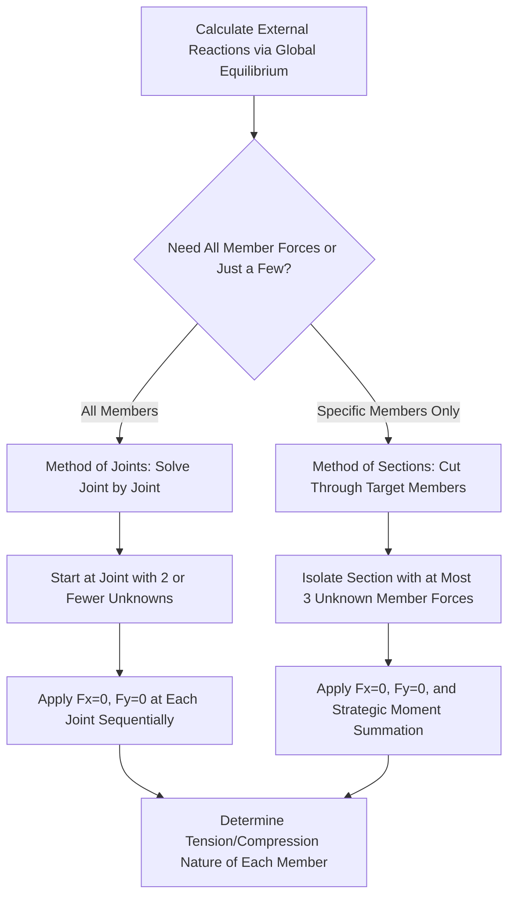

## Analysis of Statically Determinate Trusses

### Definition and Physical Concept

A truss is a structural system composed of straight members connected at joints, arranged in triangular configurations, and designed to carry loads primarily through **axial force** (pure tension or compression) in each member. Analysis of statically determinate trusses involves finding the axial force in every member and the reactions at every support, using only static equilibrium.

**Idealizing Assumptions for Truss Analysis:**

- All members are connected by **frictionless pin joints** (allowing free rotation, so no moment is transferred between members at a joint).
- All loads and reactions are applied **only at joints** (never along the length of a member), since a load applied mid-member in an idealized pin-connected truss would create local bending not accounted for by the axial-force-only assumption.
- Members are **straight** and connect exactly two joints (each member is a "two-force member").
- The truss's **self-weight** is typically idealized as a series of equivalent point loads applied at the joints, rather than as a distributed load along each member.

Because each member is a two-force member, the internal force in any truss member must act **along the member's longitudinal axis**—it is purely axial (tension or compression), with no shear or bending, provided the idealizing assumptions hold.

### Types of Trusses

| Truss Type | Description | Common Applications |
| --- | --- | --- |
| Planar Truss | All members and loads lie within a single 2D plane | Roof trusses, bridge trusses (side view) |
| Space Truss | Members extend in three dimensions | Transmission towers, geodesic domes, complex roof systems |
| Simple Truss | Built by successively adding two new members and one new joint to a base triangle | Most common, inherently stable, statically determinate configuration |
| Compound Truss | Two or more simple trusses connected together (by a common joint and member, or by three non-parallel, non-concurrent links) | Longer-span bridge and roof trusses |
| Complex Truss | Cannot be classified as simple or compound; requires more general analysis methods | Specialized or unusual configurations |

### Method of Joints

The **Method of Joints** analyzes truss member forces by applying equilibrium at each individual joint, treating every joint as a concurrent force system (since all member forces meeting at a joint intersect at that single point):

$$\sum F_x = 0, \quad \sum F_y = 0 \quad \text{(at each joint)}$$

**Key Constraint:** Since only two independent equilibrium equations are available per joint (2D case), the method of joints can only be directly applied to a joint with **two or fewer unknown member forces**—if a joint has three or more unknowns, it must be temporarily bypassed until enough adjacent joints have been solved to reduce the unknowns at that joint to two or fewer.

**General Procedure:**

1. Calculate all external support reactions first (using global equilibrium of the entire truss).
2. Identify a joint with only two unknown member forces (often a joint with a support or a simple load application, at the truss boundary).
3. Draw a free-body diagram of that joint, assuming an initial direction (typically tension, pulling away from the joint) for all unknown member forces.
4. Apply $\sum F_x = 0$ and $\sum F_y = 0$ to solve for the two unknowns.
5. Move to the next joint that now has two or fewer unknowns (using previously solved member forces as known values), and repeat until all member forces are determined.
6. A **negative** result indicates the assumed tension direction was incorrect—the member is actually in **compression**.

<svg xmlns="http://www.w3.org/2000/svg" viewBox="0 0 450 300">
<title>Method of Joints - Free Body at a Truss Joint (svg_diagram)</title>

<g transform="translate(50,50)">
<line x1="0" y1="150" x2="150" y2="150" stroke="#333" stroke-width="3" />
<line x1="0" y1="150" x2="75" y2="30" stroke="#333" stroke-width="3" />
<line x1="150" y1="150" x2="75" y2="30" stroke="#333" stroke-width="3" />
<circle cx="0" cy="150" r="4" fill="black" />
<circle cx="150" cy="150" r="4" fill="black" />
<circle cx="75" cy="30" r="4" fill="black" />
<text x="-10" y="170" font-size="12">A</text>
<text x="155" y="170" font-size="12">B</text>
<text x="80" y="25" font-size="12">C</text>

<line x1="75" y1="30" x2="75" y2="-10" stroke="red" stroke-width="2" marker-end="url(#arT)" />
<text x="80" y="-15" font-size="11" fill="red">P</text>
</g>

<g transform="translate(300,80)">
<circle cx="0" cy="0" r="4" fill="black" />
<line x1="0" y1="0" x2="0" y2="-40" stroke="red" stroke-width="2" marker-end="url(#arT)" />
<text x="5" y="-30" font-size="11" fill="red">P</text>
<line x1="0" y1="0" x2="-40" y2="40" stroke="blue" stroke-width="2" marker-end="url(#arT)" />
<text x="-60" y="55" font-size="11" fill="blue">F_AC</text>
<line x1="0" y1="0" x2="40" y2="40" stroke="green" stroke-width="2" marker-end="url(#arT)" />
<text x="45" y="55" font-size="11" fill="green">F_BC</text>
<text x="-30" y="-50" font-size="12" font-weight="bold">Joint C - Free Body</text>
</g>
</svg>

### Worked Example: Method of Joints

**Problem:** A simple triangular truss has joint A (pin support, bottom left), joint B (roller support, bottom right, 6 m from A), and joint C (apex, directly above the midpoint, 3 m above the base). A downward load of 20 kN is applied at joint C. Determine the force in each member.

**Step 1: Calculate Reactions**

By symmetry (load at midspan apex):

$$R_A = R_B = \frac{20}{2} = 10 \text{ kN (each, vertical)}$$

**Step 2: Determine Member Geometry**

Members AC and BC each span from the base corner to the apex. With a 3 m rise over a 3 m horizontal run (half the 6 m span) to reach the apex, each has a 45° angle with the horizontal in this configuration.

**Step 3: Analyze Joint A (two unknowns: $F_{AB}$, $F_{AC}$)**

$$\sum F_y = 0: \quad R_A + F_{AC}\sin(45°) = 0$$

$$10 + F_{AC}(0.707) = 0 \quad \rightarrow \quad F_{AC} = -14.14 \text{ kN (Compression)}$$

$$\sum F_x = 0: \quad F_{AB} + F_{AC}\cos(45°) = 0$$

$$F_{AB} + (-14.14)(0.707) = 0 \quad \rightarrow \quad F_{AB} = 10 \text{ kN (Tension)}$$

**Step 4: Analyze Joint B (by symmetry)**

By the symmetry of loading and geometry:

$$F_{BC} = -14.14 \text{ kN (Compression, matching } F_{AC}\text{)}$$

**Output:** The bottom chord member AB carries 10 kN tension, while both inclined members (AC and BC) carry 14.14 kN compression. This result illustrates the classic triangulated truss behavior: the bottom chord resists tension (like the tension flange of a beam) while the inclined members near the load carry compression (funneling load down toward the supports).

### Method of Sections

The **Method of Sections** provides a more efficient alternative when only the force in **one or a few specific members** (not the entire truss) is required, avoiding the need to sequentially solve every joint from one end of the truss to the member of interest.

**General Procedure:**

1. Calculate all external support reactions (as with the method of joints).
2. Make an imaginary **cut** through the truss, passing through the member(s) of interest, dividing the truss into two separate sections.
3. Select **whichever section is more convenient** (fewer external forces/reactions to include) and draw its free-body diagram, showing the cut member forces as external forces acting on that section.
4. Apply the **three** equilibrium equations ($\sum F_x=0$, $\sum F_y=0$, $\sum M=0$) to that section, since the section (unlike a single joint) is a general rigid body, not a concurrent force system.

**Critical Constraint:** The cut should generally pass through **no more than three members with unknown forces**, since only three independent equilibrium equations are available for the section as a whole (a cut through more than three unknowns generally cannot be solved directly without additional information).

**Strategic Advantage of Moment Summation:** A particularly powerful technique within the method of sections is to sum moments about the **point of intersection of two of the three unknown member forces**—this eliminates those two unknowns from the moment equation entirely, allowing direct solution for the third (target) member force in a single step.

### Worked Example: Method of Sections

**Problem:** For a truss with a horizontal top and bottom chord, determine the force in the bottom chord member DE using the method of sections, given that a cut through the truss (passing through top chord member, diagonal member, and bottom chord member DE) isolates a section where the only external vertical force is a known reaction of 25 kN (upward) at the left support, located 4 m horizontally from the cut location, with the top chord positioned 3 m above the bottom chord.

**Step 1: Isolate the Left Section**

Take the left portion of the truss (containing the 25 kN reaction) as the free body after the cut.

**Step 2: Sum Moments About the Top Chord Joint (Eliminating Two Unknowns)**

By summing moments about the point where the top chord member and diagonal member intersect (directly above the cut, at the top chord level), both of those unknown forces are eliminated from the equation, leaving only the bottom chord force $F_{DE}$ (acting horizontally, at the bottom chord level, 3 m below the moment center) as the unknown:

$$\sum M_{(\text{top chord joint})} = 0: \quad 25(4) - F_{DE}(3) = 0$$

$$F_{DE} = \frac{100}{3} = 33.3 \text{ kN}$$

**Step 3: Determine Tension/Compression**

Since the assumed direction (tension, pulling away from the cut section) satisfies equilibrium with a positive result, member DE is confirmed to be in **tension**.

**Output:** The bottom chord member DE carries 33.3 kN tension, found directly in a single moment equation without needing to solve for any other member forces first—demonstrating the primary efficiency advantage of the method of sections over the method of joints when only specific member forces are required.

### Zero-Force Members

Certain truss members carry **no force** under a specific loading condition, identifiable through simple inspection rules without any calculation, which significantly simplifies analysis by allowing these members to be eliminated from consideration early on:

**Rule 1:** If only **two non-collinear members** meet at a joint with **no external load or support** applied at that joint, both members are zero-force members.

**Rule 2:** If **three members** meet at a joint with **no external load**, and **two of the three members are collinear** (in a straight line), the third (non-collinear) member is a zero-force member (while the two collinear members carry equal force to each other).

[Inference] These rules follow directly from applying $\sum F = 0$ at such joints: for Rule 1, resolving forces perpendicular to either non-collinear member and requiring equilibrium forces both members to zero; for Rule 2, resolving forces perpendicular to the collinear pair isolates the third member as the only contributor to that direction, forcing it to zero. Identifying zero-force members is a standard preliminary step, particularly valuable for trusses with secondary bracing members that only become active under specific alternate loading conditions (e.g., wind bracing that carries no force under typical gravity loading alone).

### Compound and Complex Trusses

**Compound trusses** (formed by connecting two or more simple trusses) can often still be analyzed using the standard method of joints and method of sections, provided the overall assembly remains statically determinate and stable, though the analysis sequence may need to address each simple truss sub-unit somewhat independently before combining results at their connection points.

**Complex trusses** (which cannot be decomposed into simple triangulated units, or where joints cannot be solved sequentially with two or fewer unknowns using standard methods) require more general analytical approaches. [Unverified] Historical methods for complex truss analysis include specialized graphical or algebraic techniques (such as the "method of substitute members"), but modern practice for complex or highly indeterminate configurations typically relies on matrix/computer-based structural analysis rather than manual classical methods.

### Determinacy Verification Before Analysis

Before applying either the method of joints or method of sections, the truss's static determinacy should be verified (as established in the determinacy and stability topic) using:

$$m + r = 2j$$

Confirming this equality (combined with checking for proper triangulated, non-mechanism geometry) ensures the truss is exactly determinate, meaning the subsequent joint-by-joint or section-based analysis will yield a fully solvable, unique set of member forces using equilibrium alone.

### Applications in Structural Design

- **Direct Member Sizing:** Calculated axial forces (tension or compression) directly determine required member cross-sectional areas: tension members are sized based on yield/rupture strength, while compression members must additionally be checked against buckling (per column buckling theory), since a slender truss member in compression can fail by buckling well before reaching its material compressive strength.
- **Connection Design:** Joint forces determined through truss analysis directly size the gusset plates, bolts, or welds at each connection, which must transfer the full calculated member force.
- **Roof and Bridge Truss Applications:** Common truss configurations (Pratt, Warren, Howe, King Post, etc.) are selected based on span requirements, load patterns, and the resulting efficiency of tension/compression member distribution for that specific configuration.
- **Preliminary Design and Optimization:** Understanding which members carry the highest forces (typically bottom chords in tension and diagonal/top chord members in compression, particularly at panels closer to the point of maximum shear) allows engineers to optimize member selection and identify where cross-sectional area can be reduced in lower-force members.

### Limitations and Practical Considerations

- **Idealization vs. Reality:** Real truss connections (typically bolted or welded gusset plates) are not truly frictionless pins and can transfer some secondary bending moment; standard practice generally still uses the pin-jointed, axial-force-only idealization since secondary bending effects are usually small enough to neglect for typical truss geometries, though this should be verified for unusual configurations.
- **Self-Weight Idealization:** Distributing a truss's actual (distributed) self-weight as idealized point loads at joints introduces a minor approximation, generally considered acceptable given the relatively small contribution of self-weight compared to primary applied loads in most truss designs.
- **Out-of-Plane Buckling:** Compression members, particularly slender web/diagonal members, require careful attention to unbraced length in both the plane of the truss and perpendicular to it (out-of-plane), since out-of-plane buckling can sometimes govern member capacity if adequate lateral bracing is not provided.
- **Determinacy Requirement:** [Unverified] The method of joints and method of sections, as presented here, apply directly only to statically determinate trusses; indeterminate trusses (with additional redundant members or supports) require compatibility-based methods (force method) or computer-based matrix analysis, which is beyond the direct equilibrium approach covered here.

**Related Topics**

- Determinacy and Stability of Structures
- Analysis of Statically Determinate Beams
- Column Buckling (Compression Member Design)
- Load Paths and Structural Systems
- Statically Indeterminate Structures: Force Method
- Steel Connection Design (Gusset Plates, Bolted/Welded Joints)
- Influence Lines for Determinate Structures