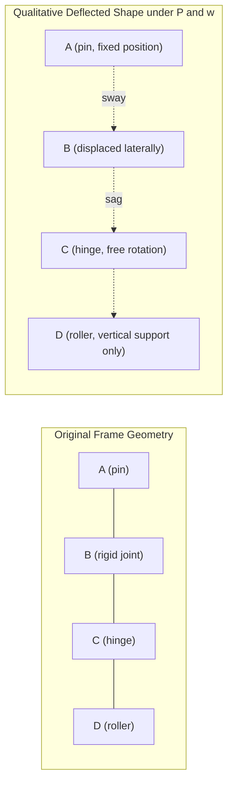

## Analysis of Determinate Frames

### Definition and Scope

A frame (rigid frame) is a structural system composed of members connected by rigid joints, moment-resisting connections, or a combination of rigid and pinned joints, capable of resisting axial force, shear force, and bending moment simultaneously. Unlike trusses, whose members are assumed to be two-force members carrying only axial load, frame members carry combined loading because the rigid joints transfer moment between connected members.

A frame is **statically determinate** when its support reactions and internal member forces can be found using only the equations of static equilibrium, without requiring compatibility equations. Determinacy is a property of the entire structural system (geometry, supports, and connectivity) rather than of the loading applied to it.

### Degree of Static Indeterminacy

For a planar (2D) frame, the degree of static indeterminacy $DSI$ is found by comparing the number of unknowns (reactions plus internal condition forces) to the number of available equilibrium equations.

**General formula (using equilibrium + condition equations):**

$$DSI = (3m + r) - (3n + c)$$

Where:

- $m$ = number of members
- $r$ = number of reaction components at supports
- $n$ = number of rigid joints (including supports), used because each rigid joint contributes 3 equilibrium equations ($\sum F_x = 0$, $\sum F_y = 0$, $\sum M = 0$)
- $c$ = number of condition equations introduced by internal hinges (each internal hinge connecting $k$ members introduces $(k-1)$ condition equations)

An equivalent and more commonly used form treats the frame as a set of rigid bodies:

$$DSI = 3m + r - 3n - c$$

- $DSI = 0$: statically determinate
- $DSI > 0$: statically indeterminate to the $DSI$ degree
- $DSI < 0$: unstable (this document assumes stability is separately verified)

**Simplified approach for a single rigid frame with no internal hinges:**

For a frame with no internal condition (no internal hinge), treated as a single rigid body:

$$r = 3 + c'$$

is the condition for determinacy, where $c'$ accounts for additional condition equations from internal hinges. In plain terms: a stable, single-rigid-body frame (no internal hinges) is statically determinate when the number of reaction components equals exactly 3 (for example, one fixed support, or a pin plus a roller).

**Effect of internal hinges:** Each internal hinge connecting only 2 members adds 1 condition equation ($M = 0$ at that hinge). A hinge connecting $k$ members adds $(k - 1)$ condition equations, since it releases relative rotation between each pair of members meeting there but the members can still rotate about the same point together.

### Common Support Reaction Counts

| Support Type | Reaction Components | Restrains |
| --- | --- | --- |
| Roller | 1 | Translation perpendicular to rolling surface |
| Pin (hinge) | 2 | Translation in both x and y |
| Fixed | 3 | Translation in x, y, and rotation |

### Worked Example: Determinacy Check

Consider a portal frame: two vertical columns fixed at their bases, connected at the top by a horizontal beam, with rigid (moment) connections at both beam-column joints, and no internal hinges.

- Members, $m = 3$ (column 1, beam, column 2)
- Fixed supports at both column bases: $r = 3 + 3 = 6$
- Rigid joints, $n = 4$ (2 fixed supports + 2 top corner joints)
- No internal hinges: $c = 0$

$$DSI = 3(3) + 6 - 3(4) - 0 = 9 + 6 - 12 = 3$$

This portal frame is indeterminate to the 3rd degree — **not** determinate. To make it determinate, hinges or roller supports must be introduced to remove exactly 3 restraints (e.g., replace both fixed supports with pins, and introduce one additional internal hinge, or use one fixed support and one roller/pin combination that removes the required restraints).

**Example of a determinate frame:** A single-bay portal frame with a pin support at one base and a roller support at the other base, with a hinge at the top of one column-beam joint.

- $m = 3$, rigid joints (excluding hinge and supports where condition applies) recalculated per the hinge rule.
- Pin support: 2 reactions; roller support: 1 reaction → $r = 3$
- Internal hinge connecting 2 members: $c = 1$

Applying the simplified check for a single rigid body with one internal condition: total unknowns (3 reactions) equal the 3 global equilibrium equations, and the internal hinge provides the 1 additional equation needed to solve the two rigid-body segments independently. This frame is statically determinate.

### Equations of Equilibrium

For any planar rigid body or portion of a structure in equilibrium:

$$\sum F_x = 0$$

$$\sum F_y = 0$$

$$\sum M = 0$$

These three equations are applied to the frame as a whole to solve for external reactions when $DSI = 0$. When internal hinges are present, the frame can be split into free bodies at the hinge, and additional equilibrium equations for each free body are used together with the condition that moment at the hinge is zero.

### General Method of Analysis

**Step 1: Verify determinacy and stability**

Compute $DSI$ using the formula above. Confirm the frame is geometrically stable (no mechanism) — a frame can have $DSI = 0$ and still be unstable if members or reactions are arranged such that they are concurrent or parallel, providing no resistance to certain movements.

**Step 2: Compute support reactions**

Apply global equilibrium ($\sum F_x = 0$, $\sum F_y = 0$, $\sum M = 0$) to the entire frame. If internal hinges are present, additionally isolate the frame at the hinge location, treating each side as a free body, and apply the condition $M_{hinge} = 0$ along with equilibrium of that free body to solve for reactions when global equations alone are insufficient (3 unknowns but hinge splits into solvable sub-systems).

**Step 3: Determine internal forces via the method of sections**

Cut the frame at the section of interest, exposing three internal actions at the cut: axial force $N$, shear force $V$, and bending moment $M$. Apply equilibrium to the isolated segment to solve for these three unknowns.

**Step 4: Construct internal force diagrams**

Develop Axial Force Diagrams (AFD), Shear Force Diagrams (SFD), and Bending Moment Diagrams (BMD) for every member of the frame, respecting sign conventions and continuity of values at joints (accounting for moment transfer through rigid corners).

**Step 5: Sketch the Qualitative Deflected Shape**

Using the BMD, sketch the deflected shape, ensuring that the curvature (concave/convex sides) is consistent with the sign of bending moment along each member, and that rigid joints maintain the original angle between connected members (typically 90° at frame corners) in the deformed configuration.

### Sign Conventions

**Axial force:** Tension positive, compression negative.

**Shear force:** Positive shear tends to rotate the isolated element clockwise (right side of a cut section moving up relative to the left, using the standard beam convention, then adapted per member local axis for frame verticals and inclined members).

**Bending moment:** For horizontal frame members, the standard beam convention often applies — sagging (concave up) positive. For frame analysis as a whole, a common and consistent alternative convention states: bending moment is plotted on the tension side of the member. This convention avoids ambiguity when members change orientation (vertical columns, inclined rafters) at rigid joints, since it directly shows which fiber is in tension without needing to redefine positive/negative per member orientation.

### Moment Transfer at Rigid Joints

At a rigid joint connecting two or more members, moment equilibrium of the joint itself requires:

$$\sum M_{joint} = 0$$

This means the sum of internal moments delivered by each member framing into the joint (accounting for direction) must balance any external moment applied directly at the joint. For a typical portal frame corner with no external joint moment, the moment at the top of the column equals the moment at the end of the beam at that same joint (magnitude equal, sense consistent with the tension side wrapping continuously around the corner).

### Worked Example: Simple Determinate Portal Frame

**Problem setup:** A frame with a pin support at A (base of left column), a roller support at D (base of right column), and a hinge at joint C (top of right column, where the beam meets the right column). Column AB is vertical (height $h$), beam BC is horizontal (span $L$), column CD is vertical (height $h$). A uniformly distributed load $w$ (force/length) acts downward along the full length of beam BC. A horizontal point load $P$ acts at joint B, at the top of the left column.

**Step 1 — Determinacy check:**

$r = 2$ (pin at A) $+ 1$ (roller at D) $= 3$. One internal hinge at C connecting 2 members contributes $c = 1$. This matches the pattern for a determinate frame (3 reactions, 1 hinge condition, solvable with 3 global equilibrium equations plus 1 condition equation split across the correct free body).

**Step 2 — Global equilibrium for reactions:**

$$\sum F_x = 0: \quad A_x + D_x + P = 0$$

Since roller D resists only vertical load (assuming a horizontal rolling surface), $D_x = 0$, giving $A_x = -P$ (direction opposite to assumed).

$$\sum F_y = 0: \quad A_y + D_y - wL = 0$$

$$\sum M_A = 0: \quad D_y (\text{horizontal distance A to D}) - wL\left(\frac{L}{2} + h_{offset}\right) - P(h) = 0$$

(Exact moment arm terms depend on the specific geometry defined; the general procedure is unchanged.) Because 3 unknown reactions exist ($A_x, A_y, D_y$) and we have only 3 global equations, this is directly solvable — the internal hinge is not needed to solve for global reactions in this particular support arrangement, but it is essential in Step 3 to isolate free bodies and find internal member forces uniquely (without the hinge, member BC and CD together with joint C would be one indeterminate junction for internal force distribution purposes in more complex geometries).

**Step 3 — Isolate at hinge C:**

Cut the structure at hinge C. The free body of column CD (from hinge C down to support D) is isolated. Since C is a hinge, $M_C = 0$ for this free body.

$$\sum M_D = 0 \text{ (for free body CD)}: \quad \text{solve for } C_x \text{ or } C_y \text{ as needed}$$

This isolates the horizontal reaction contribution transmitted through the hinge, allowing member CD's internal forces to be found independently of member AB–BC.

**Step 4 — Member force diagrams:**

With all reactions and hinge forces known, cut each member (AB, BC, CD) at representative sections (typically at the ends and at the location of maximum moment under the distributed load) and compute $N$, $V$, $M$ using free-body equilibrium of the cut segment. For beam BC under UDL $w$, the moment diagram is parabolic, with:

$$M(x) = V_B x - \frac{wx^2}{2}$$

measured from end B, where $V_B$ is the shear (vertical reaction contribution) at B carried into the beam.

**Step 5 — Deflected shape:**

The horizontal load $P$ pushes joint B laterally; the frame sways in the direction of $P$. Column AB bends with tension on the side away from $P$'s push near the base and reverses near joint B depending on the moment distribution. The beam sags under the UDL, curving concave-up (tension on the bottom fiber) between B and the point of contraflexure, if any, before the hinge at C. Joint B (rigid) maintains a 90° angle between column AB and beam BC in the deformed shape; hinge C allows an unrestricted relative rotation between beam BC and column CD.

### Qualitative Deflected Shape Diagram

### Frame Corner Detail (Moment Continuity)

<svg xmlns="http://www.w3.org/2000/svg" viewBox="0 0 500 320">
<text x="250" y="25" text-anchor="middle" font-size="16" font-weight="bold" fill="#1a1a1a">Rigid Joint Moment Transfer (svg_diagram)</text>
<line x1="100" y1="280" x2="100" y2="100" stroke="#2c3e50" stroke-width="8" />
<line x1="100" y1="100" x2="400" y2="100" stroke="#2c3e50" stroke-width="8" />
<line x1="400" y1="100" x2="400" y2="280" stroke="#2c3e50" stroke-width="8" />
<circle cx="100" cy="280" r="10" fill="#34495e" />
<text x="100" y="305" text-anchor="middle" font-size="13">A (pin)</text>
<circle cx="400" cy="280" r="10" fill="#34495e" />
<text x="400" y="305" text-anchor="middle" font-size="13">D (roller)</text>
<rect x="90" y="270" width="20" height="8" fill="#7f8c8d" />
<rect x="380" y="270" width="40" height="6" fill="#7f8c8d" />
<text x="100" y="90" text-anchor="middle" font-size="13" fill="#c0392b">B</text>
<text x="400" y="90" text-anchor="middle" font-size="13" fill="#c0392b">C (hinge)</text>
<path d="M 130 100 Q 150 130 130 160" stroke="#e74c3c" stroke-width="3" fill="none" marker-end="url(#arrow1)" />
<path d="M 100 130 Q 130 110 160 130" stroke="#e74c3c" stroke-width="3" fill="none" marker-end="url(#arrow1)" />
<text x="180" y="140" font-size="12" fill="#e74c3c">M continuous through rigid joint B</text>
<circle cx="400" cy="100" r="14" fill="none" stroke="#2980b9" stroke-width="3" />
<text x="400" y="140" text-anchor="middle" font-size="12" fill="#2980b9">M = 0 at hinge C</text>
<line x1="150" y1="230" x2="250" y2="180" stroke="#27ae60" stroke-width="2" stroke-dasharray="4,2" />
<text x="255" y="180" font-size="12" fill="#27ae60">Beam BC (UDL w)</text>
<line x1="130" y1="70" x2="130" y2="30" stroke="#8e44ad" stroke-width="2" marker-end="url(#arrow2)" />
<text x="140" y="55" font-size="12" fill="#8e44ad">P (lateral load at B)</text>
</svg>

### Common Frame Configurations and Their Determinacy

| Frame Type | Typical Support Setup | Internal Hinges | Determinate? |
| --- | --- | --- | --- |
| Simple portal, fixed-fixed | 2 fixed supports | 0 | No ($DSI = 3$) |
| Simple portal, pin-pin | 2 pin supports | 0 | No ($DSI = 1$) |
| Simple portal, pin-pin | 2 pin supports | 1 | Yes ($DSI = 0$) |
| Simple portal, pin-roller | 1 pin + 1 roller | 1 | Yes ($DSI = 0$) |
| Three-hinged frame/arch | 2 pin supports | 1 (at crown/apex) | Yes ($DSI = 0$) |
| Gable frame, fixed-fixed | 2 fixed supports | 0 | No, unless 3 hinges introduced |

### The Three-Hinged Frame (Special Case)

A widely used determinate configuration is the **three-hinged frame**, consisting of two pin supports and one additional internal hinge (often at the apex or ridge). This is a classic and reliable determinate system because:

$$r = 2 + 2 = 4 \text{ (two pins)}, \quad c = 1 \text{ (crown hinge)}$$

Global equilibrium (3 equations) plus the crown hinge condition (1 equation, applied by isolating one half of the frame and setting $M = 0$ at the hinge) gives exactly 4 equations for the 4 unknown reaction components ($A_x, A_y, D_x, D_y$), making the system fully solvable without indeterminate redundancy.

**Procedure specific to three-hinged frames:**

1. Apply global equilibrium to the entire frame (3 equations, 4 unknowns — one equation short).
2. Cut the frame at the crown hinge; isolate one half (e.g., left portion from support A to the hinge).
3. Apply $\sum M_{hinge} = 0$ to the isolated half, using only the loads and the unknown reactions from support A on that half.
4. Solve the resulting system of 4 equations for the 4 reaction components.
5. Proceed to internal member force analysis via the method of sections as in the general procedure.

### Practical Notes and Considerations

- [Inference] In real design practice, most building frames are intentionally designed as statically indeterminate (fixed or rigid connections throughout) for stiffness, redundancy, and reduced deflections; fully determinate frames are more common in textbook problems, pin-connected steel frames with bracing, or specific systems like three-hinged arches used in some long-span roof structures.
- The presence of an internal hinge in a real structure corresponds physically to a true mechanical pin connection (e.g., a detailed steel pin connection) or is used as an idealization for connections with negligible rotational stiffness relative to the connected members.
- Determinacy assumes small-deflection theory (first-order analysis); large-deflection or second-order effects are not addressed by the basic equilibrium approach shown here and require separate methods (e.g., P-Delta analysis).
- Sign convention choices (tension-side moment plotting vs. signed beam convention) do not change computed magnitudes; consistency is what matters within a single analysis.

### Practical Example: Numeric Determinacy Classification

For a two-story, single-bay determinate rigid frame with the following: 6 members, one fixed support, one pin support, one internal hinge at mid-height of one column:

- $m = 6$
- $r = 3 \text{ (fixed)} + 2 \text{ (pin)} = 5$
- $n$: count all rigid joints including supports — assume 6 total joints (2 supports + 4 internal rigid joints)
- $c = 1$ (single hinge connecting 2 members)

$$DSI = 3(6) + 5 - 3(6) - 1 = 18 + 5 - 18 - 1 = 4$$

This frame is indeterminate to the 4th degree, illustrating that adding members/stories without proportionally increasing releases (hinges) or reducing reaction redundancy rapidly increases indeterminacy — determinate multi-story frames are comparatively rare without deliberate insertion of multiple hinges.

**Related Topics**

- Analysis of Determinate Trusses (Method of Joints, Method of Sections)
- Analysis of Determinate Beams (Shear and Moment Diagrams)
- Three-Hinged Arches
- Influence Lines for Determinate Structures
- Introduction to Statically Indeterminate Structures (Force Method, Slope-Deflection Method)
- Qualitative Deflected Shapes and the Moment-Area Method
- Virtual Work Method for Deflection of Frames