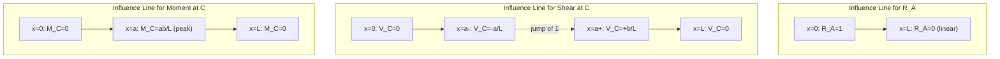

## Influence Lines for Determinate Structures

### Definition and Purpose

An **influence line** is a graph that shows the variation of a particular response function (reaction, shear, moment, or axial force at a specific fixed point in a structure) as a unit load moves across the structure. This is fundamentally different from a shear or moment diagram, which shows the variation of internal force along the structure's length for a single, fixed loading condition.

**Key distinction:**

| Diagram Type | X-axis represents | Y-axis represents |
| --- | --- | --- |
| Shear/Moment Diagram | Position along the structure | Shear/moment at that position, for one fixed load case |
| Influence Line | Position of the moving unit load | Value of one specific response function (at one fixed point) as the load moves |

Influence lines are essential for determining where to place live loads (vehicles, moving equipment, crowds) to produce the maximum or minimum value of a given response function at a critical section.

### Why Influence Lines Matter

Structures such as bridges, crane girders, and industrial platforms experience moving loads rather than fixed loads. Design must account for the worst-case position of these loads. Influence lines answer:

- At what position(s) should a moving load be placed to maximize shear at a given section?
- At what position(s) should a moving load be placed to maximize bending moment at a given section?
- What is the maximum reaction at a support due to a moving load or series of loads?

### Methods of Construction

**Method 1: Static Equilibrium (Analytical/Tabulated Method)**

1. Place a unit load ($P = 1$) at a variable position $x$ along the structure.
2. Write equilibrium equations to express the response function of interest (reaction, shear, or moment at the section of interest) as a function of $x$.
3. Repeat for all relevant segments of the structure (piecewise, since the equation typically changes depending on whether the unit load is to the left or right of the section under consideration).
4. Plot the resulting function of $x$ — this is the influence line.

**Method 2: Müller-Breslau Principle (Qualitative/Quick Method)**

The Müller-Breslau Principle states: *the influence line for a response function (reaction, shear, or moment) is given by the deflected shape of the structure obtained by removing the restraint corresponding to that response function and introducing a unit displacement (or unit rotation) at that location, consistent with the removed restraint.*

This principle is primarily used for **qualitative** influence lines (to determine shape and sign) and, for determinate beams, can also yield the exact quantitative influence line because the deflected shape of a determinate beam under such a released condition consists of straight-line segments.

**Application steps (Müller-Breslau):**

1. Identify the response function of interest (e.g., reaction at support A, shear at section C, moment at section C).
2. Remove the restraint corresponding to that function:
   - For a **reaction**: remove the support, allowing vertical displacement at that point.
   - For **shear** at a section: introduce a shear release (allow relative vertical displacement, i.e., a "slider" that permits vertical slip but no rotation or axial separation) at that section.
   - For **moment** at a section: introduce a moment release (hinge) at that section, allowing relative rotation.
3. Apply a corresponding unit displacement (or unit relative rotation) at the release.
4. Sketch the resulting deflected shape — for statically determinate beams, this deflected shape is piecewise linear and directly gives the influence line ordinates.

### Sign Convention for Influence Lines

- **Reaction influence lines:** Positive ordinate indicates the reaction acts in its assumed positive direction (typically upward for vertical reactions) when the unit load is at that position.
- **Shear influence lines:** Follow the standard beam shear sign convention (positive shear causes clockwise rotation of the isolated element).
- **Moment influence lines:** Positive ordinate indicates sagging (tension on the bottom fiber) at the section under consideration, when the unit load is at that position.

### Worked Example: Simply Supported Beam — Reaction Influence Line

Consider a simply supported beam with span $L$, pin support at A ($x = 0$) and roller support at B ($x = L$). A unit load $P = 1$ moves across the span at position $x$ from A.

**Reaction at A ($R_A$):**

Taking moments about B:

$$\sum M_B = 0: \quad R_A \cdot L - 1 \cdot (L - x) = 0$$

$$R_A = \frac{L - x}{L} = 1 - \frac{x}{L}$$

This is a straight line from $R_A = 1$ (when $x = 0$, load directly over A) to $R_A = 0$ (when $x = L$, load directly over B).

**Reaction at B ($R_B$):**

$$\sum M_A = 0: \quad R_B \cdot L - 1 \cdot x = 0$$

$$R_B = \frac{x}{L}$$

This is a straight line from $R_B = 0$ (at A) to $R_B = 1$ (at B).

### Worked Example: Simply Supported Beam — Shear Influence Line at Section C

Let section C be located at distance $a$ from support A ($0 < a < L$), with $b = L - a$ (distance from C to B).

**Case 1: Unit load to the left of C** ($0 \le x < a$)

The shear at C equals $-R_B$ (using the segment to the right of C, isolating the beam from C to B, only $R_B$ acts):

$$V_C = -R_B = -\frac{x}{L}$$

This ranges linearly from $0$ (at $x = 0$) to $-\frac{a}{L}$ (as $x \to a^-$).

**Case 2: Unit load to the right of C** ($a < x \le L$)

Using the segment to the left of C (from A to C), the shear at C equals $R_A$:

$$V_C = R_A = 1 - \frac{x}{L}$$

This ranges linearly from $\frac{b}{L}$ (as $x \to a^+$) to $0$ (at $x = L$).

**Key feature:** At $x = a$ (load directly at the section), the shear influence line has a **discontinuity (jump)**, jumping from $-\frac{a}{L}$ to $+\frac{b}{L}$, a total jump of magnitude 1 (equal to the unit load). This jump is a defining characteristic of shear influence lines at the section of interest.

### Worked Example: Simply Supported Beam — Moment Influence Line at Section C

Using the same section C at distance $a$ from A, $b = L - a$.

**Case 1: Unit load to the left of C** ($0 \le x \le a$)

Taking moment about C using the right segment (C to B, only $R_B$ acts, over distance $b$):

$$M_C = R_B \cdot b = \frac{x}{L} \cdot b$$

This is linear, increasing from $0$ at $x = 0$ to $\frac{ab}{L}$ at $x = a$.

**Case 2: Unit load to the right of C** ($a \le x \le L$)

Taking moment about C using the left segment (A to C, only $R_A$ acts, over distance $a$):

$$M_C = R_A \cdot a = \left(1 - \frac{x}{L}\right) a$$

This is linear, decreasing from $\frac{ab}{L}$ at $x = a$ to $0$ at $x = L$.

**Key feature:** The moment influence line for a determinate beam is continuous (no jump) at the section, reaching a peak ordinate of $\dfrac{ab}{L}$ exactly at $x = a$ (the section itself). Unlike the shear influence line, there is no discontinuity — only a "kink" (slope discontinuity, since the sign of slope changes).

### Influence Line Diagram: Simply Supported Beam

### Influence Line Shapes — SVG Diagram

<svg xmlns="http://www.w3.org/2000/svg" viewBox="0 0 600 420">
<text x="300" y="25" text-anchor="middle" font-size="16" font-weight="bold" fill="#1a1a1a">Influence Lines: R_A, Shear at C, Moment at C (svg_diagram)</text>
<line x1="60" y1="90" x2="540" y2="90" stroke="#2c3e50" stroke-width="3" />
<circle cx="60" cy="90" r="6" fill="#34495e" />
<circle cx="500" cy="90" r="6" fill="#34495e" />
<circle cx="260" cy="90" r="5" fill="#c0392b" />
<text x="60" y="108" font-size="12" text-anchor="middle">A</text>
<text x="500" y="108" font-size="12" text-anchor="middle">B</text>
<text x="260" y="108" font-size="12" text-anchor="middle" fill="#c0392b">C</text>

<text x="10" y="140" font-size="12" font-weight="bold">IL: R_A</text>

<line x1="60" y1="150" x2="500" y2="150" stroke="`#bdc3c7`" stroke-width="1" />

<line x1="60" y1="150" x2="60" y2="120" stroke="`#2980b9`" stroke-width="2" />

<line x1="60" y1="120" x2="500" y2="150" stroke="`#2980b9`" stroke-width="2" />

<text x="45" y="118" font-size="10" fill="`#2980b9`">1.0</text>

<text x="10" y="210" font-size="12" font-weight="bold">IL: Shear at C</text>

<line x1="60" y1="220" x2="500" y2="220" stroke="`#bdc3c7`" stroke-width="1" />

<line x1="60" y1="220" x2="260" y2="245" stroke="`#27ae60`" stroke-width="2" />

<line x1="260" y1="245" x2="260" y2="195" stroke="`#27ae60`" stroke-width="1" stroke-dasharray="3,2" />

<line x1="260" y1="195" x2="500" y2="220" stroke="`#27ae60`" stroke-width="2" />

<text x="270" y="192" font-size="10" fill="`#27ae60`">+b/L</text>

<text x="270" y="258" font-size="10" fill="`#27ae60`">-a/L</text>

<text x="10" y="300" font-size="12" font-weight="bold">IL: Moment at C</text>

<line x1="60" y1="360" x2="500" y2="360" stroke="`#bdc3c7`" stroke-width="1" />

<line x1="60" y1="360" x2="260" y2="310" stroke="`#8e44ad`" stroke-width="2" />

<line x1="260" y1="310" x2="500" y2="360" stroke="`#8e44ad`" stroke-width="2" />

<text x="270" y="305" font-size="10" fill="`#8e44ad`">ab/L (peak)</text>

<text x="60" y="400" font-size="11" fill="#555">x = 0 (at A)</text>

<text x="440" y="400" font-size="11" fill="#555">x = L (at B)</text>

</svg>

### Influence Lines for Determinate Trusses

For trusses, influence lines are constructed for the **axial force in a specific member** as a unit load moves along the loaded chord (typically the bottom chord, where floor beams transfer load to the truss at panel points).

**Procedure:**

1. Place the unit load successively at each panel point along the loaded chord.
2. For each position, use the Method of Joints or Method of Sections to compute the force in the member of interest.
3. Since the truss is loaded only at discrete panel points, the influence line is **piecewise linear between panel points**, even though the truss itself is a discrete (not continuous) system — this piecewise linearity holds specifically because the load is transferred to the truss only at panel points via stringers/floor beams, and the member force response between two adjacent panel-point load positions varies linearly due to the linearity of the equilibrium equations in $x$.
4. Connect the computed ordinates at each panel point with straight lines.

**Special note on zero-force members and influence lines:** A member can have a nonzero influence line ordinate even though it might be a zero-force member for a particular fixed load case; the influence line describes the response across all possible unit-load positions, not a single load case.

### Application: Maximum Response Due to a Series of Moving Point Loads

For a series of concentrated moving loads (e.g., truck axle loads) crossing a determinate beam:

**Maximum shear at a section:** Occurs when the loads are positioned such that the resultant of the load group and the individual axle loads are placed to maximize the algebraic sum of (load × corresponding influence-line ordinate). A common technique involves placing one axle directly at the section, evaluating the sum of $P_i \times y_i$ for both possible load train directions, and comparing.

**Maximum moment at a section:** By the **absolute maximum moment theorem** for a simply supported beam under a moving load system: the absolute maximum moment occurs under one of the loads (typically the largest, or the load nearest the resultant) when that load and the resultant of the load system are equidistant from the beam's centerline. This is found by:

1. Determine the resultant $R$ of the moving load group and its position relative to a reference load.
2. Position the load system such that the centerline of the beam bisects the distance between the reference load and the resultant $R$.
3. Compute the moment under the reference load using this position.
4. Repeat, treating each significant load as the "reference load," and take the largest computed value as the absolute maximum moment.

### Application: Maximum Response Due to a Uniformly Distributed Live Load

For a UDL of intensity $w$ that can be placed over any portion of the span (a "moving" or "patch" UDL, common in bridge/live-load design):

**Maximum response at a section (using the influence line):**

$$\text{Response} = w \times (\text{Area of the influence line diagram under the loaded length})$$

- To **maximize a positive response** (e.g., positive shear or moment), load the UDL over the portions of the span where the influence line ordinate is **positive**.
- To **maximize a negative response**, load the UDL over the portions of the span where the influence line ordinate is **negative**.
- Portions where the influence line is zero or of the opposite sign are left unloaded (the UDL is a "moving" live load, not necessarily covering the full span).

**Example — maximum positive shear at C** (using the shear IL derived earlier, which is negative from $x=0$ to $a$ and positive from $x=a$ to $L$):

$$V_{C,max}^{+} = w \times \left(\frac{1}{2} \cdot (L-a) \cdot \frac{b}{L}\right) = w \times \frac{b^2}{2L}$$

achieved by loading the UDL only over the segment from C to B (length $b$).

### Influence Lines vs. Bending Moment/Shear Diagrams — Summary Comparison

| Aspect | Influence Line | Moment/Shear Diagram |
| --- | --- | --- |
| Fixed quantity | Section location | Load position/magnitude |
| Varying quantity | Load position | Section location along beam |
| Purpose | Find critical load position for max/min response at ONE section | Find response at ALL sections for ONE fixed load case |
| Shape at load point (shear) | Discontinuous jump = 1 | Discontinuous jump = point load magnitude |
| Shape at load point (moment) | Continuous, with slope kink | Continuous, with slope kink |

### Practical Notes and Considerations

- Influence lines for statically determinate structures are always composed of straight-line (linear) segments between load application points (panel points for trusses, or continuously for beams under a moving point load) — this is a direct consequence of the equilibrium equations being linear functions of the moving load's position $x$.
- [Inference] For statically indeterminate structures, influence lines generally become curved (nonlinear) rather than piecewise linear, since compatibility conditions introduce load-position-dependent flexibility terms; construction typically relies on the Müller-Breslau principle combined with methods like the unit-load/virtual-work approach or moment-distribution-based deflected shapes, rather than the direct piecewise-linear equilibrium approach used for determinate structures.
- The Müller-Breslau principle gives only the qualitative shape for indeterminate structures but gives the exact quantitative influence line for determinate structures, which is a distinguishing practical advantage when working with determinate systems.
- Influence lines are essential in bridge engineering (design trucks, lane loading per design codes), crane runway girder design, and any structure subject to codified moving-load provisions.

**Related Topics**

- Analysis of Determinate Beams (Shear and Moment Diagrams)
- Analysis of Determinate Trusses (Method of Joints, Method of Sections)
- Analysis of Determinate Frames
- Müller-Breslau Principle for Indeterminate Structures
- Absolute Maximum Moment Under Moving Loads
- Moving Load Analysis for Bridge Design (AASHTO/Design Truck Loading)
- Virtual Work Method and Unit Load Method for Deflections