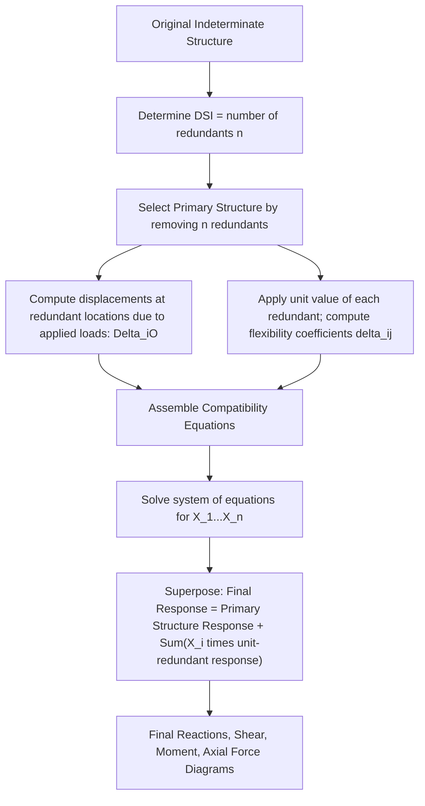

## Force Method of Consistent Deformations

### Overview and Purpose

The Force Method (also called the Method of Consistent Deformations, or the Flexibility Method) is a classical technique for analyzing statically indeterminate structures. It works by removing enough redundant restraints (reactions or internal forces) to reduce the structure to a statically determinate and stable **primary structure**, then reintroducing the redundants as unknown forces, solved for by enforcing compatibility of deformation at the points where the restraints were removed.

The name "consistent deformations" reflects the core principle: the redundant forces must have magnitudes such that the deformation they produce, combined with the deformation from the applied loads, remains **consistent** with the actual support/continuity conditions of the original structure (e.g., zero deflection at a support, zero relative rotation at a continuous joint).

### Degree of Static Indeterminacy and Choice of Redundants

The degree of static indeterminacy $DSI$ (computed as covered in prior determinacy analysis, e.g., $DSI = 3m + r - 3n - c$ for frames, or simpler forms for beams) equals the number of redundant forces that must be selected and solved for.

**Selecting redundants:** A redundant can be:

- An external reaction (e.g., one support reaction on a propped cantilever or continuous beam)
- An internal force (e.g., the bending moment at an interior support of a continuous beam, or the axial force in one member of an indeterminate truss)

The primary structure obtained after removing the redundant(s) must remain **stable** and **statically determinate**. Multiple valid choices of primary structure typically exist for the same original structure; the choice affects the complexity of the calculation but not the final result.

### General Procedure (Step-by-Step)

**Step 1: Determine the degree of indeterminacy**

Compute $DSI$. This equals the number of redundant unknowns, $n$.

**Step 2: Select the primary structure and redundants**

Remove $n$ restraints to obtain a stable, determinate primary structure. Label the removed redundant forces $X_1, X_2, \ldots, X_n$.

**Step 3: Compute displacements on the primary structure due to applied loads**

Using the primary structure (redundants removed) under the actual applied loads, compute the displacement (deflection or rotation, as appropriate to each redundant) at each point where a redundant was removed. Denote these as $\Delta_{1O}, \Delta_{2O}, \ldots$ (the "O" subscript denotes "due to original/applied loads").

**Step 4: Compute flexibility coefficients**

Apply a unit value of each redundant ($X_i = 1$) individually to the primary structure (with all applied loads removed) and compute the displacement at each redundant location due to this unit redundant. Denote the flexibility coefficient $\delta_{ij}$ as the displacement at location $i$ due to a unit value of redundant $j$.

**Step 5: Write compatibility equations**

For each redundant location, the total displacement (from applied loads plus the effects of all redundants, scaled by their actual magnitude) must equal the known actual displacement at that location in the real structure (typically zero, for a support that exists in the original structure):

$$\Delta_{1O} + \delta_{11}X_1 + \delta_{12}X_2 + \cdots + \delta_{1n}X_n = \Delta_1$$

$$\Delta_{2O} + \delta_{21}X_1 + \delta_{22}X_2 + \cdots + \delta_{2n}X_n = \Delta_2$$

$$\vdots$$

$$\Delta_{nO} + \delta_{n1}X_1 + \delta_{n2}X_2 + \cdots + \delta_{nn}X_n = \Delta_n$$

where $\Delta_1, \Delta_2, \ldots, \Delta_n$ are the known actual displacements in the original structure at the redundant locations (commonly zero for rigid supports, but can be nonzero for settlement problems).

**Step 6: Solve the system of equations**

Solve the resulting system of $n$ simultaneous linear equations for the redundant forces $X_1, X_2, \ldots, X_n$.

**Step 7: Superpose results**

Once the redundants are known, the final internal forces (moment, shear, axial force) and reactions in the original indeterminate structure are obtained by superposition:

$$\text{Final response} = \text{Response due to applied loads on primary structure} + \sum_{i=1}^{n} X_i \times (\text{Response due to unit } X_i \text{ on primary structure})$$

### Computing Displacements: Common Methods

The displacements $\Delta_{iO}$ and flexibility coefficients $\delta_{ij}$ are most commonly computed using:

**Virtual Work / Unit Load Method:**

$$\Delta = \int \frac{M_o \cdot m}{EI} \, dx \quad \text{(for beams and frames, bending-dominated)}$$

$$\delta_{ij} = \int \frac{m_i \cdot m_j}{EI} \, dx$$

where $M_o$ is the bending moment due to actual applied loads on the primary structure, and $m_i$, $m_j$ are the bending moments due to unit values of redundants $X_i$ and $X_j$ respectively, applied to the primary structure.

For trusses (axial-force-dominated):

$$\Delta = \sum \frac{N_o \cdot n \cdot L}{AE}$$

$$\delta_{ij} = \sum \frac{n_i \cdot n_j \cdot L}{AE}$$

**Moment-Area Method:** An alternative geometric method for computing beam/frame deflections and rotations directly from the $M/EI$ diagram, often convenient for simple determinate primary structures.

**Castigliano's Second Theorem:** An energy-based alternative, stating that the partial derivative of the total strain energy with respect to a redundant force equals the displacement at that redundant's point of application in the direction of that force:

$$\frac{\partial U}{\partial X_i} = \Delta_i$$

This is mathematically equivalent to the unit load method integrals above when applied to linear-elastic structures.

### Worked Example: Propped Cantilever Beam (1 Degree Indeterminate)

**Structure:** A beam fixed at A, with a roller (prop) support at B, span $L$, carrying a uniformly distributed load $w$ over the full span.

**Step 1 — Determinacy:** $DSI = 1$ (one redundant).

**Step 2 — Primary structure and redundant:** Remove the roller support at B; the redundant is $X_1 = R_B$ (the vertical reaction at B). The primary structure becomes a cantilever fixed at A, free at B.

**Step 3 — Displacement due to applied load ($\Delta_{1O}$):**

For a cantilever of length $L$ under UDL $w$, the deflection at the free end (point B) is:

$$\Delta_{1O} = \frac{wL^4}{8EI} \quad (\text{downward})$$

**Step 4 — Flexibility coefficient ($\delta_{11}$):**

Apply a unit upward load at B on the cantilever primary structure. The deflection at B due to this unit load is:

$$\delta_{11} = \frac{L^3}{3EI}$$

**Step 5 — Compatibility equation:**

The actual deflection at B in the original structure is zero (since B is a roller support, restrained against vertical displacement). Taking downward as positive for the applied-load deflection and $R_B$ acting upward (reducing net downward deflection):

$$\Delta_{1O} - \delta_{11} R_B = 0$$

$$\frac{wL^4}{8EI} - \frac{L^3}{3EI}R_B = 0$$

**Step 6 — Solve for redundant:**

$$R_B = \frac{3wL}{8}$$

**Step 7 — Superposition for final reactions and internal forces:**

With $R_B$ known, apply global equilibrium to the original structure to find the remaining reactions:

$$\sum F_y = 0: \quad R_A + R_B - wL = 0 \implies R_A = wL - \frac{3wL}{8} = \frac{5wL}{8}$$

$$\sum M_A = 0: \quad M_A + R_B \cdot L - wL \cdot \frac{L}{2} = 0 \implies M_A = \frac{wL^2}{2} - \frac{3wL^2}{8} = \frac{wL^2}{8}$$

These match the well-known standard results for a propped cantilever under UDL: $R_A = \frac{5wL}{8}$, $R_B = \frac{3wL}{8}$, $M_A = \frac{wL^2}{8}$.

### Worked Example: Two-Span Continuous Beam (1 Degree Indeterminate)

**Structure:** A continuous beam over three supports A, B, C (A and C are simple supports, B is an interior simple support), each span of length $L$, with a UDL $w$ over the entire beam.

**Step 1 — Determinacy:** $DSI = 1$ (three unknown vertical reactions, but only 2 equilibrium equations available for a beam with all supports being simple vertical supports — assuming no horizontal restraint issues — giving 1 redundant).

**Step 2 — Primary structure:** Remove the reaction at interior support B; the redundant is $X_1 = R_B$. The primary structure is a simply supported beam spanning the full length $2L$ (from A to C), with B now a point along the span with no support.

**Step 3 — Displacement at B due to applied load ($\Delta_{1O}$):**

For a simply supported beam of span $2L$ under full UDL $w$, the deflection at midspan (point B, since B is at the midpoint of the $2L$ span) is:

$$\Delta_{1O} = \frac{5w(2L)^4}{384EI} = \frac{5 \cdot 16wL^4}{384EI} = \frac{80wL^4}{384EI} = \frac{5wL^4}{24EI}$$

**Step 4 — Flexibility coefficient ($\delta_{11}$):**

Apply a unit upward load at midspan B of the simply supported beam (span $2L$). The deflection at midspan due to a unit point load at midspan is:

$$\delta_{11} = \frac{(2L)^3}{48EI} = \frac{8L^3}{48EI} = \frac{L^3}{6EI}$$

**Step 5 & 6 — Compatibility and solve:**

$$\frac{5wL^4}{24EI} - \frac{L^3}{6EI}R_B = 0$$

$$R_B = \frac{5wL^4}{24EI} \times \frac{6EI}{L^3} = \frac{30wL}{24} = \frac{5wL}{4}$$

This matches the standard tabulated result for a two-span continuous beam with equal spans under uniform load: $R_B = \frac{5wL}{4} = 1.25wL$ (well above the $wL$ that would apply if the spans acted independently, reflecting continuity effects).

**Step 7 — Remaining reactions:** By symmetry and overall equilibrium ($\sum F_y = 0$ over total load $2wL$):

$$R_A = R_C = \frac{2wL - R_B}{2} = \frac{2wL - 1.25wL}{2} = \frac{0.75wL}{2} = \frac{3wL}{8}$$

### Handling Multiple Redundants (System of Equations)

For $DSI = 2$ or higher, the compatibility equations form a matrix system:

$$\begin{bmatrix} \delta_{11} & \delta_{12} \\ \delta_{21} & \delta_{22} \end{bmatrix} \begin{bmatrix} X_1 \\ X_2 \end{bmatrix} = \begin{bmatrix} -\Delta_{1O} \\ -\Delta_{2O} \end{bmatrix}$$

(signs depend on the assumed positive directions chosen for redundants and displacements; the matrix form generalizes directly for $n$ redundants). The **Maxwell-Betti Reciprocal Theorem** guarantees that the flexibility matrix is symmetric: $\delta_{ij} = \delta_{ji}$, which reduces the number of independent flexibility coefficients that must be computed and serves as a useful check on calculations.

### Handling Support Settlement

If a support experiences a known settlement $\Delta_s$ rather than zero displacement, the compatibility equation is modified by setting the right-hand side to the known settlement value instead of zero:

$$\Delta_{1O} + \delta_{11}X_1 = \Delta_s$$

This allows the Force Method to directly account for differential support settlement effects on indeterminate structures, which is a distinct advantage over some stiffness-based methods that require additional setup for this case.

### Handling Indeterminate Trusses

For an indeterminate truss with one redundant member (or one redundant external reaction):

1. Remove the redundant member (cut it, or remove the redundant reaction) to obtain a determinate primary truss.
2. Compute member forces $N_o$ in the primary truss due to applied loads (Method of Joints/Sections).
3. Apply a unit tensile force pair at the cut redundant member's location (or a unit value of the removed reaction) and compute member forces $n$ throughout the primary truss due to this unit action.
4. Compatibility (relative displacement across the cut must be zero, i.e., the member "fits" back together, or the reaction point has zero displacement):

$$\sum \frac{N_o \cdot n \cdot L}{AE} + X_1 \sum \frac{n^2 L}{AE} = 0$$

5. Solve for $X_1$ (the force in the redundant member, or the value of the redundant reaction).
6. Final member force in any member $i$: $N_i = N_{o,i} + X_1 \cdot n_i$.

### Force Method Workflow Diagram

### Primary Structure Selection — SVG Illustration (Propped Cantilever Example)

<svg xmlns="http://www.w3.org/2000/svg" viewBox="0 0 600 340">
<text x="300" y="25" text-anchor="middle" font-size="16" font-weight="bold" fill="#1a1a1a">Force Method: Propped Cantilever Decomposition (svg_diagram)</text>

<text x="20" y="70" font-size="13" font-weight="bold">Original (Indeterminate, DSI=1)</text>

<rect x="40" y="80" width="15" height="60" fill="`#2c3e50`" />

<line x1="55" y1="110" x2="480" y2="110" stroke="`#2c3e50`" stroke-width="6" />

<circle cx="480" cy="110" r="8" fill="`#34495e`" />

<rect x="470" y="130" width="20" height="8" fill="`#7f8c8d`" />

<text x="480" y="155" font-size="11" text-anchor="middle">B (roller)</text>

<text x="55" y="155" font-size="11" text-anchor="middle">A (fixed)</text>

<path d="M 100 105 L 110 95 L 120 105 L 130 95 L 140 105 L 150 95 L 160 105 L 170 95 L 180 105 L 190 95 L 200 105 L 210 95 L 220 105 L 230 95 L 240 105 L 250 95 L 260 105 L 270 95 L 280 105 L 290 95 L 300 105 L 310 95 L 320 105 L 330 95 L 340 105 L 350 95 L 360 105 L 370 95 L 380 105 L 390 95 L 400 105 L 410 95 L 420 105 L 430 95 L 440 105" stroke="`#e74c3c`" stroke-width="1.5" fill="none" />

<text x="260" y="85" text-anchor="middle" font-size="11" fill="`#e74c3c`">w (UDL)</text>

<text x="20" y="190" font-size="13" font-weight="bold">= Primary Structure (Applied Load Only)</text>

<rect x="40" y="200" width="15" height="60" fill="`#2c3e50`" />

<line x1="55" y1="230" x2="480" y2="230" stroke="`#2c3e50`" stroke-width="6" />

<path d="M 100 225 L 110 215 L 120 225 L 130 215 L 140 225 L 150 215 L 160 225 L 170 215 L 180 225 L 190 215 L 200 225 L 210 215 L 220 225 L 230 215 L 240 225 L 250 215 L 260 225 L 270 215 L 280 225 L 290 215 L 300 225 L 310 215 L 320 225 L 330 215 L 340 225 L 350 215 L 360 225 L 370 215 L 380 225 L 390 215 L 400 225 L 410 215 L 420 225 L 430 215 L 440 225" stroke="`#e74c3c`" stroke-width="1.5" fill="none" />

<path d="M 480 230 Q 490 260 480 280" stroke="`#3498db`" stroke-width="2" fill="none" stroke-dasharray="3,2" />

<text x="500" y="260" font-size="10" fill="`#3498db`">Delta_1O (free deflection)</text>

<text x="20" y="300" font-size="13" font-weight="bold">+ Primary Structure (Unit Redundant X1=1 at B)</text>

<line x1="55" y1="320" x2="480" y2="320" stroke="`#2c3e50`" stroke-width="4" opacity="0.6" />

<rect x="40" y="290" width="15" height="30" fill="`#2c3e50`" opacity="0.6" />

<line x1="480" y1="320" x2="480" y2="300" stroke="`#27ae60`" stroke-width="2" marker-end="url(#arrowUp)" />

<text x="480" y="295" font-size="10" fill="`#27ae60`" text-anchor="middle">X1=1</text>

</svg>

### Advantages and Limitations of the Force Method

**Advantages:**

- Directly yields redundant forces with clear physical meaning (actual reaction or internal force values).
- Well-suited to structures with a small number of redundants (hand calculation remains manageable).
- Naturally handles support settlement, temperature effects, and fabrication errors by adjusting the right-hand side of the compatibility equations.

**Limitations:**

- [Inference] Becomes computationally cumbersome for structures with many redundants, since the number of simultaneous equations equals the degree of indeterminacy, and computing each flexibility coefficient requires a separate integration or virtual-work calculation; for highly indeterminate structures, displacement-based methods (Slope-Deflection Method, Moment Distribution Method, or the matrix Stiffness Method) are generally preferred in practice.
- Requires careful, consistent selection of sign conventions for redundants and displacements throughout, as errors in sign are a common source of mistakes.
- Choice of primary structure, while not affecting the final correct answer when done properly, can significantly affect the complexity of the intermediate calculations.

### Relationship to Other Indeterminate Analysis Methods

| Method | Primary Unknowns | Best Suited For |
| --- | --- | --- |
| Force Method (Consistent Deformations) | Redundant forces/reactions | Low degree of indeterminacy; hand calculation |
| Slope-Deflection Method | Joint rotations/displacements | Continuous beams and frames, moderate indeterminacy |
| Moment Distribution Method | Iterative joint moment balancing | Frames and continuous beams without needing to solve simultaneous equations directly |
| Matrix Stiffness Method | Joint displacements (as DOFs) | Computer-based analysis; any degree of indeterminacy; basis for modern structural software |

**Related Topics**

- Determinacy and Indeterminacy of Beams, Frames, and Trusses
- Unit Load Method and Virtual Work for Deflections
- Moment-Area Method
- Castigliano's Theorems
- Slope-Deflection Method
- Moment Distribution Method
- Matrix Stiffness Method (Direct Stiffness Method)
- Analysis of Indeterminate Trusses and Support Settlement Effects