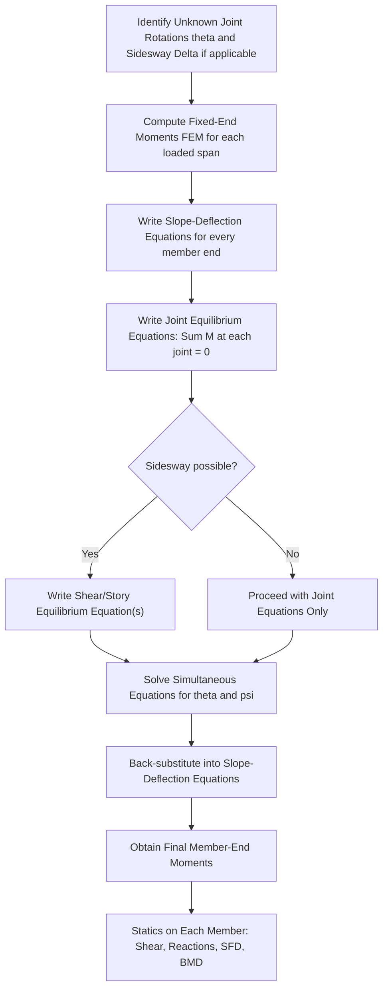

## Slope-Deflection Method

### Overview and Purpose

The Slope-Deflection Method is a **displacement method** (stiffness-based method) for analyzing statically indeterminate beams and frames. Unlike the Force Method, which solves for redundant forces, the Slope-Deflection Method solves directly for unknown joint displacements (rotations and, where applicable, translations), then uses these displacements to compute member-end moments.

This method is particularly well-suited to structures where the degree of kinematic indeterminacy (number of unknown joint displacements) is smaller than the degree of static indeterminacy, and it forms the conceptual foundation for the later Moment Distribution Method and the modern Matrix Stiffness Method.

### Key Assumptions

- Members are prismatic (constant $EI$) between joints, or are subdivided into prismatic segments.
- Deformations are due to bending only; axial and shear deformations are neglected.
- The structure behaves linearly elastically (small deflections, Hooke's Law applies).
- Joints may rotate and/or translate (sidesway), but the angle between members meeting at a rigid joint remains unchanged after deformation (rigid joint assumption).

### The Slope-Deflection Equations

For a prismatic member $AB$ with length $L$, flexural rigidity $EI$, subjected to end rotations $\theta_A$, $\theta_B$, a relative chord rotation $\psi = \Delta/L$ (due to relative joint translation $\Delta$ perpendicular to the member axis), and fixed-end moments $FEM_{AB}$, $FEM_{BA}$ due to applied loads on the span, the member-end moments are:

$$M_{AB} = \frac{2EI}{L}\left(2\theta_A + \theta_B - 3\psi\right) + FEM_{AB}$$

$$M_{BA} = \frac{2EI}{L}\left(2\theta_B + \theta_A - 3\psi\right) + FEM_{BA}$$

**Sign convention:** Clockwise member-end moments acting on the member (or equivalently, counterclockwise reaction moments from the joint on the member, depending on the textbook convention used) are taken as positive. Rotations $\theta$ are positive when counterclockwise. $\psi = \Delta/L$ is positive when the chord rotates clockwise (consistent with the sign convention adopted for the derivation); consistency of sign convention throughout a single problem is essential.

**Alternative compact form**, commonly written using relative stiffness $k = I/L$:

$$M_{AB} = 2Ek\left(2\theta_A + \theta_B - 3\psi\right) + FEM_{AB}$$

### Fixed-End Moments (FEM) — Common Cases

| Loading Case | $FEM_{AB}$ | $FEM_{BA}$ |
| --- | --- | --- |
| UDL $w$ over full span $L$ | $-\dfrac{wL^2}{12}$ | $+\dfrac{wL^2}{12}$ |
| Point load $P$ at midspan | $-\dfrac{PL}{8}$ | $+\dfrac{PL}{8}$ |
| Point load $P$ at distance $a$ from A, $b$ from B ($a+b=L$) | $-\dfrac{Pab^2}{L^2}$ | $+\dfrac{Pa^2b}{L^2}$ |
| Triangular load, peak $w_0$ at midspan (symmetric) | $-\dfrac{5w_0L^2}{96}$ | $+\dfrac{5w_0L^2}{96}$ |
| Support settlement $\Delta$ (relative), no load | $-\dfrac{6EI\Delta}{L^2}$ | $-\dfrac{6EI\Delta}{L^2}$ |

Sign convention for FEM: negative indicates a counterclockwise moment (hogging at that end, tension on top) using the common convention where clockwise is positive; conventions vary by textbook, so consistency within a single solution is what matters, and the table above follows the widely used convention where end A moment is negative (hogging) for downward loads and end B is positive under the same physical sense of hogging (equal magnitude, opposite sign, reflecting the mirrored geometry).

### Degrees of Freedom (Kinematic Unknowns)

The unknowns in the Slope-Deflection Method are:

1. **Unknown joint rotations** $\theta$ at each rigid joint that is not fully restrained (i.e., not a fixed support).
2. **Unknown joint translations** (sidesway) $\Delta$, applicable when the frame is free to translate laterally (e.g., a portal frame without adequate lateral bracing, or a frame with unequal column heights/support conditions causing sidesway).

Supports and joints contribute:

- **Fixed support:** $\theta = 0$ (no unknown).
- **Pin/roller support:** $\theta$ is unknown (free to rotate).
- **Interior rigid joint (no support):** $\theta$ is unknown; all members framing into that joint share the same rotation.

### General Procedure (Step-by-Step)

**Step 1: Identify unknown displacements**

List all unknown joint rotations $\theta_i$ and, if sidesway is possible, the unknown joint translation(s) $\Delta$.

**Step 2: Compute fixed-end moments (FEM)**

For each loaded span, compute $FEM$ at both ends using standard formulas (as tabulated above) based on the actual applied loading, treating each span temporarily as fixed at both ends.

**Step 3: Write slope-deflection equations for each member end**

For every member framing into a joint, write the slope-deflection equation expressing that member's end moment in terms of the unknown rotations, the chord rotation (if sidesway is present), and the FEM.

**Step 4: Write joint equilibrium equations**

At each joint with an unknown rotation, the sum of member-end moments framing into that joint must equal zero (assuming no externally applied joint moment):

$$\sum M_{joint} = 0$$

**Step 5: Write shear equilibrium equations (if sidesway is present)**

For frames with unknown joint translation(s), an additional equation is needed per translational degree of freedom, typically obtained by considering the horizontal (or relevant direction) shear equilibrium of an entire story or column set, using the relationship between column end moments and the shear each column must resist.

**Step 6: Solve the simultaneous equations**

Solve for the unknown rotations $\theta_i$ (and $\Delta$, if applicable).

**Step 7: Back-substitute to find member-end moments**

Substitute the solved values of $\theta$ (and $\psi$) back into the slope-deflection equations from Step 3 to obtain the final numerical member-end moments.

**Step 8: Determine reactions and draw diagrams**

Using the computed end moments together with statics on each member (treating each member as a simply supported beam under its actual span loading plus the now-known end moments), compute shear forces, then support reactions, then complete Shear Force and Bending Moment Diagrams.

### Worked Example: Two-Span Continuous Beam (No Sidesway)

**Structure:** Continuous beam ABC. Span AB has length $L_1$, span BC has length $L_2$, both with the same $EI$. Support A is fixed, B is an interior support (continuous, no support settlement), C is a roller (simple support at the far end). A UDL $w$ acts over both spans.

**Step 1 — Unknown displacements:**

$\theta_A = 0$ (fixed support). $\theta_C$ is technically unknown but since C is a simple end support with no member beyond it, it is common to condense it out using the "modified stiffness for a member pinned at the far end" or simply treat $\theta_C$ as an additional unknown solved via the joint equation at C (moment at C must equal any applied moment there, typically zero). For this worked example, we retain the general form and treat $\theta_B$ as the primary unknown (using the simplification that C is a simple end, member BC's far-end condition can use the modified slope-deflection equation directly, reducing unknowns to $\theta_B$ alone).

**Modified slope-deflection equation for a member with a pinned/simple far end** (member BC, pinned at C, no unknown rotation contribution needed from C beyond consistent statics):

$$M_{BC} = \frac{3EI}{L_2}\theta_B + FEM_{BC}^{*}$$

where $FEM_{BC}^{*}$ is the modified (carry-over-adjusted) fixed-end moment for a propped/simple far end, computed as:

$$FEM_{BC}^{*} = FEM_{BC} - \frac{1}{2}FEM_{CB}$$

(using standard UDL FEM values: $FEM_{BC} = -\frac{wL_2^2}{12}$, $FEM_{CB} = +\frac{wL_2^2}{12}$)

$$FEM_{BC}^{*} = -\frac{wL_2^2}{12} - \frac{1}{2}\left(\frac{wL_2^2}{12}\right) = -\frac{wL_2^2}{8}$$

**Step 2 — Standard slope-deflection equation for member AB** ($\theta_A = 0$, no sidesway, $\psi = 0$):

$$M_{AB} = \frac{2EI}{L_1}\left(2(0) + \theta_B\right) - \frac{wL_1^2}{12} = \frac{2EI}{L_1}\theta_B - \frac{wL_1^2}{12}$$

$$M_{BA} = \frac{2EI}{L_1}\left(2\theta_B + 0\right) + \frac{wL_1^2}{12} = \frac{4EI}{L_1}\theta_B + \frac{wL_1^2}{12}$$

**Step 3 — Joint equilibrium at B:**

$$M_{BA} + M_{BC} = 0$$

$$\frac{4EI}{L_1}\theta_B + \frac{wL_1^2}{12} + \frac{3EI}{L_2}\theta_B - \frac{wL_2^2}{8} = 0$$

**Step 4 — Solve for $\theta_B$** (for the special case $L_1 = L_2 = L$, simplifying):

$$\frac{4EI}{L}\theta_B + \frac{wL^2}{12} + \frac{3EI}{L}\theta_B - \frac{wL^2}{8} = 0$$

$$\frac{7EI}{L}\theta_B = \frac{wL^2}{8} - \frac{wL^2}{12} = \frac{3wL^2 - 2wL^2}{24} = \frac{wL^2}{24}$$

$$\theta_B = \frac{wL^3}{168EI}$$

**Step 5 — Back-substitute for final moments:**

$$M_{AB} = \frac{2EI}{L}\left(\frac{wL^3}{168EI}\right) - \frac{wL^2}{12} = \frac{wL^2}{84} - \frac{wL^2}{12}$$

$$M_{AB} = \frac{wL^2}{84} - \frac{7wL^2}{84} = -\frac{6wL^2}{84} = -\frac{wL^2}{14}$$

$$M_{BA} = \frac{4EI}{L}\left(\frac{wL^3}{168EI}\right) + \frac{wL^2}{12} = \frac{wL^2}{42} + \frac{wL^2}{12}$$

$$M_{BA} = \frac{2wL^2}{84} + \frac{7wL^2}{84} = \frac{9wL^2}{84} = \frac{3wL^2}{28}$$

These values match standard tabulated results for a two-span continuous beam (fixed-roller-roller) with equal spans and equal UDL, confirming the method.

### Worked Example: Portal Frame Without Sidesway (Symmetric Frame, Symmetric Loading)

For a symmetric portal frame with symmetric geometry and symmetric vertical loading (e.g., UDL only on the beam, no lateral load), sidesway does not occur, since the frame does not tend to translate laterally under purely symmetric conditions. In this case, the procedure reduces to writing joint equilibrium equations only at the rigid beam-column joints, without needing the additional shear equilibrium equation. This significantly simplifies the analysis compared to frames with lateral loads or asymmetric geometry, where sidesway must be explicitly considered.

### Handling Sidesway (Frames with Lateral Translation)

When a frame can translate laterally (unbraced frames, frames under lateral/wind load, or frames with asymmetric geometry/loading even under vertical load only), an additional unknown $\Delta$ (or equivalently $\psi = \Delta/L$ for each column) is introduced.

**Additional equation needed — Shear (Story) Equilibrium:**

For a single-story portal frame with columns of height $h$, the horizontal shear equilibrium of the entire story requires:

$$\sum F_{x} = 0 \text{ for the story} \implies \frac{M_{AB} + M_{BA}}{h} + \frac{M_{DC} + M_{CD}}{h} + P_{lateral} = 0$$

(the exact form depends on column orientation and the applied lateral load $P_{lateral}$; each column's contribution to story shear is derived from that column's end moments divided by its height, since shear equals the sum of end moments divided by length for a member with no transverse load along its own length).

**Procedure modification for sidesway:**

1. Write slope-deflection equations for all members, including the unknown chord rotation $\psi$ for each column (columns are the members most commonly subject to sidesway in typical portal/rectangular frames, since the beam's chord does not rotate under pure lateral sway of a rectangular frame with inextensible members).
2. Write joint equilibrium equations at each rigid joint (as in the no-sidesway case).
3. Write the additional shear equilibrium equation(s) for the story/stories.
4. Solve the now-larger system of simultaneous equations for all unknown rotations and the sidesway parameter(s) $\psi$.
5. Back-substitute to find final member-end moments.

### Slope-Deflection Method Workflow

### Slope-Deflection Sign Convention and Member Diagram

<svg xmlns="http://www.w3.org/2000/svg" viewBox="0 0 560 300">
<text x="280" y="25" text-anchor="middle" font-size="16" font-weight="bold" fill="#1a1a1a">Slope-Deflection: Member End Actions (svg_diagram)</text>
<line x1="100" y1="150" x2="460" y2="150" stroke="#2c3e50" stroke-width="6" />
<circle cx="100" cy="150" r="6" fill="#34495e" />
<circle cx="460" cy="150" r="6" fill="#34495e" />
<text x="100" y="175" text-anchor="middle" font-size="13">A</text>
<text x="460" y="175" text-anchor="middle" font-size="13">B</text>
<path d="M 130 130 A 25 25 0 0 1 130 170" stroke="#e74c3c" stroke-width="2.5" fill="none" marker-end="url(#arrowCW)" />
<text x="150" y="200" font-size="12" fill="#e74c3c" text-anchor="middle">M_AB (+CW)</text>
<path d="M 430 130 A 25 25 0 0 0 430 170" stroke="#2980b9" stroke-width="2.5" fill="none" marker-end="url(#arrowCW2)" />
<text x="415" y="200" font-size="12" fill="#2980b9" text-anchor="middle">M_BA (+CW)</text>
<path d="M 100 150 L 100 110" stroke="#27ae60" stroke-width="1.5" stroke-dasharray="4,2" />
<path d="M 100 150 L 130 145" stroke="#27ae60" stroke-width="1.5" />
<text x="80" y="105" font-size="11" fill="#27ae60">theta_A</text>
<text x="280" y="250" text-anchor="middle" font-size="12" fill="#555">M_AB = (2EI/L)(2·theta_A + theta_B − 3psi) + FEM_AB</text>

<text x="280" y="270" text-anchor="middle" font-size="12" fill="#555">M_BA = (2EI/L)(2·theta_B + theta_A − 3psi) + FEM_BA</text>

</svg>

### Relative Stiffness Simplification (When EI is Constant Throughout)

When all members share the same $E$ and only relative $I/L$ ratios matter (common in problems comparing member stiffness contributions at a joint), it is convenient to work with relative stiffness $k = I/L$ and drop the constant $E$ multiplier through the equations, reintroducing it only if absolute displacement or moment values in consistent units are required at the end. This is a calculation convenience and does not change the underlying equations.

### Distribution of Joint Moment (Conceptual Link to Moment Distribution Method)

At a rigid joint with several members framing in, each member's contribution to resisting the net joint moment is proportional to its **relative stiffness** $\left(\frac{4EI}{L}\text{ or } \frac{3EI}{L}\text{ for a far-end pinned member}\right)$ relative to the sum of stiffnesses of all members at that joint. This proportional-distribution concept, embedded implicitly within the Slope-Deflection joint equilibrium equations, is made explicit and iterative in the subsequent Moment Distribution Method, which avoids solving simultaneous equations by instead "distributing" unbalanced moments iteratively until convergence.

### Comparison: Slope-Deflection vs. Force Method

| Aspect | Slope-Deflection Method | Force Method |
| --- | --- | --- |
| Primary unknowns | Joint rotations/translations | Redundant forces/reactions |
| Number of unknowns | Degree of kinematic indeterminacy | Degree of static indeterminacy |
| Equation type | Joint/shear equilibrium equations | Compatibility (displacement) equations |
| Best suited for | Structures with few independent joint displacements (e.g., continuous beams, simple frames) | Structures with few redundant forces |
| Handles sidesway | Yes, with additional shear equilibrium equations | Yes, but requires selecting translation-related redundants |
| Relation to other methods | Basis for Moment Distribution Method | Basis for flexibility-matrix formulations |

### Practical Notes and Considerations

- The Slope-Deflection Method becomes advantageous over the Force Method specifically when the number of unknown joint displacements is smaller than the number of static redundants — a common situation in continuous beams with few spans, and simple frames without excessive sidesway complexity.
- [Inference] For structures with many joints and multiple possible sidesway directions (multi-story, multi-bay frames), the number of simultaneous equations can become large, making the Moment Distribution Method (iterative, avoiding direct simultaneous equation solving) or the Matrix Stiffness Method (systematic, computer-based) more practical in typical professional practice.
- Consistent sign convention (clockwise positive for moments, counterclockwise positive for rotations, or whichever convention is adopted) must be maintained throughout the entire problem; mixing conventions between the FEM table and the slope-deflection equations is a frequent source of error.
- The method assumes flexural (bending) deformation dominates; for members where axial shortening or shear deformation is significant (e.g., very short, deep members), additional corrections outside the basic Slope-Deflection framework are needed.

**Related Topics**

- Force Method of Consistent Deformations
- Moment Distribution Method
- Fixed-End Moments — Derivation and Standard Tables
- Analysis of Frames with Sidesway
- Matrix Stiffness Method (Direct Stiffness Method)
- Continuous Beam Analysis and Support Settlement Effects
- Kani's Method (Rotation Contribution Method)