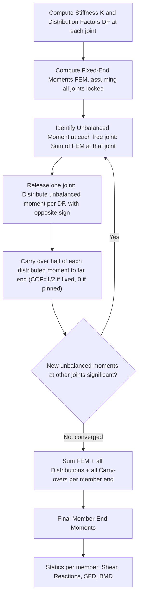

## Moment Distribution Method

### Overview and Purpose

The Moment Distribution Method (developed by Hardy Cross) is an iterative, displacement-based method for analyzing statically indeterminate beams and frames. It avoids solving simultaneous equations directly (unlike the Slope-Deflection Method) by instead simulating the physical process of joints rotating into equilibrium through successive cycles of "locking," releasing, and redistributing unbalanced moments among members meeting at each joint.

The method is conceptually rooted in the Slope-Deflection equations, but reframes the joint-equilibrium process as a repeated numerical procedure that converges to the correct solution without requiring matrix algebra, making it especially suited to hand calculation for continuous beams and frames without excessive sidesway.

### Key Concepts and Terminology

**Fixed-End Moments (FEM):** The moments that would develop at each end of a member if both ends were fully fixed against rotation, under the actual applied loading. Computed using the same standard formulas used in the Slope-Deflection Method.

**Stiffness Factor ($K$):** A measure of a member's resistance to rotation at a joint, given by:

$$K = \frac{4EI}{L} \quad \text{(far end fixed)}$$

$$K = \frac{3EI}{L} \quad \text{(far end pinned/simply supported)}$$

When comparing relative stiffness among members with the same $E$, the relative stiffness is often simplified to $K \propto \dfrac{I}{L}$ (far end fixed) or $K \propto \dfrac{3}{4}\cdot\dfrac{I}{L}$ (far end pinned), since the constant $4E$ (or $3E$) cancels out in the distribution factor ratio.

**Distribution Factor (DF):** The proportion of an unbalanced joint moment that each member framing into a joint absorbs, based on its relative stiffness compared to the total stiffness of all members at that joint:

$$DF_{ij} = \frac{K_{ij}}{\sum K_{\text{at joint } i}}$$

At any joint, the sum of distribution factors for all members framing into it equals 1 (or 0 for a fixed support, since a fixed support absorbs no distributed moment — it is treated as having infinite stiffness, receiving carry-over moments but never distributing).

**Carry-Over Factor (COF):** The fraction of a moment applied at one end of a member that is "carried over" to the far end, due to the flexural continuity of the member:

$$COF = \frac{1}{2} \quad \text{(far end fixed)}$$

$$COF = 0 \quad \text{(far end pinned/simply supported — no moment is carried over, since a pinned end cannot sustain moment)}$$

### General Procedure (Step-by-Step)

**Step 1: Compute stiffness factors and distribution factors**

For each joint in the structure, compute the relative stiffness $K$ of every member framing into it, then compute the distribution factor $DF$ for each member as its stiffness divided by the sum of stiffnesses at that joint.

**Step 2: Compute fixed-end moments (FEM)**

Assume every joint is temporarily locked against rotation (fully fixed), and compute the FEM for every loaded span using standard formulas.

**Step 3: Determine the unbalanced moment at each joint**

At each free (unlocked) joint, sum the FEM values from all members framing in. Any nonzero sum represents an "unbalanced moment" that must be redistributed once the joint is released.

**Step 4: Distribute the unbalanced moment**

Release one joint at a time (conceptually). The unbalanced moment at that joint is distributed to each member framing in, in proportion to its distribution factor, with the distributed moment having a sign opposite to the unbalanced moment (to bring the joint into equilibrium):

$$\text{Distributed Moment}_{ij} = -DF_{ij} \times (\text{Unbalanced Moment at joint } i)$$

**Step 5: Carry over the distributed moment**

Each distributed moment is carried over to the far end of its member, multiplied by the carry-over factor (typically $\frac{1}{2}$ for far end fixed, $0$ for far end pinned).

**Step 6: Repeat the distribute-and-carry-over cycle**

The carried-over moments create new unbalanced moments at adjacent joints. Repeat Steps 4 and 5 (distribute, then carry over) at each joint in turn, cycling through all joints repeatedly, until the carried-over moments become negligibly small (the process mathematically converges, since the carry-over factor is always less than 1, causing the magnitude of successive corrections to diminish geometrically).

**Step 7: Sum all moment contributions**

For each member end, sum the initial FEM, all distributed moments, and all carried-over moments received at that end, across all cycles, to obtain the final member-end moment.

**Step 8: Statics for shear, reactions, and diagrams**

Using the final member-end moments together with the actual span loading, apply statics to each member (as a simply supported beam with these end moments superimposed) to find shear forces, then support reactions, then construct the final Shear Force and Bending Moment Diagrams.

### Worked Example: Two-Span Continuous Beam

**Structure:** Continuous beam ABC, fixed at A, continuous over interior support B, roller at C. Span AB = $L_1 = 6$ m, span BC = $L_2 = 4$ m, constant $EI$. UDL $w = 10$ kN/m over both spans.

**Step 1 — Stiffness and Distribution Factors:**

At joint A (fixed support): no distribution occurs (DF not needed for a fixed support since it does not rotate).

At joint B (interior joint, members BA and BC framing in; BA has far end fixed at A, BC has far end simply supported at C):

$$K_{BA} = \frac{4EI}{L_1} = \frac{4EI}{6} = 0.667EI$$

$$K_{BC} = \frac{3EI}{L_2} = \frac{3EI}{4} = 0.75EI \quad \text{(using far-end-pinned reduced stiffness, since C is a simple end)}$$

$$DF_{BA} = \frac{0.667EI}{0.667EI + 0.75EI} = \frac{0.667}{1.417} = 0.471$$

$$DF_{BC} = \frac{0.75EI}{1.417EI} = 0.529$$

(Check: $DF_{BA} + DF_{BC} = 0.471 + 0.529 = 1.000$ ✓)

At joint C (simple end support, no continuing member beyond it): $DF_{CB} = 1.0$ conceptually, but since a simple end support does not sustain moment in the final structure, using the reduced (far-end-pinned) stiffness for BC upstream already accounts for this, and no separate distribution cycle is needed at C itself when the modified stiffness is used. (Alternative approach: treat C as an ordinary joint with $DF_{CB} = 1$ and iterate normally; both approaches converge to the same answer, though using modified stiffness for a known pinned far end accelerates convergence.)

**Step 2 — Fixed-End Moments:**

$$FEM_{AB} = -\frac{wL_1^2}{12} = -\frac{10(6)^2}{12} = -30 \text{ kN·m}$$

$$FEM_{BA} = +\frac{wL_1^2}{12} = +30 \text{ kN·m}$$

$$FEM_{BC} = -\frac{wL_2^2}{12} = -\frac{10(4)^2}{12} = -13.33 \text{ kN·m}$$

$$FEM_{CB} = +\frac{wL_2^2}{12} = +13.33 \text{ kN·m}$$

**Step 3 — Unbalanced moment at B:**

$$\text{Unbalanced}_B = FEM_{BA} + FEM_{BC} = 30 - 13.33 = 16.67 \text{ kN·m}$$

**Step 4 — Distribute at B:**

$$\text{Distributed to } BA = -0.471 \times 16.67 = -7.85 \text{ kN·m}$$

$$\text{Distributed to } BC = -0.529 \times 16.67 = -8.82 \text{ kN·m}$$

(Check: $-7.85 + -8.82 = -16.67$, exactly canceling the unbalanced moment ✓)

**Step 5 — Carry over:**

Carry-over to A (far end of BA, fixed): $\frac{1}{2} \times (-7.85) = -3.925$ kN·m, added to $M_{AB}$.

Carry-over to C (far end of BC): since the modified stiffness $\frac{3EI}{L_2}$ was used specifically because C is pinned, **no carry-over occurs to C** (COF = 0 for this configuration, consistent with using the reduced stiffness method for a pinned far end).

**Step 6 — Convergence check:**

Since joint A is fixed (does not distribute) and the reduced stiffness at BC eliminated the need for further cycles at C, the process converges in a single distribution cycle for this particular configuration (using modified end-span stiffness is a standard technique specifically to accelerate/simplify convergence at a known simple end support).

**Step 7 — Sum final moments:**

$$M_{AB} = FEM_{AB} + \text{carry-over from B} = -30 + (-3.925) = -33.925 \text{ kN·m}$$

$$M_{BA} = FEM_{BA} + \text{distributed} = 30 + (-7.85) = 22.15 \text{ kN·m}$$

$$M_{BC} = FEM_{BC} + \text{distributed} = -13.33 + (-8.82) = -22.15 \text{ kN·m}$$

(Check: $M_{BA} + M_{BC} = 22.15 - 22.15 = 0$ ✓ joint B is in equilibrium)

$$M_{CB} = 0 \text{ (simple support, no moment)}$$

### Moment Distribution Table Format (Standard Tabular Layout)

|  | A | B (BA side) | B (BC side) | C |
| --- | --- | --- | --- | --- |
| DF | — | 0.471 | 0.529 | 1.0 |
| FEM | −30.00 | +30.00 | −13.33 | +13.33 |
| Distribute | — | −7.85 | −8.82 | — |
| Carry-over | −3.93 | — | — | 0 |
| **Final Moment** | **−33.93** | **+22.15** | **−22.15** | **0** |

This tabular format is the standard way moment distribution calculations are presented and checked, with each joint's DF row summing to 1.0 and each iteration's distributed values summing to zero (or to the negative of the unbalanced moment) at every joint.

### Handling Multiple Iteration Cycles (General Case)

For structures with more than two spans, or where far-end conditions are all "fixed" (not simplified via modified stiffness), the carry-over process typically requires multiple cycles:

1. Distribute the unbalanced moment at every joint (in any convenient order, often left-to-right then right-to-left alternating, or by starting with the joint having the largest unbalanced moment).
2. Carry over half of each distributed moment to the far end of each member.
3. This carry-over creates new unbalanced moments at adjacent joints.
4. Repeat distribution and carry-over at all joints, cycle after cycle.
5. Continue until the magnitude of successive carry-over moments becomes acceptably small (commonly when values fall below 1-5% of the initial FEM values, or per a specified precision tolerance).
6. Sum all values (FEM, all distributions, all carry-overs) column-wise for each member end to get final moments.

### Moment Distribution Iterative Process — Flow Diagram

### Moment Distribution — Joint Balance Illustration

<svg xmlns="http://www.w3.org/2000/svg" viewBox="0 0 560 320">
<text x="280" y="25" text-anchor="middle" font-size="16" font-weight="bold" fill="#1a1a1a">Moment Distribution at Joint B (svg_diagram)</text>
<line x1="60" y1="150" x2="260" y2="150" stroke="#2c3e50" stroke-width="6" />
<line x1="260" y1="150" x2="460" y2="150" stroke="#2c3e50" stroke-width="6" />
<rect x="50" y="140" width="15" height="20" fill="#34495e" />
<circle cx="260" cy="150" r="7" fill="#c0392b" />
<circle cx="460" cy="150" r="6" fill="#34495e" />
<rect x="450" y="160" width="20" height="8" fill="#7f8c8d" />

<text x="60" y="175" text-anchor="middle" font-size="12">A (fixed)</text>

<text x="260" y="175" text-anchor="middle" font-size="12" fill="`#c0392b`">B</text>

<text x="460" y="175" text-anchor="middle" font-size="12">C (roller)</text>

<text x="150" y="120" text-anchor="middle" font-size="11" fill="`#2980b9`">FEM_BA = +30</text>

<text x="370" y="120" text-anchor="middle" font-size="11" fill="`#2980b9`">FEM_BC = −13.33</text>

<text x="260" y="100" text-anchor="middle" font-size="12" fill="`#e74c3c`" font-weight="bold">Unbalanced = +16.67</text>

<path d="M 230 190 A 30 30 0 0 1 230 230" stroke="#27ae60" stroke-width="2" fill="none" marker-end="url(#a1)" />
<text x="200" y="250" font-size="10" fill="#27ae60">Dist. to BA: −7.85</text>
<path d="M 290 190 A 30 30 0 0 0 290 230" stroke="#8e44ad" stroke-width="2" fill="none" marker-end="url(#a2)" />
<text x="300" y="250" font-size="10" fill="#8e44ad">Dist. to BC: −8.82</text>
<path d="M 200 200 Q 130 220 65 190" stroke="#f39c12" stroke-width="1.5" stroke-dasharray="4,2" fill="none" marker-end="url(#a3)" />
<text x="90" y="290" font-size="10" fill="#f39c12">Carry-over to A: −3.93</text>
</svg>

### Handling Frames with Sidesway

For frames susceptible to sidesway (lateral joint translation), the basic Moment Distribution procedure must be supplemented:

1. **Perform a "no-sway" distribution first:** Analyze the frame as if it were artificially restrained against sidesway (adding an imaginary horizontal restraint), performing standard moment distribution to get a set of "no-sway" end moments.
2. **Compute the artificial restraining force:** Using statics, calculate the horizontal force that the imaginary restraint must exert to prevent sidesway, based on the no-sway moments obtained.
3. **Perform a separate "sway" distribution:** Apply an arbitrary assumed sidesway displacement, compute the corresponding fixed-end moments due to this assumed sway (using the sidesway FEM formula, $FEM = -\frac{6EI\Delta}{L^2}$ for both ends of a sidesway-affected column), and perform a full moment distribution cycle for this sway-only case, obtaining a set of "sway" moments proportional to the (arbitrary) assumed $\Delta$.
4. **Scale and superpose:** Determine the scaling factor needed so that the restraining force from the sway case exactly cancels the artificial restraining force from Step 2, then superpose the scaled sway moments onto the no-sway moments to obtain the final result.

[Inference] This multi-step sway-correction procedure is more laborious than the direct simultaneous-equation approach used for sidesway in the Slope-Deflection Method, which is one practical reason many engineers today prefer the Matrix Stiffness Method (computer-based) for frames with significant sidesway, reserving hand-based Moment Distribution primarily for continuous beams and simple non-sway frames or verification checks.

### Convergence Behavior and Accuracy

The Moment Distribution Method is mathematically guaranteed to converge because the carry-over factor is always $\le \frac{1}{2}$, so each successive round of carried-over moments is smaller in magnitude than the previous round (the series of corrections forms a converging geometric-like sequence). In practice:

- Two to four cycles of distribution and carry-over typically achieve sufficient accuracy (within a fraction of a percent) for most hand-calculation purposes.
- Exact closed-form results (matching the Slope-Deflection Method precisely) are achieved only in the limit of infinite cycles; practical engineering solutions truncate once additional cycles no longer meaningfully change the final rounded moment values.

### Comparison with Other Indeterminate Methods

| Aspect | Moment Distribution Method | Slope-Deflection Method | Force Method |
| --- | --- | --- | --- |
| Solving approach | Iterative (successive approximation) | Direct simultaneous equations | Direct simultaneous equations |
| Primary unknowns tracked | Distributed/carried-over moment increments | Joint rotations/translations | Redundant forces |
| Suited for hand calculation of large continuous beams | Very well suited | Suited, but equations grow with joints | Less suited (grows with static redundancy) |
| Handling of sidesway | Requires separate no-sway/sway superposition procedure | Requires additional shear equilibrium equations | Requires selecting sidesway-related redundants |
| Conceptual basis | Physical joint-locking/releasing analogy | Direct application of member flexural equations | Compatibility of deformation |

### Practical Notes and Considerations

- The Moment Distribution Method was historically significant as the dominant hand-calculation method for indeterminate frame and continuous beam analysis for several decades (from its introduction by Hardy Cross in 1930) before the widespread availability of computers made the Matrix Stiffness Method the standard for professional practice.
- Using **modified end-span stiffness** ($\frac{3EI}{L}$ instead of $\frac{4EI}{L}$ for a member with a known pinned/simple far end) eliminates the need for iterative carry-over to that pinned end, often converging the entire beam analysis in a single distribution cycle, as demonstrated in the worked example above.
- Symmetry in geometry and loading can be exploited to reduce the number of joints requiring independent tracking, similarly to other indeterminate methods.
- Always verify that the distribution factors at each joint sum to exactly 1.0, and that final moments at each joint sum to zero (equilibrium) — these are essential self-checks built into the tabular method.

**Related Topics**

- Slope-Deflection Method
- Force Method of Consistent Deformations
- Fixed-End Moments — Derivation and Standard Tables
- Analysis of Frames with Sidesway (No-Sway/Sway Superposition)
- Kani's Method (Rotation Contribution Method)
- Matrix Stiffness Method (Direct Stiffness Method)
- Approximate Methods for Indeterminate Frame Analysis (Portal Method, Cantilever Method)