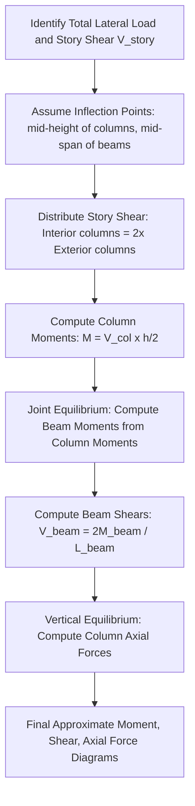

## Approximate Methods for Indeterminate Frames

### Overview and Purpose

Approximate methods are simplified hand-calculation techniques used to estimate internal forces (moments, shears, axial forces) in statically indeterminate frames without solving the exact simultaneous equations required by the Slope-Deflection Method, Moment Distribution Method, or Matrix Stiffness Method. These methods introduce simplifying assumptions about the location of points of inflection (zero moment) and the distribution of shear among frame members, converting the indeterminate structure into a determinate one that can be solved directly using statics.

Approximate methods are primarily used for:

- **Preliminary design:** Quickly estimating member sizes before performing a full, exact analysis.
- **Quick checks:** Verifying the reasonableness of results obtained from more rigorous methods (hand or computer-based).
- **Lateral load analysis of building frames:** Historically the dominant application, particularly the Portal Method and Cantilever Method, developed specifically for estimating the effects of wind and seismic loads on multi-story building frames before the era of routine computer analysis.

### Common Approximate Methods

| Method | Primary Application | Key Assumption |
| --- | --- | --- |
| Portal Method | Lateral loads on low-to-medium-rise, regular frames | Shear in each column of a story is proportional to the number of bays it serves (interior columns carry roughly twice the shear of exterior columns) |
| Cantilever Method | Lateral loads on tall, slender frames | Axial stress in columns of a story varies linearly with distance from the story's centroid, analogous to bending stress in a cantilever beam |
| Approximate methods for vertical (gravity) loads | Gravity loads on beams within rigid frames | Points of inflection assumed at fixed fractional distances along beam spans; columns assumed to carry only axial load from tributary gravity loads |

### Portal Method

**Core assumptions:**

1. A point of inflection (zero moment) occurs at the **mid-height** of every column in the story.
2. A point of inflection occurs at the **mid-span** of every beam.
3. The total horizontal shear at any story is distributed among the columns of that story such that **interior columns carry twice the shear of exterior columns** (based on the idea that each interior column effectively serves two adjacent bays, while exterior columns serve only one).

**Physical rationale:** The Portal Method idealizes each bay of a multi-bay, multi-story frame as behaving like a series of independent portal frames, with the interior columns effectively shared between two adjacent portals, hence carrying double the shear of the exterior (edge) columns.

**Procedure:**

**Step 1: Determine story shear**

For each story, sum all lateral loads applied at or above that story to obtain the total story shear $V_{story}$.

**Step 2: Distribute story shear among columns**

If a story has $n_{ext}$ exterior columns and $n_{int}$ interior columns, and each interior column carries shear $2V_0$ while each exterior column carries $V_0$:

$$V_{story} = n_{ext}(V_0) + n_{int}(2V_0)$$

$$V_0 = \frac{V_{story}}{n_{ext} + 2n_{int}}$$

Exterior column shear $= V_0$; interior column shear $= 2V_0$.

**Step 3: Compute column moments**

With the point of inflection at column mid-height, the moment at the top and bottom of each column equals the column shear multiplied by half the story height:

$$M_{col,top} = M_{col,bottom} = V_{col} \times \frac{h}{2}$$

**Step 4: Compute beam moments via joint equilibrium**

At each joint, the sum of column moments framing in must be balanced by the beam moment(s) framing into that joint (moment equilibrium at the joint, working from the top story downward or applying joint equilibrium directly):

$$\sum M_{joint} = 0 \implies M_{beam} = \sum M_{columns \, at \, joint}$$

For an interior joint with two beams framing in (from left and right), the joint moment is distributed to the two beam ends in proportion to their spans (commonly assumed inversely proportional to span length, reflecting relative stiffness, though some simplified treatments distribute based on other assumptions specific to the textbook source).

**Step 5: Compute beam shears**

With the point of inflection at beam mid-span and known beam end moments, beam shear is found using:

$$V_{beam} = \frac{2M_{beam}}{L_{beam}}$$

(using the beam end moment and treating the beam as if simply supported between inflection points on either half-span, then doubling appropriately based on the specific derivation—value depends on whether the moment is taken as constant beam moment or per-half-span).

**Step 6: Compute column axial forces**

Column axial forces are determined from vertical equilibrium of the beam shears at each joint, accumulating downward through the frame (beam shears convert to column axial loads via joint vertical equilibrium, similar to how shear in a truss chord accumulates).

### Worked Example: Single-Story, Two-Bay Portal Frame (Portal Method)

**Structure:** A single-story frame with 3 columns (2 exterior, 1 interior), 2 bays, height $h$, subjected to a lateral load $P$ at the top (roof level).

**Step 1 — Story shear:** $V_{story} = P$ (single story, all lateral load appears as shear in this one story).

**Step 2 — Distribute shear:** With $n_{ext} = 2$, $n_{int} = 1$:

$$V_0 = \frac{P}{2(1) + 1(2)} = \frac{P}{4}$$

Exterior column shear $= \frac{P}{4}$ each; interior column shear $= \frac{2P}{4} = \frac{P}{2}$.

(Check: $\frac{P}{4} + \frac{P}{2} + \frac{P}{4} = P$ ✓)

**Step 3 — Column moments** (inflection at mid-height $h/2$):

Exterior column moment (top and bottom): $\dfrac{P}{4} \times \dfrac{h}{2} = \dfrac{Ph}{8}$

Interior column moment (top and bottom): $\dfrac{P}{2} \times \dfrac{h}{2} = \dfrac{Ph}{4}$

**Step 4 — Beam moments (joint equilibrium at top of exterior column, left side):**

At the top-left joint, only one column (exterior) and one beam frame in:

$$M_{beam,left} = M_{col,top,exterior} = \frac{Ph}{8}$$

At the top-middle joint (interior column plus two beams framing in from left and right):

$$M_{beam,right\,of\,left\,bay} + M_{beam,left\,of\,right\,bay} = M_{col,top,interior} = \frac{Ph}{4}$$

If bay spans are equal, this is typically split equally: each beam end moment at the interior joint $= \dfrac{Ph}{8}$ (consistent with the exterior joint value, illustrating the standard portal-method pattern where beam moments alternate consistently along the frame for equal bay spans).

### Cantilever Method

**Core assumptions:**

1. A point of inflection occurs at the **mid-height** of every column.
2. A point of inflection occurs at the **mid-span** of every beam.
3. The axial stress (and hence axial force, given tributary area/spacing assumptions) in the columns of a given story varies **linearly** with the horizontal distance of each column from the **centroid of all column areas** in that story, analogous to bending stress distribution in a cantilever beam cross-section ($\sigma = My/I$ analogy, where the "cross-section" is the row of columns in plan, and "y" is each column's distance from the centroidal axis).

**Physical rationale:** The Cantilever Method treats the entire building frame, when resisting lateral load, as behaving like a vertical cantilever beam fixed at its base; the columns act analogously to the longitudinal fibers of a beam cross-section resisting overturning moment, with columns farther from the centroid carrying proportionally more axial force (tension on the windward side, compression on the leeward side, similar to bending stress distribution).

**Procedure:**

**Step 1: Locate the centroid of column areas**

For each story (or for the frame overall if column areas are constant with height), compute the centroid of column cross-sectional areas in plan (horizontal position), often simplified to assume equal column areas, making this equivalent to the geometric centroid of column positions.

**Step 2: Compute the moment of inertia of the column areas**

Analogous to the moment of inertia of a beam cross-section, compute:

$$I_{columns} = \sum A_i x_i^2$$

where $x_i$ is the distance of column $i$ from the centroid, and $A_i$ is its cross-sectional area (or, if areas are assumed equal, simply $\sum x_i^2$).

**Step 3: Compute axial force in each column**

Using the overturning moment $M_{OT}$ at the story level (sum of all lateral loads above that story times their respective heights above the story), the axial force in column $i$ is:

$$F_i = \frac{M_{OT} \cdot A_i \cdot x_i}{I_{columns}}$$

with sign (tension or compression) determined by which side of the centroid the column lies on relative to the direction of overturning.

**Step 4: Compute beam shears from column axial force differences**

Using vertical equilibrium at each joint, the change in column axial force from one story to the next equals the shear transferred through the connecting beams, allowing beam shears to be back-calculated.

**Step 5: Compute beam and column moments**

With beam shears known and the assumed inflection point at beam mid-span, beam end moments follow directly ($M = V \times L/2$). Column moments follow from the assumed mid-height inflection point combined with the column shear values (found from horizontal equilibrium at each joint, working similarly to the Portal Method's Step 4 but starting from the axial-force-derived beam shears instead of directly assumed column shears).

### When to Use Portal Method vs. Cantilever Method

| Consideration | Portal Method | Cantilever Method |
| --- | --- | --- |
| Best suited for | Low-to-medium-rise frames (height roughly ≤ 5 stories, or height/width ratio not large) | Taller, more slender frames where overturning (axial) effects in columns dominate over direct shear racking |
| Primary assumption basis | Shear distribution among columns | Axial force distribution among columns (bending analogy) |
| Relative accuracy for shear-dominated (short/wide) frames | Generally more accurate | Less accurate |
| Relative accuracy for overturning-dominated (tall/slender) frames | Less accurate | Generally more accurate |
| Computational basis | Direct proportion (statics-friendly) | Requires computing a "moment of inertia" of column areas (slightly more involved) |

[Inference] The general guidance that Portal Method suits "low" frames and Cantilever Method suits "tall, slender" frames is a widely taught rule of thumb; the specific height or aspect-ratio threshold at which one becomes preferable to the other varies among textbooks and is not a single universally fixed number, so this guidance should be treated as a general heuristic rather than a precise cutoff.

### Approximate Methods for Vertical (Gravity) Load Analysis of Frames

For rigid frames subjected primarily to gravity (vertical) loads, a different set of simplifying assumptions is used (distinct from the lateral-load-focused Portal/Cantilever methods):

**Common approximate assumptions for gravity loads on frame beams:**

1. Points of inflection in each beam span are assumed to occur at a fixed fraction of the span length from each support (a commonly cited approximation places them at approximately 0.1$L$ from each support for beams continuous with columns of comparable stiffness, though the exact fraction is influenced by relative beam-to-column stiffness and varies by source).
2. The beam between the two assumed inflection points is treated as a statically determinate, simply supported segment for computing the positive (midspan) moment.
3. The moment at the ends of the beam (at the assumed inflection-adjusted location, or approximated directly at the face of the column) is estimated using standard coefficients, conceptually similar in spirit to (but distinct from) code-based moment coefficients such as those historically found in ACI-type simplified design provisions for continuous beams and frames under specific span/loading regularity conditions.
4. Far columns are often assumed to carry only the axial load from the tributary gravity load, with relatively small bending moment compared to the lateral-load case, particularly for interior columns in a regular, symmetric frame under uniform gravity load.

[Inference] These gravity-load approximate coefficients and inflection-point fractions are typically presented as illustrative simplified engineering assumptions rather than a single universally standardized rule; specific numerical coefficients (such assumed inflection point locations, or moment coefficients) differ among textbooks, codes, and editions, so any specific coefficient used in practice should be verified against the governing design code or reference text adopted for a given course or project.

### Approximate Method Workflow (Portal Method)

### Portal Method Shear Distribution — SVG Illustration

<svg xmlns="http://www.w3.org/2000/svg" viewBox="0 0 600 340">
<text x="300" y="25" text-anchor="middle" font-size="16" font-weight="bold" fill="#1a1a1a">Portal Method: Column Shear Distribution (svg_diagram)</text>
<line x1="80" y1="80" x2="520" y2="80" stroke="#2c3e50" stroke-width="6" />
<line x1="80" y1="80" x2="80" y2="260" stroke="#2c3e50" stroke-width="8" />
<line x1="300" y1="80" x2="300" y2="260" stroke="#2c3e50" stroke-width="8" />
<line x1="520" y1="80" x2="520" y2="260" stroke="#2c3e50" stroke-width="8" />
<rect x="70" y="255" width="20" height="10" fill="#7f8c8d" />
<rect x="290" y="255" width="20" height="10" fill="#7f8c8d" />
<rect x="510" y="255" width="20" height="10" fill="#7f8c8d" />
<line x1="60" y1="80" x2="80" y2="80" stroke="#e74c3c" stroke-width="3" marker-end="url(#pArrow)" />
<text x="40" y="75" font-size="12" fill="#e74c3c">P</text>
<line x1="80" y1="170" x2="130" y2="170" stroke="#2980b9" stroke-width="2" stroke-dasharray="4,2" />
<text x="135" y="175" font-size="11" fill="#2980b9">Inflection (mid-h)</text>
<line x1="300" y1="170" x2="350" y2="170" stroke="#2980b9" stroke-width="2" stroke-dasharray="4,2" />
<line x1="520" y1="170" x2="570" y2="170" stroke="#2980b9" stroke-width="2" stroke-dasharray="4,2" />
<line x1="190" y1="80" x2="190" y2="60" stroke="#27ae60" stroke-width="2" stroke-dasharray="3,2" />
<text x="190" y="55" font-size="11" fill="#27ae60" text-anchor="middle">Inflection (mid-span)</text>
<line x1="410" y1="80" x2="410" y2="60" stroke="#27ae60" stroke-width="2" stroke-dasharray="3,2" />

<text x="80" y="300" text-anchor="middle" font-size="12" fill="`#c0392b`" font-weight="bold">V = P/4</text>

<text x="300" y="300" text-anchor="middle" font-size="12" fill="`#c0392b`" font-weight="bold">V = P/2 (2x)</text>

<text x="520" y="300" text-anchor="middle" font-size="12" fill="`#c0392b`" font-weight="bold">V = P/4</text>

<text x="80" y="320" text-anchor="middle" font-size="11">Exterior</text>

<text x="300" y="320" text-anchor="middle" font-size="11">Interior</text>

<text x="520" y="320" text-anchor="middle" font-size="11">Exterior</text>

</svg>

### Comparison: Approximate Methods vs. Exact Methods

| Aspect | Approximate Methods (Portal/Cantilever) | Exact Methods (Slope-Deflection, Moment Distribution, Matrix Stiffness) |
| --- | --- | --- |
| Basis | Assumed inflection points and shear/axial distribution patterns | Rigorous compatibility and equilibrium |
| Accuracy | Reasonable estimate; deviates more for irregular frames | Exact, subject only to the underlying linear-elastic assumptions |
| Speed | Very fast (direct statics after assumptions) | Slower (simultaneous equations or iterative convergence) |
| Best used for | Preliminary sizing, quick estimates, sanity checks | Final design values, code-compliant analysis |
| Sensitivity to irregularity | High — assumptions degrade for frames with highly unequal bay widths, story heights, or column stiffness | Low — rigorously accounts for actual geometry and stiffness |

### Practical Notes and Considerations

- Approximate methods are most reliable for **regular** frames: relatively uniform bay widths, consistent story heights, and comparable member stiffnesses across bays and stories. Significant irregularity in geometry or stiffness reduces the accuracy of the underlying assumptions (assumed inflection point locations and shear/axial distribution ratios).
- These methods remain valuable in modern practice primarily as **quick preliminary estimates** and as **independent sanity checks** on computer-generated results (e.g., verifying that a finite-element or matrix-stiffness model's output moments and shears are of a reasonable order of magnitude and pattern), rather than as the final basis for detailed design in most current professional contexts.
- [Inference] The historical importance of the Portal and Cantilever Methods stems from the pre-computer era of structural engineering, when performing an exact indeterminate lateral-load analysis of a multi-story frame by hand (via Slope-Deflection or Moment Distribution with full sidesway correction) was extremely labor-intensive; with modern computer-based structural analysis software, exact methods are now the norm for final design, with approximate methods retained mainly for their pedagogical value in building engineering intuition and for rapid preliminary work.
- Distinguishing the Portal Method (shear-based, better for shorter/wider frames) from the Cantilever Method (axial/bending-based, better for taller/slenderer frames) hinges on understanding which deformation mode (shear racking vs. overall bending/overturning) dominates the frame's lateral behavior — a conceptual insight that remains valuable even when the actual computation is performed with exact or computer-based methods.

**Related Topics**

- Slope-Deflection Method
- Moment Distribution Method
- Analysis of Determinate Frames
- Lateral Load Analysis of Building Frames (Wind and Seismic)
- Matrix Stiffness Method (Direct Stiffness Method)
- Frame Behavior Under Combined Gravity and Lateral Loads
- Preliminary Structural Sizing and Design Estimation Techniques