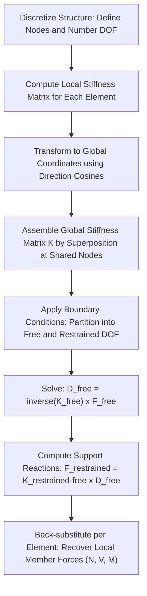

## Introduction to Matrix Stiffness Methods

### Overview and Purpose

The Matrix Stiffness Method (also called the Direct Stiffness Method) is a systematic, computer-oriented approach for analyzing structures of any degree of static or kinematic indeterminacy. It generalizes the displacement-based philosophy of the Slope-Deflection Method into a matrix formulation, in which the entire structure's behavior is captured by a single global stiffness matrix relating all joint (nodal) displacements to all applied joint loads.

This method is the theoretical foundation of essentially all modern structural analysis software (SAP2000, ETABS, STAAD.Pro, ANSYS, and similar programs), as it lends itself naturally to systematic assembly, solution via computer algorithms, and extension to complex structures (3D frames, structures with hundreds or thousands of members) that would be impractical to analyze by classical hand methods.

### Fundamental Concept

The Matrix Stiffness Method treats a structure as an assembly of discrete elements (members) connected at nodes (joints). Each element has a known **element stiffness matrix**, relating the forces at its ends to the displacements at its ends. These individual element stiffness matrices are assembled into a single **global stiffness matrix** representing the entire structure, which relates all nodal displacements to all applied nodal forces:

$$\{F\} = [K]\{D\}$$

Where:

- $\{F\}$ = vector of applied nodal forces (and moments, for frame elements)
- $[K]$ = global stiffness matrix of the entire structure
- $\{D\}$ = vector of unknown nodal displacements (translations and rotations)

Once boundary conditions (supports) are applied, this system is solved for the unknown displacements $\{D\}$, from which member forces are back-calculated using each element's individual stiffness relationship.

### Degrees of Freedom (DOF)

A **degree of freedom** is an independent displacement component (translation or rotation) at a node. For planar (2D) frame analysis, each node typically has 3 DOF:

$$\{d\} = \begin{Bmatrix} u \\ v \\ \theta \end{Bmatrix}$$

where $u$ = horizontal translation, $v$ = vertical translation, $\theta$ = rotation.

For 2D truss analysis (axial-force-only members, pinned joints), each node has 2 DOF (no rotational DOF, since truss joints are assumed pin-connected and members carry no moment):

$$\{d\} = \begin{Bmatrix} u \\ v \end{Bmatrix}$$

For 3D frame analysis, each node has 6 DOF (3 translations, 3 rotations).

### The Element Stiffness Matrix — Truss Member (Axial Only)

For a 2D truss member with length $L$, cross-sectional area $A$, and elastic modulus $E$, oriented at angle $\theta$ from the global x-axis, the element stiffness matrix in **local coordinates** (aligned with the member axis) relates axial force to axial displacement:

$$k_{local} = \frac{AE}{L}\begin{bmatrix} 1 & -1 \\ -1 & 1 \end{bmatrix}$$

To assemble this into the global system, the local stiffness matrix must be **transformed** into global coordinates using a transformation matrix based on the direction cosines $c = \cos\theta$, $s = \sin\theta$:

$$k_{global} = \frac{AE}{L}\begin{bmatrix} c^2 & cs & -c^2 & -cs \\ cs & s^2 & -cs & -s^2 \\ -c^2 & -cs & c^2 & cs \\ -cs & -s^2 & cs & s^2 \end{bmatrix}$$

This $4\times4$ matrix relates the 4 global DOF of the member's two end nodes ($u_1, v_1, u_2, v_2$) to the corresponding global forces at those nodes.

### The Element Stiffness Matrix — Beam/Frame Member

For a 2D frame (beam) member with length $L$, cross-sectional area $A$, moment of inertia $I$, and elastic modulus $E$, the full local stiffness matrix (6×6, combining axial and flexural behavior, local coordinates aligned with the member axis) is:

$$k_{local} = \begin{bmatrix}

\frac{AE}{L} & 0 & 0 & -\frac{AE}{L} & 0 & 0 \

0 & \frac{12EI}{L^3} & \frac{6EI}{L^2} & 0 & -\frac{12EI}{L^3} & \frac{6EI}{L^2} \

0 & \frac{6EI}{L^2} & \frac{4EI}{L} & 0 & -\frac{6EI}{L^2} & \frac{2EI}{L} \

-\frac{AE}{L} & 0 & 0 & \frac{AE}{L} & 0 & 0 \

0 & -\frac{12EI}{L^3} & -\frac{6EI}{L^2} & 0 & \frac{12EI}{L^3} & -\frac{6EI}{L^2} \

0 & \frac{6EI}{L^2} & \frac{2EI}{L} & 0 & -\frac{6EI}{L^2} & \frac{4EI}{L}

\end{bmatrix}$$

corresponding to DOF ordering $\{u_1, v_1, \theta_1, u_2, v_2, \theta_2\}$. Notice the recognizable slope-deflection-related terms ($\frac{4EI}{L}$, $\frac{2EI}{L}$, $\frac{6EI}{L^2}$) embedded within the flexural sub-block, reflecting the method's conceptual continuity with the Slope-Deflection Method.

For inclined members in global coordinates, this local matrix must similarly be transformed using a rotation transformation matrix $[T]$ incorporating $\cos\theta$ and $\sin\theta$:

$$k_{global} = [T]^T [k_{local}] [T]$$

### General Procedure (Step-by-Step)

**Step 1: Discretize the structure and number the nodes and DOF**

Identify all nodes (joints, including supports) and assign a systematic numbering to all degrees of freedom in the structure.

**Step 2: Compute each element's local stiffness matrix**

For each member, compute its local stiffness matrix using its own $E$, $A$, $I$, and $L$ properties.

**Step 3: Transform to global coordinates (if needed)**

For members not aligned with the global axes, apply the coordinate transformation to obtain each element's stiffness matrix in global coordinates.

**Step 4: Assemble the global stiffness matrix**

Superpose each element's global stiffness matrix contribution into the correct locations (rows/columns corresponding to that element's connected DOF) within the overall global stiffness matrix $[K]$. This assembly process directly reflects the physical principle that the total stiffness at any DOF is the sum of stiffness contributions from all members connected to that DOF.

**Step 5: Apply boundary conditions**

Modify the global system to account for known (typically zero) displacements at supports. This is commonly done by partitioning the system into "free" (unknown) and "restrained" (known) DOF, or by directly eliminating restrained rows/columns.

**Step 6: Solve for unknown displacements**

$$\{D_{free}\} = [K_{free}]^{-1}\{F_{free}\}$$

Solve the reduced system of equations (after removing restrained DOF) for the unknown nodal displacements.

**Step 7: Compute support reactions**

Using the full (unpartitioned) stiffness relationship and the now-known displacements (including the known zero displacements at supports), compute the reaction forces at restrained DOF:

$$\{F_{restrained}\} = [K_{restrained,free}]\{D_{free}\}$$

**Step 8: Compute member forces**

For each member, extract its relevant nodal displacements from the global solution, transform back to local coordinates if needed, and apply the local element stiffness relationship to obtain member-end forces (axial force, shear, moment) in local (member) coordinates.

### Worked Example: Simple 2-Member Truss (Conceptual Walkthrough)

**Structure:** Two truss members meeting at a common free node, with the other ends pinned to fixed supports, subjected to a load at the free node. (A minimal illustrative example; full numeric solution requires member geometry, areas, and load magnitude.)

**Step 1 — DOF numbering:** The free node has 2 unknown DOF ($u$, $v$); each fixed support contributes 2 restrained DOF (both zero).

**Step 2-3 — Element matrices:** Each member's $4\times4$ global stiffness matrix is computed using its own length, area, and orientation angle, per the transformed truss stiffness formula above.

**Step 4 — Assembly:** Since both members share the common free node, their stiffness contributions at that node's 2 DOF are summed together (superposed) into a $2\times2$ reduced system (after eliminating the restrained support DOF, which contribute no unknowns).

**Step 5-6 — Solve:** The resulting $2\times2$ system is solved directly for the free node's horizontal and vertical displacement components.

**Step 7-8 — Back-substitution:** Using the found nodal displacement, each member's local axial force is recovered via $N = \frac{AE}{L}(\text{relative axial elongation, from transformed displacements})$, and support reactions follow from the stiffness contributions at the restrained DOF.

This example demonstrates the essential pattern: **assembly by superposition at shared nodes**, **partition-and-solve for unknown displacements**, then **back-substitute for member forces and reactions** — a pattern that scales identically (only growing in matrix size) regardless of how large or complex the structure becomes.

### Matrix Stiffness Method Workflow

### Global Assembly Concept — SVG Illustration

<svg xmlns="http://www.w3.org/2000/svg" viewBox="0 0 600 340">
<text x="300" y="25" text-anchor="middle" font-size="16" font-weight="bold" fill="#1a1a1a">Global Stiffness Matrix Assembly (svg_diagram)</text>
<circle cx="150" cy="180" r="8" fill="#c0392b" />
<circle cx="350" cy="120" r="8" fill="#34495e" />
<circle cx="350" cy="240" r="8" fill="#34495e" />
<line x1="150" y1="180" x2="350" y2="120" stroke="#2980b9" stroke-width="4" />
<line x1="150" y1="180" x2="350" y2="240" stroke="#27ae60" stroke-width="4" />

<text x="150" y="205" text-anchor="middle" font-size="12" fill="`#c0392b`">Node 1 (free, u,v)</text>

<text x="360" y="115" font-size="11">Node 2 (fixed)</text>

<text x="360" y="255" font-size="11">Node 3 (fixed)</text>

<text x="230" y="130" font-size="11" fill="`#2980b9`">Member A [k_A]</text>

<text x="230" y="230" font-size="11" fill="`#27ae60`">Member B [k_B]</text>

<rect x="420" y="80" width="150" height="150" fill="none" stroke="#2c3e50" stroke-width="1.5" />
<text x="495" y="70" text-anchor="middle" font-size="12" font-weight="bold">Global [K] (assembled)</text>
<line x1="420" y1="155" x2="570" y2="155" stroke="#bdc3c7" stroke-width="1" />
<line x1="495" y1="80" x2="495" y2="230" stroke="#bdc3c7" stroke-width="1" />
<text x="450" y="120" text-anchor="middle" font-size="10" fill="#2980b9">k_A + k_B</text>
<text x="450" y="200" text-anchor="middle" font-size="10">terms</text>
<text x="535" y="120" text-anchor="middle" font-size="10">restrained</text>
<text x="535" y="200" text-anchor="middle" font-size="10">restrained</text>

<text x="300" y="300" text-anchor="middle" font-size="12" fill="#555">Contributions from k_A and k_B superpose at shared Node 1 DOF</text>

</svg>

### Boundary Condition Application Methods

**Elimination method (reduced stiffness matrix):** Rows and columns corresponding to restrained (known, typically zero) DOF are removed entirely from the system before solving, leaving only the free DOF. This is the most common conceptual approach for hand-worked small examples and is straightforward for zero-displacement supports.

**Penalty method:** A very large stiffness value is added to the diagonal term of the global matrix at each restrained DOF, effectively forcing the displacement at that DOF toward zero without altering the matrix's overall size or structure. This approach is often used internally by software because it avoids resizing/renumbering the matrix.

**Support settlement (non-zero prescribed displacement):** For known non-zero displacements at a support, the restrained DOF is not simply set to zero; instead, its known value is substituted into the system, and its effect is moved to the load side of the equation for the free DOF, allowing the Matrix Stiffness Method to directly incorporate settlement effects analogous to how the Force Method handles them via a modified compatibility equation right-hand side.

### Advantages of the Matrix Stiffness Method

- **Systematic and general:** The same procedure (assemble, partition, solve, back-substitute) applies identically regardless of the degree of static or kinematic indeterminacy, unlike classical methods whose complexity grows differently with different types of indeterminacy.
- **Computer-friendly:** The matrix formulation is directly implementable in software, enabling analysis of large, complex, real-world structures (multi-story buildings, bridges, three-dimensional frames) that would be entirely impractical by hand.
- **Naturally extensible:** The same basic framework extends to more advanced structural elements (plate/shell finite elements, dynamic analysis via mass and damping matrices, geometric nonlinearity via updated stiffness formulations) by building on the same core assembly-and-solve philosophy.
- **Automatic handling of all force types:** Since the method solves for all nodal displacements simultaneously, it inherently accounts for the combined interaction of axial, shear, and flexural effects throughout the structure, without needing separate classical methods for different indeterminacy sources.

### Relationship to Classical Methods

| Aspect | Matrix Stiffness Method | Slope-Deflection Method |
| --- | --- | --- |
| Unknowns | All nodal displacements (systematically numbered) | Unknown joint rotations/translations (identified case-by-case) |
| Equation assembly | Systematic superposition of element matrices | Manual joint/shear equilibrium equations |
| Element formulation | Explicit stiffness matrix per element type | Implicit within the slope-deflection equation derivation |
| Scalability | Scales to any size via computer solution | Becomes impractical by hand beyond a few unknowns |

[Inference] The Matrix Stiffness Method can be understood as the direct generalization and systematization of the Slope-Deflection Method: both are displacement-based approaches built on the same underlying member flexural relationships, but the Matrix Stiffness Method organizes these relationships into a matrix framework specifically designed for algorithmic assembly and numerical solution, which is why it displaced hand-based classical methods as the standard tool once computing became widely accessible.

### Practical Notes and Considerations

- Modern structural analysis software (SAP2000, ETABS, STAAD.Pro, and similar) implements the Matrix Stiffness Method (or closely related finite-element formulations) as its core computational engine; understanding the underlying matrix method aids in interpreting software output, diagnosing modeling errors, and understanding solver behavior (e.g., what an "unstable structure" or "singular stiffness matrix" error indicates physically — typically a mechanism or insufficiently restrained DOF).
- The element stiffness matrices shown here assume linear-elastic material behavior and small-deflection (first-order) theory; nonlinear material or geometric behavior (second-order/P-Delta effects, plastic hinging) requires modified or iteratively updated stiffness formulations beyond this introductory scope.
- Hand computation of the Matrix Stiffness Method is practical only for very small illustrative structures (as in the worked example above); for structures beyond a handful of members and nodes, computer implementation is the standard and expected approach in professional practice.
- [Inference] Behavior of specific commercial software packages regarding matrix assembly, solver algorithms (e.g., banded/sparse matrix solvers), and default boundary condition handling may vary by software and version; specific claims about a particular software's internal solver behavior should be verified against that software's own documentation.

**Related Topics**

- Slope-Deflection Method
- Moment Distribution Method
- Force Method of Consistent Deformations
- Finite Element Method — Introduction and Extension Beyond Frame Elements
- Structural Analysis Software (SAP2000, ETABS, STAAD.Pro) — Modeling Fundamentals
- Dynamic Analysis Using Mass and Stiffness Matrices
- Geometric Nonlinearity and P-Delta Effects in Frame Analysis