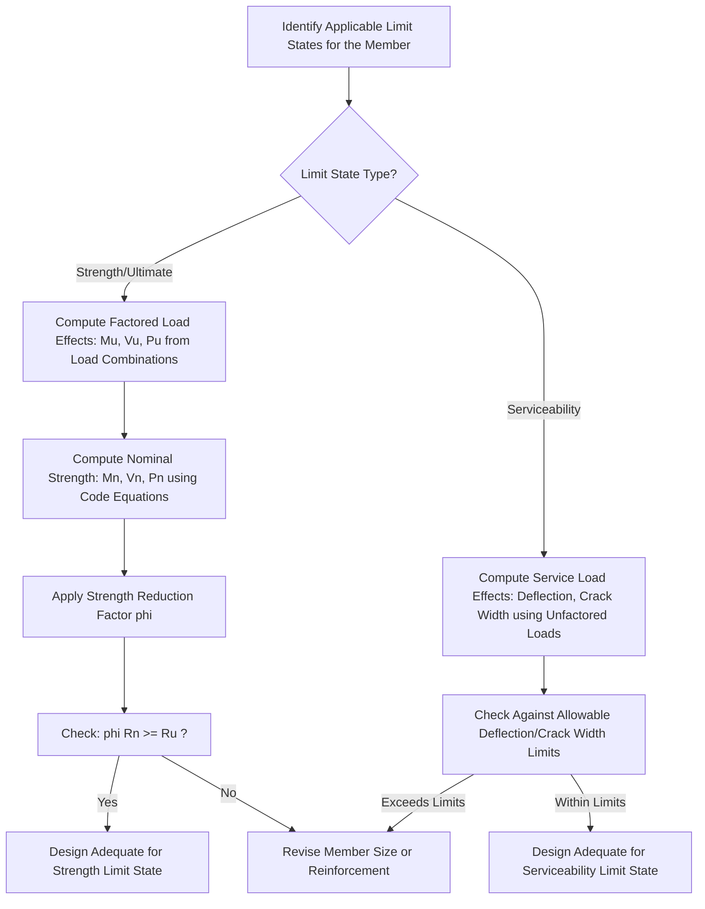

## Design Philosophy and Limit States

### Overview and Purpose

Design philosophy in reinforced concrete refers to the overarching framework of principles, safety criteria, and analytical approach used to proportion structural members so that they perform safely and adequately throughout their intended service life. **Limit states** are the conditions beyond which a structure or structural element no longer satisfies the design performance requirements for which it was intended — either becoming unsafe (a strength failure) or becoming unfit for normal use (a serviceability failure).

Modern reinforced concrete design, as codified in standards such as ACI 318 (American Concrete Institute) and NSCP (National Structural Code of the Philippines, which closely follows ACI 318 provisions), is based on **Limit States Design**, more specifically implemented through the **Strength Design Method** (also historically called Ultimate Strength Design, USD) combined with serviceability checks.

### Historical Evolution of Design Philosophies

**Working Stress Design (WSD) / Allowable Stress Design (ASD):**

The earliest systematic design philosophy, in which member stresses under actual (service) loads are kept below a fraction of the material's yield or ultimate strength (an "allowable stress"), providing a margin of safety through stress reduction rather than load amplification. This approach assumes linear-elastic material behavior throughout and applies a single factor of safety on the material side.

**Ultimate Strength Design (USD) / Strength Design Method (SDM):**

The design philosophy that superseded WSD in most modern concrete codes. Structural members are designed so that their **factored nominal strength** exceeds the effects of **factored (amplified) loads**, explicitly accounting for the actual nonlinear behavior of concrete and steel at failure (ultimate) conditions, rather than assuming linear-elastic stress distributions throughout.

**Limit States Design (LSD) / Load and Resistance Factor Design (LRFD):**

The most comprehensive and current philosophy, which explicitly separates and addresses multiple distinct "limit states" — both strength (ultimate) limit states and serviceability limit states — each with its own load combinations, safety factors, and acceptance criteria. Strength Design Method as implemented in ACI 318/NSCP is essentially the concrete-specific application of this broader LRFD philosophy.

### Categories of Limit States

**1. Strength (Ultimate) Limit States**

Conditions associated with the maximum load-carrying capacity of a structure or member, where exceeding the limit state implies collapse, structural failure, or loss of stability. Strength limit states include:

- Flexural failure (bending capacity exceeded)
- Shear failure
- Torsional failure
- Axial compression/tension failure (columns, ties)
- Bearing failure
- Buckling/instability (of compression members or thin elements)
- Overall structural instability or overturning

**2. Serviceability Limit States**

Conditions associated with the structure's performance under normal, everyday service loads, where exceeding the limit state does not cause collapse but renders the structure unfit for its intended use, uncomfortable, or damaging to non-structural elements. Serviceability limit states include:

- Excessive deflection (affecting appearance, function, or causing damage to attached non-structural elements such as partitions or finishes)
- Excessive crack width (affecting durability via reinforcement corrosion, and appearance)
- Excessive vibration (affecting occupant comfort, particularly in floors and footbridges)
- Excessive permanent (long-term/creep) deformation

**3. Other Limit States (Durability, Special Conditions)**

Some design frameworks explicitly recognize additional limit-state categories:

- **Durability limit states:** Conditions related to long-term deterioration (reinforcement corrosion due to chloride ingress or carbonation, freeze-thaw damage, alkali-silica reaction), addressed through provisions such as minimum concrete cover, maximum water-cement ratio, and crack-width control.
- **Fatigue limit states:** Relevant for structures subject to repeated cyclic loading (bridges, crane runway girders), addressing progressive strength degradation under cyclic stress ranges.
- **Extreme event limit states:** Conditions associated with rare, extreme loading scenarios such as major seismic events, blast, or impact, often governed by separate specialized provisions distinct from routine strength/serviceability design.

### The Strength Design Method — Fundamental Design Inequality

The core requirement of the Strength Design Method, applied to every relevant strength limit state at every critical section, is:

$$\phi R_n \geq R_u$$

Where:

- $R_n$ = nominal resistance (nominal strength) of the member for the limit state under consideration (e.g., nominal moment capacity $M_n$, nominal shear capacity $V_n$)
- $\phi$ = strength reduction factor (also called resistance factor), a value less than 1.0 that accounts for uncertainties in material strength, workmanship, dimensional variation, and the type/consequence of the specific failure mode
- $R_u$ = factored load effect (required strength) at that section, computed from factored (amplified) load combinations (e.g., factored moment $M_u$, factored shear $V_u$)

This can also be expressed with load and resistance sides separated explicitly:

$$\phi R_n \geq \gamma_1 Q_1 + \gamma_2 Q_2 + \cdots$$

where $\gamma_i$ are load factors applied to each type of load effect $Q_i$ (dead load, live load, wind, seismic, etc.).

### Strength Reduction Factors ($\phi$) — Typical Values (ACI 318 / NSCP Framework)

| Failure Mode / Member Type | Typical $\phi$ Value |
| --- | --- |
| Tension-controlled flexural sections (beams, most slabs) | 0.90 |
| Compression-controlled sections, spiral-reinforced columns | 0.75 |
| Compression-controlled sections, tied columns | 0.65 |
| Shear and torsion | 0.75 |
| Bearing on concrete | 0.65 |
| Transition-zone sections (between compression- and tension-controlled) | Linearly interpolated between 0.65 (or 0.75) and 0.90 |

[Unverified] Exact numerical values for $\phi$ factors, and the precise strain limits defining "tension-controlled," "compression-controlled," and "transition zone" sections, have been revised across different editions of ACI 318 and correspondingly NSCP; the specific numerical values and classification thresholds in force for a given design should always be confirmed against the specific code edition governing the project or course (e.g., ACI 318-19, NSCP 2015, or later editions), since this document presents commonly cited representative values rather than quoting a single definitive current edition verbatim.

**Rationale for varying $\phi$ values:** Lower $\phi$ values are assigned to failure modes that are brittle, sudden, or occur with less warning (e.g., compression failure of columns, shear failure), while higher $\phi$ values are assigned to failure modes that are ductile and provide warning before collapse (e.g., tension-controlled flexural yielding of properly designed under-reinforced beams). This reflects a deliberate philosophy of penalizing brittle failure modes with a larger safety margin.

### Load Factors and Load Combinations

Factored load combinations amplify service (unfactored, actual/nominal) loads to account for the possibility of loads exceeding their expected values and for uncertainty in load estimation itself. A widely referenced representative set of ACI 318 / NSCP-style basic load combinations includes:

$$U = 1.4D$$

$$U = 1.2D + 1.6L + 0.5(L_r \text{ or } S \text{ or } R)$$

$$U = 1.2D + 1.6(L_r \text{ or } S \text{ or } R) + (1.0L \text{ or } 0.5W)$$

$$U = 1.2D + 1.0W + 1.0L + 0.5(L_r \text{ or } S \text{ or } R)$$

$$U = 1.2D + 1.0E + 1.0L + 0.2S$$

$$U = 0.9D + 1.0W$$

$$U = 0.9D + 1.0E$$

Where $D$ = dead load, $L$ = live load, $L_r$ = roof live load, $S$ = snow load, $R$ = rain load, $W$ = wind load, $E$ = earthquake (seismic) load.

[Unverified] The precise numerical load factors and the specific combinations shown above are illustrative of the general ACI 318/ASCE 7-style approach; exact values, especially wind and seismic load factors, have changed between code editions (e.g., a shift from 1.6W to 1.0W accompanied a change in the underlying wind speed basis in some ASCE 7 editions), so the governing code edition for a specific project or course must be consulted for the exact current values.

**Rationale for varying load factors:** Higher load factors are applied to loads with greater variability or uncertainty (live load, wind, seismic) compared to dead load (which is generally more predictable, being based on known material densities and member dimensions), reflecting the principle that more uncertain loads warrant a larger amplification margin. The reduced dead load factor (0.9) in combinations involving wind or seismic uplift/overturning reflects the scenario where a *lower* dead load is actually the conservative (critical) case — insufficient dead weight to resist overturning or uplift.

### Nominal Strength vs. Design Strength vs. Required Strength

| Term | Symbol | Meaning |
| --- | --- | --- |
| Nominal strength | $R_n$ (e.g., $M_n$, $V_n$, $P_n$) | Theoretical capacity computed using specified material properties and code-prescribed equations, without any reduction factor |
| Design strength | $\phi R_n$ | Nominal strength multiplied by the applicable strength reduction factor $\phi$ |
| Required strength | $R_u$ (e.g., $M_u$, $V_u$, $P_u$) | The load effect computed from factored load combinations, representing the demand the member must be designed to resist |

The fundamental design check, restated: **Design strength must equal or exceed required strength** ($\phi R_n \geq R_u$) at every critical section for every applicable limit state.

### Serviceability Design Checks (Working/Service Load Basis)

Unlike strength limit states (checked using factored loads), serviceability limit states are checked using **unfactored (service) loads**, since the concern is behavior under normal, everyday conditions rather than at the point of failure.

**Deflection control:** Achieved either through:

- **Direct computation** of immediate and long-term (creep/shrinkage-affected) deflections, compared against code-specified allowable deflection limits (commonly expressed as a fraction of span, e.g., $L/240$, $L/360$, or $L/480$ depending on the member type and sensitivity of attached elements to deflection).
- **Minimum thickness/depth-to-span ratio tables**, which allow deflection checks to be waived if minimum member thickness requirements (as tabulated in the code based on span, support conditions, and member type) are satisfied — a common practical shortcut for typical beams and slabs.

**Crack control:** Achieved through limits on reinforcement spacing (rather than a direct computed crack width in many modern code editions), particularly relevant for members exposed to weather or aggressive environments, ensuring reinforcement is well-distributed to control crack widths at service load levels.

### Design Philosophy Comparison

| Aspect | Working Stress Design (WSD/ASD) | Strength Design Method (USD/LRFD) |
| --- | --- | --- |
| Load basis | Service (unfactored) loads | Factored (amplified) loads |
| Material behavior assumption | Linear-elastic throughout | Nonlinear stress distribution at ultimate/failure conditions |
| Safety factor location | Applied to material allowable stress (single factor) | Applied separately to loads (factors > 1) and resistance (factor < 1) |
| Reflects actual failure behavior | Less accurately (assumes elastic behavior even near failure) | More accurately (accounts for concrete's nonlinear stress-strain behavior and steel yielding) |
| Current status in most codes (ACI 318, NSCP) | Largely superseded, retained in some older/legacy references or specific alternative provisions | The primary, standard design method |

### Limit States Design Workflow

### Design Inequality — SVG Illustration

<svg viewBox="0 0 600 300" xmlns="http://www.w3.org/2000/svg">
<text x="300" y="25" text-anchor="middle" font-size="16" font-weight="bold" fill="#1a1a1a">Strength Design Inequality: phi Rn >= Ru (svg_diagram)</text>
<rect x="60" y="80" width="200" height="60" rx="8" fill="#eafaf1" stroke="#27ae60" stroke-width="2"/>
<text x="160" y="105" text-anchor="middle" font-size="13" font-weight="bold" fill="#27ae60">Design Strength</text>
<text x="160" y="125" text-anchor="middle" font-size="14" fill="#27ae60">phi x Rn</text>

<text x="300" y="115" text-anchor="middle" font-size="24" font-weight="bold" fill="`#2c3e50`">≥</text>

<rect x="340" y="80" width="200" height="60" rx="8" fill="#fdedec" stroke="#c0392b" stroke-width="2"/>
<text x="440" y="105" text-anchor="middle" font-size="13" font-weight="bold" fill="#c0392b">Required Strength</text>
<text x="440" y="125" text-anchor="middle" font-size="14" fill="#c0392b">Ru (Mu, Vu, Pu)</text>

<text x="160" y="170" text-anchor="middle" font-size="11" fill="#555">Nominal Strength Rn</text>

<text x="160" y="185" text-anchor="middle" font-size="11" fill="#555">reduced by phi < 1.0</text>

<text x="160" y="200" text-anchor="middle" font-size="11" fill="#555">(accounts for material/</text>

<text x="160" y="215" text-anchor="middle" font-size="11" fill="#555">construction uncertainty)</text>

<text x="440" y="170" text-anchor="middle" font-size="11" fill="#555">Service Loads amplified</text>

<text x="440" y="185" text-anchor="middle" font-size="11" fill="#555">by load factors > 1.0</text>

<text x="440" y="200" text-anchor="middle" font-size="11" fill="#555">(accounts for load</text>

<text x="440" y="215" text-anchor="middle" font-size="11" fill="#555">variability/uncertainty)</text>

<text x="300" y="270" text-anchor="middle" font-size="12" fill="`#2c3e50`" font-weight="bold">Margin of Safety = gap between the two sides</text>

</svg>

### Ductility and Reinforcement Ratio Philosophy

A central design philosophy embedded within the Strength Design Method (specifically for flexural members) is ensuring **ductile behavior**: the design deliberately favors reinforcement ratios that ensure the steel reinforcement yields before the concrete crushes in compression, providing visible warning (large deflection, wide cracks) before ultimate failure, rather than a sudden, brittle compression failure of the concrete with little or no warning. This philosophy underlies:

- The classification of sections as "tension-controlled," "transition," or "compression-controlled" based on the net tensile strain in the extreme tension reinforcement at nominal strength.
- The assignment of higher $\phi$ factors to tension-controlled (ductile) sections and lower $\phi$ factors to compression-controlled (brittle) sections, as previously noted.
- Code-mandated minimum and maximum reinforcement ratio limits, which respectively guard against sudden brittle failure immediately upon cracking (minimum reinforcement) and against non-ductile, compression-controlled behavior (maximum reinforcement, historically tied to a defined balanced condition).

### Practical Notes and Considerations

- The specific numerical values of load factors, $\phi$ factors, and serviceability limits presented in general references (including this document) are illustrative of common, widely taught ACI 318/NSCP-style provisions; because these values are periodically revised between code editions, the specific edition governing a given academic course, jurisdiction, or project must always be the authoritative source for final design values.
- The Philippines' National Structural Code (NSCP) generally adopts and closely mirrors ACI 318 provisions, sometimes with a lag of one or more code cycles and with specific adaptations for local seismic and wind hazard conditions; the governing NSCP edition (and its adopted ACI 318 base edition) should be confirmed for any project-specific or examination-specific work.
- Understanding *why* the Strength Design Method uses distinct load and resistance factors (rather than a single combined safety factor as in Working Stress Design) is foundational to interpreting virtually all subsequent reinforced concrete design topics (flexure, shear, columns, slabs), since every subsequent design check follows the same $\phi R_n \geq R_u$ inequality structure.
- [Inference] The overall trend across successive code editions internationally has been toward increasingly probabilistic, reliability-based calibration of load and resistance factors (aiming for a consistent target reliability/probability of failure across different member types and failure modes), though the specific target reliability indices and calibration methodology are typically addressed in more advanced structural reliability coursework beyond this introductory design-philosophy scope.

**Related Topics**

- Material Properties of Concrete and Reinforcing Steel
- Flexural Design of Reinforced Concrete Beams (Singly and Doubly Reinforced)
- Shear Design of Reinforced Concrete Beams
- Load Combinations and Structural Loading (NSCP/ASCE 7 Basis)
- Serviceability: Deflection and Crack Width Control
- Ductility, Balanced Condition, and Reinforcement Ratio Limits
- Column Design: Axial-Flexural Interaction and Slenderness Effects