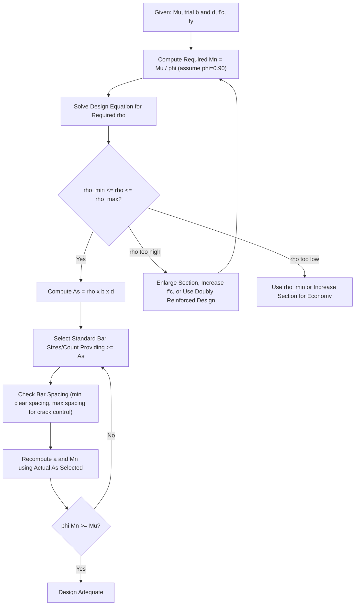

## Flexural Design of Beams and Slabs

### Overview and Purpose

Flexural design of reinforced concrete beams and slabs involves proportioning the concrete cross-section and reinforcing steel so that the member's design moment capacity ($\phi M_n$) equals or exceeds the factored moment demand ($M_u$) at every critical section, following the Strength Design Method inequality $\phi M_n \geq M_u$. Flexural design encompasses both **analysis** (finding the capacity of a known section) and **design** (determining required reinforcement or dimensions for a given demand).

### Fundamental Assumptions of Flexural Theory

The design of reinforced concrete flexural members rests on the following standard assumptions (per ACI 318/NSCP):

1. **Plane sections remain plane** before and after bending (strain varies linearly across the depth of the section).
2. **Perfect bond** exists between concrete and reinforcing steel (no slip; steel strain equals the adjacent concrete strain at the same depth).
3. **Tensile strength of concrete is neglected** in flexural strength calculations (concrete is assumed cracked in the tension zone at ultimate conditions).
4. **Maximum usable concrete compressive strain** is taken as $\varepsilon_{cu} = 0.003$.
5. **Concrete stress distribution** at nominal strength is replaced, for design purposes, with an **equivalent rectangular stress block** (the Whitney stress block), simplifying the actual nonlinear stress-strain distribution into an equivalent uniform stress of $0.85f'_c$ over a depth $a = \beta_1 c$.
6. **Steel stress-strain behavior** is idealized as elastic-perfectly-plastic: $f_s = E_s \varepsilon_s \leq f_y$.

### The Equivalent Rectangular Stress Block (Whitney Stress Block)

$$a = \beta_1 c$$

Where $c$ is the depth to the neutral axis, and $\beta_1$ is a factor depending on concrete strength:

$$\beta_1 = 0.85 \quad \text{for } f'_c \leq 28 \text{ MPa (4000 psi)}$$

$$\beta_1 = 0.85 - 0.05\left(\frac{f'_c - 28}{7}\right) \geq 0.65 \quad \text{for } f'_c > 28 \text{ MPa}$$

[Unverified] The exact numerical thresholds and reduction rate for $\beta_1$ (as well as the lower bound of 0.65) are as commonly tabulated in ACI 318/NSCP-style provisions; small variations in the exact breakpoint value or units convention (MPa vs. psi) exist across code editions and unit systems, so the specific edition in force should be checked for exact values.

### Singly Reinforced Rectangular Beam — Flexural Analysis

**Nominal moment capacity**, derived from internal force equilibrium (compression in concrete = tension in steel) and moment of the resulting force couple about either force's line of action:

$$C = 0.85f'_c \cdot a \cdot b$$

$$T = A_s f_y$$

Setting $C = T$ (equilibrium) and solving for the stress block depth $a$:

$$a = \frac{A_s f_y}{0.85 f'_c b}$$

**Nominal moment capacity:**

$$M_n = A_s f_y \left(d - \frac{a}{2}\right)$$

$$M_u = \phi M_n = \phi A_s f_y\left(d - \frac{a}{2}\right)$$

Where:

- $A_s$ = area of tension reinforcement
- $f_y$ = yield strength of reinforcing steel
- $f'_c$ = specified compressive strength of concrete
- $b$ = width of the compression face
- $d$ = effective depth (distance from extreme compression fiber to centroid of tension reinforcement)

### Reinforcement Ratio and Its Limits

**Reinforcement ratio:**

$$\rho = \frac{A_s}{bd}$$

**Balanced reinforcement ratio** ($\rho_b$): the ratio at which the concrete reaches its ultimate compressive strain ($\varepsilon_{cu} = 0.003$) at precisely the same instant the tension steel reaches its yield strain ($\varepsilon_y = f_y/E_s$):

$$\rho_b = 0.85\beta_1 \frac{f'_c}{f_y}\left(\frac{600}{600 + f_y}\right) \quad \text{(f}_y\text{ in MPa)}$$

**Minimum reinforcement ratio** (guards against sudden brittle failure at first cracking, ensuring the cracked section still has more capacity than the uncracked section had):

$$\rho_{min} = \frac{1.4}{f_y} \quad \text{(f}_y\text{ in MPa, or equivalent code-specified formula)}$$

$$\rho_{min} = \frac{\sqrt{f'_c}}{4f_y} \quad \text{(alternative form, governing when larger)}$$

**Maximum reinforcement ratio** (ensures tension-controlled, ductile behavior by limiting the net tensile strain in the reinforcement at nominal strength to at least a code-specified minimum value, commonly $\varepsilon_t \geq 0.005$ for tension-controlled classification in beams):

$$\rho_{max} \approx 0.319\beta_1\frac{f'_c}{f_y}\left(\frac{600}{600+f_y}\right) \quad \text{[Inference: representative value; exact coefficient depends on the specific } \varepsilon_t \text{ limit and code edition adopted]}$$

[Unverified] The precise minimum reinforcement formula, the exact strain limit defining tension-controlled sections (commonly cited as $\varepsilon_t = 0.005$ in several editions, though earlier/alternate provisions used different values or a direct $0.75\rho_b$ maximum limit), and the resulting numerical coefficient in the $\rho_{max}$ expression vary among ACI 318 editions and corresponding NSCP adoptions; the governing code edition should be consulted for the exact current formula and strain limit.

### Under-Reinforced vs. Over-Reinforced vs. Balanced Sections

| Condition | Reinforcement Ratio | Failure Mode | Ductility |
| --- | --- | --- | --- |
| Under-reinforced (tension-controlled) | $\rho < \rho_b$ (specifically $\rho \leq \rho_{max}$) | Steel yields first; concrete crushes after large deflection | Ductile — preferred design condition |
| Balanced | $\rho = \rho_b$ | Steel yields and concrete crushes simultaneously (theoretical condition) | Transition point — not a practical design target |
| Over-reinforced (compression-controlled) | $\rho > \rho_b$ | Concrete crushes before steel yields | Brittle — avoided in standard design practice |

Standard design practice deliberately targets **under-reinforced, tension-controlled sections** ($\rho_{min} \leq \rho \leq \rho_{max}$), ensuring visible warning (cracking, deflection) before ultimate failure.

### Design Procedure for a Singly Reinforced Rectangular Beam (Given $M_u$)

**Step 1: Estimate a trial section** (beam width $b$ and effective depth $d$), often guided by span-to-depth ratio rules of thumb or architectural/serviceability constraints (minimum thickness tables).

**Step 2: Compute the required nominal moment**

$$M_n = \frac{M_u}{\phi} \quad (\phi = 0.90 \text{ assumed for tension-controlled section, verified later})$$

**Step 3: Solve for the required reinforcement ratio using the flexural design equation**

Combining the $C = T$ equilibrium and moment equations into a single design equation:

$$M_n = \rho f_y bd^2\left(1 - \frac{0.59\rho f_y}{f'_c}\right)$$

This is a quadratic in $\rho$; solving directly:

$$\rho = \frac{0.85f'_c}{f_y}\left[1 - \sqrt{1 - \frac{2.353 M_u}{\phi f'_c bd^2}}\right]$$

(Coefficient 2.353 arises from algebraic manipulation of the quadratic solution combined with the 0.85 and related constants; some references present this with slightly different but algebraically equivalent groupings.)

**Step 4: Check reinforcement ratio against limits**

Verify $\rho_{min} \leq \rho \leq \rho_{max}$. If $\rho < \rho_{min}$, use $\rho_{min}$ (or increase section size for economy). If $\rho > \rho_{max}$, the section must be enlarged, concrete strength increased, or doubly reinforced design employed (see below).

**Step 5: Compute required steel area and select bars**

$$A_s = \rho b d$$

Select a practical combination of standard reinforcing bar sizes and quantities to provide at least this area, checking bar spacing requirements (minimum clear spacing, maximum spacing for crack control) fit within the beam width.

**Step 6: Verify final design capacity**

Using the actual selected $A_s$ (which will generally be slightly larger than the exact required value, due to discrete bar sizes), recompute $a$, $M_n$, and confirm $\phi M_n \geq M_u$.

### Worked Example: Singly Reinforced Beam Design

**Given:** $b = 300$ mm, $d = 500$ mm, $f'_c = 27.6$ MPa, $f_y = 414$ MPa, $M_u = 250$ kN·m.

**Step 1-2:**

$$M_n = \frac{250}{0.90} = 277.8 \text{ kN·m}$$

**Step 3 — Solve for $\rho$:**

$$\rho = \frac{0.85(27.6)}{414}\left[1 - \sqrt{1 - \frac{2.353(277.8 \times 10^6)}{0.90(27.6)(300)(500)^2}}\right]$$

$$\rho = 0.0567\left[1 - \sqrt{1 - \frac{653.5 \times 10^6}{1.863 \times 10^9}}\right] = 0.0567\left[1 - \sqrt{1 - 0.3508}\right]$$

$$\rho = 0.0567\left[1 - \sqrt{0.6492}\right] = 0.0567\left[1 - 0.8057\right] = 0.0567(0.1943) = 0.01102$$

**Step 4 — Check limits:** (using representative $\rho_{min} \approx 0.0034$, $\rho_{max} \approx 0.0197$ for these material properties, illustrative values consistent with the formulas above): $\rho_{min} < 0.01102 < \rho_{max}$ ✓ — acceptable, under-reinforced.

**Step 5 — Required steel area:**

$$A_s = 0.01102 \times 300 \times 500 = 1653 \text{ mm}^2$$

This could be satisfied by, for example, 4-25mm diameter bars ($4 \times 490.9 = 1963.6$ mm², providing a margin above the required area) or 6-20mm diameter bars ($6 \times 314.2 = 1885.2$ mm²), subject to spacing checks.

**Step 6 — Verify:**

$$a = \frac{1963.6 \times 414}{0.85 \times 27.6 \times 300} = \frac{813,010}{7038} = 115.5 \text{ mm}$$

$$M_n = 1963.6 \times 414 \times \left(500 - \frac{115.5}{2}\right) = 813,010 \times 442.25 = 359.6 \times 10^6 \text{ N·mm} = 359.6 \text{ kN·m}$$

$$\phi M_n = 0.90 \times 359.6 = 323.6 \text{ kN·m} \geq M_u = 250 \text{ kN·m}$$ ✓

### Doubly Reinforced Beams

When a section requires more moment capacity than can be economically or physically achieved with tension reinforcement alone within the maximum reinforcement ratio limit (common when architectural constraints limit section depth), compression reinforcement ($A'_s$) is added.

**Nominal moment capacity (doubly reinforced):**

$$M_n = (A_s - A'_s)f_y\left(d - \frac{a}{2}\right) + A'_s f_y(d - d')$$

where $d'$ is the depth to the centroid of the compression reinforcement, and $a$ is computed using only the "excess" tension steel:

$$a = \frac{(A_s - A'_s)f_y}{0.85f'_c b}$$

**Critical check:** The compression steel must actually yield at nominal strength for the equation above to be valid directly; this requires verifying:

$$d' \leq \frac{600(1 - f_y/(600+f_y))}{...} \quad \text{[a strain-compatibility check comparing the compression steel's strain at the assumed neutral axis depth to its yield strain]}$$

If the compression steel does not yield, the actual stress $f'_s < f_y$ must be found from strain compatibility ($\varepsilon'_s = 0.003\frac{c - d'}{c}$, then $f'_s = E_s\varepsilon'_s$) and used in place of $f_y$ for the compression steel term.

### Flexural Design Procedure — Flow Diagram

### Strain and Stress Distribution — SVG Illustration

<svg xmlns="http://www.w3.org/2000/svg" viewBox="0 0 600 380">
<text x="300" y="25" text-anchor="middle" font-size="16" font-weight="bold" fill="#1a1a1a">Beam Cross-Section: Strain and Stress Distribution (svg_diagram)</text>
<rect x="100" y="60" width="140" height="220" fill="#ecf0f1" stroke="#2c3e50" stroke-width="2" />
<text x="170" y="50" text-anchor="middle" font-size="12">Cross-Section</text>
<circle cx="130" cy="255" r="6" fill="#7f8c8d" />
<circle cx="170" cy="255" r="6" fill="#7f8c8d" />
<circle cx="210" cy="255" r="6" fill="#7f8c8d" />
<text x="170" y="300" text-anchor="middle" font-size="11">As (tension steel)</text>
<line x1="100" y1="60" x2="240" y2="60" stroke="#c0392b" stroke-width="4" />
<text x="170" y="55" text-anchor="middle" font-size="10" fill="#c0392b"> </text>
<line x1="280" y1="60" x2="280" y2="280" stroke="#95a5a6" stroke-width="1" />
<path d="M 280 60 L 300 60 L 280 280 Z" fill="#3498db" fill-opacity="0.3" stroke="#3498db" stroke-width="1.5" />
<text x="330" y="90" font-size="11" fill="#3498db">Strain Diagram</text>
<text x="330" y="105" font-size="10" fill="#3498db">(linear, plane sections)</text>
<text x="300" y="55" font-size="10" fill="#3498db">epsilon_cu = 0.003</text>
<text x="285" y="295" font-size="10" fill="#3498db">epsilon_s</text>
<line x1="380" y1="60" x2="380" y2="280" stroke="#95a5a6" stroke-width="1" />
<rect x="380" y="60" width="40" height="90" fill="#e74c3c" fill-opacity="0.4" stroke="#c0392b" stroke-width="1.5" />
<text x="460" y="80" font-size="11" fill="#c0392b">Equivalent Stress</text>
<text x="460" y="95" font-size="11" fill="#c0392b">Block (Whitney)</text>
<text x="460" y="110" font-size="10" fill="#c0392b">0.85 f'c, depth = a</text>
<line x1="380" y1="150" x2="500" y2="150" stroke="#7f8c8d" stroke-width="1" stroke-dasharray="3,2" />
<text x="505" y="155" font-size="10">Neutral Axis (c)</text>
<line x1="380" y1="255" x2="500" y2="255" stroke="#27ae60" stroke-width="2" marker-end="url(#tArrow)" />
<text x="505" y="260" font-size="11" fill="#27ae60">T = As fy</text>
<line x1="400" y1="100" x2="500" y2="100" stroke="#c0392b" stroke-width="2" marker-start="url(#cArrow)" />
<text x="505" y="100" font-size="11" fill="#c0392b">C = 0.85 f'c a b</text>
</svg>

### Flexural Design of One-Way Slabs

One-way slabs are designed using the same fundamental flexural equations as rectangular beams, treating a representative **1-meter (or 1-foot) wide strip** as an equivalent beam ($b = 1000$ mm typically assumed for metric design).

**Key differences from beam design:**

- Reinforcement is typically specified as **bar spacing** for a given bar size, rather than a discrete bar count, since the design strip width is an arbitrary reference (1 m):

$$s = \frac{A_b \times 1000}{A_s} \quad \text{(spacing in mm, for bar area } A_b \text{, per meter width)}$$

- **Minimum slab reinforcement** is governed by shrinkage and temperature requirements (rather than the beam's $\rho_{min}$ flexural formula) in the direction perpendicular to the main flexural reinforcement, with typical shrinkage/temperature steel ratios in the range of 0.0018–0.0020 depending on reinforcement grade [Unverified: exact values and applicable grades should be confirmed against the governing code edition].
- **Maximum bar spacing** is limited to the lesser of a fixed dimension (e.g., 450 mm/18 in.) or a multiple of the slab thickness (e.g., 3 times slab thickness for main reinforcement, per common code provisions), to ensure reasonably uniform crack distribution and flexural behavior approximating the assumed 1D strip idealization.
- **Minimum slab thickness** is often governed directly by deflection-control tables (span/depth ratios) based on span length and support/continuity conditions, frequently controlling slab thickness selection before detailed flexural design of reinforcement even begins.

### Continuous Beams and Slabs — Moment Redistribution Considerations

For continuous beams and slabs (spanning over multiple supports), the design bending moment envelope is obtained from structural analysis (Moment Distribution, Matrix Stiffness, or approximate coefficient methods for regular spans). Some codes permit limited **moment redistribution** — a reduction of the elastic negative (support) moment with a corresponding increase in positive (span) moment, or vice versa, within specified percentage limits — reflecting the actual ductile, plastic-hinge-forming behavior of properly detailed reinforced concrete members near ultimate load, provided the section has adequate ductility (net tensile strain above a specified threshold) to sustain the assumed rotation without premature failure.

### Comparison: Beam vs. Slab Flexural Design

| Aspect | Rectangular Beam | One-Way Slab |
| --- | --- | --- |
| Design strip width $b$ | Actual beam width | Typically 1000 mm (or 1 ft) reference strip |
| Reinforcement specification | Discrete bars, specific count | Bar size and spacing |
| Governing minimum reinforcement | Flexural $\rho_{min}$ formula | Shrinkage/temperature steel ratio (often controls) |
| Typical governing design consideration | Flexural strength and often shear | Deflection (minimum thickness) frequently governs before flexural strength |
| Secondary/transverse reinforcement | Stirrups (shear), not typically a full transverse flexural layer | Shrinkage/temperature steel perpendicular to main bars |

### Practical Notes and Considerations

- Beam and slab flexural design in practice is rarely governed purely by the theoretical minimum-material solution; practical considerations such as standard bar sizes, constructability (bar spacing for concrete placement and vibration access), and coordination with shear/deflection/crack-control requirements typically govern the final selected reinforcement, which is generally somewhat larger than the theoretical minimum computed from the design equation alone.
- The specific numerical coefficients in the design equation (e.g., "2.353"), minimum/maximum reinforcement formulas, and $\phi$ factor values are dependent on the specific unit system (SI/MPa vs. US customary/psi) and code edition; care must be taken to use a fully consistent set of formulas and units throughout a single design calculation.
- [Inference] For heavily loaded or long-span beams, doubly reinforced design or T-beam action (utilizing an integral slab as a compression flange) often becomes more economical than progressively increasing a rectangular beam's depth or width, though the specific point at which doubly reinforced or T-beam design becomes preferable depends on project-specific architectural, economic, and constructability constraints rather than a single universal threshold.
- Behavior of any specific beam or slab design may vary from idealized calculations due to actual material variability, construction tolerances, and load path assumptions; the code-mandated $\phi$ factors and load factors are specifically intended to provide a margin accounting for these real-world variations rather than certainty of exact behavior.

**Related Topics**

- Design Philosophy and Limit States
- Shear Design of Reinforced Concrete Beams
- T-Beam and Flanged Section Design
- Development Length and Bar Anchorage
- Serviceability: Deflection and Crack Width Control
- Two-Way Slab Design (Direct Design Method, Equivalent Frame Method)
- Moment Redistribution in Continuous Members