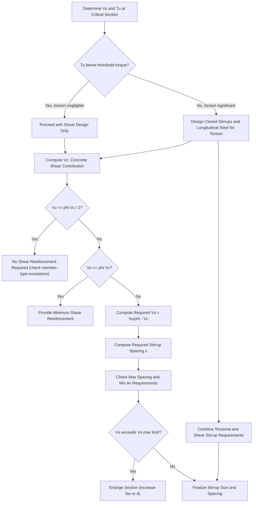

## Shear and Torsion Design

### Overview and Purpose

Shear and torsion design ensures reinforced concrete members can resist diagonal tension stresses (from shear) and combined stresses from twisting (torsion) without brittle, sudden failure. Because shear failure in concrete tends to be **brittle** (occurring with little warning, unlike ductile flexural yielding), shear design is deliberately treated more conservatively than flexural design, with lower strength reduction factors and a design philosophy that aims to ensure flexural failure (ductile) governs over shear failure (brittle) — a principle often called "capacity design" or "shear friendly detailing" in earthquake-resistant design contexts.

### Nature of Shear Failure in Concrete Beams

Shear in a beam produces **diagonal tension stress** (a combination of shear stress and flexural stress) at approximately 45° to the beam axis, because concrete is weak in tension. This diagonal tension can cause **diagonal cracking**, and without adequate reinforcement crossing these cracks, the beam can fail suddenly along this diagonal crack path — a mode distinctly different from and generally less predictable than flexural (bending) failure.

**Shear resisting mechanisms in a cracked reinforced concrete beam:**

1. **Shear resistance of uncracked concrete** in the compression zone above the neutral axis.
2. **Aggregate interlock** across the rough faces of the diagonal crack.
3. **Dowel action** of the longitudinal reinforcement crossing the crack.
4. **Shear reinforcement (stirrups)** crossing the diagonal crack, providing a truss-like tension tie action once diagonal cracking occurs.

### The Basic Shear Design Inequality

$$\phi V_n \geq V_u$$

Where nominal shear strength is the sum of the concrete contribution and the steel (stirrup) contribution:

$$V_n = V_c + V_s$$

$\phi = 0.75$ is the commonly cited strength reduction factor for shear (and torsion) in ACI 318/NSCP-style provisions. [Unverified] The exact $\phi$ value has been consistent at 0.75 across many recent editions, but the governing code edition should always be confirmed.

### Concrete Shear Contribution ($V_c$)

For a typical nonprestressed beam without significant axial load, a widely used simplified expression is:

$$V_c = 0.17\sqrt{f'_c}\, b_w d \quad \text{(SI units, MPa and mm)}$$

or equivalently in some editions expressed as:

$$V_c = \frac{1}{6}\sqrt{f'_c}\, b_w d$$

Where $b_w$ = web width of the beam, $d$ = effective depth.

[Unverified] More refined expressions for $V_c$ exist in various code editions that account for the influence of the longitudinal reinforcement ratio and the moment-to-shear ratio at the section (historically expressed as a function of $\rho_w V_u d / M_u$); the specific formula, its applicable conditions, and whether the simplified or detailed expression governs depends on the code edition in use, so the exact governing formula should be verified against the applicable code.

### Steel (Stirrup) Shear Contribution ($V_s$)

Derived from a **truss analogy**, in which vertical stirrups act as tension "web members" of an idealized truss, with the concrete compression diagonals acting as the "compression members":

$$V_s = \frac{A_v f_{yt} d}{s}$$

Where:

- $A_v$ = area of shear reinforcement within a spacing $s$ (for a two-legged stirrup, $A_v = 2 \times A_b$, where $A_b$ is the area of one stirrup leg)
- $f_{yt}$ = yield strength of the shear reinforcement (transverse reinforcement)
- $d$ = effective depth
- $s$ = center-to-center spacing of stirrups along the member axis

**Maximum $V_s$ limit:** To prevent a brittle shear-compression failure of the concrete diagonal strut before the stirrups can be fully utilized, codes typically impose an upper limit on $V_s$, commonly expressed as a multiple of $\sqrt{f'_c}\, b_w d$ (e.g., a form such as $V_{s,max} = 0.66\sqrt{f'_c}\,b_w d$ in some editions) [Unverified: exact coefficient and applicable conditions vary by code edition].

### Shear Design Procedure (Step-by-Step)

**Step 1: Determine factored shear demand $V_u$ at the critical section**

The critical section for shear design in beams is commonly taken at a distance $d$ from the face of the support (for typical loading and support conditions where the support introduces compression into the end region of the member, allowing the code to permit disregarding the shear demand within that distance for design purposes).

**Step 2: Compute the concrete shear contribution $V_c$**

Using the applicable code formula (simplified or detailed) based on $f'_c$, $b_w$, and $d$.

**Step 3: Determine whether shear reinforcement is required**

$$\text{If } V_u \leq \frac{\phi V_c}{2}: \quad \text{No shear reinforcement required (except in specific member types where minimum shear reinforcement is always mandated regardless)}$$

$$\text{If } \frac{\phi V_c}{2} < V_u \leq \phi V_c: \quad \text{Minimum shear reinforcement required (per code minimum area/spacing provisions)}$$

$$\text{If } V_u > \phi V_c: \quad \text{Shear reinforcement must be designed to resist } V_s = \frac{V_u}{\phi} - V_c$$

**Step 4: Compute required stirrup spacing**

$$s = \frac{A_v f_{yt} d}{V_s}$$

**Step 5: Check maximum spacing limits**

Even where calculated spacing from Step 4 would allow wider spacing, code-mandated maximum spacing limits apply to ensure at least one stirrup crosses any potential diagonal crack (commonly $d/2$ or a fixed maximum such as 600 mm, whichever is smaller, for typical $V_s$ levels; this maximum is reduced further, commonly to $d/4$, when $V_s$ exceeds a specified threshold relative to $\sqrt{f'_c}b_wd$, reflecting the need for closer stirrup spacing under heavier shear demand) [Unverified: exact numerical limits per current governing code edition should be confirmed].

**Step 6: Check minimum shear reinforcement requirements**

Where shear reinforcement is required, a minimum area is mandated regardless of the calculated $A_v$ from Step 4, typically expressed in a form such as:

$$A_{v,min} = 0.062\sqrt{f'_c}\,\frac{b_w s}{f_{yt}} \geq 0.35\frac{b_w s}{f_{yt}} \quad \text{[Unverified: representative form; exact coefficients vary by code edition]}$$

**Step 7: Verify maximum $V_s$ is not exceeded**

Confirm the required $V_s$ from Step 3 does not exceed the code's upper limit on $V_s$ (Step above); if it does, the section must be enlarged (increasing $b_w$ or $d$) since additional stirrups alone cannot resist the excess shear without risking a diagonal-compression (crushing) failure of the concrete strut.

### Worked Example: Stirrup Spacing Design

**Given:** $b_w = 300$ mm, $d = 450$ mm, $f'_c = 21$ MPa, $f_{yt} = 275$ MPa, $V_u = 180$ kN at the critical section, using 10mm diameter two-legged stirrups ($A_v = 2 \times 78.5 = 157$ mm²).

**Step 2 — Concrete contribution:**

$$V_c = 0.17\sqrt{21}(300)(450) = 0.17(4.583)(135,000) = 105,100 \text{ N} = 105.1 \text{ kN}$$

**Step 3 — Determine need for reinforcement:**

$$\phi V_c = 0.75 \times 105.1 = 78.8 \text{ kN}$$

Since $V_u = 180 \text{ kN} > \phi V_c = 78.8 \text{ kN}$, shear reinforcement must be designed.

$$V_s = \frac{V_u}{\phi} - V_c = \frac{180}{0.75} - 105.1 = 240 - 105.1 = 134.9 \text{ kN}$$

**Step 4 — Required spacing:**

$$s = \frac{A_v f_{yt} d}{V_s} = \frac{157 \times 275 \times 450}{134,900} = \frac{19,428,750}{134,900} = 144.0 \text{ mm}$$

**Step 5 — Maximum spacing check:**

$d/2 = 450/2 = 225$ mm. Since the calculated 144 mm is less than the 225 mm maximum, use $s = 140$ mm (rounded down for practical/conservative detailing).

**Step 7 — Verify $V_s$ limit:** A representative $V_{s,max} \approx 0.66\sqrt{21}(300)(450) = 408,000$ N $= 408$ kN, well above the required 134.9 kN — acceptable, no section enlargement needed.

### Torsion in Reinforced Concrete Members

Torsion (twisting moment) occurs in members subject to eccentric loading relative to their shear center, or in members that provide torsional restraint to attached members (e.g., a spandrel beam supporting a slab that frames into it eccentrically, inducing twist in the beam).

**Types of torsion:**

- **Equilibrium (statically determinate) torsion:** The torsional moment is required for the structure's basic equilibrium and cannot be reduced by redistribution (e.g., a cantilevered balcony slab supported on one side by a spandrel beam, where the beam must resist the full torsional moment from the slab's eccentric reaction). This torsion must be designed for at its full computed value.
- **Compatibility (statically indeterminate) torsion:** The torsional moment arises from the compatibility (continuity) requirements of an indeterminate structure, and can be reduced through cracking and redistribution, since the torsionally stressed member can crack and lose significant torsional stiffness while the overall structure redistributes the twisting effect to adjacent, stiffer load paths.

### Threshold for Considering Torsion

Torsional effects can often be neglected if the factored torsional moment $T_u$ is below a specified small fraction of the member's "cracking torque" $T_{cr}$, since torsion below this threshold produces negligible reduction in flexural and shear capacity and does not require explicit torsional reinforcement design:

$$T_u < \phi T_{th} \quad \text{(threshold torque, typically a specified fraction of the cracking torsional moment, e.g., } \phi(0.083\lambda\sqrt{f'_c})\left(\frac{A_{cp}^2}{p_{cp}}\right) \text{ or similar form)}$$

Where $A_{cp}$ is the area enclosed by the outer perimeter of the concrete cross-section, and $p_{cp}$ is that outer perimeter. [Unverified] The exact numerical coefficient and whether compatibility torsion receives a separate, higher (relaxed) threshold than equilibrium torsion varies by code edition; the governing code should be consulted.

### Torsion Design — Thin-Walled Tube / Space Truss Analogy

Once torsion must be explicitly designed for, the concrete section is idealized as a **thin-walled tube**, with torsional shear flow circulating around the perimeter, resisted by:

- **Closed transverse (stirrup) reinforcement**, providing torsional shear resistance analogous to the shear stirrups in the direct-shear truss analogy, but arranged as closed loops (since torsion induces shear flow around the full perimeter, requiring a closed loop rather than an open U-shaped stirrup).
- **Longitudinal reinforcement distributed around the perimeter**, providing the tension chord elements of the idealized space truss resisting the torsional shear flow's longitudinal component.

**Nominal torsional strength (transverse reinforcement):**

$$T_n = \frac{2A_o A_t f_{yt}}{s}\cot\theta$$

Where $A_o$ is the gross area enclosed by the shear flow path (commonly approximated as $0.85A_{oh}$, with $A_{oh}$ the area enclosed by the centerline of the closed transverse torsional reinforcement), $A_t$ is the area of one leg of a closed stirrup, and $\theta$ is the angle of the assumed concrete compression diagonals (commonly taken as 45° in simplified design, i.e., $\cot\theta = 1$, though some code provisions permit a range of $\theta$ values for a more refined space-truss analysis).

**Combined shear and torsion:** Since both shear and torsion induce diagonal cracking and both require transverse (stirrup) reinforcement, the required stirrup area for shear ($A_v$) and for torsion ($A_t$, per leg) are typically computed separately per unit spacing and then combined (added, using appropriate consideration since $A_v$ conventionally refers to the total area of a two-legged stirrup while $A_t$ refers to a single leg of a closed stirrup, so care in combining these must respect this per-leg vs. total-legs distinction) to determine the final total transverse reinforcement required at a given spacing.

### Shear and Torsion Design Workflow

### Shear Truss Analogy — SVG Illustration

<svg xmlns="http://www.w3.org/2000/svg" viewBox="0 0 600 320">
<text x="300" y="25" text-anchor="middle" font-size="16" font-weight="bold" fill="#1a1a1a">Truss Analogy for Shear Resistance (svg_diagram)</text>
<line x1="80" y1="240" x2="520" y2="240" stroke="#2c3e50" stroke-width="4" />
<line x1="80" y1="100" x2="520" y2="100" stroke="#2c3e50" stroke-width="4" />
<text x="80" y="260" font-size="11">Tension chord (longitudinal steel)</text>
<text x="80" y="90" font-size="11">Compression chord (concrete top)</text>
<line x1="140" y1="240" x2="140" y2="100" stroke="#27ae60" stroke-width="3" />
<line x1="220" y1="240" x2="220" y2="100" stroke="#27ae60" stroke-width="3" />
<line x1="300" y1="240" x2="300" y2="100" stroke="#27ae60" stroke-width="3" />
<line x1="380" y1="240" x2="380" y2="100" stroke="#27ae60" stroke-width="3" />
<line x1="460" y1="240" x2="460" y2="100" stroke="#27ae60" stroke-width="3" />
<text x="140" y="270" font-size="10" fill="#27ae60" text-anchor="middle">Stirrup</text>
<text x="140" y="80" font-size="10" fill="#27ae60" text-anchor="middle">(tension tie)</text>
<line x1="140" y1="240" x2="220" y2="100" stroke="#e74c3c" stroke-width="2" stroke-dasharray="5,3" />
<line x1="220" y1="240" x2="300" y2="100" stroke="#e74c3c" stroke-width="2" stroke-dasharray="5,3" />
<line x1="300" y1="240" x2="380" y2="100" stroke="#e74c3c" stroke-width="2" stroke-dasharray="5,3" />
<line x1="380" y1="240" x2="460" y2="100" stroke="#e74c3c" stroke-width="2" stroke-dasharray="5,3" />
<text x="180" y="180" font-size="10" fill="#e74c3c">Concrete</text>
<text x="180" y="195" font-size="10" fill="#e74c3c">compression</text>
<text x="180" y="210" font-size="10" fill="#e74c3c">diagonal (~45deg)</text>
</svg>

### Torsional Shear Flow — SVG Illustration

<svg xmlns="http://www.w3.org/2000/svg" viewBox="0 0 500 320">
<text x="250" y="25" text-anchor="middle" font-size="16" font-weight="bold" fill="#1a1a1a">Torsion: Thin-Walled Tube Idealization (svg_diagram)</text>
<rect x="130" y="70" width="240" height="180" fill="none" stroke="#2c3e50" stroke-width="3" />
<rect x="160" y="100" width="180" height="120" fill="none" stroke="#8e44ad" stroke-width="2" stroke-dasharray="4,2" />
<text x="250" y="90" text-anchor="middle" font-size="11">Outer perimeter (p_cp, A_cp)</text>
<text x="250" y="240" text-anchor="middle" font-size="11" fill="#8e44ad">Shear flow path centerline (A_oh)</text>
<path d="M 160 100 L 340 100" stroke="#e74c3c" stroke-width="2" marker-end="url(#tor1)" />
<path d="M 340 100 L 340 220" stroke="#e74c3c" stroke-width="2" marker-end="url(#tor1)" />
<path d="M 340 220 L 160 220" stroke="#e74c3c" stroke-width="2" marker-end="url(#tor1)" />
<path d="M 160 220 L 160 100" stroke="#e74c3c" stroke-width="2" marker-end="url(#tor1)" />
<text x="250" y="270" text-anchor="middle" font-size="11" fill="#e74c3c">Circulating torsional shear flow q</text>
</svg>

### Shear Design in Slabs and Punching Shear (Two-Way Action)

For two-way slabs and footings supported directly on columns, shear behaves fundamentally differently from the one-way (beam) shear discussed above: **punching shear** (two-way shear) occurs around the perimeter of the column, at a critical section typically located $d/2$ from the column face.

**Punching shear nominal strength** is governed by the smallest (most conservative) of typically three expressions accounting for column aspect ratio, the location of the column relative to slab edges/corners, and the ratio of the critical perimeter to slab depth — reflecting that punching shear capacity does not scale as directly with $\sqrt{f'_c}$ over a simple width-times-depth term the way one-way shear does, since the two-way failure surface and column geometry effects are more complex. [Inference] Given the complexity and code-specific nature of the exact three governing punching-shear equations (which involve the column aspect ratio $\beta_c$ and a location factor $\alpha_s$), detailed numerical coefficients are best treated as a distinct, dedicated topic (Two-Way Slab and Punching Shear Design) rather than summarized briefly here, since presenting incomplete or oversimplified punching-shear formulas risks understating this failure mode's real design complexity.

### Practical Notes and Considerations

- Shear failure's brittle nature is the fundamental reason shear design uses a lower $\phi$ factor (0.75) than tension-controlled flexural design (0.90) and why codes deliberately impose minimum shear reinforcement requirements even where calculated demand is low — the intent is to ensure some reserve ductility and warning capacity even in members not governed by shear in ordinary service conditions.
- The "critical section at distance $d$ from the support face" simplification for shear design is valid only under specific conditions (support reaction introduces compression into the end region, no concentrated load within that distance, and other conditions specified in the governing code); when these conditions are not met (e.g., a beam supported by a hanger/tension connection, or a concentrated load applied close to the support), the critical section must be taken at the face of the support instead.
- [Inference] Torsion design is often the least-covered topic in introductory reinforced concrete design courses relative to its practical importance in specific member types (spandrel beams, eccentrically loaded ledger beams), given its comparative complexity (space-truss analogy, combined-action interaction) relative to direct shear design; students should expect a more abbreviated introductory treatment of torsion compared to the depth typically given to flexure and direct shear.
- All numerical coefficients and threshold values presented here (torsion threshold, $V_s$ maximum, minimum reinforcement formulas) are representative of common ACI 318/NSCP-style provisions but are subject to revision across code editions; final design values must always be confirmed against the specific governing code edition.

**Related Topics**

- Design Philosophy and Limit States
- Flexural Design of Beams and Slabs
- Two-Way Slab Design and Punching Shear
- Development Length and Bar Anchorage
- Seismic Detailing and Capacity Design Principles
- Deep Beams and Strut-and-Tie Modeling
- Combined Loading: Shear-Torsion-Flexure Interaction