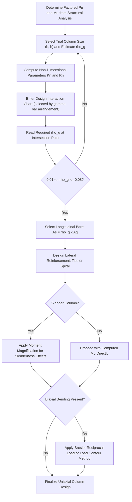

## Column Design Under Axial Load and Bending

### Overview and Purpose

Columns are compression members that typically resist a combination of axial load and bending moment simultaneously, rather than either effect in isolation. This combined loading arises from various sources: eccentricity of applied load, moments transferred from beams framing into the column at rigid joints, unbalanced loading patterns, or lateral loads (wind, seismic). Column design fundamentally differs from beam flexural design because the interaction between axial force and moment capacity is not independent — increasing axial load can either increase or decrease a column's moment capacity, depending on where the section lies on its strength interaction relationship.

### Types of Columns by Reinforcement

| Column Type | Lateral Reinforcement | Typical $\phi$ (Compression-Controlled) |
| --- | --- | --- |
| Tied column | Discrete closed ties at intervals | 0.65 |
| Spiral column | Continuous helical spiral | 0.75 |
| Composite column | Structural steel shape encased in concrete, or concrete-filled steel tube | Varies by code provision |

**Spiral columns** generally exhibit more ductile post-peak behavior than tied columns because the continuous spiral provides ongoing confinement to the core concrete even after the concrete shell (cover) spalls off at high load, allowing gradual rather than sudden strength loss — this is the basis for the higher $\phi$ factor assigned to spiral columns.

### Types of Columns by Loading Condition

- **Axially loaded columns (concentric loading):** Load applied at (or very near) the geometric centroid, producing primarily uniform axial compression. True concentric loading is rare in practice; even nominally "axial" columns are designed with a minimum eccentricity requirement to account for unavoidable construction imperfections and unintended eccentricities.
- **Uniaxial bending columns:** Axial load combined with bending about one principal axis (common for edge/exterior columns receiving unbalanced moment from one direction of framing).
- **Biaxial bending columns:** Axial load combined with bending about both principal axes simultaneously (common for corner columns receiving moments from beams framing in from two perpendicular directions).

### Nominal Axial Load Capacity (Pure Compression, Upper Bound)

The theoretical maximum nominal axial capacity, assuming uniform strain across the section at $\varepsilon_{cu} = 0.003$ with all steel at yield in compression, is:

$$P_o = 0.85f'_c(A_g - A_{st}) + f_y A_{st}$$

Where $A_g$ = gross cross-sectional area of the column, $A_{st}$ = total area of longitudinal reinforcement.

**Code-imposed maximum axial capacity:** Since true concentric axial loading without any eccentricity is unrealistic, codes limit the maximum usable nominal axial capacity to a fraction of $P_o$, explicitly building in an allowance for accidental/minimum eccentricity:

$$P_{n,max} = 0.80P_o \quad \text{(tied columns)}$$

$$P_{n,max} = 0.85P_o \quad \text{(spiral columns)}$$

[Unverified] These specific coefficients (0.80 and 0.85) are widely and consistently cited across many ACI 318/NSCP-style editions, but the exact values should be confirmed against the specific governing code edition for final design use.

### Longitudinal Reinforcement Limits

$$\rho_g = \frac{A_{st}}{A_g}$$

0.01 \leq \rho_g \leq 0.08 \quad \text{(commonly cited limits: 1% minimum, 8% maximum)}

**Rationale for minimum $\rho_g$ (typically 1%):** Ensures the column has adequate resistance to bending moments that may not be fully captured by the nominal design calculations (creep effects transferring load from concrete to steel over time, accidental eccentricity, and providing a minimum level of ductility and toughness).

**Rationale for maximum $\rho_g$ (typically 8%, though practical designs rarely approach this):** Guards against excessive reinforcement congestion, which impairs proper concrete placement and consolidation around bars, and which can create practical difficulty at lap splice locations (where bar areas effectively double locally).

[Unverified] The exact numerical minimum/maximum values (1% and 8%) are commonly and consistently cited, but should be confirmed against the specific governing code edition, as should the minimum number of longitudinal bars required (commonly 4 for rectangular tied columns, 6 for spiral columns) [Unverified: exact minimum bar count requirements per code edition].

### The Axial Load-Moment (P-M) Interaction Diagram

Because a column's moment capacity depends on the simultaneous axial load level, column design uses an **interaction diagram** — a plot of nominal axial capacity $P_n$ (vertical axis) versus nominal moment capacity $M_n$ (horizontal axis) — that traces out all possible combinations of $(P_n, M_n)$ the column cross-section can resist, generated by varying the assumed position of the neutral axis from pure compression (top of the diagram) through pure bending/tension (bottom).

**Key points on the interaction diagram:**

| Point | Condition | Description |
| --- | --- | --- |
| Pure axial compression | $c \to \infty$ (or beyond the section) | $P_n = P_{n,max}$, $M_n = 0$ |
| Balanced point | $\varepsilon_s = \varepsilon_y$ at same instant as $\varepsilon_c = 0.003$ | Both $P_b$ and $M_b$ at their balanced values; separates compression-controlled and tension-controlled regions |
| Pure bending | $P_n = 0$ | Column behaves as a beam; $M_n$ equals the flexural capacity computed by standard beam flexural theory |
| Pure axial tension | $c \to -\infty$ (or fully in tension) | $P_n = -A_{st}f_y$ (all steel in tension, no concrete contribution) |

**Compression-controlled region (above the balanced point):** As axial load increases above the balanced load $P_b$, moment capacity generally decreases — concrete crushes before steel yields, giving brittle behavior. This region uses the lower $\phi$ factor (0.65 tied / 0.75 spiral).

**Tension-controlled region (below the balanced point):** As axial load decreases below $P_b$, the section behaves more like a beam, with steel yielding before concrete crushes, giving ductile behavior. This region transitions to the higher $\phi$ factor (0.90) as axial load approaches zero, following the same transition-zone interpolation logic used in beam flexural design.

### Construction of a Point on the Interaction Diagram (Strain Compatibility Approach)

**Step 1: Assume a neutral axis depth $c$**

**Step 2: Compute strain in each layer of reinforcement using similar triangles**, based on the linear strain distribution with $\varepsilon_{cu} = 0.003$ at the extreme compression fiber:

$$\varepsilon_{si} = 0.003\left(\frac{c - d_i}{c}\right)$$

where $d_i$ is the distance from the extreme compression fiber to reinforcement layer $i$ (positive $\varepsilon_{si}$ indicates compression if $d_i < c$, negative/tension if $d_i > c$).

**Step 3: Compute stress in each reinforcement layer**, capped at yield:

$$f_{si} = E_s \varepsilon_{si}, \quad -f_y \leq f_{si} \leq f_y$$

**Step 4: Compute the concrete compression force** using the equivalent rectangular stress block:

$$C_c = 0.85f'_c \cdot a \cdot b, \quad a = \beta_1 c$$

(with a reduction subtracted for the area of any compression steel layer displaced by/embedded within the compression stress block, since that concrete area does not independently contribute the full $0.85f'_c$ stress if already accounted for via the steel stress term)

**Step 5: Sum forces for $P_n$ and take moments about the centroid for $M_n$**

$$P_n = C_c + \sum A_{si}f_{si}$$

$$M_n = C_c\left(\frac{h}{2} - \frac{a}{2}\right) + \sum A_{si}f_{si}\left(\frac{h}{2} - d_i\right)$$

**Step 6: Repeat for a range of assumed $c$ values**, plotting the resulting $(P_n, M_n)$ pairs to trace the full interaction curve.

### P-M Interaction Diagram — SVG Illustration

<svg xmlns="http://www.w3.org/2000/svg" viewBox="0 0 560 400">
<text x="280" y="25" text-anchor="middle" font-size="16" font-weight="bold" fill="#1a1a1a">Column P-M Interaction Diagram (svg_diagram)</text>
<line x1="80" y1="350" x2="80" y2="60" stroke="#2c3e50" stroke-width="2" />
<line x1="80" y1="350" x2="480" y2="350" stroke="#2c3e50" stroke-width="2" />
<text x="40" y="70" font-size="12">Pn</text>
<text x="470" y="375" font-size="12">Mn</text>
<path d="M 80 70 Q 200 75 280 130 Q 350 200 380 280 Q 400 320 420 350" fill="none" stroke="#2980b9" stroke-width="3" />
<path d="M 80 350 L 80 400" stroke="#2980b9" stroke-width="1" opacity="0" />
<circle cx="80" cy="70" r="5" fill="#c0392b" />
<text x="100" y="65" font-size="11" fill="#c0392b">Pure Compression (Pn,max)</text>
<circle cx="280" cy="130" r="6" fill="#e67e22" />
<text x="290" y="120" font-size="11" fill="#e67e22">Balanced Point (Pb, Mb)</text>
<circle cx="420" cy="350" r="5" fill="#27ae60" />
<text x="330" y="340" font-size="11" fill="#27ae60">Pure Bending (Pn=0)</text>
<line x1="80" y1="130" x2="480" y2="130" stroke="#95a5a6" stroke-width="1" stroke-dasharray="4,2" />
<text x="440" y="125" font-size="10" fill="#95a5a6">Balanced Pn level</text>

<text x="150" y="105" font-size="11" fill="`#8e44ad`">Compression-controlled</text>

<text x="150" y="115" font-size="10" fill="`#8e44ad`">(phi = 0.65 tied / 0.75 spiral)</text>

<text x="330" y="280" font-size="11" fill="`#16a085`">Tension-controlled</text>

<text x="330" y="290" font-size="10" fill="`#16a085`">(phi transitions to 0.90)</text>

<path d="M 80 200 L 60 220 L 80 240 L 60 260" stroke="#7f8c8d" stroke-width="1" fill="none" />
<text x="30" y="230" font-size="9" fill="#7f8c8d" transform="rotate(-90 30 230)">Pn = -Ast fy (tension)</text>
</svg>

### Design Interaction Diagram (With $\phi$ Applied)

In practice, engineers typically use **design interaction diagrams** (published in code handbooks or generated by software) that already incorporate:

- The applicable $\phi$ factor (varying continuously through the transition zone between compression-controlled and tension-controlled regions)
- The $P_{n,max}$ cap (a horizontal cutoff line near the top of the diagram)
- Non-dimensionalized axes (commonly $\frac{\phi P_n}{f'_c A_g}$ vs. $\frac{\phi M_n}{f'_c A_g h}$, or similar), allowing a single family of standardized charts (parameterized by reinforcement ratio $\rho_g$ and reinforcement layout, e.g., bars on 2 faces vs. bars distributed around the perimeter, and by the ratio $\gamma = $ distance between outer bar layers / column dimension) to be used for a wide range of actual column sizes and material strengths.

**Using a design chart:** Given factored $P_u$ and $M_u$, compute the non-dimensional load parameters, locate the corresponding point on the appropriate chart (selected based on $\gamma$ and bar arrangement), and read off the required reinforcement ratio $\rho_g$ directly, or verify that a trial $\rho_g$ provides adequate capacity (point falls inside/on the interaction curve).

### Column Design Procedure (Step-by-Step, Uniaxial Bending)

**Step 1: Determine factored loads $P_u$ and $M_u$** from structural analysis (typically the governing combination among several load cases, since wind/seismic combinations may govern over gravity-only combinations for exterior/corner columns).

**Step 2: Select a trial column size** based on preliminary estimates (axial load alone, or architectural/story-height constraints), often starting with an assumed reinforcement ratio (e.g., $\rho_g \approx 0.02$) for initial sizing.

**Step 3: Compute non-dimensional design parameters**

$$K_n = \frac{P_u}{\phi f'_c A_g}, \quad R_n = \frac{M_u}{\phi f'_c A_g h}$$

**Step 4: Enter the appropriate design interaction chart** (selected by $\gamma$ ratio and bar arrangement) and locate the required reinforcement ratio $\rho_g$ at the intersection of $K_n$ and $R_n$.

**Step 5: Check reinforcement limits** ($0.01 \leq \rho_g \leq 0.08$); if outside limits, revise the trial section size.

**Step 6: Select and detail longitudinal bars** to provide at least the required $A_{st} = \rho_g A_g$, distributed per the assumed bar arrangement (commonly symmetric about both axes for typical rectangular tied columns).

**Step 7: Design lateral reinforcement** (ties or spiral) per code spacing and size requirements (addressed as a related, dedicated topic — Column Confinement and Tie/Spiral Detailing).

**Step 8: Check slenderness effects**, determining whether the column qualifies as "short" (slenderness effects negligible) or "slender" (requiring moment magnification, addressed as a related, dedicated topic — Slenderness Effects in Columns).

### Biaxial Bending — Approximate Design Methods

For columns subject to bending about both principal axes simultaneously (common for corner columns), exact analysis requires generating a full three-dimensional interaction surface. Two widely used approximate methods simplify this:

**Bresler Reciprocal Load Method:**

$$\frac{1}{P_{ni}} \approx \frac{1}{P_{nx}} + \frac{1}{P_{ny}} - \frac{1}{P_o}$$

Where $P_{nx}$ is the nominal axial capacity for the given eccentricity $e_y$ acting alone (uniaxial bending about the x-axis), $P_{ny}$ is the nominal capacity for the given eccentricity $e_x$ acting alone (uniaxial bending about the y-axis), and $P_o$ is the pure axial capacity (no eccentricity, as defined earlier).

[Unverified] This formula is known to become less accurate (less conservative, potentially overestimating capacity) for cases of small axial load combined with significant biaxial moment (approaching pure biaxial bending); code commentary and textbooks typically note this limitation and may recommend the alternative Bresler Load Contour Method or a full three-dimensional interaction analysis for such cases.

**Bresler Load Contour Method:** Expresses the biaxial interaction as a contour equation at a constant axial load level:

$$\left(\frac{M_{ux}}{M_{nx0}}\right)^{\alpha_1} + \left(\frac{M_{uy}}{M_{ny0}}\right)^{\alpha_2} \leq 1.0$$

Where $M_{nx0}$ and $M_{ny0}$ are the uniaxial moment capacities about each axis at the given axial load level (with no moment about the other axis), and $\alpha_1$, $\alpha_2$ are exponents (often both taken as approximately 1.5 to 2.0 for typical rectangular tied column cross-sections, though the appropriate value is influenced by cross-section shape and reinforcement distribution) [Unverified: exact exponent value depends on specific section and is not a single fixed universal constant].

### Column Interaction and Design Workflow

### Comparison: Column vs. Beam Design Philosophy

| Aspect | Beam Flexural Design | Column Design |
| --- | --- | --- |
| Primary loading | Moment (axial force typically negligible) | Combined axial force and moment (interdependent) |
| Design tool | Direct flexural design equation | Interaction diagram (P-M chart) |
| Governing $\phi$ range | Fixed at 0.90 for typical tension-controlled beams | Varies continuously from 0.65/0.75 (compression-controlled) to 0.90 (tension-controlled) |
| Ductility emphasis | Achieved via reinforcement ratio limits ($\rho_{max}$) | Achieved via spiral confinement, minimum reinforcement, and capacity-design principles in seismic regions |
| Failure consequence philosophy | Individual member failure often more locally contained | Column failure often more critical to overall structural stability (potential for progressive/story collapse), warranting extra conservatism |

### Practical Notes and Considerations

- [Inference] Because column failure can be more consequential to overall structural stability than an individual beam failure (a column supports the load path for everything above it, and columns are typically less redundant than beams within a framing system), design practice and code philosophy generally treat columns more conservatively than beams — reflected in the "strong column-weak beam" capacity design philosophy commonly required in seismic design, which deliberately proportions columns to remain elastic (or nearly so) while beams are permitted to form ductile plastic hinges under extreme seismic demand.
- Minimum eccentricity provisions (built into the $P_{n,max}$ cap of $0.80P_o$ or $0.85P_o$) exist specifically because truly concentric axial loading is not achievable in real construction due to unavoidable dimensional tolerances, load path uncertainties, and minor construction imperfections; a column designed with zero explicit moment still receives an implicit minimum moment allowance through this capacity reduction.
- Design interaction charts are specific to a particular combination of material strengths, $\gamma$ ratio, and bar arrangement; using a chart that does not match the actual column's parameters (wrong $\gamma$, wrong bar layout assumption) introduces error, so chart selection must be verified as appropriate for the specific column being designed.
- All numerical coefficients presented here (0.80/0.85 for $P_{n,max}$, 1%/8% reinforcement limits, Bresler exponents) are representative and widely cited but subject to variation across code editions; the specific governing code edition should be the final authority for actual design work.

**Related Topics**

- Design Philosophy and Limit States
- Flexural Design of Beams and Slabs
- Slenderness Effects in Columns (Moment Magnification Method)
- Column Confinement and Tie/Spiral Detailing
- Biaxial Bending — Bresler Methods in Detail
- Seismic Detailing and Strong Column-Weak Beam Philosophy
- Footing and Foundation Design Under Combined Axial-Moment Loading