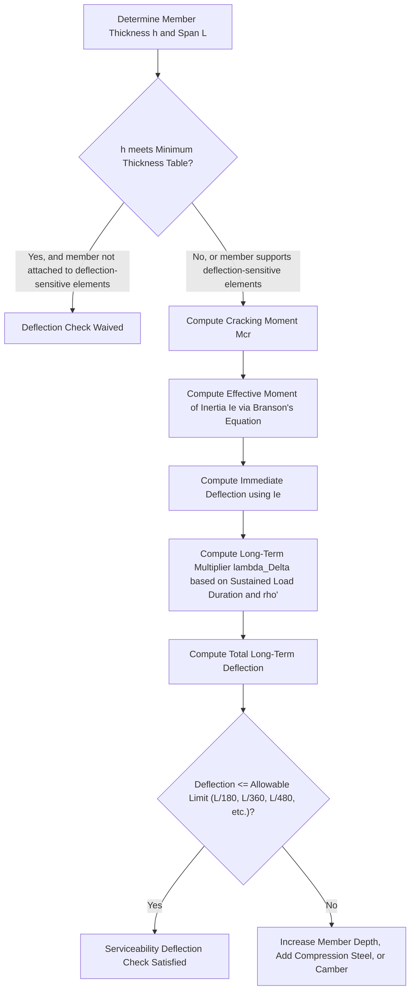

## Serviceability: Deflection and Crack Control

### Overview and Purpose

Serviceability limit states govern the performance of reinforced concrete members under everyday **service (unfactored) loads**, ensuring the structure remains functional, comfortable, and durable throughout its service life, even though it may retain substantial reserve strength beyond service load levels. Unlike strength limit states (which use factored loads and address collapse prevention), serviceability checks use actual, unfactored loads and address deflection, cracking, and related performance issues that affect appearance, function, and long-term durability rather than immediate safety.

### Why Serviceability Requires Separate Consideration

Reinforced concrete's behavior under service loads differs fundamentally from its behavior at ultimate (factored-load) conditions:

- At service loads, concrete sections are typically **cracked in the tension zone** (since concrete's tensile strength is low and is exceeded early in the loading history for most flexural members), but reinforcement stresses remain well below yield, and the member behaves in a substantially linear (though cracked-section) manner.
- **Time-dependent effects** (creep and shrinkage of concrete) cause deflections to increase progressively over the life of the structure, well beyond the immediate (instantaneous) elastic deflection computed from a single load application — an effect entirely absent from ultimate strength calculations.
- Concrete's actual tensile cracking behavior (crack width, crack spacing) depends on reinforcement detailing parameters (bar size, spacing, cover) that do not directly appear in ultimate flexural strength equations, requiring separate serviceability-specific design checks.

### Deflection Control — Two Approaches

**Approach 1: Minimum Thickness Tables (Deflection Check Waived)**

Most concrete design codes provide tables of minimum member thickness (as a function of span length and support/continuity condition) below which deflection calculations may be waived entirely for members not supporting or attached to construction likely to be damaged by large deflections.

**Representative minimum thickness values** (as a fraction of span $L$, for normal-weight concrete and $f_y = 420$ MPa reinforcement — illustrative values, commonly cited pattern):

| Member and Support Condition | Minimum Thickness (h) |
| --- | --- |
| Simply supported | $L/20$ |
| One end continuous | $L/24$ |
| Both ends continuous | $L/28$ |
| Cantilever | $L/10$ |

[Unverified] These specific fractional coefficients are widely and consistently cited across ACI 318/NSCP-style provisions for solid one-way slabs and beams under specified conditions (normal-weight concrete, $f_y = 420$ MPa, members not supporting elements likely to be damaged by deflection); however, exact table values, applicable member types (beams vs. slabs, ribbed/waffle systems), and correction factors for other reinforcement yield strengths or lightweight concrete vary by code edition, so the exact governing table should be verified.

**Approach 2: Direct Deflection Computation**

When the minimum thickness table does not apply (member thickness is less than the tabulated minimum, or the member supports/is attached to construction sensitive to deflection), deflection must be computed directly and compared against code-specified allowable limits.

### Immediate (Instantaneous) Deflection

Immediate deflection is computed using standard elastic beam deflection formulas, but with an **effective moment of inertia** ($I_e$) that accounts for the reduction in stiffness caused by tension cracking, rather than the full gross (uncracked) moment of inertia $I_g$.

**Effective Moment of Inertia (Branson's Equation — widely used historical formulation):**

$$I_e = \left(\frac{M_{cr}}{M_a}\right)^3 I_g + \left[1 - \left(\frac{M_{cr}}{M_a}\right)^3\right]I_{cr} \leq I_g$$

Where:

- $M_{cr}$ = cracking moment of the section
- $M_a$ = maximum service (unfactored) moment in the member at the load stage for which deflection is being computed
- $I_g$ = gross moment of inertia of the uncracked section
- $I_{cr}$ = moment of inertia of the fully cracked, transformed section

**Cracking moment:**

$$M_{cr} = \frac{f_r I_g}{y_t}$$

Where $f_r$ is the modulus of rupture of concrete (commonly $f_r = 0.62\lambda\sqrt{f'_c}$ in SI/MPa units, where $\lambda$ is a modification factor for lightweight concrete, $\lambda = 1.0$ for normal-weight), and $y_t$ is the distance from the neutral axis of the uncracked (gross) section to the extreme tension fiber.

[Unverified] Branson's equation has been the historically dominant and widely taught method for computing $I_e$; more recent code editions have introduced or transitioned toward alternative effective-stiffness formulations in some cases, so the specific formula and its applicability (particularly for continuous/indeterminate members, where $I_e$ may need to be computed as a weighted average along the span) should be verified against the governing code edition and specific member configuration.

### Long-Term (Time-Dependent) Deflection — Creep and Shrinkage

Sustained loads cause concrete to continue deforming over time due to **creep** (time-dependent deformation under sustained stress) and **shrinkage** (volume reduction due to moisture loss), both of which increase deflection well beyond the immediate elastic value.

**Additional long-term deflection multiplier:**

$$\lambda_{\Delta} = \frac{\xi}{1 + 50\rho'}$$

Where:

- $\xi$ = time-dependent factor for sustained load duration (commonly tabulated: e.g., $\xi = 1.0$ at 3 months, $\xi = 1.2$ at 6 months, $\xi = 1.4$ at 12 months, $\xi = 2.0$ at 5 years or more) [Unverified: exact tabulated values vary somewhat among code editions and references]
- $\rho'$ = compression reinforcement ratio at midspan (for simple/continuous spans) or at the support (for cantilevers), reflecting the fact that compression reinforcement helps restrain long-term creep-related deflection increase

**Total long-term deflection:**

$$\Delta_{long-term} = \lambda_\Delta \times \Delta_{immediate, sustained} + \Delta_{immediate, additional \, live \, load}$$

The total long-term deflection is typically computed as the long-term multiplier applied to the portion of immediate deflection caused by sustained (typically dead plus a sustained portion of live) load, plus the immediate deflection increment from any additional (non-sustained, transient) live load applied afterward.

### Allowable Deflection Limits (Representative Values)

| Member Type / Condition | Deflection to be Considered | Deflection Limit |
| --- | --- | --- |
| Flat roofs not supporting/attached to elements likely to be damaged by large deflections | Immediate deflection due to live load $L$ | $L_{span}/180$ |
| Floors not supporting/attached to elements likely to be damaged by large deflections | Immediate deflection due to live load $L$ | $L_{span}/360$ |
| Roof or floor supporting/attached to non-structural elements likely to be damaged by large deflections | That part of total deflection occurring after attachment of non-structural elements (sum of long-term deflection due to sustained load and immediate deflection due to additional live load) | $L_{span}/480$ |
| Roof or floor supporting/attached to non-structural elements not likely to be damaged by large deflections | Same as above | $L_{span}/240$ |

[Unverified] These specific deflection limit fractions ($L/180$, $L/360$, $L/480$, $L/240$) are widely and consistently cited across ACI 318/NSCP-style provisions, but the exact applicable conditions and any additional footnoted exceptions should be confirmed against the governing code edition.

### Deflection Control Workflow

### Effective Moment of Inertia Concept — SVG Illustration

<svg xmlns="http://www.w3.org/2000/svg" viewBox="0 0 560 320">
<text x="280" y="25" text-anchor="middle" font-size="16" font-weight="bold" fill="#1a1a1a">Effective Moment of Inertia Transition (svg_diagram)</text>
<line x1="70" y1="270" x2="500" y2="270" stroke="#2c3e50" stroke-width="2" />
<line x1="70" y1="270" x2="70" y2="60" stroke="#2c3e50" stroke-width="2" />
<text x="30" y="70" font-size="12">I</text>
<text x="490" y="295" font-size="12">Ma</text>
<line x1="70" y1="90" x2="500" y2="90" stroke="#2980b9" stroke-width="2" stroke-dasharray="4,2" />
<text x="410" y="85" font-size="11" fill="#2980b9">Ig (uncracked)</text>
<line x1="70" y1="220" x2="500" y2="220" stroke="#c0392b" stroke-width="2" stroke-dasharray="4,2" />
<text x="410" y="240" font-size="11" fill="#c0392b">Icr (fully cracked)</text>
<path d="M 70 90 L 150 92 Q 200 130 260 190 Q 350 215 500 219" fill="none" stroke="#27ae60" stroke-width="3" />
<text x="200" y="165" font-size="11" fill="#27ae60">Ie (Branson's transition)</text>
<line x1="150" y1="270" x2="150" y2="92" stroke="#7f8c8d" stroke-width="1" stroke-dasharray="2,2" />
<text x="150" y="290" text-anchor="middle" font-size="10">Mcr</text>
</svg>

### Crack Control — Purpose and Mechanism

Cracking in reinforced concrete flexural members is expected and normal at service loads (since concrete's tensile strength is intentionally neglected in strength design, reflecting the reality that concrete cracks well before reaching its ultimate flexural capacity). Crack control provisions do not aim to prevent cracking entirely, but rather to ensure cracks remain **fine and well-distributed** rather than few and wide, for two primary reasons:

1. **Corrosion protection:** Wide cracks provide easier pathways for moisture, chlorides, and carbon dioxide to reach the reinforcement, accelerating corrosion-related durability deterioration.
2. **Appearance and perception of safety:** Wide, visible cracks can cause occupant concern about structural adequacy even when the member remains structurally safe, and can be aesthetically objectionable in exposed concrete.

### Crack Control — Reinforcement Distribution Approach

Modern code provisions (many current ACI 318/NSCP-style editions) control cracking indirectly by limiting the **spacing** of tension reinforcement closest to the tension face, rather than requiring a direct computed crack-width check for most ordinary members:

$$s \leq 380\left(\frac{280}{f_s}\right) - 2.5c_c$$

$$s \leq 300\left(\frac{280}{f_s}\right)$$

(governing, whichever is smaller), where $f_s$ is the calculated service-load stress in the reinforcement nearest the tension face (commonly approximated as $\frac{2}{3}f_y$ for simplified design in lieu of a direct calculation), and $c_c$ is the clear cover to the nearest surface of the tension reinforcement.

[Unverified] The exact numerical coefficients (380, 2.5, 300) in this spacing-based crack control provision, and the specific approximation used for $f_s$, have been introduced and refined across specific ACI 318 editions and correspondingly adopted NSCP editions; earlier code approaches used a direct computed crack-width formula (the Gergely-Lutz equation) rather than this spacing-limitation approach, so the governing code edition should be consulted to confirm which approach and exact coefficients currently apply.

### Historical Approach: Direct Crack Width Calculation (Gergely-Lutz Equation)

Some earlier code provisions and some current alternative/supplementary references still reference a direct crack-width estimate:

$$w = 0.076\beta f_s\sqrt[3]{d_c A}$$

Where $w$ is the estimated maximum crack width (in units consistent with the empirical coefficient, historically often in units of $10^{-3}$ in.), $\beta$ is the ratio of distances from the neutral axis to the tension face and to the centroid of the tension reinforcement, $d_c$ is the concrete cover measured to the center of the nearest reinforcing bar, and $A$ is the effective tension area of concrete surrounding one bar divided by the number of bars.

[Unverified] This Gergely-Lutz-type empirical crack-width formula, and its exact coefficient and unit conventions, reflect a historically significant approach in earlier code editions; whether a given current governing code edition still references this direct-calculation method (versus relying exclusively on the spacing-limitation approach above) should be confirmed against that specific code.

### Factors Influencing Crack Width and Spacing

- **Reinforcement stress at service load ($f_s$):** Higher steel stress at service load generally correlates with wider cracks, since crack width is fundamentally related to the elongation (strain) of the reinforcement crossing the crack.
- **Bar size and spacing:** For a given total reinforcement area, using a larger number of smaller-diameter bars, more closely spaced, produces finer, more closely spaced cracks than using fewer large-diameter bars — this is the underlying reason spacing-based crack control provisions specifically target bar spacing near the tension face.
- **Concrete cover:** Greater cover generally increases crack width at the concrete surface for a given reinforcement stress and bar arrangement (since the crack must widen more, further from the reinforcement, to reach the surface), which is why cover appears explicitly (with a negative-influence coefficient) in the spacing-limitation formula above.

### Skin Reinforcement for Deep Beams (Additional Crack Control Provision)

For beams and joists with an overall depth exceeding a specified threshold (a commonly cited value being approximately 900 mm, though this should be verified against the governing code), **longitudinal skin reinforcement** is required along the side faces of the web, distributed over a portion of the member's depth, to control cracking in the region between the main tension reinforcement and the neutral axis — a region not directly addressed by the primary flexural crack-control spacing provision, since that provision governs only the reinforcement closest to the tension face.

### Comparison: Deflection vs. Crack Control Serviceability Checks

| Aspect | Deflection Control | Crack Control |
| --- | --- | --- |
| Primary concern | Functional/aesthetic performance, damage to attached non-structural elements | Durability (corrosion protection), appearance |
| Time dependency | Explicitly time-dependent (immediate + long-term creep/shrinkage) | Primarily assessed at service load (though corrosion effects are inherently long-term consequences of inadequate initial crack control) |
| Primary code mechanism | Minimum thickness tables (simplified) or direct $I_e$-based computation (detailed) | Reinforcement spacing limitation (simplified, most current codes) or direct crack-width formula (historical/alternative) |
| Key material/section parameters | $I_g$, $I_{cr}$, $M_{cr}$, creep/shrinkage multiplier | Bar spacing, cover, service-load steel stress $f_s$ |

### Practical Notes and Considerations

- Minimum thickness tables are a deliberately conservative simplification intended to avoid the need for explicit deflection computation in the great majority of ordinary, regularly proportioned members; when architectural or economic pressures push toward thinner members than the table would allow, direct computation (with its associated additional engineering time and the added uncertainty inherent in creep/shrinkage prediction) becomes necessary.
- [Inference] Long-term deflection prediction via the creep/shrinkage multiplier approach carries inherent uncertainty, since actual creep and shrinkage behavior depends on factors not fully captured by the simplified multiplier (ambient humidity, curing conditions, actual concrete mix proportions, and age at loading); the code-prescribed multiplier values are intended as reasonable design estimates rather than precise predictions of actual field behavior, and actual measured deflections in service may differ from the calculated design values.
- Crack control provisions using the reinforcement spacing approach are indirect (controlling a proxy variable — spacing — rather than directly computing crack width), reflecting the practical reality that crack width prediction has substantial inherent scatter even under controlled laboratory conditions; the code's intent is reasonable, practical protection against unacceptably wide cracking rather than a precise crack-width guarantee.
- All numerical coefficients presented here (minimum thickness fractions, deflection limit fractions, crack-control spacing coefficients, skin reinforcement depth threshold) are representative of widely cited ACI 318/NSCP-style provisions but are subject to revision across code editions; the specific governing code edition for a given course, jurisdiction, or project should always be the final authority for exact current values.

**Related Topics**

- Design Philosophy and Limit States
- Flexural Design of Beams and Slabs
- Material Properties of Concrete: Creep, Shrinkage, and Modulus of Rupture
- Development Length and Bar Anchorage
- Two-Way Slab Deflection Considerations
- Durability Design and Reinforcement Corrosion Protection
- Long-Term Structural Health Monitoring of Concrete Members