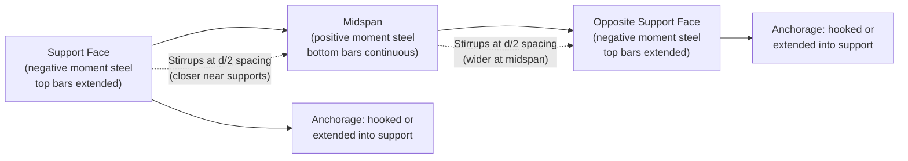

## Detailing Requirements

### Overview

Detailing requirements govern how reinforcement is physically arranged, sized, bent, spliced, anchored, and spaced within a reinforced concrete member so that the member can actually achieve the strength and ductility assumed in design calculations. Structural analysis determines *how much* steel is needed at a section; detailing determines *how that steel is placed and made continuous* so load paths are not interrupted. Poor detailing is one of the most common causes of premature failure even when flexural and shear design calculations are correct.

Detailing provisions are codified primarily in **ACI 318** (Chapter 25 in ACI 318-19, covering development, splices, and spacing) and in **IS 456 / IS 13920** (ductile detailing for seismic zones) internationally. This entry follows ACI 318 conventions with cross-references to IS 456 where numerical constants differ.

---

### Core Objectives of Detailing

- **Anchorage**: Ensure bars can transfer force to concrete via bond over a sufficient length before the bar is required to be fully stressed.
- **Continuity**: Maintain a continuous, calculable load path across splices, joints, and discontinuities.
- **Ductility**: Confine concrete and restrain compression bars so the member can undergo inelastic deformation without brittle failure (critical in seismic design).
- **Crack control**: Limit bar spacing so flexural cracks remain fine and well-distributed.
- **Constructability**: Ensure bars can physically fit, be placed, and be consolidated with concrete around them (this is why minimum spacing and cover rules exist, not just structural rules).

---

### Concrete Cover Requirements

Cover is the clear distance from the concrete surface to the nearest surface of the reinforcement.

**Functions of cover:**

- Corrosion protection (durability)
- Fire resistance (insulates steel from heat)
- Bond development (adequate concrete surrounding the bar for stress transfer)

**Typical ACI 318 minimum cover (cast-in-place, non-prestressed):**

| Exposure Condition | Member | Minimum Cover |
| --- | --- | --- |
| Cast against and permanently in contact with earth | Any | 75 mm (3 in) |
| Exposed to weather or earth | #6–#18 bars | 50 mm (2 in) |
| Exposed to weather or earth | #5 bar and smaller | 40 mm (1.5 in) |
| Not exposed to weather/earth | Slabs, walls, joists | 20 mm (0.75 in) |
| Not exposed to weather/earth | Beams, columns (primary reinforcement) | 40 mm (1.5 in) |

[Unverified] — exact cover values vary by code edition and exposure class (e.g., ACI 318-19 Table 20.6.1.3.1 vs. earlier editions); the project's governing code edition should always be checked directly.

---

### Bar Spacing Requirements

**Minimum clear spacing** between parallel bars in a layer (ACI 318):

$$s_{min} = \max(d_b,\ 25\ \text{mm},\ \frac{4}{3}d_{agg})$$

where $d_b$ is the bar diameter and $d_{agg}$ is the nominal maximum aggregate size.

**Maximum spacing** is governed by crack control (ACI 318 §24.3):

$$s = \min\left(380\left(\frac{280}{f_s}\right) - 2.5c_c,\ 300\left(\frac{280}{f_s}\right)\right)$$

where $f_s$ is the calculated stress in reinforcement at service load (may be taken as $\frac{2}{3}f_y$) and $c_c$ is the clear cover to the nearest tension bar.

**Key Points**

- Bars placed too close together prevent aggregate from passing through, causing honeycombing.
- Bars placed too far apart allow wide surface cracks between bars.
- For bars in two or more layers, vertical clear spacing must be at least 25 mm, and bars in upper layers should be placed directly above bars in the layer below (not staggered).

---

### Development Length

Development length ($l_d$) is the embedment length required for a bar to develop its full yield strength through bond before the section of peak stress, without pulling out or splitting the concrete.

**Simplified ACI 318 expression for deformed bars in tension** (§25.4.2):

$$l_d = \left(\frac{f_y \psi_t \psi_e \psi_s}{1.1 \lambda \sqrt{f'_c}} \cdot \frac{1}{\left(\frac{c_b + K_{tr}}{d_b}\right)}\right) d_b$$

Where:

- $\psi_t$ = casting position factor (top bars with >300 mm concrete cast below: 1.3)
- $\psi_e$ = epoxy-coating factor (1.2–1.5)
- $\psi_s$ = bar size factor (0.8 for #6 and smaller)
- $\lambda$ = lightweight concrete factor
- $c_b$ = spacing or cover dimension
- $K_{tr}$ = transverse reinforcement index (may conservatively be taken as 0)

The term $\frac{c_b + K_{tr}}{d_b}$ is capped at 2.5.

**Development length in compression** is shorter (no tension-splitting concern):

$$l_{dc} = \frac{f_y d_b}{4\lambda\sqrt{f'_c}} \geq 0.043 f_y d_b$$

**Standard hooks** reduce required straight embedment when space is limited. ACI 318 defines 90° and 180° hook geometries with minimum bend diameters ($6d_b$ to $8d_b$ depending on bar size) and specifies development length for hooked bars, $l_{dh}$, typically 40–60% of straight $l_d$.

**Example**

A #8 bar ($d_b = 25.4$ mm), $f_y = 420$ MPa, $f'_c = 28$ MPa, bottom bar (no top-bar penalty), uncoated, normal-weight concrete, adequate spacing/cover ($c_b/d_b = 2.5$, capped):

$$l_d = \left(\frac{420 \times 1.0 \times 1.0 \times 1.0}{1.1 \times 1.0 \times \sqrt{28}} \times \frac{1}{2.5}\right)(25.4) \approx 908\ \text{mm}$$

[Inference] — actual required length also depends on code edition simplification tables (e.g., ACI 318 §25.4.2.2 tabulated method), which may yield a slightly different but comparable result; designers typically verify with the applicable tabulated or full expression before finalizing.

---

### Splices

Splices join bars where a single length is insufficient (due to fabrication/transport limits) or where construction sequencing requires it (e.g., column-to-column continuity at floor levels).

**Types of splices:**

1. **Lap splices** — two bars overlapped and tied together, relying on bond through surrounding concrete.
   - **Tension lap splices**: classified as Class A ($1.0 l_d$) or Class B ($1.3 l_d$), depending on the fraction of bars spliced at one location and the ratio of provided-to-required steel area.
   - **Compression lap splices**: length based on $f_y$ and bar size, generally shorter than tension splices.
   - Lap splices are **not permitted** for bars larger than #11 (36 mm) in tension due to excessive required lengths and practical bond limitations.
2. **Mechanical splices** — proprietary couplers (threaded, swaged, or grouted sleeves) that develop at least 125% of $f_y$ in tension or compression. Used for large bars, congested sections, or where full continuity/ductility is required (common in seismic detailing).
3. **Welded splices** — full-penetration butt welds developing 125% of $f_y$; require weldable steel (checked via carbon equivalent) and qualified welding procedures.

**Key Points**

- Splices should be staggered so not all bars in a section are spliced at the same location — this avoids creating a weak plane.
- Splices should avoid regions of maximum stress (e.g., avoid splicing flexural tension steel at midspan positive-moment regions or at column ends in seismic frames).

---

### Anchorage of Reinforcement at Discontinuities and Supports

At simple supports and points of inflection, ACI 318 requires that a portion of positive-moment reinforcement extend into the support and be anchored to resist unaccounted-for tension caused by moment redistribution, shear-induced tension (per the shear-friction/truss analogy), or reversal effects.

**Key Points**

- At least one-third of the positive-moment reinforcement in simple spans (one-fourth in continuous spans) must extend along the same face into the support at least 150 mm.
- At points of inflection, reinforcement diameter is limited relative to $M_n/V_u$ to prevent bond failure where moment drops rapidly.

---

### Detailing for Shear Reinforcement (Stirrups)

- **Minimum stirrup area**: required wherever $V_u > 0.5\phi V_c$, computed as $A_{v,min} = 0.062\sqrt{f'_c}\frac{b_w s}{f_{yt}} \geq 0.35\frac{b_w s}{f_{yt}}$.
- **Maximum stirrup spacing**: $d/2$ (or $d/4$ if $V_s$ exceeds $\frac{1}{3}\sqrt{f'_c}b_w d$), capped at 600 mm.
- **Stirrup anchorage**: stirrups must be closed (or have 135° seismic hooks in ductile detailing) and anchored with hooks engaging longitudinal bars, since stirrups rely on hook anchorage rather than straight development due to their small bend radii and thin cross-section.
- **First stirrup** typically placed at $s/2$ from the face of support.

---

### Column Detailing

- **Longitudinal reinforcement ratio**: $0.01 \leq \rho_g \leq 0.08$ (ACI 318 §10.6.1.1); practically limited to about 4% at splices to avoid congestion.
- **Minimum number of bars**: 4 for rectangular/circular ties, 6 for spiral columns.
- **Tie spacing**: minimum of $16d_b$ (longitudinal bar diameter), $48d_{tie}$ (tie diameter), or the least column dimension.
- **Spiral reinforcement**: continuous helical reinforcement providing confinement; spiral ratio $\rho_s \geq 0.45\left(\frac{A_g}{A_{ch}} - 1\right)\frac{f'_c}{f_{yt}}$.

---

### Seismic (Ductile) Detailing — Special Moment Frames

For structures in high seismic zones, ACI 318 Chapter 18 (and IS 13920 internationally) imposes stricter detailing to ensure ductile behavior (strong-column/weak-beam mechanism) rather than brittle shear or bond failure.

**Key Points**

- **Beam-column joints**: require closely spaced transverse reinforcement (hoops) through the joint region to confine concrete under reversed cyclic loading.
- **Hoop spacing in plastic hinge regions**: typically $\leq d/4$, $\leq 8d_b$ (smallest longitudinal bar), $\leq 24d_{tie}$, and $\leq 150$ mm (varies by code).
- **135° seismic hooks** (not 90°) are required on hoops/crossties so they do not open under load reversal.
- **No splices** permitted within beam-column joints or within a distance $2h$ from the column/beam face (plastic hinge region).
- **Strong-column/weak-beam ratio**: $\sum M_{nc} \geq \frac{6}{5}\sum M_{nb}$, ensuring plastic hinges form in beams, not columns.

---

### Detailing Diagram — Typical Beam Reinforcement Layout

---

### Detailing Illustration — Standard Hook Geometry (svg_diagram)

<svg xmlns="http://www.w3.org/2000/svg" viewBox="0 0 500 260">
<text x="150" y="20" font-size="14" font-weight="bold" text-anchor="middle">Standard 90° Hook (svg_diagram)</text>
<path d="M 60 200 L 60 80 A 20 20 0 0 1 80 60 L 140 60" stroke="#333" stroke-width="5" fill="none" />
<line x1="60" y1="200" x2="60" y2="220" stroke="#333" stroke-width="1" stroke-dasharray="3,3" />
<line x1="140" y1="60" x2="140" y2="80" stroke="#333" stroke-width="1" stroke-dasharray="3,3" />
<text x="30" y="150" font-size="11" text-anchor="middle" transform="rotate(-90 30 150)">l_dh (development length)</text>
<line x1="15" y1="80" x2="15" y2="200" stroke="#666" stroke-width="1" />
<line x1="10" y1="80" x2="20" y2="80" stroke="#666" stroke-width="1" />
<line x1="10" y1="200" x2="20" y2="200" stroke="#666" stroke-width="1" />
<text x="105" y="45" font-size="11" text-anchor="middle">12d_b extension</text>
<line x1="80" y1="35" x2="140" y2="35" stroke="#666" stroke-width="1" />
<text x="90" y="100" font-size="10" text-anchor="middle">6d_b bend</text>
<text x="70" y="255" font-size="10">d_b = bar diameter</text>

<text x="350" y="20" font-size="14" font-weight="bold" text-anchor="middle">135° Seismic Hook (svg_diagram)</text>

<path d="M 320 200 L 320 100 A 15 15 0 0 1 335 85 L 385 105" stroke="#333" stroke-width="5" fill="none" />

<line x1="320" y1="200" x2="320" y2="220" stroke="#333" stroke-width="1" stroke-dasharray="3,3" />

<text x="360" y="130" font-size="10" text-anchor="middle">6d_b extension</text>

<text x="300" y="150" font-size="11" text-anchor="middle" transform="rotate(-90 300 150)">embedment</text>

</svg>

---

### Common Detailing Errors and Consequences

| Error | Consequence |
| --- | --- |
| Insufficient lap splice length | Bar slip / pullout before yielding |
| Congested bars at joints (inadequate spacing) | Poor concrete consolidation, honeycombing |
| 90° hooks used in seismic hoops instead of 135° | Hook opens under cyclic loading, loss of confinement |
| Splicing all bars at the same section | Creates a weak plane, reduced ductility |
| Inadequate cover | Accelerated corrosion, reduced fire resistance, reduced bond |
| Missing stirrups at first support location | Shear/diagonal tension cracking near high-shear zone |

---

**Related Topics**

- Development Length and Anchorage (detailed derivation)
- Lap Splices vs. Mechanical Couplers — Design Comparison
- Beam-Column Joint Design (Seismic)
- Crack Width Control and Serviceability (ACI 318 Ch. 24)
- Confinement Reinforcement in Columns (Ties vs. Spirals)
- Strut-and-Tie Modeling for Discontinuity Regions
- IS 13920 Ductile Detailing Provisions (comparative study)
- Corrosion Protection and Durability Design (Cover, Epoxy Coating, Cathodic Protection)