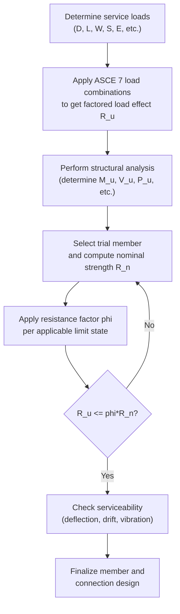

## Load and Resistance Factor Design Specifications

### Overview

Load and Resistance Factor Design (LRFD) is a limit-states design philosophy for structural steel in which both loads and resistances (strengths) are multiplied by statistically derived factors to account for uncertainty, ensuring a consistent and quantifiable margin of safety against failure. It is the primary design methodology codified in the **AISC 360 Specification for Structural Steel Buildings**, and has largely superseded Allowable Strength Design (ASD) as the default approach in modern steel design, though AISC 360 presents both methods in a unified specification.

The fundamental LRFD safety-check inequality is:

$$\sum \gamma_i Q_i \leq \phi R_n$$

Where the left side represents **factored load effects** and the right side represents **factored (reduced) nominal resistance**.

---

### Philosophical Basis: Probabilistic Limit States Design

Unlike Allowable Stress Design (older working-stress methods using a single factor of safety), LRFD separately accounts for variability in loads and variability in resistance:

- **Loads** (dead, live, wind, seismic, snow) have different degrees of predictability. Dead load is well-known and stable; live load and environmental loads are more variable. Each therefore receives its own load factor, $\gamma_i$.
- **Resistance** (member/connection strength) has variability due to material properties, fabrication tolerances, and modeling assumptions. This is captured by a single resistance (strength-reduction) factor, $\phi$, applied to nominal strength $R_n$.

**Key Points**

- The result is a design that targets a consistent, quantifiable **reliability index** ($\beta$) across different member types and failure modes, rather than a uniform but arbitrary factor of safety.
- Because factors are calibrated using structural reliability theory (probabilistic modeling of load/resistance distributions), LRFD is also referred to as a **probability-based limit states design method**.

---

### Governing Equation

$$R_u \leq \phi R_n$$

Where:

- $R_u$ = required strength (factored load effect, from structural analysis using factored loads)
- $\phi R_n$ = design strength
- $\phi$ = resistance factor (≤ 1.0, accounts for uncertainty/variability in resistance)
- $R_n$ = nominal strength (computed using specified material properties and specified equations, e.g., yield strength $F_y$, cross-sectional properties)

---

### Load Combinations (ASCE 7 / AISC 360)

LRFD load combinations are defined in **ASCE 7**, Chapter 2, and referenced by AISC 360. Common combinations include:

1. $1.4D$
2. $1.2D + 1.6L + 0.5(L_r \text{ or } S \text{ or } R)$
3. $1.2D + 1.6(L_r \text{ or } S \text{ or } R) + (L \text{ or } 0.5W)$
4. $1.2D + 1.0W + L + 0.5(L_r \text{ or } S \text{ or } R)$
5. $1.2D + 1.0E + L + 0.2S$
6. $0.9D + 1.0W$
7. $0.9D + 1.0E$

Where $D$ = dead load, $L$ = live load, $L_r$ = roof live load, $S$ = snow load, $R$ = rain load, $W$ = wind load, $E$ = seismic (earthquake) load.

**Key Points**

- Higher factors (1.6) apply to loads with greater variability and lower predictability (live load, snow).
- Lower factors (1.2 or less) apply to loads that are more predictable (dead load).
- Load combinations 6 and 7 (with $0.9D$) check for **uplift or reversal** conditions, where a reduced dead load might be insufficient to counteract wind or seismic overturning/uplift effects.
- [Unverified] — exact load factors and combinations may be revised between ASCE 7 editions (e.g., ASCE 7-16 vs. ASCE 7-22); the specific edition adopted by the governing building code must be verified for any real project.

---

### Resistance Factors (φ) by Limit State

AISC 360 specifies distinct $\phi$ values calibrated to the reliability of each failure mode:

| Limit State | Resistance Factor ($\phi$) |
| --- | --- |
| Tension yielding (gross section) | 0.90 |
| Tension rupture (net section) | 0.75 |
| Compression (flexural buckling) | 0.90 |
| Flexure (yielding, lateral-torsional buckling) | 0.90 |
| Shear (webs of rolled I-shapes, most cases) | 0.90 (or 1.00 for certain compact-web sections per AISC G2.1a) |
| Bearing on bolt holes | 0.75 |
| Bolts in shear/tension | 0.75 |
| Welds | 0.75–0.90 (varies by weld type and loading) |

**Key Points**

- Lower $\phi$ values (0.75) correspond to failure modes that are more sudden, brittle, or less predictable (fracture, bolt/weld rupture).
- Higher $\phi$ values (0.90) correspond to more ductile, predictable failure modes (yielding).
- This differential reflects LRFD's core principle: **the more unpredictable or catastrophic a failure mode, the more conservative (lower) its resistance factor.**

---

### Reliability Index and Calibration Basis

LRFD resistance and load factors were calibrated during development of the original 1986 LRFD Specification (predecessor to AISC 360) using **First-Order Second-Moment (FOSM)** reliability methods, targeting a reliability index $\beta$ of approximately 3.0 for members under gravity loads and higher for connections.

The general calibration relationship:

$$\phi R_n = \gamma_D D_n + \gamma_L L_n$$

is solved backward from target reliability using statistical distributions of load and resistance variables (mean values, coefficients of variation) so that the probability of $R < Q$ (resistance falling below load effect) meets a target failure probability.

[Inference] — while the calibration methodology is well documented in AISC commentary and reliability literature, the precise statistical parameters (bias factors, COVs) used in original calibration are historical/research-based rather than something a practicing engineer directly re-derives on a per-project basis.

---

### LRFD vs. ASD: Comparison

| Aspect | LRFD | ASD |
| --- | --- | --- |
| Load treatment | Multiple load factors ($\gamma_i > 1$) applied to loads | Single set of loads, no amplification |
| Resistance treatment | Nominal strength reduced by $\phi$ (< 1.0) | Nominal strength divided by safety factor $\Omega$ (> 1.0) |
| Governing equation | $R_u \leq \phi R_n$ | $R_a \leq R_n/\Omega$ |
| Consistency of safety margin | More uniform reliability across limit states | Less uniform; single factor applied broadly |
| Typical use case | Preferred for most new building design (per AISC 360) | Still used in some industries/legacy contract specs |

**Approximate equivalence** (for a live-to-dead load ratio near 3): LRFD and ASD produce similar member sizes because $\phi$ and $\Omega$ are calibrated so that $\phi \approx 1/(1.5\Omega)$ under typical load ratios. At other load ratios, results diverge—LRFD tends to be more economical for high live-to-dead ratios (e.g., storage/industrial), while ASD may govern for low ratios.

---

### Steel Member Design Procedure Under LRFD

---

### Example: Beam Flexural Check Under LRFD

Given: A simply supported W-shape beam, $F_y = 345$ MPa, factored moment demand $M_u = 280$ kN·m, laterally braced at intervals such that lateral-torsional buckling is not governing (compact section, adequate bracing).

**Nominal flexural strength** (plastic yielding governs):

$$M_n = F_y Z_x$$

Assume a trial section with $Z_x = 900 \times 10^3\ \text{mm}^3$:

$$M_n = 345 \times 900 \times 10^3 = 310.5 \times 10^6\ \text{N·mm} = 310.5\ \text{kN·m}$$

**Design strength:**

$$\phi M_n = 0.90 \times 310.5 = 279.5\ \text{kN·m}$$

**Check:**

$$M_u = 280\ \text{kN·m} \leq \phi M_n = 279.5\ \text{kN·m}$$

This fails marginally (280 > 279.5) — the trial section is inadequate by approximately 0.2%; the next larger section (or one with slightly greater $Z_x$) should be selected.

**Key Points**

- This example illustrates the direct application of the governing inequality $R_u \leq \phi R_n$ at the member level.
- Real design also requires checking lateral-torsional buckling, local buckling (flange/web compactness), shear, deflection, and connections — flexural yielding is only one limit state among several that must all be satisfied. Behavior may vary if compactness or bracing assumptions do not hold.

---

### Scope of AISC 360 LRFD Provisions

AISC 360 organizes LRFD provisions by chapter, covering:

- **Chapter B**: General design requirements, section classification (compact/noncompact/slender)
- **Chapter D**: Tension members
- **Chapter E**: Compression members (flexural, torsional, flexural-torsional buckling)
- **Chapter F**: Flexural members (beams)
- **Chapter G**: Shear
- **Chapter H**: Combined forces (axial + bending interaction)
- **Chapter I**: Composite members
- **Chapter J**: Connections (bolts, welds, connecting elements)
- **Chapter K**: Additional connection provisions (HSS, concentrated forces)

---

### Common Pitfalls in LRFD Application

| Pitfall | Consequence |
| --- | --- |
| Mixing LRFD load factors with ASD-based resistance values | Inconsistent, non-conservative or overly conservative design |
| Ignoring governing load combination for uplift (0.9D combos) | Undetected net tension/overturning failure |
| Applying φ to service loads instead of nominal resistance | Incorrect safety margin computation |
| Neglecting second-order (P-Δ, P-δ) effects in analysis | Underestimated $R_u$ for slender/sway-sensitive frames |
| Overlooking interaction equations (Chapter H) for combined axial + flexure | Unconservative design under biaxial or combined loading |

---

**Related Topics**

- Allowable Strength Design (ASD) — Comparative Methodology
- AISC 360 Chapter H: Combined Forces and Interaction Equations
- Lateral-Torsional Buckling of Steel Beams
- Section Classification: Compact, Noncompact, and Slender Elements
- Bolted and Welded Connection Design under LRFD
- Structural Reliability Theory and Reliability Index (β)
- ASCE 7 Load Combinations and Load Types
- Composite Steel-Concrete Member Design (AISC 360 Chapter I)