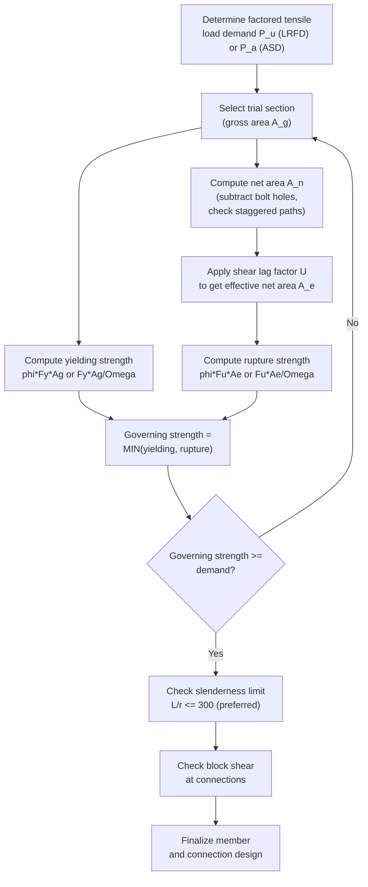

## Tension Member Design

### Overview

Tension members are structural elements subjected to axial tensile forces, transmitting load along their longitudinal axis without bending. Common examples include truss diagonals/chords in tension, hangers, sag rods, bracing members, and cable-supported elements. Because tension members do not experience buckling under pure axial tension, their design is governed primarily by two distinct limit states: **yielding of the gross cross-section** and **rupture (fracture) of the net cross-section** at points of reduced area (bolt holes, notches).

Design provisions are codified in **AISC 360, Chapter D** (LRFD/ASD unified specification).

---

### Governing Limit States

A tension member must satisfy strength checks for both possible failure modes, and the controlling (lower) design strength governs:

**1. Tensile Yielding (Gross Section)**

$$P_n = F_y A_g$$

$$\phi_t = 0.90 \quad (\text{LRFD}), \qquad \Omega_t = 1.67 \quad (\text{ASD})$$

**2. Tensile Rupture (Net Section)**

$$P_n = F_u A_e$$

$$\phi_t = 0.75 \quad (\text{LRFD}), \qquad \Omega_t = 2.00 \quad (\text{ASD})$$

Where:

- $F_y$ = specified minimum yield stress
- $F_u$ = specified minimum tensile (ultimate) stress
- $A_g$ = gross cross-sectional area
- $A_e$ = effective net area (accounts for both hole reduction and shear lag)

**Key Points**

- Yielding is a ductile, gradual failure mode — governs with a higher $\phi$ (0.90) reflecting greater predictability.
- Rupture is a sudden, brittle failure mode at the net section — governs with a lower $\phi$ (0.75), reflecting higher uncertainty and lower reserve capacity beyond first fracture.
- Even though the net section often has less area than the gross section, yielding across the full gross section can still govern the design because it uses a less severe reduction factor — both checks must always be performed.

---

### Net Area Calculation

**Net area** ($A_n$) accounts for the loss of cross-section due to bolt holes:

$$A_n = A_g - \sum (d_h \cdot t)$$

Where $d_h$ is the hole diameter (bolt diameter + 1.6 mm [1/16 in], plus fabrication allowance per AISC B4.3) and $t$ is the element thickness.

**For staggered bolt patterns**, the critical net section may not be a straight transverse line — diagonal fracture paths through staggered holes must also be checked using the **Cochrane (s²/4g) rule**:

$$A_n = A_g - \sum (d_h \cdot t) + \sum \left(\frac{s^2}{4g}\right) t$$

Where:

- $s$ = longitudinal center-to-center spacing between consecutive holes (pitch)
- $g$ = transverse center-to-center spacing between hole gage lines

**Key Points**

- All possible failure paths (straight and zig-zag/staggered) must be checked; the path giving the **smallest** net area governs.
- Staggering holes increases the net area along any single diagonal path compared to an aligned pattern, which is why staggering is often used to reduce the hole-area penalty in tension members.

---

### Effective Net Area (Shear Lag)

When load is not transmitted uniformly across the entire cross-section (e.g., only one leg of an angle is bolted), not all of the net area is fully effective in resisting tension — this is the **shear lag** phenomenon.

$$A_e = A_n \cdot U$$

Where $U$ is the **shear lag reduction factor**, per AISC 360 Table D3.1:

| Connection Type | U |
| --- | --- |
| All elements connected, load transmitted directly to each | 1.00 |
| W, M, S, HP shapes (flange connected, $b_f \geq 2/3 d$), ≥3 fasteners per line | 0.90 |
| W, M, S, HP shapes not meeting above, or tees cut from them | 0.85 |
| Angles, 4 or more fasteners per line | 0.80 |
| Angles, 2–3 fasteners per line | 0.60 |
| Plates, all transverse weld connections | $A_e = A_n$ (direct) |
| Round HSS, $l \geq 1.3D$ | 1.00 |
| Rectangular HSS, welded connection | Varies (per D3.1) |

**General formula (alternative to table)** for bolted/welded connections other than plates and HSS:

$$U = 1 - \frac{\bar{x}}{l}$$

Where $\bar{x}$ = distance from the connection plane (shear plane) to the centroid of the connected element, and $l$ = length of the connection in the load direction.

**Key Points**

- Shear lag reduces effective capacity because stress concentrates near the connected elements and does not fully "spread" to unconnected portions of the section by the time the load path reaches the connection.
- Longer connections (larger $l$) reduce shear lag effects (increase $U$) because there is more length over which stress can redistribute.
- Members connected through all elements (e.g., plates with full-width welds) have no shear lag penalty ($U = 1.0$).

---

### Design Procedure

---

### Example: Tension Member Design Check

**Given:** A single angle L102×102×9.5 (L4×4×3/8) in tension, ASTM A36 ($F_y = 250$ MPa, $F_u = 400$ MPa), connected through one leg with a single line of four 20 mm bolts (22 mm holes accounting for clearance), factored tensile load $P_u = 300$ kN.

**Section properties:** $A_g = 1740\ \text{mm}^2$, leg thickness $t = 9.5$ mm.

**Step 1 — Yielding check:**

$$\phi_t P_n = 0.90 \times 250 \times 1740 = 391{,}500\ \text{N} = 391.5\ \text{kN}$$

**Step 2 — Net area:**

$$A_n = A_g - (d_h \cdot t) = 1740 - (22 \times 9.5) = 1740 - 209 = 1531\ \text{mm}^2$$

(single hole subtracted per critical straight section since only one line of bolts is used)

**Step 3 — Shear lag factor:** Angle with 4 or more fasteners per line → $U = 0.80$

$$A_e = 1531 \times 0.80 = 1225\ \text{mm}^2$$

**Step 4 — Rupture check:**

$$\phi_t P_n = 0.75 \times 400 \times 1225 = 367{,}500\ \text{N} = 367.5\ \text{kN}$$

**Step 5 — Governing strength:**

$$\phi_t P_n = \min(391.5,\ 367.5) = 367.5\ \text{kN} \quad (\text{rupture governs})$$

**Check:** $P_u = 300\ \text{kN} \leq 367.5\ \text{kN}$ ✓ — section is adequate.

**Key Points**

- Rupture governed in this example (367.5 kN < 391.5 kN), which is typical for bolted single-angle connections due to combined hole reduction and shear lag penalty.
- Margin of safety here is about 22% above demand; a more economical (smaller) angle could be investigated, but bolt spacing/edge distance requirements may control minimum practical leg size.

---

### Slenderness Limits

AISC 360 does not impose a strength-based slenderness limit for tension members (since buckling is not a concern under pure tension), but recommends a serviceability-based preferred limit:

$$\frac{L}{r} \leq 300$$

Where $L$ is the unbraced length and $r$ is the governing radius of gyration. This limit is intended to control **sag, vibration, and damage during handling/erection** rather than strength — members that are extremely slender may sag visibly under self-weight or be easily damaged before/during construction, even though they would be adequate for the design tensile load itself.

[Unverified] — this 300 ratio is a *recommendation*, not a mandatory strength limit, in AISC 360; specific project specifications or the engineer of record may impose stricter or more lenient limits depending on application (e.g., hangers vs. bracing).

---

### Block Shear Rupture

At bolted or welded end connections, a combined failure mode called **block shear** must be checked — a "block" of material tears out along a path combining shear (parallel to load) and tension (perpendicular to load) planes.

$$R_n = 0.60F_u A_{nv} + U_{bs}F_u A_{nt} \leq 0.60F_y A_{gv} + U_{bs}F_u A_{nt}$$

Where:

- $A_{nv}$ = net area subject to shear
- $A_{nt}$ = net area subject to tension
- $A_{gv}$ = gross area subject to shear
- $U_{bs}$ = 1.0 for uniform tension stress distribution, 0.5 for non-uniform

$$\phi = 0.75 \quad (\text{LRFD}), \qquad \Omega = 2.00 \quad (\text{ASD})$$

**Key Points**

- Block shear is a connection-region limit state, distinct from — and checked in addition to — gross yielding and net rupture of the member itself.
- It commonly governs for short-tab or coped-end connections (e.g., angle or WT tension members with a small number of end bolts near the member edge).

---

### Common Pitfalls in Tension Member Design

| Pitfall | Consequence |
| --- | --- |
| Checking only gross yielding, omitting net section rupture | Unconservative design at connection region |
| Ignoring shear lag ($U$ factor) for partially connected shapes (angles, tees) | Overestimated effective net area, unconservative capacity |
| Missing staggered bolt hole diagonal path check | Understated hole area loss, unconservative net area |
| Neglecting block shear at end connections | Undetected tear-out failure mode |
| Treating $L/r \leq 300$ as a mandatory strength requirement | Unnecessarily oversized members in non-critical bracing |

---

**Related Topics**

- Bolted Connection Design (Bearing, Shear, Slip-Critical)
- Block Shear Rupture — Detailed Derivation and Failure Paths
- Compression Member Design (Buckling Limit States)
- Welded Connection Design for Tension Members
- Angle and WT Sections as Tension Members — Practical Considerations
- AISC 360 Chapter D: Design of Members for Tension
- Truss Design and Load Path Analysis