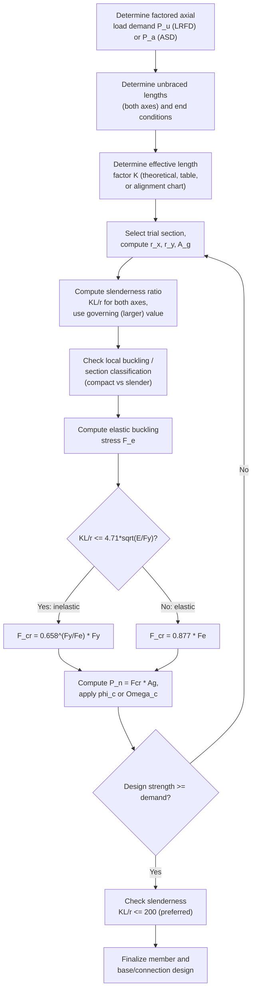

## Compression Member and Column Design

### Overview

Compression members carry axial compressive load along their longitudinal axis and are found as columns, truss chords/diagonals in compression, and bracing members. Unlike tension members, compression members are governed by **buckling** — an instability failure mode where the member deflects laterally (or twists) under load well before the material itself reaches its yield stress, especially for slender members. Design is codified in **AISC 360, Chapter E** (flexural, torsional, and flexural-torsional buckling of members) and Chapter E7 (slender-element sections).

The central design challenge for compression members is that their strength depends not only on cross-sectional area and material strength (as with tension) but critically on **member length, end restraint (boundary conditions), and cross-sectional shape/slenderness** — the same cross-section can have vastly different capacities depending on its unbraced length.

---

### Euler Buckling — Theoretical Basis

The classical theoretical basis for column buckling is the **Euler critical load**:

$$P_{cr} = \frac{\pi^2 E I}{(KL)^2}$$

Or, in terms of stress:

$$F_e = \frac{\pi^2 E}{(KL/r)^2}$$

Where:

- $E$ = modulus of elasticity
- $I$ = moment of inertia about the buckling axis
- $K$ = effective length factor (accounts for end restraint conditions)
- $L$ = unbraced (laterally unsupported) length
- $r$ = radius of gyration ($r = \sqrt{I/A}$)
- $KL/r$ = **slenderness ratio**, the single most important parameter in compression design

**Key Points**

- Euler buckling assumes a perfectly straight, elastic, concentrically loaded column with no initial imperfections — real columns deviate from this ideal, which is why AISC 360 uses empirically calibrated column curves rather than the pure Euler equation directly.
- As slenderness ($KL/r$) increases, Euler (elastic) buckling stress decreases with the square of slenderness — long, slender columns fail at very low stress relative to yield.

---

### Effective Length Factor (K)

The effective length factor $K$ accounts for how end conditions affect the buckled shape and effective unsupported length of a column.

| End Condition | Theoretical K | AISC Recommended (design) K |
| --- | --- | --- |
| Fixed–Fixed | 0.5 | 0.65 |
| Fixed–Pinned | 0.7 | 0.80 |
| Pinned–Pinned | 1.0 | 1.0 |
| Fixed–Free (cantilever) | 2.0 | 2.10 |
| Fixed–Fixed, sidesway permitted | 1.0 | 1.2 |
| Fixed–Pinned, sidesway permitted | 2.0 | 2.0 |

**Key Points**

- "Sidesway permitted" conditions (unbraced frames) dramatically increase $K$ and therefore reduce column strength — this is why moment frames without adequate bracing require much larger columns than braced frames.
- For columns in continuous frames, $K$ is often determined using **alignment charts (nomographs)** based on the relative stiffness of connecting beams and columns at each end (the $G$-factor method), rather than assumed from idealized end conditions.
- AISC recommended $K$ values are slightly higher than pure theoretical values to account for practical imperfections in achieving idealized end fixity.

---

### AISC 360 Column Strength Curve (Flexural Buckling)

**Nominal compressive strength:**

$$P_n = F_{cr} A_g$$

$$\phi_c = 0.90 \quad (\text{LRFD}), \qquad \Omega_c = 1.67 \quad (\text{ASD})$$

**Critical stress $F_{cr}$** depends on whether the member behaves in the **inelastic** or **elastic** buckling regime, determined by comparing slenderness to a limiting value:

**Elastic buckling stress:**

$$F_e = \frac{\pi^2 E}{(KL/r)^2}$$

**Case 1 — Inelastic buckling** (when $\frac{KL}{r} \leq 4.71\sqrt{\frac{E}{F_y}}$, equivalently $F_y/F_e \leq 2.25$):

$$F_{cr} = \left[0.658^{\frac{F_y}{F_e}}\right] F_y$$

**Case 2 — Elastic buckling** (when $\frac{KL}{r} > 4.71\sqrt{\frac{E}{F_y}}$):

$$F_{cr} = 0.877 F_e$$

**Key Points**

- The $0.658^{F_y/F_e}$ exponential expression is an empirical curve (not derived from pure Euler theory) calibrated against test data to account for residual stresses, initial out-of-straightness, and inelastic material behavior — it transitions smoothly from near-yield strength at low slenderness to Euler-like elastic behavior at high slenderness.
- The 0.877 factor in the elastic regime accounts for the reduction in average column strength due to initial crookedness, even for long, slender columns where buckling is essentially elastic.
- Short, stocky columns ($KL/r$ small) approach $F_{cr} \approx F_y$ (yielding governs, not buckling).
- Long, slender columns approach the Euler elastic buckling curve directly.

---

### Column Strength Curve — Conceptual Diagram (svg_diagram)

<svg xmlns="http://www.w3.org/2000/svg" viewBox="0 0 520 320">
<text x="260" y="20" font-size="14" font-weight="bold" text-anchor="middle">AISC Column Strength Curve: F_cr vs. KL/r (svg_diagram)</text>
<line x1="60" y1="280" x2="480" y2="280" stroke="#333" stroke-width="2" />
<line x1="60" y1="280" x2="60" y2="40" stroke="#333" stroke-width="2" />
<text x="270" y="305" font-size="12" text-anchor="middle">Slenderness Ratio (KL/r)</text>
<text x="25" y="160" font-size="12" text-anchor="middle" transform="rotate(-90 25 160)">Critical Stress F_cr</text>
<line x1="60" y1="70" x2="60" y2="70" stroke="#888" stroke-dasharray="4,4" />
<line x1="40" y1="70" x2="480" y2="70" stroke="#888" stroke-width="1" stroke-dasharray="4,4" />
<text x="45" y="65" font-size="10" text-anchor="end">Fy</text>
<path d="M 60 75 Q 140 80 200 130" stroke="#c0392b" stroke-width="3" fill="none" />
<path d="M 200 130 Q 280 220 480 270" stroke="#2980b9" stroke-width="3" fill="none" />
<line x1="200" y1="280" x2="200" y2="130" stroke="#888" stroke-dasharray="3,3" />
<text x="200" y="295" font-size="10" text-anchor="middle">4.71 sqrt(E/Fy)</text>
<text x="110" y="95" font-size="11" fill="#c0392b">Inelastic (0.658 curve)</text>
<text x="330" y="200" font-size="11" fill="#2980b9">Elastic (0.877 Fe)</text>
</svg>

---

### Slenderness Limit

AISC 360 recommends (non-mandatory, serviceability-oriented):

$$\frac{KL}{r} \leq 200$$

**Key Points**

- Unlike tension members, this limit is more consequential in compression because strength drops rapidly with increasing slenderness — a column near or above this limit becomes highly sensitive to imperfections and second-order effects.
- Design should use the **largest** slenderness ratio among all buckling axes (e.g., strong-axis vs. weak-axis unbraced lengths may differ due to bracing configuration).

---

### Local Buckling — Section Classification

In addition to overall (global) member buckling, individual plate elements of the cross-section (flanges, webs) can buckle locally before the member reaches its global buckling capacity. AISC 360 Table B4.1a classifies elements as:

- **Nonslender** — local buckling does not govern; full $F_{cr}$ from Chapter E applies.
- **Slender** — local buckling reduces capacity; a reduction factor $Q$ (per Chapter E7) is applied.

**Width-to-thickness limiting ratio** for compression elements (example, unstiffened flange of I-shape):

$$\lambda_r = 0.56\sqrt{\frac{E}{F_y}}$$

If the actual $b/t$ ratio exceeds $\lambda_r$, the element is slender and the modified critical stress becomes:

$$F_{cr} = Q\left[0.658^{\frac{QF_y}{F_e}}\right]F_y \quad (\text{inelastic, modified})$$

**Key Points**

- Compact, standard hot-rolled W-shapes used as columns are typically nonslender under normal proportions; slenderness effects become significant primarily for thin-walled built-up sections or HSS with high width-to-thickness ratios.
- Local buckling and global (flexural) buckling are independent checks — a member must be adequate against both.

---

### Torsional and Flexural-Torsional Buckling

For certain cross-sections (particularly **singly symmetric** or **unsymmetric** shapes like channels, angles, and some tees), buckling modes other than simple flexural buckling can govern:

- **Torsional buckling**: the member twists about its longitudinal (shear center) axis without translating.
- **Flexural-torsional buckling**: a combined mode involving simultaneous bending and twisting, common in channels, tees, and single/double angles.

$$F_{crz} = \frac{G J}{A r_0^2} \quad \text{(pure torsional buckling stress term)}$$

Flexural-torsional buckling stress is computed via a quadratic interaction of flexural ($F_{ex}, F_{ey}$) and torsional ($F_{ez}$) elastic buckling stresses per AISC 360 Eq. E4-2 through E4-6.

**Key Points**

- Doubly symmetric shapes (W, HSS square/round) are generally governed by simple flexural buckling only, since the shear center coincides with the centroid.
- Singly symmetric or unsymmetric shapes (angles, channels, tees) must always be checked for the governing mode among flexural, torsional, and flexural-torsional buckling — the lowest resulting $F_{cr}$ controls, and design software or explicit hand checks should evaluate all applicable modes since which one governs is not always obvious a priori. [Inference] — which mode controls depends on specific cross-sectional proportions and cannot be assumed without calculation for a given case.

---

### Design Procedure

---

### Example: Column Design Check

**Given:** A W250×67 column, $F_y = 345$ MPa, $E = 200{,}000$ MPa, pinned–pinned end conditions ($K = 1.0$), unbraced length $L = 4.5$ m, factored axial load $P_u = 1400$ kN.

**Section properties:** $A_g = 8580\ \text{mm}^2$, $r_x = 113$ mm, $r_y = 65.0$ mm (weak axis governs).

**Step 1 — Slenderness ratio (weak axis governs):**

$$\frac{KL}{r_y} = \frac{1.0 \times 4500}{65.0} = 69.2$$

**Step 2 — Limiting slenderness:**

$$4.71\sqrt{\frac{E}{F_y}} = 4.71\sqrt{\frac{200{,}000}{345}} = 113.4$$

Since $69.2 < 113.4$, the member is in the **inelastic buckling regime**.

**Step 3 — Elastic buckling stress:**

$$F_e = \frac{\pi^2 (200{,}000)}{(69.2)^2} = \frac{1{,}974{,}300}{4789} \approx 412.2\ \text{MPa}$$

**Step 4 — Critical stress:**

$$F_{cr} = \left[0.658^{\frac{345}{412.2}}\right](345) = \left[0.658^{0.837}\right](345)$$

$$0.658^{0.837} \approx 0.706 \implies F_{cr} \approx 0.706 \times 345 = 243.6\ \text{MPa}$$

**Step 5 — Nominal and design strength:**

$$P_n = F_{cr} A_g = 243.6 \times 8580 = 2{,}090{,}000\ \text{N} \approx 2090\ \text{kN}$$

$$\phi_c P_n = 0.90 \times 2090 = 1881\ \text{kN}$$

**Check:** $P_u = 1400\ \text{kN} \leq \phi_c P_n = 1881\ \text{kN}$ ✓ — section is adequate, with roughly 34% reserve capacity.

**Key Points**

- Weak-axis ($r_y$) slenderness governed the design because it produces the larger (more critical) $KL/r$ ratio — this is the typical governing case for symmetric bracing unless weak-axis bracing is provided at closer intervals.
- The section could potentially be optimized to a lighter member, but practical considerations (connection compatibility, standard sizing, availability) often influence final selection beyond pure strength efficiency.

---

### Built-Up and Composite Compression Members

- **Built-up members** (e.g., laced or battened columns from multiple shapes) require additional checks per AISC 360 E6, including modified slenderness ratios accounting for shear deformation between components and requirements for stitching/lacing spacing to prevent buckling of individual components between connectors.
- **Composite columns** (steel encased in or filled with concrete) are addressed in AISC 360 Chapter I, using modified stiffness and effective strength expressions that account for composite action between steel and concrete.

---

### Common Pitfalls in Compression Member Design

| Pitfall | Consequence |
| --- | --- |
| Using theoretical K instead of design-recommended K | Unconservative estimate of buckling capacity |
| Neglecting weak-axis bracing/unbraced length | Governing slenderness ratio understated, unconservative design |
| Ignoring torsional/flexural-torsional buckling for angles, channels, tees | Overestimated capacity for asymmetric shapes |
| Overlooking local (element) bubuckling for slender built-up or HSS sections | Overestimated nominal strength |
| Assuming pinned-pinned K=1.0 universally without evaluating actual frame restraint | Inaccurate capacity in braced/unbraced frame systems |
| Ignoring second-order (P-Δ) amplification in sway-sensitive frames | Understated required strength $P_u$ |

---

**Related Topics**

- Effective Length Factor and Alignment Charts (G-factor Method)
- Local Buckling and Slender-Element Section Design (AISC 360 E7)
- Flexural-Torsional Buckling of Angles, Channels, and Tees
- Beam-Column Design (Combined Axial and Flexural Loading, Chapter H)
- Built-Up and Laced/Battened Column Design
- Composite Column Design (Steel-Concrete, AISC 360 Chapter I)
- Base Plate and Column Base Connection Design
- Second-Order (P-Δ and P-δ) Effects in Frame Analysis