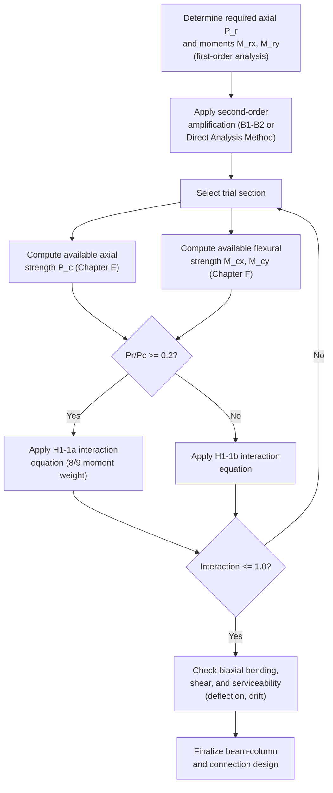

## Beam and Beam-Column Design

### Overview

Beams are structural members subjected primarily to transverse loading, producing internal bending moment and shear. Beam-columns are members subjected to **combined axial force and bending moment** simultaneously — a condition common to nearly all columns in real frames, since perfectly concentric axial loading rarely occurs in practice due to frame continuity, eccentric connections, or lateral loads. Design of both is codified in **AISC 360**: Chapter F (flexural members) and Chapter G (shear) govern beams, while Chapter H (combined forces) governs beam-columns through interaction equations that unify axial and flexural checks.

---

### Beam Flexural Design — Limit States

The nominal flexural strength $M_n$ of a beam is governed by the **least** of several possible failure modes, depending on cross-section compactness and lateral bracing:

1. **Yielding** — full plastic moment capacity reached
2. **Lateral-Torsional Buckling (LTB)** — the compression flange buckles laterally, twisting the section, before full yielding
3. **Flange Local Buckling (FLB)** — the compression flange buckles locally
4. **Web Local Buckling (WLB)** — the web buckles locally in the compression zone

**Key Points**

- For standard hot-rolled W-shapes with compact sections (which is the majority of cases), FLB and WLB do not govern — only yielding and LTB need to be checked.
- Which limit state governs depends on the **unbraced length** $L_b$ (distance between points of lateral bracing to the compression flange) relative to two key length parameters, $L_p$ and $L_r$.

---

### Lateral-Torsional Buckling Zones

AISC 360 Chapter F defines three behavioral zones based on unbraced length $L_b$:

**Zone 1 — Plastic (Yielding governs), $L_b \leq L_p$:**

$$M_n = M_p = F_y Z_x$$

**Zone 2 — Inelastic LTB, $L_p < L_b \leq L_r$:**

$$M_n = C_b \left[M_p - (M_p - 0.7F_yS_x)\left(\frac{L_b - L_p}{L_r - L_p}\right)\right] \leq M_p$$

**Zone 3 — Elastic LTB, $L_b > L_r$:**

$$M_n = F_{cr}S_x \leq M_p$$

$$F_{cr} = \frac{C_b \pi^2 E}{(L_b/r_{ts})^2}\sqrt{1 + 0.078\frac{Jc}{S_x h_0}\left(\frac{L_b}{r_{ts}}\right)^2}$$

Where:

- $Z_x$ = plastic section modulus
- $S_x$ = elastic section modulus
- $C_b$ = lateral-torsional buckling modification factor (accounts for moment gradient along the unbraced segment)
- $r_{ts}$ = effective radius of gyration for LTB
- $J$ = torsional constant, $h_0$ = distance between flange centroids, $c$ = 1.0 for doubly symmetric shapes

**Limiting lengths:**

$$L_p = 1.76 r_y \sqrt{\frac{E}{F_y}}$$

$$L_r = 1.95 r_{ts}\frac{E}{0.7F_y}\sqrt{\frac{Jc}{S_xh_0} + \sqrt{\left(\frac{Jc}{S_xh_0}\right)^2 + 6.76\left(\frac{0.7F_y}{E}\right)^2}}$$

**Key Points**

- $L_p$ represents the unbraced length below which the beam can reach its full plastic moment $M_p$ without any LTB reduction.
- $L_r$ represents the unbraced length above which the beam buckles elastically before reaching yield anywhere in the section.
- The $C_b$ factor increases (improves) capacity when moment varies favorably along the unbraced length (e.g., moment decreasing toward the ends of the segment); $C_b = 1.0$ is a conservative default for uniform moment.

---

### LTB Behavior — Conceptual Diagram (svg_diagram)

<svg xmlns="http://www.w3.org/2000/svg" viewBox="0 0 520 300">
<text x="260" y="20" font-size="14" font-weight="bold" text-anchor="middle">Flexural Strength vs. Unbraced Length (svg_diagram)</text>
<line x1="60" y1="260" x2="480" y2="260" stroke="#333" stroke-width="2" />
<line x1="60" y1="260" x2="60" y2="40" stroke="#333" stroke-width="2" />
<text x="270" y="285" font-size="12" text-anchor="middle">Unbraced Length L_b</text>
<text x="25" y="150" font-size="12" text-anchor="middle" transform="rotate(-90 25 150)">Nominal Moment M_n</text>
<line x1="40" y1="70" x2="480" y2="70" stroke="#888" stroke-width="1" stroke-dasharray="4,4" />
<text x="45" y="65" font-size="10" text-anchor="end">Mp</text>
<line x1="40" y1="160" x2="480" y2="160" stroke="#888" stroke-width="1" stroke-dasharray="4,4" />
<text x="45" y="155" font-size="10" text-anchor="end">0.7FySx</text>
<line x1="150" y1="260" x2="150" y2="70" stroke="#c0392b" stroke-width="3" />
<line x1="150" y1="70" x2="320" y2="160" stroke="#e67e22" stroke-width="3" />
<path d="M 320 160 Q 400 200 480 240" stroke="#2980b9" stroke-width="3" fill="none" />
<line x1="150" y1="280" x2="150" y2="260" stroke="#333" />
<text x="150" y="295" font-size="10" text-anchor="middle">Lp</text>
<line x1="320" y1="280" x2="320" y2="260" stroke="#333" />
<text x="320" y="295" font-size="10" text-anchor="middle">Lr</text>
<text x="90" y="90" font-size="10" fill="#c0392b">Zone 1: Plastic</text>
<text x="200" y="130" font-size="10" fill="#e67e22">Zone 2: Inelastic LTB</text>
<text x="380" y="220" font-size="10" fill="#2980b9">Zone 3: Elastic LTB</text>
</svg>

---

### Design Flexural Strength

$$\phi_b M_n \quad (\phi_b = 0.90), \qquad \frac{M_n}{\Omega_b} \quad (\Omega_b = 1.67)$$

**Example — Zone 2 check:** A W410×60 beam, $F_y = 345$ MPa, laterally braced at 3 m intervals, with $L_p = 2.6$ m, $L_r = 7.8$ m, $M_p = 350$ kN·m, $0.7F_yS_x = 220$ kN·m, $C_b = 1.0$, subject to factored moment $M_u = 280$ kN·m.

Since $L_p = 2.6 < L_b = 3.0 \leq L_r = 7.8$, Zone 2 (inelastic LTB) governs:

$$M_n = 1.0\left[350 - (350-220)\left(\frac{3.0-2.6}{7.8-2.6}\right)\right] = 350 - 130(0.077) = 340.0\ \text{kN·m}$​

$$\phi_b M_n = 0.90 \times 340.0 = 306\ \text{kN·m}$$

**Check:** $M_u = 280\ \text{kN·m} \leq 306\ \text{kN·m}$ ✓ — adequate, roughly 9% reserve.

---

### Shear Design (AISC 360 Chapter G)

$$V_n = 0.6F_y A_w C_{v1}$$

Where $A_w$ = web area ($d \times t_w$), and $C_{v1}$ = web shear coefficient (equals 1.0 for most compact-web rolled I-shapes; reduces for slender webs subject to shear buckling).

$$\phi_v = 0.90 \ (\text{or } 1.00 \text{ for compact rolled I-shapes per G2.1a}), \qquad \Omega_v = 1.67 \ (\text{or } 1.50)$$

**Key Points**

- For the vast majority of standard rolled W-shape beams with $h/t_w \leq 2.24\sqrt{E/F_y}$, shear rarely governs design — flexure or deflection typically controls member selection.
- Shear becomes more critical for short-span, heavily loaded beams, coped beam ends, or built-up/plate girders with slender webs.

---

### Deflection Serviceability

Though not a strength limit state, deflection is a governing **serviceability** check, typically per project specification or IBC-referenced limits:

| Member Type | Typical Limit (Live Load) |
| --- | --- |
| Floor beams | $L/360$ |
| Roof beams (no plaster) | $L/240$ |
| Roof beams (with plaster ceiling) | $L/360$ |
| Total load deflection (floors) | $L/240$ |

[Unverified] — exact deflection limits are project-specific and governed by the applicable building code or engineer of record's project specification rather than a single universal AISC value; the specification's own criteria should always be checked.

---

### Beam-Column Design — Combined Axial and Flexural Loading

Most columns in real building frames experience combined axial compression **and** bending moment (from frame action, eccentric loads, or lateral forces). AISC 360 **Chapter H** provides interaction equations to check adequacy under combined loading.

**Interaction Equations (H1-1a, H1-1b):**

For $\frac{P_r}{P_c} \geq 0.2$:

$$\frac{P_r}{P_c} + \frac{8}{9}\left(\frac{M_{rx}}{M_{cx}} + \frac{M_{ry}}{M_{cy}}\right) \leq 1.0$$

For $\frac{P_r}{P_c} < 0.2$:

$$\frac{P_r}{2P_c} + \left(\frac{M_{rx}}{M_{cx}} + \frac{M_{ry}}{M_{cy}}\right) \leq 1.0$$

Where:

- $P_r$ = required axial strength (factored)
- $P_c$ = available axial strength ($\phi_c P_n$ or $P_n/\Omega_c$)
- $M_{rx}, M_{ry}$ = required flexural strength about x- and y-axes (including second-order amplification)
- $M_{cx}, M_{cy}$ = available flexural strength about x- and y-axes

**Key Points**

- When axial load dominates ($P_r/P_c \geq 0.2$), the interaction equation weights moment contribution by $8/9$, reflecting reduced additional capacity for bending once axial load is already significant.
- When axial load is small ($P_r/P_c < 0.2$), the equation transitions to a form that more closely resembles a pure flexural check, since axial effects are comparatively minor.
- $M_{rx}$ and $M_{ry}$ **must** include **second-order effects** ($P$-$\delta$ member effects and $P$-$\Delta$ frame/story effects) per AISC 360 Chapter C (Direct Analysis Method) or the traditional B1-B2 amplification factor approach — using only first-order analysis moments here is unconservative for sway-sensitive frames.

---

### Second-Order Amplification (B1-B2 Method)

**Member-level amplification (P-δ):**

$$M_r = B_1 M_{nt} + B_2 M_{lt}$$

$$B_1 = \frac{C_m}{1 - \frac{\alpha P_r}{P_{e1}}} \geq 1.0$$

**Story-level amplification (P-Δ):**

$$B_2 = \frac{1}{1 - \frac{\alpha P_{story}}{P_{e,story}}} \geq 1.0$$

Where $M_{nt}$ = moment from non-sway (gravity) analysis, $M_{lt}$ = moment from sway (lateral) analysis, $C_m$ = equivalent moment factor, $P_{e1}$ = elastic critical buckling load of the member, $\alpha = 1.0$ (LRFD) or $1.6$ (ASD).

**Key Points**

- $B_1$ amplifies moments due to member curvature under axial load ($P$-$\delta$, "little delta") — relevant even in braced frames.
- $B_2$ amplifies moments due to overall lateral frame sidesway ($P$-$\Delta$, "big delta") — relevant primarily in unbraced/moment frames.
- Modern practice increasingly favors the **Direct Analysis Method** (AISC 360 Chapter C), which incorporates second-order effects, notional loads, and reduced stiffness directly in the structural analysis rather than through post-hoc amplification factors — though B1-B2 remains valid and widely used.

---

### Design Procedure — Beam-Column

---

### Example: Beam-Column Interaction Check

**Given:** A W310×97 column-beam member, $P_r = 900$ kN, $M_{rx} = 150$ kN·m (including second-order amplification), $M_{ry} = 0$ (no weak-axis bending), $P_c = \phi_c P_n = 1500$ kN, $M_{cx} = \phi_b M_{nx} = 280$ kN·m.

**Step 1:**

$$\frac{P_r}{P_c} = \frac{900}{1500} = 0.60 \geq 0.2$$

**Step 2 — Use H1-1a:**

$$\frac{P_r}{P_c} + \frac{8}{9}\left(\frac{M_{rx}}{M_{cx}}\right) = 0.60 + \frac{8}{9}\left(\frac{150}{280}\right) = 0.60 + 0.476 \times ...$$

$$= 0.60 + 0.889 \times 0.536 = 0.60 + 0.476 = 1.076$$

**Check:** $1.076 > 1.0$ ✗ — **inadequate**. The section fails the combined interaction check by approximately 7.6%, even though it may pass either the pure axial or pure flexural check individually. A larger section (or one with more favorable $r_x$ to reduce moment amplification) is required.

**Key Points**

- This example illustrates why beam-column design cannot be performed by checking axial and flexural capacity independently — the interaction equation captures the reduced combined capacity when both effects act simultaneously.

---

### Common Pitfalls in Beam and Beam-Column Design

| Pitfall | Consequence |
| --- | --- |
| Assuming $C_b = 1.0$ always (ignoring favorable moment gradient) | Overly conservative, uneconomical design |
| Neglecting LTB for beams with widely spaced bracing | Unconservative overestimate of flexural strength |
| Checking axial and flexural strength independently instead of interaction | Undetected overstress under combined loading |
| Using first-order moments in beam-column interaction checks | Unconservative for sway-sensitive (unbraced) frames |
| Ignoring biaxial bending ($M_{ry}$) for columns with asymmetric framing | Incomplete interaction check, unconservative result |
| Overlooking deflection serviceability despite adequate strength | Serviceability failures (cracking, vibration, perceived sag) despite code-compliant strength |

---

**Related Topics**

- Lateral-Torsional Buckling — Detailed Derivation and $C_b$ Factor Calculation
- Direct Analysis Method (AISC 360 Chapter C)
- Plate Girder Design (Slender Web Beams)
- Moment Frame vs. Braced Frame Systems — Lateral Load Resisting Comparison
- Biaxial Bending of Columns in Unbraced Frames
- Composite Beam Design (Steel-Concrete, AISC 360 Chapter I)
- Connection Design for Beam-Columns (Moment Connections)