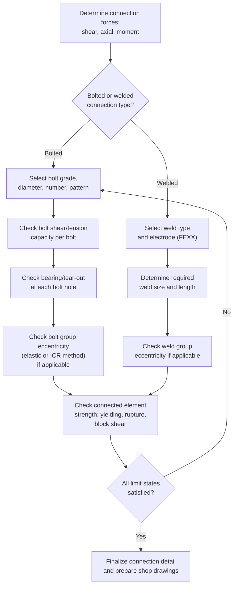

## Bolted and Welded Connection Design

### Overview

Connections join structural steel members into a continuous load-resisting system, transferring axial force, shear, moment, or combinations thereof between members. Connection design is arguably the most consequential aspect of steel detailing — the vast majority of steel structure failures originate at connections rather than within member spans, because connections concentrate stress, involve discontinuities, and are often designed with simplifying assumptions about force distribution. Design provisions are codified in **AISC 360, Chapter J** (general connection provisions) and **Chapter K** (additional provisions for HSS and concentrated forces), with bolt and weld material specifications cross-referenced from **ASTM** and the **AWS D1.1 Structural Welding Code**.

---

### Bolted Connections

#### Bolt Types and Materials

| Designation | Type | Typical $F_{nt}$ (MPa) | Typical $F_{nv}$ (MPa) |
| --- | --- | --- | --- |
| ASTM A325 (A325M) | High-strength, medium carbon steel | 620 | 372–457 |
| ASTM A490 (A490M) | High-strength, alloy steel | 780 | 457–579 |
| ASTM A307 | Common (unfinished) bolts | 310–414 | ~165–207 |

**Key Points**

- A325 and A490 bolts are pretensioned high-strength bolts used in nearly all modern structural steel connections; A307 bolts are lower-strength and typically limited to secondary/non-critical connections.
- $F_{nv}$ (nominal shear strength) is lower when threads are included in the shear plane (condition "N") versus excluded ("X") — thread-excluded connections have higher shear capacity because the full shank diameter resists shear rather than the reduced thread root area.

---

#### Bolted Connection Limit States

A bolted connection must be checked against multiple, independent limit states:

**1. Bolt Shear**

$$R_n = F_{nv} A_b$$

$$\phi = 0.75\ (\text{LRFD}), \qquad \Omega = 2.00\ (\text{ASD})$$

**2. Bolt Tension**

$$R_n = F_{nt} A_b$$

**3. Combined Shear and Tension (Interaction)**

$$F'_{nt} = 1.3F_{nt} - \frac{F_{nt}}{\phi F_{nv}}f_{rv} \leq F_{nt}$$

**4. Bearing at Bolt Holes**

$$R_n = 1.2 l_c t F_u \leq 2.4 d_b t F_u$$

$$\phi = 0.75\ (\text{LRFD}), \qquad \Omega = 2.00\ (\text{ASD})$$

Where $l_c$ = clear distance between hole edge and adjacent edge or hole in the direction of load, $t$ = connected material thickness, $d_b$ = bolt diameter.

**5. Tear-Out** — a special bearing sub-case where $l_c$ is small enough that the concrete/steel material tears out before reaching full bearing capacity (captured directly by the $1.2 l_c t F_u$ term above).

**6. Slip-Critical Resistance** (for slip-critical connections only)

$$R_n = \mu D_u h_f T_b N_s$$

Where $\mu$ = mean slip coefficient (surface condition dependent, typically 0.30–0.50), $D_u = 1.13$, $h_f$ = fill factor, $T_b$ = minimum bolt pretension, $N_s$ = number of slip planes.

**Key Points**

- **Bearing-type connections** (most common) allow slight slip into bearing under load; the connection strength is governed by bolt shear and material bearing.
- **Slip-critical connections** are designed so no slip occurs at service loads (or in some cases, factored loads) — required where slip would be unacceptable (e.g., connections subject to fatigue, oversized/slotted holes, or serviceability-sensitive joints).
- All applicable limit states (shear, bearing, tear-out) must be checked simultaneously — the connection strength is governed by whichever produces the **lowest** capacity for the given bolt group and geometry.

---

#### Spacing and Edge Distance Requirements

| Requirement | AISC 360 Provision |
| --- | --- |
| Minimum spacing (center-to-center) | $2\frac{2}{3}d_b$ (preferred: $3d_b$) |
| Minimum edge distance | Per Table J3.4 (function of bolt diameter and edge condition — sheared vs. rolled/gas-cut edge) |
| Maximum spacing | $24t$ (thinner connected part) or 305 mm |
| Maximum edge distance | $12t$ or 150 mm |

**Key Points**

- Minimum spacing/edge distance rules prevent tear-out failure and ensure adequate room for wrench clearance during installation.
- Maximum spacing/edge distance rules control against local buckling of unconnected plate edges and ensure adequate load transfer between bolts (avoiding gaps where corrosion could initiate between fasteners).

---

#### Bolt Group Analysis — Eccentric Shear Connections

When a bolt group resists a shear load applied eccentrically (not through the group's centroid), each bolt experiences a combination of **direct shear** and **torsional shear** due to the eccentricity-induced moment.

**Elastic (vector) method:**

$$f_{v,direct} = \frac{P}{n}$$

$$f_{v,torsion} = \frac{M \cdot c}{J_{polar}}$$

Where $J_{polar} = \sum(x_i^2 + y_i^2)$ summed over all bolts, $c$ = distance from group centroid to the bolt under consideration, and vector summation of direct and torsional components gives the resultant force on the critical (typically outermost) bolt.

**Instantaneous Center of Rotation (ICR) method** — a more accurate, iterative method assuming each bolt's load is proportional to its distance from an instantaneous center of rotation, accounting for the nonlinear load-deformation behavior of bolts; this method underlies the tabulated coefficients in the **AISC Manual eccentric-connection tables** and generally yields higher (more economical) capacities than the elastic method.

**Key Points**

- The elastic method is conservative and simpler for hand calculation; the ICR method (or manual design tables based on it) is more accurate and commonly used in practice via AISC Manual Table 7-7 through 7-14 (for standard eccentric shear connection configurations).

---

### Welded Connections

#### Weld Types

- **Fillet welds** — most common type; triangular cross-section deposited in the corner formed by two members; strength governed by shear on the effective throat.
- **Groove welds (CJP/PJP)** — Complete Joint Penetration or Partial Joint Penetration; CJP welds develop the full strength of the connected material (no separate strength calculation required beyond matching base metal); PJP welds have a defined effective throat less than full material thickness.
- **Plug and slot welds** — fill a hole or slot to transfer shear between overlapping plates.

#### Fillet Weld Strength

$$R_n = F_{nw} A_{we}$$

$$F_{nw} = 0.60 F_{EXX}\left(1.0 + 0.50\sin^{1.5}\theta\right)$$

$$\phi = 0.75\ (\text{LRFD}), \qquad \Omega = 2.00\ (\text{ASD})$$

Where:

- $F_{EXX}$ = weld electrode classification strength (e.g., E70XX → 70 ksi ≈ 483 MPa)
- $A_{we}$ = effective weld throat area = $0.707 \times \text{leg size} \times \text{length}$ (for equal-leg fillets)
- $\theta$ = angle of loading relative to weld axis (0° = longitudinal, 90° = transverse)

**Key Points**

- The $(1.0 + 0.50\sin^{1.5}\theta)$ term reflects the empirically observed increase in fillet weld strength when loaded transversely (perpendicular) versus longitudinally (parallel) to the weld axis — transverse fillet welds are stronger per unit length than longitudinal ones, though this directional strength increase is often conservatively neglected ($\theta = 0$ assumed) in connections with welds at mixed angles for simplicity.
- Minimum fillet weld size is specified by AISC 360 Table J2.4, based on the thickness of the thinner connected part (to ensure adequate heat input for proper fusion without excessive distortion).
- Maximum fillet weld size along an edge is limited to prevent edge melting: $t - 1.6$ mm for material $\geq 6.4$ mm thick, or the full material thickness for thinner material.

---

#### Weld Group Analysis — Eccentric Loading

Similar to bolt groups, weld groups subject to eccentric shear require combining direct and torsional shear components, typically treating the weld as a line element with **unit throat properties** (per unit length) analyzed via elastic vector or ICR methods, paralleling the bolt group approach above.

$$f_v = \sqrt{f_{v,direct}^2 + f_{v,torsion}^2}$$

---

### Bolted vs. Welded Connections — Comparison

| Aspect | Bolted | Welded |
| --- | --- | --- |
| Field installation | Faster, less skilled labor, weather-tolerant | Requires qualified welders, weather-sensitive |
| Inspection | Visual + torque/turn-of-nut verification | Requires NDT (UT, RT) for critical welds |
| Fatigue performance | Generally better (no heat-affected zone defects) | More fatigue-sensitive (stress concentrations at weld toe) |
| Reversibility | Can be disassembled | Permanent |
| Typical use | Field connections (erection splices, most field joints) | Shop connections (fabricated assemblies), CJP field splices |
| Cost driver | Bolt/hole fabrication, erection labor | Welder qualification, inspection, weld consumables |

**Key Points**

- Common practice combines both: **shop-welded, field-bolted** connections are standard in U.S. steel construction — shop welding under controlled conditions minimizes weld defects, while field bolting speeds erection and avoids field-weld quality control challenges.

---

### Design Procedure

---

### Example: Fillet Weld Design Check

**Given:** A plate connection transferring $P_u = 400$ kN via two longitudinal fillet welds (loaded parallel, $\theta = 0°$), E70XX electrode ($F_{EXX} = 483$ MPa), weld length $L = 200$ mm each side, weld leg size $w = 8$ mm.

**Effective throat:**

$$t_e = 0.707 \times 8 = 5.66\ \text{mm}$$

**Effective area (both welds):**

$$A_{we} = 2 \times (5.66 \times 200) = 2264\ \text{mm}^2$$

**Nominal strength (longitudinal, $\theta = 0°$, so the directional term = 1.0):**

$$F_{nw} = 0.60 \times 483 \times 1.0 = 289.8\ \text{MPa}$$

$$R_n = 289.8 \times 2264 = 656{,}300\ \text{N} = 656.3\ \text{kN}$$

**Design strength:**

$$\phi R_n = 0.75 \times 656.3 = 492.2\ \text{kN}$$

**Check:** $P_u = 400\ \text{kN} \leq 492.2\ \text{kN}$ ✓ — adequate, roughly 23% reserve capacity.

**Key Points**

- This check addresses weld strength only; the connected plate itself must separately be checked for tension yielding, rupture (accounting for any shear lag if the connection does not engage the full plate width), and block shear at the weld termination.

---

### Common Pitfalls in Connection Design

| Pitfall | Consequence |
| --- | --- |
| Checking bolt shear only, omitting bearing/tear-out at holes | Undetected bearing failure, especially near plate edges |
| Neglecting eccentricity in bolt/weld groups (assuming uniform distribution) | Understated peak fastener force, unconservative design |
| Using elastic vector method inconsistently with AISC table-based coefficients | Double-conservatism or mismatched assumptions |
| Ignoring block shear at bolted/welded connection ends | Undetected tear-out failure mode |
| Mixing bolts and welds to share load in the same connection without justification | AISC 360 generally does not permit sharing load between bolts and welds in new work except under specific conditions (J1.8) |
| Undersizing minimum weld size relative to base metal thickness | Inadequate fusion, potential weld cracking |

---

**Related Topics**

- Slip-Critical Connection Design and Surface Preparation Classes
- Eccentric Bolt and Weld Group Analysis (Elastic vs. ICR Method)
- Block Shear Rupture at Connections
- Moment Connection Design (Beam-to-Column, FR and PR Connections)
- AWS D1.1 Structural Welding Code — Weld Inspection and NDT Methods
- HSS Connection Design (AISC 360 Chapter K)
- Fatigue Design of Welded and Bolted Connections (AISC 360 Appendix 3)