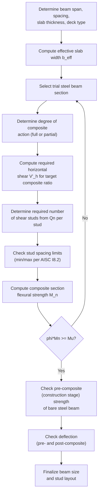

## Composite Steel-Concrete Construction Basics

### Overview

Composite construction combines structural steel and reinforced concrete so that the two materials act together as a single structural element, leveraging steel's tensile strength and ductility alongside concrete's compressive strength and stiffness. When properly connected, the composite section achieves greater strength and stiffness than either material would provide alone, or than the same materials would provide acting independently (non-compositely). Design provisions are codified in **AISC 360, Chapter I** (Design of Composite Members), covering composite beams, composite columns (encased and filled), and composite diaphragms/collector systems.

---

### Fundamental Principle: Composite Action

**Composite action** occurs when shear transfer between steel and concrete is sufficient to make the two materials behave as an integrated section rather than two independent, slipping layers.

**Key Points**

- Without adequate shear connection, a steel beam supporting a concrete slab would behave **non-compositely** — the slab and beam would each bend independently, with slip occurring at the interface, and the combined strength/stiffness would be far less than a true composite section.
- With full composite action, the concrete slab effectively becomes the compression flange of the system, dramatically increasing flexural stiffness and strength compared to the bare steel section alone — often allowing a 20–30% reduction in steel beam weight for the same span and loading. [Inference] — the specific weight-reduction percentage depends on span, loading, and slab thickness; it is a general order-of-magnitude industry observation rather than a fixed code value.

---

### Composite Beam Systems

The most common application is a **composite beam**: a steel wide-flange beam connected to a concrete slab (typically cast on metal deck) via **shear studs** welded to the top flange.

#### Shear Studs (Headed Stud Anchors)

$$Q_n = 0.5 A_{sa}\sqrt{f'_c E_c} \leq R_g R_p A_{sa} F_u$$

Where:

- $A_{sa}$ = cross-sectional area of the stud shank
- $f'_c$ = concrete compressive strength
- $E_c$ = modulus of elasticity of concrete
- $F_u$ = specified minimum tensile strength of the stud (typically 450 MPa for standard studs)
- $R_g, R_p$ = reduction factors for deck geometry and stud position relative to deck ribs

**Key Points**

- The first term ($0.5A_{sa}\sqrt{f'_c E_c}$) represents concrete-controlled failure (concrete crushing/splitting around the stud).
- The second term ($R_gR_pA_{sa}F_u$) represents steel-controlled failure (stud shank shearing off).
- The governing (lower) value controls — for typical normal-weight concrete and standard stud sizes, concrete strength often controls for lower $f'_c$, while stud shear strength controls for higher $f'_c$ or smaller studs. [Inference] — which term governs is geometry- and material-specific and should be checked explicitly rather than assumed.

---

#### Degree of Composite Action

- **Full composite action**: sufficient studs are provided so that the beam can develop its full plastic moment capacity assuming complete shear transfer.
- **Partial composite action**: fewer studs are provided than required for full composite action; flexural strength is correspondingly reduced but may still be economical (fewer studs = lower cost) if the reduced capacity is still adequate.

$$\sum Q_n \geq \text{(required horizontal shear for the desired degree of composite action)}$$

**Required horizontal shear for full composite action** (governed by the smaller of concrete crushing or steel yielding):

$$V'_h = \min(0.85 f'_c A_c,\ F_y A_s)$$

Where $A_c$ = effective concrete area in compression, $A_s$ = steel beam cross-sectional area.

**Key Points**

- Partial composite design is common in practice because full composite action often requires more studs than are needed to satisfy strength — engineers frequently target 25–50% composite action for economy when deflection and strength checks still pass, though full composite action is used when maximum stiffness or capacity is needed. [Inference] — specific percentage targets are a matter of engineering judgment and project economics rather than a fixed code requirement.

---

### Effective Slab Width

For composite beam design, only a portion of the slab width is considered "effective" in resisting compression (accounting for shear lag across the slab width, analogous to shear lag in tension members):

$$b_{eff} = \min\left(\frac{L}{4},\ \text{beam spacing}\right) \times 2 \text{ (for interior beams, summed both sides)}$$

More precisely, AISC 360 I3.1a specifies the effective width on each side of the beam centerline as the smaller of $L/8$ (span/8) or half the distance to the centerline of the adjacent beam (for interior beams) or the distance to the edge of slab (for edge beams).

---

### Composite Beam Behavior — Conceptual Diagram (svg_diagram)

<svg xmlns="http://www.w3.org/2000/svg" viewBox="0 0 520 260">
<text x="260" y="20" font-size="14" font-weight="bold" text-anchor="middle">Composite Beam Cross-Section (svg_diagram)</text>
<rect x="140" y="50" width="240" height="40" fill="#bdc3c7" stroke="#333" stroke-width="1" />
<text x="260" y="75" font-size="11" text-anchor="middle">Concrete Slab (compression)</text>
<rect x="230" y="90" width="60" height="10" fill="#7f8c8d" stroke="#333" />
<line x1="250" y1="100" x2="250" y2="120" stroke="#333" stroke-width="3" />
<line x1="270" y1="100" x2="270" y2="120" stroke="#333" stroke-width="3" />
<text x="330" y="110" font-size="10">Shear studs</text>
<rect x="220" y="120" width="80" height="8" fill="#34495e" />
<rect x="245" y="128" width="10" height="70" fill="#34495e" />
<rect x="220" y="198" width="80" height="8" fill="#34495e" />
<text x="260" y="220" font-size="11" text-anchor="middle">Steel Beam (tension flange)</text>
<line x1="60" y1="70" x2="60" y2="204" stroke="#666" stroke-width="1" />
<text x="30" y="140" font-size="10" text-anchor="middle" transform="rotate(-90 30 140)">Composite depth</text>
<path d="M 160 240 Q 260 250 360 240" stroke="#e74c3c" stroke-width="1.5" fill="none" stroke-dasharray="4,2" />
<text x="260" y="255" font-size="9" text-anchor="middle" fill="#e74c3c">Plastic neutral axis (varies with composite ratio)</text>
</svg>

---

### Composite Columns

AISC 360 Chapter I recognizes two primary composite column types:

**1. Encased Composite Columns** — a steel shape fully encased in reinforced concrete.

**2. Filled Composite Columns (CFT — Concrete-Filled Tubes)** — a hollow structural steel section (typically round or rectangular HSS) filled with concrete.

**Nominal compressive strength** follows a modified version of the bare-steel column curve (AISC 360 I2.1b), using **modified stiffness and strength parameters** that account for composite action:

$$P_{no} = F_y A_s + F_{ysr} A_{sr} + 0.85 f'_c A_c \quad (\text{encased, or similar form for filled})$$

$$EI_{eff} = E_s I_s + E_s I_{sr} + C_3 E_c I_c$$

Where subscripts $s$ = steel shape, $sr$ = reinforcing steel, $c$ = concrete, and $C_3$ is a stiffness reduction coefficient reflecting cracking/creep effects in concrete.

**Key Points**

- **Encased columns** benefit from concrete's fire protection and corrosion protection for the embedded steel, at the cost of increased formwork/labor.
- **Filled columns (CFT)** benefit from the steel tube acting as permanent formwork (no separate formwork needed) and providing confinement to the concrete core, which increases the concrete's effective compressive strength beyond its unconfined value — this confinement effect is a key advantage of round CFT sections in particular.
- CFT sections are increasingly popular in high-rise construction for their combination of high strength-to-weight ratio, fire resistance (concrete core provides thermal mass), and construction speed (steel tube erects quickly, concrete pumped later).

---

### Deck Types in Composite Floor Systems

- **Metal deck (composite deck)** — corrugated steel decking that serves as both permanent formwork for the concrete slab and, when properly detailed with embossments, contributes some composite action between deck and slab itself (separate from beam-to-slab composite action).
- **Deck orientation relative to beam span**: deck ribs can run parallel or perpendicular to the supporting beam, which affects the $R_g$ and $R_p$ reduction factors used in stud strength calculations (studs in perpendicular ribs typically have reduced strength compared to studs through a flat slab or parallel ribs, due to reduced concrete confinement around the stud within the rib).

---

### Design Procedure — Composite Beam

---

### Example: Composite Beam Stud Requirement (Simplified)

**Given:** A composite beam requires $V'_h = 1800$ kN of horizontal shear transfer for full composite action. Each 19 mm shear stud provides $Q_n = 105$ kN (governing value, steel-controlled).

**Number of studs required (each side of maximum moment point, i.e., half the beam for a simply supported span):**

$$n = \frac{V'_h}{Q_n} = \frac{1800}{105} \approx 17.1 \rightarrow 18 \text{ studs (each half-span)}$$

**Total studs for the full beam:** $18 \times 2 = 36$ studs.

**Key Points**

- Studs are typically distributed uniformly between the point of maximum moment and the nearest point of zero moment (support), unless concentrated loads require adjusted spacing per AISC 360 I8.2.
- This calculation determines stud quantity for strength; spacing limits (minimum 6 diameters longitudinally, 4 diameters transversely; maximum 8 times slab thickness) must also be checked for placement feasibility.

---

### Construction Sequence Considerations

**Key Points**

- Before the concrete cures, the steel beam alone must support construction loads (wet concrete weight, formwork, construction live load) acting **non-compositely** — this "construction stage" check is often overlooked but can govern beam selection, particularly for long spans or when shoring is not used.
- **Unshored construction** (no temporary support during concrete placement) requires the bare steel section to carry full construction dead load alone, often governing beam size for longer spans.
- **Shored construction** (temporary supports remove load from the steel beam until concrete cures) allows the composite section to resist a larger share of the total load, potentially permitting a smaller beam, at the added cost and schedule impact of shoring installation and removal.

---

### Common Pitfalls in Composite Design

| Pitfall | Consequence |
| --- | --- |
| Neglecting construction-stage (pre-composite) strength check | Bare steel beam overstressed during concrete placement |
| Assuming full composite action without verifying stud quantity | Overestimated flexural strength |
| Ignoring deck rib orientation effects on stud strength ($R_g$, $R_p$) | Overestimated shear stud capacity |
| Omitting confinement benefit verification for CFT (assuming plain concrete strength) | Understated or overstated capacity depending on direction of error |
| Neglecting deflection check under wet concrete (pre-composite stiffness only) | Excessive ponding or slab thickness variation during placement |
| Exceeding maximum stud spacing (governing slab/deck buckling between studs) | Local slab or deck instability during construction or service |

---

**Related Topics**

- Shear Stud Design and Deck Reduction Factors (AISC 360 I8)
- Concrete-Filled Tube (CFT) Column Design and Confinement Effects
- Encased Composite Column Design
- Composite Deck Systems and Metal Deck Selection
- Partial vs. Full Composite Action — Economic Trade-offs
- Construction Stage (Pre-Composite) Beam Design
- Composite Diaphragms and Collector Design