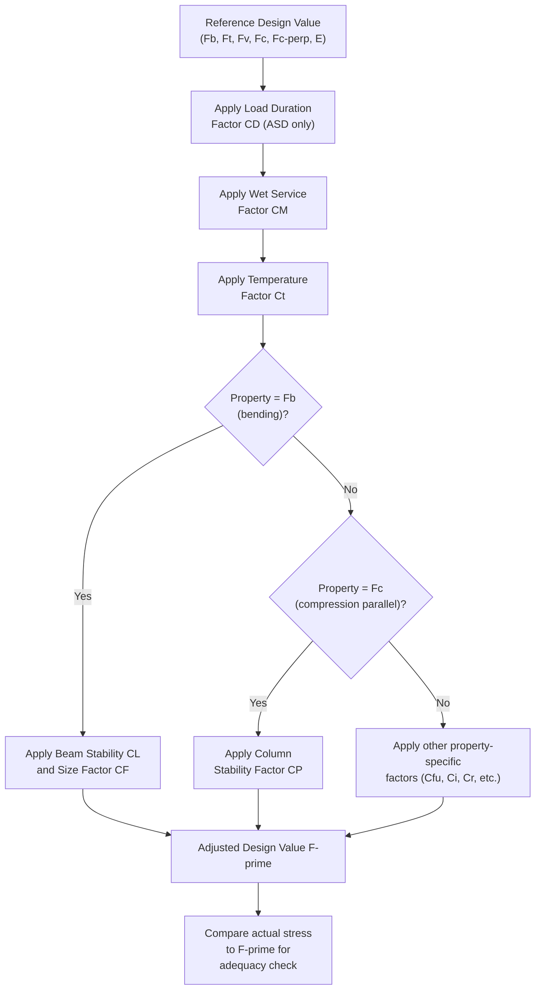

## Timber Design Codes and Adjustment Factors

### Overview

Timber (wood) structural design differs fundamentally from steel or concrete design because wood is a **natural, anisotropic, orthotropic material** whose strength properties vary with grain direction, moisture content, load duration, temperature, and species. Rather than a single set of static allowable stresses, timber design relies on a **reference design value** for each stress type, modified by a series of **adjustment factors (C-factors)** that account for the specific in-service conditions of the member being designed. The governing U.S. standard is the **National Design Specification for Wood Construction (NDS)**, published by the American Wood Council (AWC), used in conjunction with the **Supplement: Design Values for Wood Construction**.

---

### Governing Codes and Standards

| Standard | Scope |
| --- | --- |
| **NDS (ANSI/AWC NDS)** | Core design specification — allowable stress design (ASD) and LRFD provisions for sawn lumber, glulam, structural composite lumber, connections |
| **NDS Supplement** | Tabulated reference design values by species/grade |
| **ANSI/AWC SDPWS** | Special Design Provisions for Wind and Seismic (diaphragms, shear walls) |
| **ANSI/APA PRG 320** | Cross-laminated timber (CLT) product standard |
| **ASTM D voluminous series** | Testing standards underlying reference design values (e.g., D198, D245, D2915) |
| **IBC (International Building Code)** | Adopts NDS by reference for wood structural design |

**Key Points**

- Unlike AISC 360 (steel) or ACI 318 (concrete), which are largely self-contained, timber design draws on a broader family of interrelated standards because wood products (sawn lumber, glulam, CLT, I-joists, LVL) each have distinct manufacturing standards feeding into the unified NDS design framework.
- The NDS supports **both ASD and LRFD** methodologies, similar to AISC 360's unified format, though ASD remains the dominant method in practice for wood design in the U.S.

---

### Reference Design Values

Reference design values represent the baseline strength of a wood member under a standardized set of conditions (specific moisture content, load duration, temperature, and size). Common reference values include:

| Symbol | Property |
| --- | --- |
| $F_b$ | Bending strength |
| $F_t$ | Tension strength (parallel to grain) |
| $F_v$ | Shear strength (parallel to grain) |
| $F_{c\perp}$ | Compression strength perpendicular to grain |
| $F_c$ | Compression strength parallel to grain |
| $E$, $E_{min}$ | Modulus of elasticity (average, and reduced value for stability calculations) |

**Key Points**

- These values are tabulated by **species/species combination and grade** (e.g., Douglas Fir-Larch No. 2, Southern Pine Select Structural) in the NDS Supplement, derived from extensive full-size member testing per ASTM standards.
- $F_{c\perp}$ (compression perpendicular to grain, e.g., at bearing points) is typically much lower than $F_c$ (compression parallel to grain, along the fibers) — this directional strength disparity is a defining characteristic of wood's orthotropic behavior and a frequent source of bearing-related design checks (e.g., at beam supports, sill plates).

---

### The Adjustment Factor Framework

The core NDS design equation for allowable stress design is:

$$F'_{property} = F_{property} \times (\text{applicable adjustment factors})$$

For example, adjusted bending strength:

$$F'_b = F_b \times C_D \times C_M \times C_t \times C_L \times C_F \times C_fu \times C_i \times C_r$$

**Key Points**

- Not all factors apply to all properties — each property ($F_b$, $F_t$, $F_v$, $F_c$, $F_{c\perp}$, $E$) has its own specific applicable subset of factors, tabulated in NDS Table 4.3.1 (sawn lumber) or corresponding tables for glulam/other products.
- This multiplicative framework allows a single tabulated reference value to be adapted to the actual, highly variable in-service conditions a timber member experiences — a critical necessity given wood's sensitivity to environmental and loading conditions compared to steel or concrete.

---

### Key Adjustment Factors

#### Load Duration Factor ($C_D$) — ASD only

Wood exhibits **time-dependent strength** — it can sustain higher stress for short durations than for sustained (long-term) loading, a phenomenon captured by the empirical **Madison Curve**.

| Load Type | Duration | $C_D$ |
| --- | --- | --- |
| Dead load (permanent) | 10 years (reference) | 0.9 |
| Occupancy live load | 10 years | 1.0 |
| Snow load | 2 months | 1.15 |
| Construction load | 7 days | 1.25 |
| Wind/seismic | 10 minutes | 1.6 |
| Impact | Instantaneous | 2.0 |

**Key Points**

- $C_D$ is unique to wood design among the major structural materials — steel and concrete strength are not adjusted for load duration in the same explicit, tabulated manner.
- When multiple load combinations are checked, the $C_D$ associated with the **shortest-duration load in that combination governs** for that specific combination — e.g., a combination including wind uses $C_D = 1.6$, not the dead-load-only value.
- LRFD uses an analogous but distinct **time effect factor ($\lambda$)** rather than $C_D$, reflecting the different probabilistic basis of the LRFD format.

---

#### Wet Service Factor ($C_M$)

Accounts for reduced strength when wood moisture content exceeds 19% in service (as opposed to the standard "dry" reference condition, typically ≤19% MC for sawn lumber).

**Key Points**

- $C_M$ values are less than 1.0 for most properties in wet-service conditions (e.g., 0.85 for $F_b$, varies by property), reflecting wood's reduced strength and stiffness when moisture content is elevated.
- Applies to exterior, unprotected, or high-humidity applications (e.g., exposed decks, wet-use industrial buildings) — this factor does not apply to typical fully enclosed, climate-controlled interior construction.

---

#### Temperature Factor ($C_t$)

Accounts for strength reduction at sustained elevated temperatures (above 38°C/100°F), relevant for industrial or high-temperature service environments.

---

#### Beam Stability Factor ($C_L$)

Analogous to lateral-torsional buckling in steel beams — accounts for lateral-torsional instability of the compression edge of a bending member when it is not braced or is only partially braced along its length.

$$C_L = \frac{1 + (F_{bE}/F_b^*)}{1.9} - \sqrt{\left[\frac{1+(F_{bE}/F_b^*)}{1.9}\right]^2 - \frac{F_{bE}/F_b^*}{0.95}}$$

Where $F_{bE} = \frac{1.20 E_{min}}{R_B^2}$ and $R_B$ is the slenderness ratio for bending members based on unbraced length and cross-sectional dimensions.

**Key Points**

- $C_L = 1.0$ when the compression edge is fully laterally braced (e.g., by continuous sheathing or closely spaced blocking) — instability is not a concern.
- $C_L$ decreases (increasing the buckling penalty) as unbraced length increases relative to the beam's depth-to-width ratio, conceptually paralleling the LTB reduction curve in steel beam design (Chapter F of AISC 360), though the underlying empirical formula differs.

---

#### Size Factor ($C_F$)

Accounts for the statistically observed reduction in strength (particularly bending and tension) as sawn lumber member size increases, due to the greater probability of larger, strength-reducing defects being present in larger pieces (the "size effect" in brittle/quasi-brittle materials).

**Key Points**

- $C_F$ values are tabulated by grade and nominal dimension in NDS Supplement tables; values increase for smaller/lighter framing sizes (e.g., 2×4) and are generally at or near 1.0 for larger, higher-grade dimension lumber.
- This factor is unique to visually graded sawn lumber — it does not apply in the same form to glulam or engineered wood products, which have their own volume-effect adjustments ($C_V$).

---

#### Repetitive Member Factor ($C_r$)

Applies to bending members (e.g., joists, rafters, studs) spaced no more than 610 mm (24 in) on center, connected by sheathing or similar load-sharing elements, and consisting of at least 3 members. $C_r = 1.15$ for such repetitive-member systems.

**Key Points**

- $C_r$ reflects the observed system effect where adjacent framing members share and redistribute load through the connecting sheathing/decking, reducing the effective consequence of any single member's below-average strength — a form of structural redundancy specific to closely spaced, sheathed wood framing systems.

---

#### Flat Use Factor ($C_{fu}$)

Applies when a rectangular sawn lumber bending member is loaded about its weak axis (loaded flatwise, on its wide face, rather than the typical strong-axis orientation).

#### Incising Factor ($C_i$)

Accounts for the strength reduction caused by incising (small pressure-relief cuts made in lumber surfaces) prior to pressure-preservative treatment, which is necessary for adequate chemical penetration but slightly reduces mechanical properties.

#### Column Stability Factor ($C_P$)

Analogous to the steel column buckling curve — accounts for buckling of compression members (columns/studs) based on slenderness ratio.

$$C_P = \frac{1+(F_{cE}/F_c^*)}{2c} - \sqrt{\left[\frac{1+(F_{cE}/F_c^*)}{2c}\right]^2 - \frac{F_{cE}/F_c^*}{c}}$$

Where $c = 0.8$ for sawn lumber, $0.9$ for glulam/structural composite lumber, and $F_{cE} = \frac{0.822 E_{min}}{(l_e/d)^2}$.

**Key Points**

- The wood column stability equation is empirically calibrated (via the Ylinen equation form), paralleling in spirit — but numerically distinct from — the AISC steel column curve; the "c" coefficient adjusts the curve shape differently for sawn lumber versus manufactured wood products, reflecting their differing variability characteristics.

---

### Adjustment Factor Applicability Diagram

---

### Example: Adjusted Bending Strength Calculation

**Given:** A 2×10 Douglas Fir-Larch No. 1 joist, $F_b = 13.8$ MPa (reference, tabulated), repetitive member framing (16" o.c., sheathed), dry interior condition, normal temperature, snow load governs the critical combination ($C_D = 1.15$), fully braced compression edge ($C_L = 1.0$), $C_F = 1.0$ (size factor for this grade/size per table), $C_r = 1.15$ (repetitive member).

**Applicable factors for this case:** $C_D$, $C_M = 1.0$ (dry service), $C_t = 1.0$ (normal temp), $C_L = 1.0$, $C_F = 1.0$, $C_r = 1.15$.

$$F'_b = F_b \times C_D \times C_M \times C_t \times C_L \times C_F \times C_r$$

$$F'_b = 13.8 \times 1.15 \times 1.0 \times 1.0 \times 1.0 \times 1.0 \times 1.15 = 18.25\ \text{MPa}$$

**Key Points**

- The combined effect of favorable load duration ($C_D = 1.15$ for snow) and repetitive member sharing ($C_r = 1.15$) increased the usable bending strength by roughly 32% above the bare reference value — illustrating why identifying all applicable factors correctly is essential; omitting a legitimately applicable increase factor produces an overly conservative (uneconomical) design, while missing an applicable reduction factor is unconservative and unsafe.

---

### ASD vs. LRFD in Timber Design

| Aspect | ASD | LRFD |
| --- | --- | --- |
| Load duration adjustment | $C_D$ (multiplies reference strength) | $\lambda$ (time effect factor, similar concept, different values/basis) |
| Format | $F'_b \geq f_b$ (adjusted allowable stress vs. actual stress) | $\phi R_n \geq R_u$ (design strength vs. factored demand) |
| Resistance factors | Not used (safety embedded in reference values/factors) | $\phi$ factors per NDS Table N3 (e.g., $\phi_b = 0.85$ for bending) |
| U.S. practice prevalence | Dominant in current practice | Less common, though codified and available |

---

### Common Pitfalls in Timber Adjustment Factor Application

| Pitfall | Consequence |
| --- | --- |
| Using $C_D$ for the longest-duration load in a combination instead of the governing (shortest, for that specific combination) load | Unconservative or overly conservative strength for that load case |
| Omitting $C_M$ for exterior/wet-use applications | Overestimated strength in moisture-exposed members |
| Applying $C_r$ to members not meeting spacing/connection/quantity requirements | Unconservative strength increase for non-qualifying framing |
| Neglecting $C_L$ for beams with long unbraced compression edges | Unconservative bending capacity, undetected lateral-torsional instability |
| Confusing $C_D$ (ASD) with $\lambda$ (LRFD) values when mixing design approaches | Incorrect adjusted strength, inconsistent safety margin |
| Applying sawn-lumber-specific factors (e.g., $C_F$) to glulam or engineered wood without checking product-specific applicability | Incorrect design value adjustment |

---

**Related Topics**

- Sawn Lumber vs. Engineered Wood Products (Glulam, LVL, CLT, I-Joists)
- Wood Connection Design (Bolts, Nails, Lag Screws — NDS Chapter 12)
- Diaphragm and Shear Wall Design (ANSI/AWC SDPWS)
- Wood Beam and Column Member Design (Applying Adjusted Values)
- Cross-Laminated Timber (CLT) Design Basics
- Preservative Treatment and Durability of Wood Structures
- Fire Design of Wood Structures (Char Rate Method)