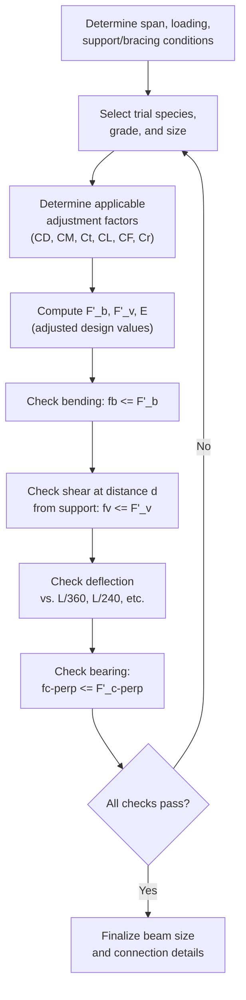

## Design of Sawn Lumber Beams and Columns

### Overview

Sawn lumber beams and columns are the most common structural wood elements, used as joists, rafters, headers, studs, and posts in light-frame and heavy-timber construction. Design follows the **NDS (National Design Specification for Wood Construction)** framework: reference design values are adjusted by the applicable C-factors (as covered in adjustment factor fundamentals), then checked against actual member stresses for bending, shear, compression, and deflection. Unlike steel or concrete members with a single dominant failure mode per limit state, sawn lumber design typically requires checking **several independent, often equally critical, limit states** because wood's strength varies so significantly by loading direction and stress type.

---

### Beam Design — Governing Limit States

A sawn lumber beam must be checked for:

1. **Bending stress** (strong-axis flexure)
2. **Shear stress** (horizontal shear parallel to grain)
3. **Deflection** (serviceability)
4. **Bearing** (compression perpendicular to grain at supports)
5. **Lateral-torsional (beam) stability**, if not fully braced

---

#### 1. Bending Check

$$f_b = \frac{M}{S} \leq F'_b$$

Where $M$ = applied bending moment, $S$ = section modulus ($S = \frac{bd^2}{6}$ for rectangular sections), and $F'_b$ = adjusted bending design value (per applicable $C_D, C_M, C_t, C_L, C_F, C_r$, etc.).

**Key Points**

- Because $S$ depends on $bd^2$, beam depth $d$ has a much greater effect on bending capacity than width $b$ — doubling depth quadruples $S$ for the same width, which is why wood beams are typically proportioned much deeper than wide.

---

#### 2. Shear Check

$$f_v = \frac{VQ}{Ib} = \frac{1.5V}{bd} \quad (\text{for rectangular sections}) \leq F'_v$$

**Key Points**

- The $1.5V/bd$ simplified form comes from the parabolic shear stress distribution in a rectangular cross-section, where maximum shear stress occurs at the neutral axis and equals 1.5 times the average shear stress.
- NDS permits **shear check at a reduced location**: for beams supported by bearing at the ends (not by a hanger or other means that prevents natural stress relief near supports), the shear force may be computed at a distance $d$ (the beam depth) from the face of the support, rather than at the support face itself, since concentrated reactions near the support create local stress conditions not representative of the beam's shear capacity away from the support. This is analogous in concept, though not in numerical basis, to reduced-shear-check provisions found in some concrete and steel design contexts.
- Wood's shear strength parallel to grain ($F_v$) is comparatively low, and shear (rather than bending) often governs for **short, heavily loaded beams**, especially with concentrated loads near supports.

---

#### 3. Deflection Check

$$\Delta_{actual} = \frac{5wL^4}{384EI} \quad (\text{uniform load, simple span})$$

Compared against serviceability limits:

| Application | Live Load Limit | Total Load Limit |
| --- | --- | --- |
| Floor joists | $L/360$ | $L/240$ |
| Roof joists/rafters (no ceiling) | $L/180$ | $L/120$ |
| Roof joists/rafters (with plaster/drywall ceiling) | $L/240$ | $L/180$ |

**Key Points**

- Deflection calculations use the **unadjusted** modulus of elasticity, $E$ (not $E_{min}$, which is reserved for stability calculations like $C_L$ and $C_P$) — $E$ and $E_{min}$ serve distinctly different purposes within the NDS framework and must not be interchanged.
- Long-term (creep) deflection under sustained loads (dead load, long-term live load) can be significantly greater than instantaneous elastic deflection; many designers apply a creep factor (commonly around 1.5–2.0 for wood under sustained load, per NDS Appendix or project-specific criteria) to sustained load components. [Unverified] — specific creep multiplier values and when they must be applied vary by application (e.g., NDS Appendix guidance vs. project specification), and should be confirmed against the applicable governing document for the project.

---

#### 4. Bearing Check (Compression Perpendicular to Grain)

$$f_{c\perp} = \frac{R}{A_{bearing}} \leq F'_{c\perp}$$

Where $R$ = reaction force at the bearing point, $A_{bearing}$ = contact bearing area.

**Key Points**

- $F_{c\perp}$ is typically the **lowest** reference design value among all the stress properties for a given wood species/grade, reflecting wood's inherent weakness across (rather than along) the grain direction.
- For bearing lengths less than 150 mm (6 in) at the end of a member, NDS permits a **bearing area factor ($C_b$)** that increases the effective allowable $F_{c\perp}$, reflecting the beneficial confinement effect of surrounding unstressed wood fibers near a short bearing length.

---

#### 5. Beam Stability (Lateral-Torsional Buckling)

Governed by the **beam stability factor $C_L$** (detailed in the adjustment factors framework), which depends on the **slenderness ratio for bending members**:

$$R_B = \sqrt{\frac{l_e d}{b^2}} \leq 50$$

Where $l_e$ = effective unbraced length (function of actual unbraced length and loading/support conditions per NDS Table 3.3.3), $d$ = depth, $b$ = breadth (width).

**Key Points**

- $R_B \leq 50$ is an absolute NDS limit — beams exceeding this slenderness ratio are not permitted regardless of calculated $C_L$, reflecting a practical upper bound on the applicability of the beam stability equation itself.
- Beams with continuous lateral support of the compression edge (e.g., structural sheathing nailed directly to the top of a joist) may take $C_L = 1.0$ without further calculation, since lateral-torsional buckling is effectively prevented.

---

### Beam Design Procedure

---

### Example: Sawn Lumber Beam Design Check

**Given:** A simply supported floor joist, span $L = 4.0$ m, Douglas Fir-Larch No. 1, 2×10 nominal (actual: 38×235 mm), uniform load $w = 4.5$ kN/m (factored ASD design load, already including duration considerations), $F_b = 13.8$ MPa, $F_v = 1.55$ MPa, $E = 12{,}400$ MPa, repetitive member ($C_r = 1.15$), fully sheathed top edge ($C_L = 1.0$), dry service, normal temperature, $C_D = 1.0$ (occupancy live load governs), $C_F = 1.0$.

**Section properties:** $b = 38$ mm, $d = 235$ mm, $S = \frac{38 \times 235^2}{6} = 349{,}758\ \text{mm}^3$, $I = \frac{38\times235^3}{12} = 41.1\times10^6\ \text{mm}^4$, $A = 8930\ \text{mm}^2$.

**Step 1 — Maximum moment and shear:**

$$M = \frac{wL^2}{8} = \frac{4.5 \times 4.0^2}{8} = 9.0\ \text{kN·m}$$

$$V = \frac{wL}{2} = \frac{4.5\times4.0}{2} = 9.0\ \text{kN}$$

**Step 2 — Bending check:**

$$F'_b = 13.8 \times 1.0 \times 1.0 \times 1.15 = 15.87\ \text{MPa}$$

$$f_b = \frac{9.0\times10^6}{349{,}758} = 25.7\ \text{MPa}$$

**Check:** $25.7\ \text{MPa} > 15.87\ \text{MPa}$ ✗ — **fails bending**, section is inadequate; a deeper/larger joist or closer spacing is required.

**Key Points**

- This result illustrates a common real-world outcome: a nominal 2×10 at 4.0 m span under this load is undersized — actual joist design would iterate to a larger member (e.g., 2×12, engineered I-joist, or reduced spacing) to satisfy bending. The example is intentionally carried through to a failing check to demonstrate the comparison process; a full design would proceed to select a revised trial section and re-check all limit states.

---

### Column Design — Sawn Lumber

Compression members (posts, studs) are checked against **buckling** using the **column stability factor $C_P$**, following the Ylinen-based equation introduced in the adjustment factors discussion.

$$f_c = \frac{P}{A} \leq F'_c = F_c^* \times C_P$$

Where $F_c^* = F_c \times C_D \times C_M \times C_t \times C_F$ (all applicable factors except $C_P$ itself), and:

$$F_{cE} = \frac{0.822 E'_{min}}{(l_e/d)^2}$$

$$C_P = \frac{1+(F_{cE}/F_c^*)}{2c} - \sqrt{\left[\frac{1+(F_{cE}/F_c^*)}{2c}\right]^2 - \frac{F_{cE}/F_c^*}{c}}, \qquad c = 0.8 \text{ (sawn lumber)}$$

**Key Points**

- $E'_{min}$ (adjusted minimum modulus of elasticity, incorporating a built-in reduction for variability) is used specifically for stability calculations ($C_P$, $C_L$) — distinct from the average adjusted $E$ used for deflection.
- The slenderness ratio $l_e/d$ must be checked for **both principal axes** of a rectangular column (since $b \neq d$ typically), and the **larger** resulting slenderness ratio (weaker axis) governs $C_P$, analogous to weak-axis governance in steel column design.
- NDS limits column slenderness to $l_e/d \leq 50$ for sawn lumber compression members.

---

### Example: Sawn Lumber Column Check

**Given:** A 6×6 nominal (actual 140×140 mm) Douglas Fir-Larch No. 1 post, unbraced length $L = 3.0$ m (both axes, pinned-pinned, $K=1.0$), $F_c = 11.4$ MPa, $E_{min} = 4{,}530$ MPa (already adjusted, representative value), $C_D = 1.0$, $C_M = C_t = C_F = 1.0$, factored axial load $P = 130$ kN.

**Section properties:** $A = 140\times140 = 19{,}600\ \text{mm}^2$, $d = 140$ mm (both directions, square).

**Step 1 — Slenderness ratio:**

$$\frac{l_e}{d} = \frac{3000}{140} = 21.4 \quad (< 50,\ \text{OK})$$

**Step 2 — $F_{cE}$:**

$$F_{cE} = \frac{0.822 \times 4530}{(21.4)^2} = \frac{3724.7}{458.0} = 8.13\ \text{MPa}$$

**Step 3 — $F_c^*$ (no adjustment beyond base value in this case):**

$$F_c^* = 11.4\ \text{MPa}$$

**Step 4 — $C_P$:**

$$\frac{F_{cE}}{F_c^*} = \frac{8.13}{11.4} = 0.713$$

$$C_P = \frac{1+0.713}{1.6} - \sqrt{\left[\frac{1+0.713}{1.6}\right]^2 - \frac{0.713}{0.8}}$$

$$= 1.071 - \sqrt{1.147 - 0.891} = 1.071 - \sqrt{0.256} = 1.071 - 0.506 = 0.565$$

**Step 5 — Adjusted compressive strength and check:**

$$F'_c = 11.4 \times 0.565 = 6.44\ \text{MPa}$$

$$f_c = \frac{130{,}000}{19{,}600} = 6.63\ \text{MPa}$$

**Check:** $6.63\ \text{MPa} > 6.44\ \text{MPa}$ ✗ — **fails by approximately 3%**; a marginally larger post section or reduced unbraced length (added bracing) would resolve the deficiency.

**Key Points**

- The column stability factor reduced the base compressive strength by roughly 44% ($C_P = 0.565$) due to slenderness effects — illustrating how significantly buckling governs wood column capacity even at moderate slenderness ratios, reinforcing why unbraced length control (blocking, bracing) is often more effective than simply increasing section size.

---

### Combined Bending and Axial Load (Beam-Columns)

For members subject to combined axial compression and bending (common in wall studs under gravity + lateral wind load), NDS provides an interaction equation:

$$\left(\frac{f_c}{F'_c}\right)^2 + \frac{f_{b1}}{F'_{b1}\left(1 - \frac{f_c}{F_{cE1}}\right)} \leq 1.0$$

**Key Points**

- This equation parallels the beam-column interaction concept used in steel design (AISC 360 Chapter H), but the specific mathematical form is unique to the NDS and incorporates a $P$-$\delta$-like amplification term implicitly through the $(1 - f_c/F_{cE1})$ denominator, which increases the effective bending stress demand as axial load approaches the member's elastic buckling capacity.

---

### Common Pitfalls in Sawn Lumber Beam and Column Design

| Pitfall | Consequence |
| --- | --- |
| Checking shear at the support face instead of at distance $d$ from support | Overly conservative shear design, though not unsafe |
| Using $E$ instead of $E_{min}$ (or vice versa) for stability vs. deflection calculations | Incorrect stability or deflection results |
| Neglecting bearing check at supports (assuming bending/shear govern) | Undetected crushing perpendicular to grain at reactions |
| Ignoring beam stability factor $C_L$ for unbraced compression edges | Unconservative bending capacity |
| Using the wrong (stronger) axis slenderness ratio for column $C_P$ calculation | Unconservative column capacity |
| Omitting combined bending-axial interaction check for studs under gravity + lateral load | Undetected overstress under combined loading |

---

**Related Topics**

- Engineered Wood Products: Glulam, LVL, and I-Joist Design
- Wood Connection Design (Bolted, Nailed, and Lag Screw Connections)
- Timber Diaphragm and Shear Wall Design
- Notching and Boring Limitations in Sawn Lumber Beams
- Preservative-Treated Wood and Incising Effects
- Wood Truss Design and Plate Connections
- Fire-Resistance Design of Heavy Timber Members