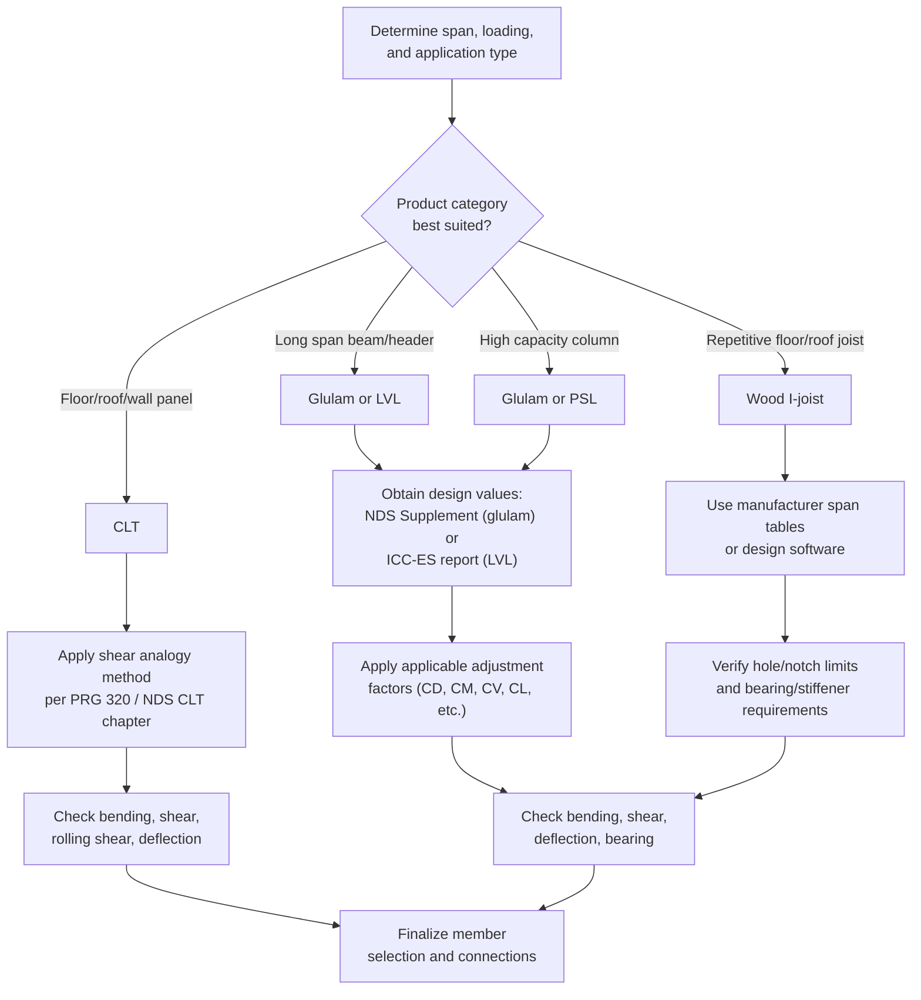

## Design of Engineered Wood Members

### Overview

Engineered wood products (EWPs) are manufactured from wood veneers, strands, fibers, or dimension lumber laminations, combined with adhesives under controlled factory conditions to produce structural members with **more uniform, predictable properties** than sawn lumber. Because manufacturing removes or redistributes natural defects (knots, grain slope) that limit sawn lumber strength and introduce variability, engineered wood products generally achieve higher design values, greater dimensional stability, and availability in larger sizes than solid-sawn lumber allows. Common EWP categories include **glued-laminated timber (glulam)**, **laminated veneer lumber (LVL)**, **parallel strand lumber (PSL)**, **laminated strand lumber (LSL)**, **wood I-joists**, and **cross-laminated timber (CLT)**. Design is governed by the **NDS**, individual **ICC-ES evaluation reports** (proprietary product-specific code-recognized values), and, for CLT, **ANSI/APA PRG 320**.

---

### Glued-Laminated Timber (Glulam)

Glulam consists of dimension lumber laminations (typically 25–50 mm thick) bonded together with structural adhesives under pressure, with grain oriented parallel to the member's long axis.

**Key Points**

- Glulam members are manufactured with **laminations graded and positioned by strength** — higher-grade laminations are placed at the outer (highest-stress) fibers in bending members, an approach that optimizes material use since bending stress is greatest at the extreme fibers and near zero at the neutral axis.
- Available in both **balanced** (symmetric layup, used when a member may see bending in either direction, e.g., due to load reversal) and **unbalanced** (asymmetric layup, more efficient when bending is known to occur in only one direction, e.g., simple-span gravity beams) configurations.
- Glulam design values include species/combination-specific reference values for $F_{bx}$ (positive and negative bending, which may differ for unbalanced layups), $F_{vx}$, $F_{c\perp}$, and $E_x$, tabulated in the NDS Supplement by **stress class** (e.g., 24F-1.8E).

**Adjustment factors specific to glulam:**

- **Volume factor ($C_V$)** replaces the sawn-lumber size factor ($C_F$) for glulam, reflecting the statistical size effect differently for manufactured members:

$$C_V = \left(\frac{21}{L}\right)^{1/x}\left(\frac{12}{d}\right)^{1/x}\left(\frac{5.125}{b}\right)^{1/x} \leq 1.0$$

Where $L$ = span (ft), $d$ = depth (in), $b$ = width (in), and $x$ is a species-dependent exponent (typically 10 for most species, 20 for Southern Pine). [Unverified] — units and exact exponent values follow NDS-specific imperial conventions embedded in the original empirical derivation; SI-unit practice typically converts through equivalent tabulated or software-based values rather than direct substitution.

- **Curvature factor ($C_c$)** applies to curved glulam members, reducing bending strength due to residual stresses induced by bending laminations to the specified radius during manufacturing.

---

### Laminated Veneer Lumber (LVL)

LVL is manufactured by bonding thin wood veneers (typically 2.5–3.2 mm thick) with grain oriented parallel to the member length, layered and pressed under heat.

**Key Points**

- LVL's manufacturing process (thin veneers, parallel grain, staggered joints) produces very consistent strength properties with minimal size effect compared to sawn lumber, and design values are typically published directly by the manufacturer via ICC-ES evaluation reports rather than derived from the general NDS Supplement tables used for sawn lumber and glulam.
- Common uses include headers, beams, rim boards, and flanges for engineered I-joists — LVL's high strength-to-depth ratio makes it well suited for long-span headers with limited depth.

---

### Parallel Strand Lumber (PSL) and Laminated Strand Lumber (LSL)

- **PSL** is manufactured from long wood strands (veneer clippings) aligned parallel to the length and bonded under pressure — commonly used for high-capacity beams and columns (e.g., Parallam®).
- **LSL** uses shorter strands than PSL, arranged with a greater proportion of cross-grain orientation, producing a product with different (generally somewhat lower strength but higher dimensional stability in certain directions) properties — used for both beams and, notably, studs and rim board applications.

**Key Points**

- PSL and LSL are proprietary products; design values and applicable adjustment factors come from the manufacturer's ICC-ES report rather than a generic NDS Supplement table — always confirm the specific product's published design values and code report number for a given project, since these values are trademarked/product-specific rather than generic species-based reference values.

---

### Wood I-Joists

Wood I-joists consist of an "I" cross-section: LVL or solid-sawn lumber flanges bonded to a thin OSB (oriented strand board) or plywood web, combining the bending efficiency of a wide-flange shape with lightweight, engineered material use.

**Key Points**

- The **flanges** resist the vast majority of bending moment (analogous to steel wide-flange behavior), while the **thin web** resists shear — this is a direct structural parallel to steel I-beam design principles, though failure modes and design equations are product-specific.
- Wood I-joists require careful attention to **web stiffeners** at concentrated loads/reactions (similar in principle to steel beam web crippling/stiffener requirements) and are highly sensitive to **field notching and hole-cutting**, which must strictly follow manufacturer-published limits since even small unauthorized web penetrations can dramatically reduce shear capacity.
- Design values, span tables, and allowable hole/notch locations are proprietary and published per-manufacturer (e.g., through software tools or printed span tables referencing the specific product's ICC-ES report) rather than through a generic NDS table.

---

### Cross-Laminated Timber (CLT)

CLT consists of layers (typically 3, 5, or 7) of dimension lumber boards stacked with grain direction rotated 90° between adjacent layers, then bonded under pressure — producing a panel product with **two-way structural behavior**, used for floor/roof panels and increasingly for mass-timber wall and structural systems.

**Key Points**

- The alternating grain orientation gives CLT dimensional stability and load-carrying capacity in both in-plane directions, unlike glulam or sawn lumber, which are strongest only in the direction parallel to grain — this cross-lamination is analogous conceptually to plywood's cross-ply construction, scaled up to structural panel thickness.
- CLT design uses a **shear analogy method** (or transformed-section method) to account for the fact that layers oriented perpendicular to the primary span direction contribute much less to bending stiffness/strength (due to their low strength/stiffness perpendicular to grain) than layers oriented parallel to span.
- Governed by **ANSI/APA PRG 320**, which establishes manufacturing/grading standards, and design values/methods are further detailed in the **NDS** (Chapter on CLT) and various APA/manufacturer design guides.
- CLT is central to modern **mass timber construction**, often used with **exposed structure** for architectural effect, requiring specific fire design approaches (char rate methods) since the wood itself, not applied fireproofing, provides the fire resistance rating in many applications.

---

### EWP Comparison Summary

| Product | Grain Orientation | Typical Use | Design Value Source |
| --- | --- | --- | --- |
| Glulam | Parallel, laminated layers | Beams, columns, curved members | NDS Supplement (stress class tables) |
| LVL | Parallel, thin veneers | Headers, beams, I-joist flanges | Manufacturer ICC-ES report |
| PSL | Parallel, long strands | High-capacity beams, columns | Manufacturer ICC-ES report |
| LSL | Mixed/cross strand orientation | Studs, rim board, beams | Manufacturer ICC-ES report |
| Wood I-joist | Flange (parallel) + web (OSB/plywood) | Floor/roof joists | Manufacturer span tables/software |
| CLT | Alternating 90° layers | Floor/roof/wall panels, mass timber | ANSI/APA PRG 320, NDS |

---

### EWP Cross-Section Comparison — Conceptual Diagram (svg_diagram)

<svg xmlns="http://www.w3.org/2000/svg" viewBox="0 0 560 260">
<text x="280" y="20" font-size="14" font-weight="bold" text-anchor="middle">Engineered Wood Cross-Sections (svg_diagram)</text>

<text x="80" y="45" font-size="11" text-anchor="middle">Glulam</text>

<rect x="50" y="55" width="60" height="120" fill="none" stroke="#333" stroke-width="1.5" />

<line x1="50" y1="70" x2="110" y2="70" stroke="#888" />

<line x1="50" y1="85" x2="110" y2="85" stroke="#888" />

<line x1="50" y1="100" x2="110" y2="100" stroke="#888" />

<line x1="50" y1="115" x2="110" y2="115" stroke="#888" />

<line x1="50" y1="130" x2="110" y2="130" stroke="#888" />

<line x1="50" y1="145" x2="110" y2="145" stroke="#888" />

<line x1="50" y1="160" x2="110" y2="160" stroke="#888" />

<text x="80" y="195" font-size="9" text-anchor="middle">Stacked laminations</text>

<text x="220" y="45" font-size="11" text-anchor="middle">Wood I-Joist</text>

<rect x="195" y="55" width="50" height="10" fill="`#8b5a2b`" stroke="#333" />

<rect x="212" y="65" width="16" height="100" fill="`#d4b896`" stroke="#333" />

<rect x="195" y="165" width="50" height="10" fill="`#8b5a2b`" stroke="#333" />

<text x="220" y="195" font-size="9" text-anchor="middle">LVL flanges + OSB web</text>

<text x="360" y="45" font-size="11" text-anchor="middle">PSL/LSL</text>

<rect x="330" y="55" width="60" height="120" fill="`#c9a876`" stroke="#333" stroke-width="1.5" />

<path d="M 335 60 L 385 65 M 335 75 L 385 80 M 335 90 L 385 95 M 335 105 L 385 110 M 335 120 L 385 125 M 335 135 L 385 140 M 335 150 L 385 155 M 335 165 L 385 170" stroke="`#a0805a`" stroke-width="1" />

<text x="360" y="195" font-size="9" text-anchor="middle">Aligned strands</text>

<text x="490" y="45" font-size="11" text-anchor="middle">CLT</text>

<rect x="460" y="55" width="60" height="20" fill="`#d4b896`" stroke="#333" />

<rect x="460" y="75" width="60" height="20" fill="`#a0805a`" stroke="#333" />

<rect x="460" y="95" width="60" height="20" fill="`#d4b896`" stroke="#333" />

<rect x="460" y="115" width="60" height="20" fill="`#a0805a`" stroke="#333" />

<rect x="460" y="135" width="60" height="20" fill="`#d4b896`" stroke="#333" />

<text x="490" y="195" font-size="9" text-anchor="middle">Cross-laminated layers</text>

</svg>

---

### Design Procedure — Engineered Wood Member Selection

---

### Example: Glulam Beam Volume Factor Application

**Given:** A 24F-1.8E DF glulam beam, reference $F_{bx} = 16.5$ MPa, span $L = 9.0$ m (≈29.5 ft), depth $d = 456$ mm (≈17.95 in), width $b = 130$ mm (≈5.12 in), species exponent $x = 10$.

**Volume factor (using imperial-based formula, converting inputs):**

$$C_V = \left(\frac{21}{29.5}\right)^{0.1}\left(\frac{12}{17.95}\right)^{0.1}\left(\frac{5.125}{5.12}\right)^{0.1}$$

$$= (0.712)^{0.1} \times (0.669)^{0.1} \times (1.001)^{0.1}$$

$$\approx 0.966 \times 0.960 \times 1.000 = 0.927$$

**Adjusted bending value (assuming $C_D = 1.0$, dry service, other factors = 1.0):**

$$F'_{bx} = 16.5 \times 0.927 = 15.3\ \text{MPa}$$

**Key Points**

- The volume factor reduced bending strength by roughly 7% for this larger-than-reference-size member, illustrating that even highly engineered products like glulam retain a statistical size effect — larger members still have a higher probability of containing a strength-limiting defect somewhere along their length compared to the small reference specimen size the base value was calibrated against.

---

### Common Pitfalls in Engineered Wood Design

| Pitfall | Consequence |
| --- | --- |
| Applying sawn-lumber size factor ($C_F$) to glulam instead of volume factor ($C_V$) | Incorrect (often unconservative) adjusted design value |
| Field-cutting holes/notches in wood I-joist webs beyond manufacturer limits | Significant shear capacity loss, potential failure |
| Using generic NDS Supplement values for proprietary LVL/PSL/LSL products | Incorrect design values; must use manufacturer ICC-ES report |
| Neglecting rolling shear check in CLT panels (shear between cross-oriented layers) | Undetected delamination-type failure mode unique to cross-laminated products |
| Ignoring curvature factor ($C_c$) for curved glulam members | Unconservative bending strength for curved/cambered beams |
| Assuming CLT behaves isotropically like a solid panel in both directions | Incorrect strength/stiffness assumption; strong and weak spanning directions must be distinguished |

---

**Related Topics**

- Cross-Laminated Timber Shear Analogy Method (Detailed)
- Mass Timber Construction and Fire Design (Char Rate Method)
- Wood I-Joist Web Stiffener and Hole Placement Requirements
- Glulam Manufacturing and Stress Class Designations
- Timber Connection Design for Engineered Wood Members
- Sawn Lumber Beam and Column Design (Comparative Basis)
- Mass Timber Building Code Provisions (IBC Type IV-A/B/C)