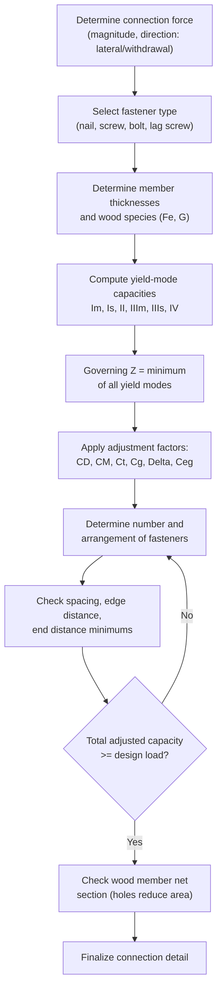

## Connections in Timber Structures

### Overview

Timber connections transfer force between wood members (or between wood and steel/concrete) using mechanical fasteners, since wood cannot be welded and adhesive-only field connections are uncommon in structural applications. Connection design in wood construction is governed primarily by **dowel-type fastener** behavior (nails, screws, bolts, lag screws, pins) under the **European Yield Model (EYM)**, adopted into the **NDS (Chapter 12)**, supplemented by provisions for **timber connectors** (split rings, shear plates) and **specialty engineered connectors** (structural screws, proprietary hangers, moment connections for mass timber). Because wood is a comparatively low-density, anisotropic material, connections frequently limit overall structural capacity more than the wood members themselves — much like connections often govern in steel design.

---

### Dowel-Type Fasteners — Overview

Dowel-type fasteners include nails, wood screws, lag screws, bolts, and drift pins — all mechanically similar in that they transfer load through a combination of **bearing** (dowel against wood fibers) and, for slenderer fasteners, **bending of the fastener itself**.

**Key Points**

- As fastener diameter increases relative to member thickness, failure mode shifts from **fastener bending with local wood crushing** (typical for smaller, more slender fasteners like nails) toward **wood bearing/splitting governing** (more typical for larger-diameter fasteners like bolts) — this progression underlies the different yield modes defined in the EYM.
- All dowel-type fastener connections must also satisfy **minimum spacing, edge distance, and end distance** requirements (NDS Chapter 12) to prevent splitting of the wood along the grain — analogous in purpose to bolt spacing/edge distance rules in steel, though the specific values and underlying failure mechanism (wood splitting vs. steel tear-out) differ.

---

### European Yield Model (EYM) — Dowel Connection Design

The EYM predicts the **lowest of several possible yield modes** for a dowel-type fastener connection, each representing a different combination of wood crushing and fastener bending.

**Yield Modes (single shear connection, simplified):**

| Mode | Description |
| --- | --- |
| $I_m$ | Bearing failure in the main (thicker) member |
| $I_s$ | Bearing failure in the side member |
| $II$ | Rotation of the fastener without bending (rigid-body rotation), localized crushing at each member |
| $III_m$ | One plastic hinge forms in the fastener, near the main member interface |
| $III_s$ | One plastic hinge forms in the fastener, near the side member interface |
| $IV$ | Two plastic hinges form in the fastener (fastener bending dominates, minimal wood crushing) |

**General reference design value:**

$$Z = \frac{Z' \times (\text{minimum yield mode capacity})}{\text{applicable reduction factors}}$$

Where $Z$ is computed via yield-mode-specific equations (NDS Chapter 12 Equations 12.3-1 through 12.3-11) incorporating dowel bearing strength ($F_e$), fastener bending yield strength ($F_{yb}$), member thicknesses, and dowel diameter.

**Key Points**

- Mode $IV$ (fastener bending governs, two plastic hinges) is generally associated with **more ductile** connection behavior — the fastener yields gradually rather than the wood splitting suddenly — and is often the governing/preferred mode for well-proportioned bolted connections with adequate member thickness.
- Modes $I_m$/$I_s$ (pure wood bearing, no fastener yielding) tend to be more **brittle**, particularly relevant in thin members or high dowel-bearing-strength wood species, and are less desirable from a ductility standpoint even when they may govern numerically.
- The governing mode is not fixed for a given fastener type — it depends on the specific combination of member thicknesses, wood species (dowel bearing strength), and fastener diameter/strength for that particular connection, and must be checked for each design case. [Inference] — general trends (e.g., "thicker members favor Mode IV") hold broadly across the literature, but the specific governing mode for any given case requires direct calculation rather than assumption.

---

### Dowel Bearing Strength ($F_e$)

$$F_e = 77 G^{1.45} / \sqrt{D} \quad (\text{parallel to grain, small-diameter fasteners, imperial units convention})$$

Where $G$ = specific gravity of the wood species, $D$ = fastener diameter.

**Key Points**

- Dowel bearing strength increases with wood density (specific gravity) — denser species (e.g., Southern Pine, Douglas Fir) provide higher bearing resistance than lower-density species (e.g., spruce-pine-fir), directly affecting connection capacity even when the fastener itself is identical.
- $F_e$ differs for **parallel-to-grain** versus **perpendicular-to-grain** loading, with perpendicular values typically lower — connections loaded at an angle to grain use the **Hankinson formula** to interpolate between the two reference values based on load angle.

---

### Adjustment Factors for Connections

Similar to member design, connection reference design values ($Z$) are modified by connection-specific adjustment factors:

| Factor | Purpose |
| --- | --- |
| $C_D$ | Load duration (same concept as member design) |
| $C_M$ | Wet service |
| $C_t$ | Temperature |
| $C_g$ | Group action factor (multiple fasteners in a row) |
| $\Delta$ | Geometry factor (reduced spacing/edge distance) |
| $C_{eg}$ | End grain factor (fasteners loaded in withdrawal or lateral loading into end grain) |
| $C_{di}$ | Diaphragm factor |
| $C_{tn}$ | Toe-nail factor |

**Group Action Factor ($C_g$)** deserves particular attention:

$$C_g = \frac{m(1-m^{2n})}{n\left[(1+R_{EA}m^n)(1+m) - 1 + m^{2n}\right]} \times \frac{1+R_{EA}}{1-m}$$

**Key Points**

- $C_g$ accounts for the fact that fasteners in a row **do not share load equally** — end fasteners in a bolted row attract disproportionately more load than interior fasteners due to differential elongation of the connected members along the fastener line, an effect that becomes more pronounced with more fasteners in a row and greater stiffness mismatch between connected members. This is conceptually analogous to (but mathematically distinct from) uneven load distribution in eccentric bolt/weld groups in steel connections.
- $C_g$ decreases (greater penalty) as the number of fasteners in a row increases — simply adding more bolts to a row does not increase capacity proportionally, which is why practical connection design favors multiple rows over very long single rows when high capacity is needed.

---

### Timber Connectors (Split Rings and Shear Plates)

Split rings and shear plates are pre-cut circular connectors inserted into matching grooves cut into the wood faces of connected members, used with a central bolt primarily for alignment (the connector, not the bolt, transfers the bulk of the load).

**Key Points**

- These connectors distribute load over a much larger bearing area than the bolt alone could achieve, allowing significantly higher single-connection capacities than bolts of similar central diameter — historically important for heavy timber truss and bridge construction before modern steel plate and structural screw connectors became widely available.
- Less common in modern light construction (largely superseded by steel plates, structural screws, and proprietary connectors) but still used in some heavy timber, historic restoration, and specialty truss applications.

---

### Withdrawal Connections (Nails, Screws, Lag Screws in Tension)

When fasteners are loaded axially (withdrawal, pulling the fastener out along its axis rather than shearing it laterally), a separate design approach applies:

$$W = (\text{withdrawal design value per unit penetration}) \times (\text{penetration length})$$

**Key Points**

- Withdrawal capacity depends on the fastener's surface characteristics (smooth shank vs. threaded), penetration depth into the main member, and wood density — threaded fasteners (screws, threaded nails) achieve substantially higher withdrawal resistance than smooth-shank common nails of similar diameter.
- Connections relying primarily on withdrawal (rather than lateral/shear loading) are generally discouraged as a **primary** structural load path in critical applications, since withdrawal capacity is more sensitive to installation quality, wood moisture cycling (which can loosen fasteners over time as wood shrinks/swells), and long-term creep under sustained load. [Inference] — this is standard engineering practice guidance reflected across NDS commentary and general timber engineering literature, rather than an explicit blanket prohibition in the code itself.

---

### Dowel Connection Yield Modes — Conceptual Diagram (svg_diagram)

<svg xmlns="http://www.w3.org/2000/svg" viewBox="0 0 560 260">
<text x="280" y="20" font-size="14" font-weight="bold" text-anchor="middle">EYM Yield Modes (svg_diagram)</text>

<text x="90" y="45" font-size="11" text-anchor="middle">Mode I (bearing)</text>

<rect x="50" y="55" width="80" height="30" fill="`#d4b896`" stroke="#333" />

<rect x="50" y="85" width="80" height="80" fill="`#c9a876`" stroke="#333" />

<line x1="90" y1="55" x2="90" y2="165" stroke="#555" stroke-width="6" />

<path d="M 80 60 L 100 60" stroke="`#e74c3c`" stroke-width="2" />

<text x="90" y="195" font-size="9" text-anchor="middle">No fastener bend</text>

<text x="280" y="45" font-size="11" text-anchor="middle">Mode III (one hinge)</text>

<rect x="240" y="55" width="80" height="30" fill="`#d4b896`" stroke="#333" />

<rect x="240" y="85" width="80" height="80" fill="`#c9a876`" stroke="#333" />

<path d="M 280 55 L 280 85 L 295 165" stroke="#555" stroke-width="6" fill="none" />

<circle cx="280" cy="85" r="4" fill="`#e74c3c`" />

<text x="280" y="195" font-size="9" text-anchor="middle">One plastic hinge</text>

<text x="470" y="45" font-size="11" text-anchor="middle">Mode IV (two hinges)</text>

<rect x="430" y="55" width="80" height="30" fill="`#d4b896`" stroke="#333" />

<rect x="430" y="85" width="80" height="80" fill="`#c9a876`" stroke="#333" />

<path d="M 470 55 L 465 85 L 480 165" stroke="#555" stroke-width="6" fill="none" />

<circle cx="465" cy="85" r="4" fill="`#e74c3c`" />

<circle cx="474" cy="125" r="4" fill="`#e74c3c`" />

<text x="470" y="195" font-size="9" text-anchor="middle">Ductile, fastener yields</text>

</svg>

---

### Connection Design Procedure

---

### Example: Bolted Connection Capacity (Simplified)

**Given:** A single 12.7 mm (1/2 in) bolt in single shear connecting a 38 mm side member to a 89 mm main member, both Douglas Fir-Larch ($G = 0.50$), load parallel to grain, governing yield mode determined to be Mode $III_s$ with $Z = 3.5$ kN (reference value, hypothetical for illustration), $C_D = 1.0$, $C_M = 1.0$, single bolt (no group action reduction, $C_g = 1.0$).

**Adjusted capacity:**

$$Z' = Z \times C_D \times C_M \times C_g = 3.5 \times 1.0 \times 1.0 \times 1.0 = 3.5\ \text{kN}$$

**For a connection with 4 bolts in a single row** (assume $C_g = 0.92$ for this configuration, hypothetical illustrative value):

$$Z'_{total} = 4 \times 3.5 \times 0.92 = 12.88\ \text{kN}$$

**Key Points**

- Note that $12.88$ kN is **less** than the naive $4 \times 3.5 = 14.0$ kN that would result from simply multiplying single-bolt capacity by bolt count — this 8% reduction directly demonstrates the group action factor's effect of penalizing unequal load-sharing among fasteners in a row.
- [Inference] — the specific $Z$ and $C_g$ values above are illustrative placeholders for demonstrating the calculation method, not values to be used for an actual design; real designs must use members' specific dowel bearing strength, fastener yield strength, and NDS Table/equation-derived $C_g$ values.

---

### Common Pitfalls in Timber Connection Design

| Pitfall | Consequence |
| --- | --- |
| Simply summing individual fastener capacities without applying group action factor $C_g$ | Overestimated connection capacity for multi-fastener rows |
| Ignoring minimum spacing/edge/end distance requirements | Splitting failure, reduced actual capacity below calculated value |
| Relying on withdrawal capacity as the primary structural load path | Reduced long-term reliability due to moisture cycling and creep sensitivity |
| Using parallel-to-grain $F_e$ values for connections loaded at an angle to grain | Overestimated capacity; Hankinson formula interpolation required |
| Assuming a single "typical" fastener always fails in a particular EYM mode | Incorrect governing capacity; mode must be calculated per specific connection geometry |
| Neglecting net section reduction of wood member at bolt holes | Undetected tension/bending overstress in the perforated member |

---

**Related Topics**

- European Yield Model — Detailed Yield Mode Equations
- Group Action Factor ($C_g$) Derivation and Application
- Timber Moment Connections for Mass Timber (Self-Tapping Screws)
- Metal Plate Connected (MPC) Wood Truss Design
- Diaphragm and Shear Wall Nailing Schedules (ANSI/AWC SDPWS)
- Lag Screw and Wood Screw Withdrawal Design
- Historic Timber Connector Systems (Split Rings, Shear Plates)