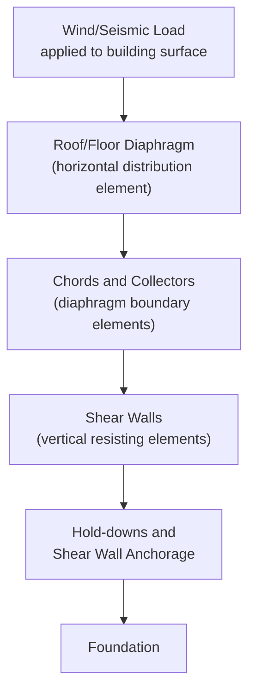
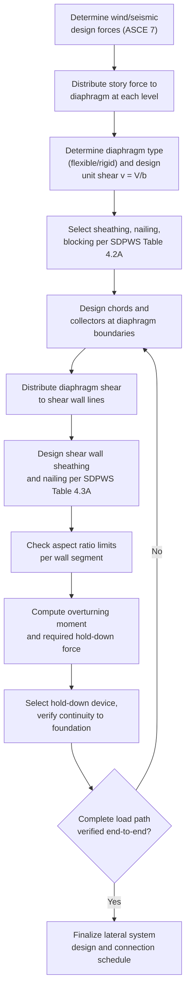

## Lateral Load Resisting Systems in Wood Construction

### Overview

Lateral load resisting systems in wood construction transfer horizontal forces — from wind or seismic events — from the points where they are applied (typically roof and floor diaphragms) down through vertical elements (shear walls or braced frames) to the foundation. Because wood-frame buildings are typically light, flexible structures with numerous small connections rather than a few large structural elements, their lateral system behavior is governed heavily by **connection ductility, nailing patterns, and load path continuity** rather than by member-level strength alone. Design provisions are codified in the **ANSI/AWC Special Design Provisions for Wind and Seismic (SDPWS)**, used in conjunction with the base **NDS** for member and connection design, and referenced by the **IBC** and **ASCE 7** for load determination.

---

### The Lateral Load Path

A complete lateral force resisting system (LFRS) requires an unbroken **load path** from the point of load application to the foundation:

**Key Points**

- Every link in this chain must be explicitly designed and detailed — a diaphragm with adequate nailing but inadequate chord/collector connections, or a strong shear wall with an undersized hold-down, represents a broken load path that will fail at its weakest link regardless of the strength of other elements in the system.
- This load path concept is universal across lateral system types (wood, steel, concrete) but is particularly critical to verify explicitly in wood construction because the system is assembled from many small, discrete connections rather than a few large continuous elements.

---

### Diaphragms

Diaphragms are horizontal (or sloped, for roofs) structural elements — typically wood structural panel (plywood or OSB) sheathing over framing — that collect lateral load and distribute it to the vertical resisting elements (shear walls).

**Diaphragm Behavior Classification:**

- **Flexible diaphragm**: distributes shear to shear walls in proportion to **tributary area** (similar to a simple beam distributing load to supports based on span length), used when diaphragm deflection is large relative to shear wall deflection (typical of most wood-sheathed diaphragms).
- **Rigid diaphragm**: distributes shear to shear walls in proportion to their **relative stiffness**, accounting for torsional (rotational) effects if the center of rigidity does not align with the center of mass — more typical of concrete diaphragms, but occasionally relevant for heavily sheathed or concrete-topped wood diaphragms.

**Key Points**

- Most wood structural panel diaphragms are conservatively treated as flexible under SDPWS provisions for typical light-frame buildings, simplifying analysis to tributary-area-based distribution — though this assumption should be verified against the specific diaphragm aspect ratio and construction rather than assumed universally, since some configurations (e.g., very stiff, small-aspect-ratio diaphragms) may require rigid or semi-rigid analysis. [Inference] — the flexible-diaphragm simplification is common industry practice reflected in SDPWS provisions, but the applicability threshold depends on specific diaphragm/wall stiffness ratios best confirmed against project-specific analysis or code guidance rather than assumed as universal.

**Diaphragm Shear Capacity:**

$$v = \frac{V}{b}$$

Where $V$ = total diaphragm shear force at the section considered, $b$ = diaphragm depth (dimension perpendicular to the direction of load).

Nominal unit shear capacities are tabulated in SDPWS Table 4.2A (wood structural panel diaphragms) based on panel thickness, nail size/spacing, framing member width, and panel layout (blocked vs. unblocked).

**Key Points**

- **Blocked diaphragms** (with solid blocking at all panel edges, allowing consistent nail spacing at every joint) achieve substantially higher shear capacities than **unblocked diaphragms** (nailing only at supported edges, unsupported edges free) — this is one of the most significant single factors affecting diaphragm capacity in wood construction.
- Nail spacing at panel edges is the primary variable controlling diaphragm capacity — closer nail spacing (e.g., 51 mm/2 in o.c.) provides substantially higher unit shear capacity than wider spacing (e.g., 150 mm/6 in o.c.), all else equal.

---

### Chords and Collectors (Diaphragm Boundary Elements)

- **Chords** resist the tension/compression couple generated by diaphragm bending (analogous to the flanges of a horizontal "beam" formed by the diaphragm), typically the top plates of perimeter walls acting continuously around the building.
- **Collectors (drag struts)** gather (collect) shear force from the diaphragm along wall lines where the shear wall does not extend the full length of the diaphragm edge, "dragging" the force into the shear wall.

**Key Points**

- Chord force is computed analogous to a beam's flange force under bending: $T = C = M/d$, where $M$ is the diaphragm design moment and $d$ is the diaphragm depth — chord splices must be designed to develop this tension force with adequate connection capacity at each joint.
- Collectors are frequently under-designed in practice because their required force (and even their necessity) is not always visually obvious from the framing plan — a shear wall that does not span the entire diaphragm edge **requires** a collector to gather load from the unsupported diaphragm length into the wall, and omitting this element breaks the load path even if the shear wall itself is adequately designed.

---

### Shear Walls

Shear walls are vertical elements — typically wood structural panel sheathing over stud framing — that resist in-plane lateral shear force and transfer it down to the foundation.

**Nominal Shear Capacity** (wood structural panel shear walls, SDPWS Table 4.3A):

Tabulated by sheathing type/thickness, nail size/spacing, framing species, and whether sheathing is applied to one or both sides.

$$v_s = \frac{V}{L}$$

Where $V$ = design shear force on the wall segment, $L$ = wall segment length.

**Key Points**

- **Aspect ratio limits** apply to shear wall segments (typically height-to-width ratio limits, e.g., $h/w \leq 3.5:1$ for wood structural panel sheathing under SDPWS, with capacity reductions required for ratios exceeding $2:1$) — walls that are too narrow relative to their height exhibit reduced effective capacity due to increased rocking/overturning tendency relative to shear deformation.
- **Perforated shear wall method** vs. **segmented shear wall method**: perforated shear wall design treats a wall line with openings (doors, windows) as a single unit with a capacity reduction factor based on the percentage of full-height sheathing, avoiding the need for hold-downs at every wall segment; segmented design treats each full-height wall segment between openings as an independent shear wall requiring individual hold-down anchorage at each end.
- The perforated method is often more economical (fewer hold-downs required) but requires the wall line to meet specific geometric and construction requirements (e.g., uniform full-height sheathing above and below openings) to qualify.

---

### Overturning and Hold-Downs

Shear walls resist lateral load through in-plane shear, but the applied lateral force also generates an **overturning moment** at each wall segment, creating tension at one end (uplift) and compression at the other.

$$T = \frac{M_{OT} - 0.9M_{resisting}}{d}$$

Where $M_{OT}$ = overturning moment from lateral load, $M_{resisting}$ = resisting moment from dead load (with a 0.9 reduction factor per typical load combination convention, reflecting minimum expected dead load), $d$ = wall segment length (distance between hold-down/tension chord locations).

**Key Points**

- **Hold-down devices** (steel brackets anchoring the wall's tension chord stud to the foundation or the framing below) are required wherever calculated uplift tension exceeds the resistance available from dead load alone — this is one of the most common sources of lateral system deficiency in wood-frame retrofits and inspections, since hold-downs are easy to omit or under-specify without careful calculation.
- Multi-story buildings require **hold-down force accumulation and continuity** — tension forces at upper-story hold-downs must be transferred continuously down through lower-story framing (via continuous tie rods, stacked hold-downs, or equivalent) to the foundation; a hold-down that terminates on a floor diaphragm without continuing load path to the foundation does not adequately resist overturning.

---

### Shear Wall System Diagram (svg_diagram)

<svg xmlns="http://www.w3.org/2000/svg" viewBox="0 0 520 300">
<text x="260" y="20" font-size="14" font-weight="bold" text-anchor="middle">Shear Wall Overturning Behavior (svg_diagram)</text>
<rect x="150" y="50" width="220" height="180" fill="none" stroke="#333" stroke-width="2" />
<line x1="150" y1="50" x2="150" y2="230" stroke="#555" stroke-width="4" />
<line x1="370" y1="50" x2="370" y2="230" stroke="#555" stroke-width="4" />
<path d="M 130 55 L 150 55 L 150 45" stroke="#e74c3c" stroke-width="2" fill="none" />
<text x="100" y="50" font-size="10" text-anchor="middle">V (lateral load)</text>
<line x1="90" y1="55" x2="145" y2="55" stroke="#e74c3c" stroke-width="2" marker-end="url(#arrow)" />
<text x="150" y="255" font-size="10" text-anchor="middle">Tension chord</text>
<text x="150" y="270" font-size="10" text-anchor="middle">(hold-down required)</text>
<text x="370" y="255" font-size="10" text-anchor="middle">Compression chord</text>
<rect x="135" y="230" width="30" height="20" fill="#7f8c8d" stroke="#333" />
<text x="150" y="290" font-size="9" text-anchor="middle">Hold-down anchor</text>
<line x1="260" y1="240" x2="260" y2="230" stroke="#333" />
<text x="260" y="250" font-size="10" text-anchor="middle">d (wall length)</text>
</svg>

---

### Braced Wall Panels (Prescriptive Alternative)

For conventional light-frame construction meeting IBC prescriptive limitations (building height, wind speed, seismic design category), **braced wall panels** (using let-in bracing, wood structural panels, diagonal boards, or other prescriptively recognized bracing methods) may be used **without engineered calculation**, following prescriptive spacing and length requirements in the IBC/IRC.

**Key Points**

- Prescriptive braced wall design is limited to buildings within specific scope limitations (typically low-rise, conventional light-frame residential/light commercial construction in areas of moderate wind/seismic demand) — buildings outside this scope require engineered shear wall design per SDPWS rather than prescriptive bracing tables.
- Even within prescriptive scope, an engineer may choose to use engineered shear wall design instead of (or supplementing) prescriptive bracing, particularly for irregular buildings, larger openings, or higher seismic/wind demand than the prescriptive tables anticipate.

---

### Seismic-Specific Considerations

**Key Points**

- Wood-frame shear wall systems are recognized in ASCE 7 as having relatively high **response modification factors ($R$)** compared to some other lateral systems, reflecting their generally favorable ductile, energy-dissipating behavior under cyclic seismic loading — this ductility arises primarily from nail yielding at sheathing-to-framing connections (analogous in concept to Mode IV dowel yielding), which allows the system to deform inelastically and dissipate energy without sudden, brittle failure.
- Redundancy factors and irregularity provisions (per ASCE 7) can significantly affect required design forces for wood lateral systems, particularly for buildings with **soft or weak stories** (e.g., open-front commercial ground floors below residential units above) — a common and code-scrutinized irregularity in wood-frame construction.
- Diaphragm-to-shear-wall and shear-wall-to-foundation connections are frequently the **most critical detailing elements** in seismic design, since the wood members themselves rarely govern capacity — connection ductility and continuity typically control overall system seismic performance.

---

### Design Procedure — Lateral System

---

### Example: Shear Wall Design Check (Simplified)

**Given:** A shear wall segment, length $L = 2.4$ m, height $h = 2.7$ m, design shear $V = 18$ kN, 11 mm OSB sheathing one side, 8d common nails at 100 mm o.c. edge spacing (tabulated capacity per SDPWS, hypothetical illustrative value: $v_{allow} = 8.5$ kN/m for ASD).

**Aspect ratio check:**

$$\frac{h}{L} = \frac{2.7}{2.4} = 1.125 \quad (< 2:1,\ \text{full capacity applies, no reduction})$$

**Unit shear demand:**

$$v = \frac{V}{L} = \frac{18}{2.4} = 7.5\ \text{kN/m}$$

**Check:** $7.5\ \text{kN/m} \leq 8.5\ \text{kN/m}$ ✓ — adequate, roughly 13% reserve capacity.

**Overturning check (assume dead load resisting moment provides $M_{resisting}/d$ equivalent to 6 kN, wall height 2.7 m):**

$$T = \frac{(V \times h) - 0.9(M_{resisting})}{L} = \frac{(18\times2.7) - 0.9(6\times2.4)}{2.4} = \frac{48.6 - 12.96}{2.4} = 14.85\ \text{kN}$$

**Key Points**

- A hold-down device with allowable tension capacity of at least 14.85 kN (plus appropriate adjustment factors) would be required at the tension end of this wall segment — this example demonstrates that even a wall segment passing its in-plane shear check may still require substantial hold-down capacity, and the two checks (shear and overturning) must both be satisfied independently.

---

### Common Pitfalls in Wood Lateral System Design

| Pitfall | Consequence |
| --- | --- |
| Omitting collector (drag strut) design where shear walls don't span full diaphragm edge | Broken load path, undetected overstress at diaphragm boundary |
| Assuming flexible diaphragm behavior without verifying applicability | Incorrect shear distribution to walls, especially in torsionally irregular buildings |
| Neglecting hold-down force accumulation/continuity in multi-story buildings | Discontinuous overturning load path between stories |
| Exceeding shear wall aspect ratio limits without applying required capacity reduction | Overestimated wall capacity |
| Using unblocked diaphragm capacity values when blocking was not actually specified/installed | Overestimated diaphragm shear capacity |
| Treating prescriptive braced wall provisions as applicable outside their code-defined scope limitations | Non-compliant, potentially inadequate lateral system for the actual building conditions |

---

**Related Topics**

- Diaphragm Design: Blocked vs. Unblocked, Chord/Collector Force Calculation
- Perforated vs. Segmented Shear Wall Design Methods
- Hold-Down Selection and Multi-Story Load Path Continuity
- Seismic Response Modification Factor (R) and System Ductility
- Soft-Story and Weak-Story Irregularities in Wood-Frame Buildings
- Prescriptive Braced Wall Panel Requirements (IBC/IRC)
- Wind and Seismic Load Determination (ASCE 7 Chapters 26–30, 11–23)