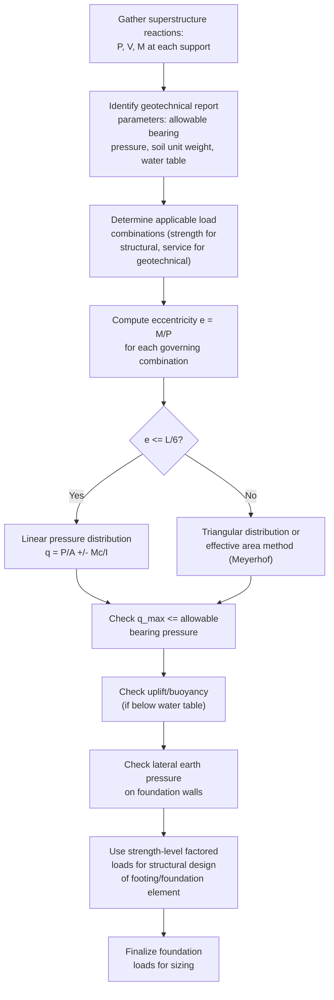

## Design Loads for Foundation Elements

### Overview

Foundation elements transfer all structural loads from the superstructure into the supporting soil or rock, making accurate determination of design loads a prerequisite for every subsequent foundation design step (bearing capacity, settlement, structural sizing of footings/piles/mats). Unlike superstructure elements, which primarily resist loads from a single, relatively well-defined direction (gravity for floors, lateral for walls), foundations must resolve **combined vertical, lateral, and moment loading simultaneously**, often governed by different load combinations for different failure modes (bearing capacity vs. sliding vs. overturning vs. structural strength of the footing itself). Load determination draws on **ASCE 7** (load types and combinations) together with geotechnical engineering principles from **soil mechanics** and, where applicable, **AASHTO** (for bridge foundations) or local geotechnical reports.

---

### Load Types Acting on Foundations

| Load Type | Source | Typical Direction |
| --- | --- | --- |
| Dead Load ($D$) | Self-weight of structure, permanent fixtures | Vertical |
| Live Load ($L$) | Occupancy, movable loads | Vertical |
| Roof Live Load ($L_r$) / Snow ($S$) | Roof-level loads | Vertical |
| Wind Load ($W$) | Lateral wind pressure on building surfaces | Lateral (with overturning moment) |
| Seismic Load ($E$) | Inertial response to ground motion | Lateral and vertical (with overturning moment) |
| Lateral Earth Pressure ($H$) | Soil pressure against foundation/basement walls | Lateral |
| Hydrostatic/Buoyant Pressure | Groundwater | Vertical (uplift) and lateral |
| Surcharge Loads | Adjacent structures, equipment, vehicular loading near foundation | Vertical and/or lateral (transmitted through soil) |

**Key Points**

- Foundations uniquely must account for **soil-imposed loads** (lateral earth pressure, hydrostatic uplift, surcharge) in addition to the structural loads transmitted from the superstructure above — this is a fundamental distinction from superstructure member design, where soil interaction is not a factor.
- **Buoyant (uplift) forces** on foundations below the groundwater table can be significant and are sometimes overlooked; a foundation or basement structure that appears adequately loaded under normal service conditions can experience net uplift (flotation) under high groundwater conditions if the structure's weight is insufficient to counteract buoyancy, particularly during construction before full building dead load is in place.

---

### Load Combinations for Foundation Design

Foundation design load combinations follow the same general ASCE 7 framework used for superstructure design, but with important distinctions in how they are applied to different foundation failure modes:

**Strength-level (LRFD/factored) combinations** — used for structural design of the footing/foundation element itself (concrete strength, reinforcement, pile structural capacity):

$$1.2D + 1.6L + 0.5(L_r \text{ or } S)$$

$$1.2D + 1.0E + L + 0.2S$$

$$0.9D + 1.0W \quad (\text{uplift/overturning check})$$

**Service-level (unfactored, ASD) combinations** — used for **geotechnical** checks (bearing capacity, settlement, sliding), because soil behavior and geotechnical capacity are traditionally evaluated against **allowable** (service-level) soil pressures rather than factored ultimate soil pressures:

$$D + L$$

$$D + 0.75L + 0.75(L_r \text{ or } S)$$

$$D + 0.6W$$

$$D + 0.7E$$

**Key Points**

- This dual approach — factored loads for structural (concrete/steel) design of the foundation element, unfactored/service loads for geotechnical bearing capacity checks — reflects the traditional split between structural engineering practice (which has moved to LRFD) and geotechnical engineering practice (which has historically remained predominantly ASD-based, since allowable bearing pressures in geotechnical reports are typically expressed as service-level values).
- Modern practice increasingly also supports **LRFD-based geotechnical design** (with resistance factors applied to ultimate bearing capacity), particularly in AASHTO bridge foundation design, but ASD-based geotechnical checks using service loads remain very common in building foundation practice. [Unverified] — the specific method (ASD vs. LRFD) required for geotechnical design varies by governing code, project type, and jurisdiction, and the applicable method should be confirmed against the project's governing code and geotechnical report.

---

### Foundation Loading Diagram — Combined Vertical, Lateral, and Moment (svg_diagram)

<svg xmlns="http://www.w3.org/2000/svg" viewBox="0 0 480 320">
<text x="240" y="20" font-size="14" font-weight="bold" text-anchor="middle">Combined Foundation Loading (svg_diagram)</text>
<rect x="150" y="60" width="180" height="60" fill="#95a5a6" stroke="#333" stroke-width="1.5" />
<text x="240" y="95" font-size="11" text-anchor="middle">Column/Wall</text>
<line x1="240" y1="30" x2="240" y2="60" stroke="#e74c3c" stroke-width="3" />
<text x="255" y="45" font-size="10" fill="#e74c3c">P (axial)</text>
<line x1="330" y1="80" x2="370" y2="80" stroke="#2980b9" stroke-width="3" />
<text x="375" y="85" font-size="10" fill="#2980b9">H (lateral)</text>
<path d="M 220 40 A 20 20 0 0 1 260 40" stroke="#8e44ad" stroke-width="2" fill="none" />
<text x="265" y="35" font-size="10" fill="#8e44ad">M (moment)</text>
<rect x="100" y="120" width="280" height="30" fill="#7f8c8d" stroke="#333" stroke-width="1.5" />
<text x="240" y="140" font-size="11" text-anchor="middle" fill="white">Footing</text>
<line x1="100" y1="150" x2="380" y2="150" stroke="#333" stroke-width="1" />
<path d="M 100 160 L 380 160 M 110 170 L 130 160 M 140 170 L 160 160 M 170 170 L 190 160 M 200 170 L 220 160 M 230 170 L 250 160 M 260 170 L 280 160 M 290 170 L 310 160 M 320 170 L 340 160 M 350 170 L 370 160" stroke="#654321" stroke-width="1" />
<text x="240" y="195" font-size="10" text-anchor="middle">Soil (bearing reaction)</text>
<path d="M 110 155 L 110 148" stroke="#c0392b" stroke-width="1" />
<path d="M 150 155 L 150 148" stroke="#c0392b" stroke-width="1" />
<path d="M 190 155 L 190 148" stroke="#c0392b" stroke-width="1" />
<path d="M 240 155 L 240 145" stroke="#c0392b" stroke-width="1.5" />
<path d="M 290 155 L 290 148" stroke="#c0392b" stroke-width="1" />
<path d="M 330 155 L 330 148" stroke="#c0392b" stroke-width="1" />
<path d="M 370 155 L 370 148" stroke="#c0392b" stroke-width="1" />
<text x="240" y="225" font-size="9" text-anchor="middle" fill="#c0392b">Non-uniform bearing pressure due to eccentricity (P + M)</text>
</svg>

---

### Eccentric Loading and Effective Bearing Pressure

When a foundation carries both axial load $P$ and moment $M$ (from wind, seismic, or eccentric superstructure loads), the resulting **eccentricity** produces a non-uniform bearing pressure distribution:

$$e = \frac{M}{P}$$

**If $e \leq L/6$ (load within the "middle third"):**

$$q_{max,min} = \frac{P}{A} \pm \frac{M c}{I} = \frac{P}{BL}\left(1 \pm \frac{6e}{L}\right)$$

**If $e > L/6$ (load outside the middle third):** a portion of the footing lifts off the soil (no tension can develop between footing and soil), and pressure distribution becomes triangular over a reduced effective bearing area:

$$q_{max} = \frac{2P}{3B\left(\frac{L}{2}-e\right)}$$

**Key Points**

- The "middle third rule" ($e \leq L/6$) is a critical design threshold: footings are generally proportioned to keep resultant eccentricity within the middle third under service loads specifically to avoid the soil-footing separation (uplift/gapping) that occurs outside this zone, which concentrates pressure over a smaller area and can also cause instability under repeated/cyclic loading (e.g., wind or seismic reversal).
- For eccentricity beyond $L/6$, using the simplified linear pressure formula would incorrectly predict tension at one edge, which soil cannot resist — the triangular distribution formula must be used instead once this threshold is exceeded.

---

### Effective Footing Dimensions (Meyerhof Method)

For eccentric loading, geotechnical bearing capacity is often evaluated using an **effective footing area** concept (Meyerhof's method), reducing the footing to an equivalent smaller footing centered on the load resultant rather than analyzing the actual eccentric pressure distribution directly against ultimate bearing capacity theory:

$$B' = B - 2e_B, \qquad L' = L - 2e_L$$

$$A' = B' \times L'$$

**Key Points**

- This method reflects the physical reality that only the portion of the footing effectively "engaged" by the resultant eccentric load contributes meaningfully to bearing capacity — using the full (un-reduced) footing area in a bearing capacity equation for an eccentrically loaded footing would overestimate the effective bearing capacity.
- This effective area approach is widely used and referenced in standard geotechnical engineering practice (e.g., Bowles, Das textbooks) and integrated into many building code and AASHTO bearing capacity procedures. [Unverified] — the exact bearing capacity equation modifications (shape/depth/inclination factors) that accompany the effective area concept vary by the specific bearing capacity theory/reference being applied (Terzaghi, Meyerhof, Hansen, Vesic) and should be confirmed against the governing geotechnical reference for a given project.

---

### Uplift and Buoyancy Loads

For foundations below the water table (basements, below-grade structures, some deep foundations), **hydrostatic uplift (buoyancy)** must be checked as a distinct load case, often governing during construction when structure weight is not yet fully in place.

$$F_{buoyancy} = \gamma_w \times V_{displaced}$$

**Check against uplift:**

$$\frac{W_{structure} + W_{soil\ surcharge} + \text{anchorage resistance}}{F_{buoyancy}} \geq \text{required factor of safety (typically 1.1–1.5, project/code specific)}$$

**Key Points**

- Uplift/flotation checks are particularly critical for **lightweight structures with large below-grade footprints** (e.g., underground tanks, parking structures, pump stations) where the structure's own weight may be insufficient to resist buoyant force from a high water table.
- Temporary construction-stage conditions (before full dead load is applied, or before backfill is placed) often represent the **critical** uplift case, even if the completed structure would be adequate against buoyancy once fully loaded — this makes construction sequencing itself a load case that must be explicitly considered.
- [Unverified] — required factor of safety against flotation is project/code-specific and varies by jurisdiction and application (e.g., some agencies specify 1.25, others 1.5 or higher for critical facilities); the applicable value should be confirmed against the governing code or geotechnical report.

---

### Lateral Earth Pressure on Foundation Elements

Foundation walls and pile caps below grade must resist lateral earth pressure from retained soil, which varies with soil condition (at-rest, active, or passive), covered in depth under retaining wall design, but relevant here as a **foundation design load input**:

$$p = K \gamma_s z$$

Where $K$ = lateral earth pressure coefficient (at-rest $K_0$, active $K_a$, or passive $K_p$ depending on wall movement conditions), $\gamma_s$ = soil unit weight, $z$ = depth below grade.

**Key Points**

- Rigid, unyielding foundation elements (e.g., basement walls braced by floor diaphragms top and bottom, preventing significant wall movement) are typically designed for **at-rest** pressure ($K_0$), which is higher than active pressure, because insufficient wall movement occurs to mobilize the lower active pressure condition.
- Surcharge loads at grade near a foundation wall (vehicles, adjacent construction equipment, stockpiled material) add to the lateral pressure on foundation walls and must be included as an additional load component, often modeled as an equivalent additional soil height or a directly applied uniform lateral pressure increment.

---

### Foundation Design Load Procedure

---

### Example: Eccentric Footing Bearing Pressure Check

**Given:** A spread footing, $B = 2.0$ m, $L = 2.5$ m, service axial load $P = 850$ kN, service moment $M = 280$ kN·m (about the $L$-direction axis), allowable soil bearing pressure $q_{allow} = 200$ kPa.

**Step 1 — Eccentricity:**

$$e = \frac{M}{P} = \frac{280}{850} = 0.329\ \text{m}$$

**Step 2 — Middle third check:**

$$\frac{L}{6} = \frac{2.5}{6} = 0.417\ \text{m}$$

Since $e = 0.329\ \text{m} < 0.417\ \text{m}$, the resultant is within the middle third — use the linear pressure distribution formula.

**Step 3 — Section modulus term:**

$$\frac{6e}{L} = \frac{6\times0.329}{2.5} = 0.790$$

**Step 4 — Maximum and minimum pressures:**

$$q_{max} = \frac{P}{BL}\left(1+\frac{6e}{L}\right) = \frac{850}{2.0\times2.5}(1+0.790) = 170 \times 1.790 = 304.3\ \text{kPa}$$

$$q_{min} = \frac{850}{5.0}(1-0.790) = 170 \times 0.210 = 35.7\ \text{kPa}$$

**Check:** $q_{max} = 304.3\ \text{kPa} > q_{allow} = 200\ \text{kPa}$ ✗ — **fails**; the footing must be enlarged (increased $B$ or $L$) or the eccentricity reduced (e.g., by resizing the footing to shift its centroid toward the load resultant) to bring maximum pressure within the allowable limit.

**Key Points**

- This example demonstrates why eccentric loading can govern footing size even when the average pressure ($P/A = 170$ kPa) appears well within the allowable limit — the peak edge pressure, not the average, controls the check, and eccentricity effects can be substantial even for moderate moment-to-axial-load ratios.

---

### Common Pitfalls in Foundation Load Determination

| Pitfall | Consequence |
| --- | --- |
| Using factored (strength-level) loads directly against allowable bearing pressure | Overestimated allowable capacity; geotechnical checks require service-level loads unless the report explicitly provides factored/LRFD resistance values |
| Neglecting construction-stage uplift/buoyancy check | Undetected flotation risk before full dead load is in place |
| Assuming linear pressure distribution when eccentricity exceeds $L/6$ | Incorrectly predicts tension between footing and soil, which cannot physically occur |
| Ignoring surcharge loads near foundation/basement walls | Underestimated lateral earth pressure |
| Using active earth pressure for rigid, unyielding foundation walls | Underestimated lateral pressure; at-rest pressure should govern for restrained walls |
| Overlooking group effects and load combination for closely spaced foundation elements (e.g., adjacent footings, pile groups) | Underestimated settlement or overlapping stress zones in soil |

---

**Related Topics**

- Bearing Capacity Theory (Terzaghi, Meyerhof, Hansen Equations)
- Settlement Analysis (Immediate and Consolidation Settlement)
- Shallow Foundation Design (Spread Footings, Combined Footings, Mat Foundations)
- Deep Foundation Design (Driven Piles, Drilled Shafts)
- Lateral Earth Pressure Theory (Rankine and Coulomb Methods)
- Retaining Wall Design and Stability Checks
- Groundwater Effects on Foundation Design and Dewatering