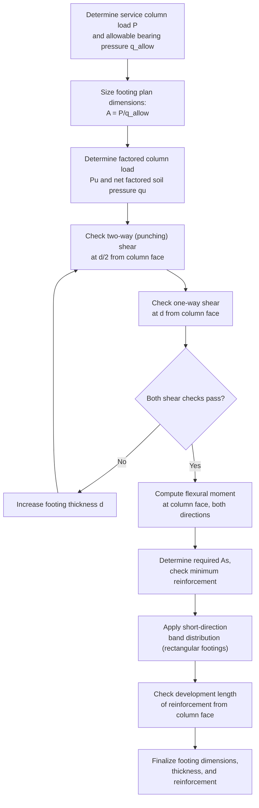
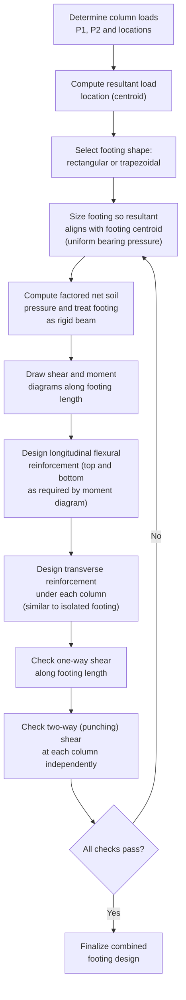

## Isolated and Combined Footing Design

### Overview

Isolated (spread) and combined footings are the most common shallow foundation types, transferring column or wall loads directly to the supporting soil through a reinforced concrete pad sized to keep bearing pressure within the soil's allowable capacity. **Isolated footings** support a single column independently; **combined footings** support two or more columns on a single footing, typically used when isolated footings would overlap, when a column is too close to a property line to center an isolated footing beneath it, or when differential settlement control between adjacent columns is desired. Structural design of the footing itself (as a reinforced concrete element) follows **ACI 318** (particularly Chapter 13, Two-Way Slabs, and Chapter 22/25 for shear and flexure/detailing provisions applied to footings), while sizing is governed by the geotechnical bearing pressure checks discussed under foundation design loads.

---

### Isolated (Spread) Footing Design

#### Sizing for Bearing Capacity

$$A_{required} = \frac{P_{service}}{q_{allow}}$$

Where $P_{service}$ is the unfactored (service-level) total load (including footing self-weight and any soil surcharge above the footing) and $q_{allow}$ is the allowable soil bearing pressure from the geotechnical report.

**Key Points**

- Footing plan dimensions are determined using **service-level (unfactored) loads** against allowable bearing pressure, consistent with the traditional ASD-based geotechnical design approach — this is distinct from the subsequent structural design of the footing (reinforcement, thickness), which uses factored loads.
- For square footings, $B = L = \sqrt{A_{required}}$; for rectangular footings (e.g., constrained by property lines or wall geometry), dimensions are proportioned to match the aspect ratio dictated by the loading or geometric constraint while still satisfying the required area.

---

#### Structural Design — Two-Way (Punching) Shear

Once plan dimensions are set from bearing capacity, the footing **thickness** is typically governed by **two-way (punching) shear** around the column — footings are usually unreinforced for shear (relying on concrete alone) for economy, since shear reinforcement in footings is uncommon in standard practice.

$$V_u = q_u\left[BL - (c_1+d)(c_2+d)\right]$$

Where $q_u$ = factored net soil pressure (using strength-level factored column loads divided by footing area), $c_1, c_2$ = column dimensions, $d$ = effective footing depth, and the critical shear perimeter is located at $d/2$ from the column face.

**Two-way shear capacity** (ACI 318 §22.6.5), governed by the **smallest** of three expressions:

$$v_c = \min\left[0.33\lambda\sqrt{f'_c},\ \ 0.17\left(1+\frac{2}{\beta}\right)\lambda\sqrt{f'_c},\ \ 0.083\left(2+\frac{\alpha_s d}{b_o}\right)\lambda\sqrt{f'_c}\right]$$

$$\phi V_c = \phi v_c b_o d, \qquad \phi = 0.75$$

Where $\beta$ = ratio of long side to short side of the column, $\alpha_s$ = 40 (interior columns), 30 (edge columns), 20 (corner columns), and $b_o$ = perimeter of the critical shear section.

**Key Points**

- The three terms in the $v_c$ expression address, respectively: a baseline concrete shear capacity, a reduction for very elongated (non-square) columns (larger $\beta$ reduces the effective punching perimeter's efficiency), and a reduction for columns with a small critical perimeter relative to depth (particularly relevant for corner and edge columns, which have proportionally smaller shear perimeters than interior columns of the same size).
- Corner and edge column footings are inherently more vulnerable to punching shear than interior column footings of similar plan size, both because of the reduced $\alpha_s$ value and because the shear perimeter itself is physically shorter (three or two sides of the critical perimeter, versus all four for an interior column).

---

#### Structural Design — One-Way (Beam) Shear

$$V_u = q_u \times B \times \left(\frac{L-c_1}{2}-d\right)$$

Checked at a critical section located a distance $d$ from the face of the column, analogous to one-way shear checks for beams.

$$\phi V_c = \phi \times 0.17\lambda\sqrt{f'_c}\ b\ d, \qquad \phi = 0.75$$

**Key Points**

- One-way shear typically governs footing thickness for **rectangular** footings with a large aspect ratio (long, narrow footings, such as wall footings or elongated combined footings), while two-way (punching) shear typically governs for more **square, compact** isolated column footings — but both must always be checked, since which one governs depends on the specific footing geometry.

---

#### Flexural Design

The footing is designed as an inverted cantilever, with the critical bending moment section located at the **face of the column** (or wall):

$$M_u = q_u \times B \times \frac{\left(\frac{L-c_1}{2}\right)^2}{2}$$

$$A_s = \frac{M_u}{\phi F_y (d - a/2)}, \qquad \phi = 0.90$$

**Key Points**

- Reinforcement is placed at the **bottom** of the footing (tension face under the inverted-cantilever bending action, since the footing bends upward — concave up — under the soil's upward bearing pressure reaction against the downward column load).
- For rectangular footings, reinforcement in the **long direction** is distributed uniformly across the full footing width; reinforcement in the **short direction** requires special distribution per ACI 318 §13.3.3.3 — a portion of the total short-direction steel is concentrated within a band width centered on the column (equal to the footing's short dimension), with the remainder distributed uniformly across the rest of the footing width, reflecting the non-uniform two-way bending behavior of a footing with an aspect ratio greater than 1.0.

---

### Isolated Footing Design Procedure

---

### Example: Isolated Footing Punching Shear Check

**Given:** A square footing supporting a 400×400 mm column, $P_u = 1600$ kN (factored), $f'_c = 28$ MPa, footing plan $B = L = 2.8$ m, effective depth $d = 450$ mm (trial), normal-weight concrete ($\lambda=1.0$).

**Critical shear perimeter (interior column, square):**

$$b_o = 4(c_1+d) = 4(400+450) = 3400\ \text{mm}$$

**Factored net soil pressure (approximating self-weight effects as embedded in the factored load for this illustration):**

$$q_u = \frac{P_u}{BL} = \frac{1600\times10^3}{2800\times2800} = 0.204\ \text{MPa} = 204\ \text{kPa}$$

**Punching shear force:**

$$V_u = q_u\left[BL - (c_1+d)^2\right] = 0.204\left[(2800\times2800) - (850)^2\right]$$

$$= 0.204\left[7{,}840{,}000 - 722{,}500\right] = 0.204 \times 7{,}117{,}500 = 1{,}452{,}000\ \text{N} = 1452\ \text{kN}$$

**Concrete shear capacity ($\beta=1.0$ for square column, $\alpha_s=40$ interior):**

$$v_c = \min\left[0.33\sqrt{28},\ 0.17(1+2)\sqrt{28},\ 0.083\left(2+\frac{40\times450}{3400}\right)\sqrt{28}\right]$$

$$= \min\left[1.75,\ 2.70,\ 0.083(2+5.29)(5.29)\right] = \min[1.75,\ 2.70,\ 3.20] = 1.75\ \text{MPa}$$

$$\phi V_c = 0.75 \times 1.75 \times 3400 \times 450 = 2{,}008{,}000\ \text{N} \approx 2008\ \text{kN}$$

**Check:** $V_u = 1452\ \text{kN} \leq \phi V_c = 2008\ \text{kN}$ ✓ — adequate, roughly 38% reserve capacity against punching shear.

**Key Points**

- The baseline term ($0.33\sqrt{f'_c}$) governed in this example since the column is square ($\beta=1$, so the second term is larger) and the perimeter-to-depth ratio is favorable (third term also larger) — for a square, interior column, the simplest baseline expression is often the governing (lowest, most conservative) term, though this must be verified rather than assumed for every case.

---

### Combined Footings

Combined footings support two (or occasionally more) columns on a single continuous footing, most commonly used when:

- Adjacent columns are close enough that isolated footings would overlap.
- An exterior/property-line column cannot have a symmetric isolated footing centered beneath it (eccentric loading concerns).
- Differential settlement control between adjacent, closely spaced columns is desired.

**Design Objective — Uniform Bearing Pressure:**

For a combined footing, the plan dimensions and footing shape are proportioned so that the **resultant of all column loads passes through (or very near) the centroid of the footing plan area**, producing a uniform (or near-uniform) bearing pressure distribution — avoiding the eccentric, non-uniform pressure conditions covered under foundation design loads.

$$\bar{x} = \frac{\sum P_i x_i}{\sum P_i}$$

Where $\bar{x}$ locates the resultant load position, used to determine the required footing shape (often rectangular, but trapezoidal when column loads are significantly unequal, to shift the footing's centroid to align with the unequal load resultant).

**Key Points**

- A **rectangular** combined footing is appropriate when column loads are relatively similar in magnitude (resultant near the geometric midpoint between columns); a **trapezoidal** combined footing (wider at the heavier-loaded column end) is used when column loads differ significantly, allowing the footing centroid to align with the unequal-magnitude load resultant without requiring an excessively long rectangular footing.
- Combined footings are typically analyzed as a **rigid beam** spanning between (and cantilevering beyond) the two columns, subject to the upward soil bearing pressure reaction and downward column point loads — generating a shear and moment diagram similar in concept to a continuous beam analysis, from which flexural reinforcement (top and bottom, at different locations along the footing length) is determined.

---

### Combined Footing — Conceptual Diagram (svg_diagram)

<svg xmlns="http://www.w3.org/2000/svg" viewBox="0 0 560 260">
<text x="280" y="20" font-size="14" font-weight="bold" text-anchor="middle">Combined Footing — Rectangular vs Trapezoidal (svg_diagram)</text>

<text x="140" y="45" font-size="11" text-anchor="middle">Rectangular (equal loads)</text>

<rect x="60" y="55" width="160" height="50" fill="`#bdc3c7`" stroke="#333" stroke-width="1.5" />

<rect x="90" y="30" width="20" height="25" fill="`#7f8c8d`" stroke="#333" />

<rect x="170" y="30" width="20" height="25" fill="`#7f8c8d`" stroke="#333" />

<line x1="100" y1="30" x2="100" y2="20" stroke="`#e74c3c`" stroke-width="2" />

<line x1="180" y1="30" x2="180" y2="20" stroke="`#e74c3c`" stroke-width="2" />

<text x="140" y="120" font-size="9" text-anchor="middle">P1 approx P2</text>

<text x="420" y="45" font-size="11" text-anchor="middle">Trapezoidal (unequal loads)</text>

<path d="M 340 105 L 350 55 L 490 65 L 500 105 Z" fill="`#bdc3c7`" stroke="#333" stroke-width="1.5" />

<rect x="360" y="30" width="20" height="25" fill="`#7f8c8d`" stroke="#333" />

<rect x="460" y="35" width="20" height="25" fill="`#7f8c8d`" stroke="#333" />

<line x1="370" y1="30" x2="370" y2="15" stroke="`#e74c3c`" stroke-width="3" />

<text x="375" y="12" font-size="9" fill="`#e74c3c`">P1 (larger)</text>

<line x1="470" y1="35" x2="470" y2="20" stroke="`#e74c3c`" stroke-width="1.5" />

<text x="475" y="17" font-size="9" fill="`#e74c3c`">P2 (smaller)</text>

<text x="420" y="120" font-size="9" text-anchor="middle">Wide end aligns under heavier column</text>

</svg>

---

### Combined Footing Design Procedure

---

### Common Pitfalls in Isolated and Combined Footing Design

| Pitfall | Consequence |
| --- | --- |
| Sizing footing plan area using factored loads instead of service loads | Undersized footing, exceeding allowable bearing pressure at service conditions |
| Neglecting footing self-weight and soil surcharge in bearing pressure sizing | Underestimated required footing area |
| Checking only one-way shear (or only two-way shear) rather than both | Undetected shear failure in whichever mode was not checked |
| Applying uniform reinforcement distribution in the short direction of a rectangular footing without band-width concentration | Non-compliant with ACI 318 §13.3.3.3, potentially unconservative near the column |
| Designing a combined footing as rectangular when column loads are significantly unequal | Non-uniform (eccentric) bearing pressure despite the "combined" footing design intent |
| Ignoring differential settlement potential between footings of different sizes/loads on variable soil | Unanticipated structural distress from differential movement |

---

**Related Topics**

- Mat (Raft) Foundation Design
- Bearing Capacity Theory and Allowable Bearing Pressure Determination
- Reinforced Concrete Two-Way Slab Design (Punching Shear Basis)
- Wall (Strip) Footing Design
- Pile Cap Design (Deep Foundation Analog to Combined Footings)
- Settlement Analysis for Shallow Foundations
- Eccentric and Property-Line Footing Design Strategies