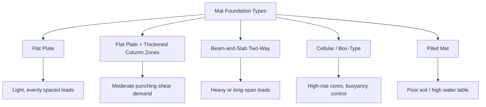

## Mat Foundation Design Basics

### Definition and Purpose

A mat foundation (also called a raft foundation) is a large, continuous reinforced concrete slab that supports multiple columns and walls by transferring structural loads to the underlying soil over the entire footprint of the structure. Instead of using individual isolated or combined footings, the mat spreads the total building load across a single large contact area, which reduces the net bearing pressure imposed on the soil.

Mat foundations are typically selected when:

- Allowable soil bearing capacity is low relative to structural loads
- Individual footings would overlap or cover more than approximately 50% of the plan area
- Differential settlement must be minimized across the structure
- Columns are closely spaced or unevenly loaded
- Basement construction requires a uniform waterproof slab
- Soil is erratic or contains compressible pockets that could cause uneven support

### Types of Mat Foundations

**Flat Plate Mat**

A uniform-thickness slab, typically used for relatively light and evenly spaced column loads. Simplest to form and reinforce.

**Flat Plate Thickened Under Columns**

Similar to the flat plate but with a thickened region (a "plinth" or drop panel) beneath heavily loaded columns to resist punching shear without increasing the overall slab thickness.

**Beam-and-Slab (Two-Way Beam) Mat**

Beams run between columns in both directions, with the slab spanning between beams. Used when column loads or spans are large and a flat plate would require excessive thickness.

**Cellular or Box-Type Mat**

Composed of a grid of intersecting beams and top/bottom slabs forming a rigid box structure. Used for very heavy structures (e.g., high-rise cores) where high rigidity and buoyancy resistance are needed.

**Piled Mat (Mat-on-Piles)**

A mat combined with piles beneath it, used when soil at shallow depth cannot provide adequate bearing capacity even with load spreading, or to control settlement and uplift (e.g., due to high water tables).

### Design Philosophy and Load Path

The mat behaves as an inverted, upside-down slab: instead of gravity loads bearing down on a slab supported by beams/columns, the soil pressure pushes upward against the mat while the columns "hang" loads down onto it. The mat must therefore be designed for bending, shear, and punching shear caused by this upward reaction.

**Load Path Summary:**

1. Superstructure loads (dead, live, lateral) collect at column/wall bases.
2. Column loads are transmitted into the mat as concentrated downward forces.
3. Soil reaction (bearing pressure) pushes upward against the mat's underside.
4. The mat bends between columns due to the net effect of concentrated column loads versus distributed soil reaction.
5. Bearing pressure distribution depends on mat rigidity and soil stiffness (see Rigid vs. Flexible methods below).

### Bearing Pressure Distribution: Rigid vs. Flexible Methods

**Rigid (Conventional) Method**

Assumes the mat is infinitely rigid compared to the soil, so soil pressure varies linearly across the mat, similar to eccentric footing pressure distribution. This is the most common simplified design approach.

For a mat with resultant load $Q$ acting at eccentricities $e_x$ and $e_y$ from the centroid, the soil pressure at any point $(x, y)$ is:

$$q(x,y) = \frac{Q}{A} \pm \frac{Q \cdot e_x \cdot x}{I_y} \pm \frac{Q \cdot e_y \cdot y}{I_x}$$

where:

- $A$ = total plan area of the mat
- $I_x, I_y$ = moments of inertia of the mat plan area about the centroidal axes
- $e_x, e_y$ = eccentricities of the resultant load from the centroid

**Applicability criterion (rigid method valid when):**

$$\frac{1}{\lambda} = \left(\frac{4 \cdot E_s \cdot B \cdot t^3}{12 \cdot (1-\mu_s^2) \cdot E_c \cdot I}\right)^{0.25} \times \text{spacing} \leq \pi/4 \text{ (approx.)}$$

In practice, most codes/textbooks (e.g., ACI 336) state the mat can be treated as rigid if column spacing is fairly uniform and spacing variation does not exceed about 20% between adjacent spans, and the mat thickness is proportioned so relative stiffness $\beta \times L \leq \pi/4$, where $\beta$ is defined below.

**Flexible (Elastic Foundation) Method**

Used when the mat is relatively thin or spans/loads are highly non-uniform, causing significant local deformation ("dishing") under concentrated loads. The soil is idealized as a bed of independent springs (Winkler foundation model), each with stiffness defined by the modulus of subgrade reaction $k_s$.

The governing differential equation for a beam (or strip) on an elastic foundation is:

$$E \cdot I \cdot \frac{d^4y}{dx^4} + k_s \cdot B \cdot y = q(x)$$

where:

- $E \cdot I$ = flexural rigidity of the mat strip
- $k_s$ = modulus of subgrade reaction (force/length³)
- $B$ = width of the strip
- $y$ = deflection
- $q(x)$ = applied load per unit length

The characteristic parameter $\beta$ (relative stiffness) is:

$$\beta = \left(\frac{k_s \cdot B}{4 \cdot E \cdot I}\right)^{0.25}$$

**[Inference]** The precise threshold values separating "rigid" from "flexible" behavior vary between design codes and textbooks (ACI 336.2R vs. various national codes), so the exact numerical cutoff should be confirmed against the governing code for a given project.

### Modulus of Subgrade Reaction ($k_s$)

$k_s$ is a critical and often uncertain parameter representing soil stiffness per unit area, typically obtained from:

- Plate load tests (most reliable, but scale-dependent)
- Correlation with soil bearing capacity or CBR value
- Correlation with allowable soil pressure: approximate relation $k_s \approx 40 \times q_{allow}$ (in consistent units, commonly used as a rough estimate)
- Consolidation/settlement analysis: $k_s = q / \delta$, where $q$ is applied pressure and $\delta$ is expected settlement

**[Unverified]** Because $k_s$ depends on the loaded area, soil type, footing size, and depth, published correlation formulas should be treated as approximate starting points rather than universally accurate; site-specific geotechnical investigation is standard practice.

### Design Procedure (Typical Workflow)

1. **Gather geotechnical data**: allowable bearing capacity, modulus of subgrade reaction, settlement characteristics, groundwater table depth.
2. **Determine total loads**: sum all column/wall dead, live, and lateral loads plus mat self-weight.
3. **Check bearing capacity**: ensure the net average pressure does not exceed the allowable soil bearing capacity, with an adequate factor of safety.
4. **Select mat type and preliminary thickness**: based on span, punching shear demand, and rigidity requirements.
5. **Determine pressure distribution**: apply rigid or flexible method depending on applicability.
6. **Analyze bending moments and shears**: using strip method, finite difference, finite element, or closed-form beam-on-elastic-foundation solutions.
7. **Check punching (two-way) shear** at each column.
8. **Check one-way (beam) shear** across critical sections.
9. **Design flexural reinforcement** (top and bottom mats of rebar, in both directions).
10. **Check settlement (total and differential)**.
11. **Check overturning/sliding** for eccentric or lateral loads, if applicable.
12. **Detail reinforcement**, construction joints, waterproofing (if below water table), and edge conditions.

### Punching Shear Check

Punching (two-way) shear failure occurs when a column punches through the mat as a cone/pyramid shape around the loaded area. The critical section is located at a distance $d/2$ from the column face, where $d$ is the effective depth of the mat.

**Nominal punching shear stress capacity (per ACI 318 approach):**

$$v_c = \min\left[ \left(2 + \frac{4}{\beta_c}\right), \left(\frac{\alpha_s \cdot d}{b_0} + 2\right), 4 \right] \times 0.17\sqrt{f_c'}$$

(expressed in SI units, MPa) where:

- $\beta_c$ = ratio of long side to short side of the column
- $\alpha_s$ = 40 for interior columns, 30 for edge columns, 20 for corner columns
- $b_0$ = perimeter of the critical shear section
- $f_c'$ = specified concrete compressive strength

**[Inference]** Exact coefficients and unit conventions differ slightly between ACI 318 editions and other codes (Eurocode 2, IS 456); designers should verify against the specific code edition governing the project.

### One-Way (Beam) Shear Check

Checked at a distance $d$ from the column/wall face, treating the mat as a wide beam:

$$V_c = 0.17\sqrt{f_c'} \times b_w \times d \quad \text{(SI units, MPa)}$$

The factored shear demand $V_u$ at the critical section must satisfy $V_u \leq \phi V_c$ (plus any additional shear reinforcement contribution, if provided).

### Flexural Design

Bending moments obtained from the rigid or flexible analysis are used to design top and bottom reinforcement mats in both orthogonal directions:

- **Bottom reinforcement**: resists positive moments (sagging) typically occurring between columns
- **Top reinforcement**: resists negative moments (hogging) typically occurring over columns and near edges/cantilevers

Reinforcement design follows standard reinforced concrete flexural design:

$$M_n = A_s \cdot f_y \cdot \left(d - \frac{a}{2}\right)$$

where $a = \dfrac{A_s \cdot f_y}{0.85 \cdot f_c' \cdot b}$

Minimum reinforcement ratios and bar spacing follow standard slab design provisions of the governing concrete code (e.g., ACI 318 minimum shrinkage/temperature steel and flexural minimums).

### Settlement Considerations

Mat foundations reduce **differential** settlement more effectively than uniform (total) settlement because the large, continuous slab tends to redistribute uneven soil response across the structure. Total settlement is typically estimated using consolidation settlement theory for cohesive soils:

$$S_c = \frac{C_c \cdot H}{1 + e_0} \times \log_{10}\left(\frac{\sigma_0' + \Delta\sigma}{\sigma_0'}\right)$$

where:

- $C_c$ = compression index
- $H$ = thickness of compressible layer
- $e_0$ = initial void ratio
- $\sigma_0'$ = initial effective overburden stress
- $\Delta\sigma$ = increase in stress due to applied load

**[Inference]** Differential settlement across a mat is generally estimated as a fraction of total settlement (commonly cited as roughly 50–75% of total settlement in many design references), but this ratio is soil- and geometry-dependent and should not be applied as a fixed universal rule.

### Example: Simplified Rigid Method Calculation

**Given:**

- Rectangular mat: 20 m × 15 m
- Total column load $Q$ = 45,000 kN, applied with eccentricity $e_x$ = 0.5 m along the long axis
- Allowable soil bearing capacity = 180 kPa

**Step 1 — Average pressure:**

$$q_{avg} = \frac{Q}{A} = \frac{45{,}000}{20 \times 15} = 150 \text{ kPa}$$

**Step 2 — Section modulus (long axis):**

$$Z = \frac{B \cdot L^2}{6} = \frac{15 \times 20^2}{6} = 1000 \text{ m}^3$$

**Step 3 — Maximum/minimum pressure:**

$$q_{max,min} = q_{avg} \pm \frac{Q \cdot e_x}{Z} = 150 \pm \frac{45{,}000 \times 0.5}{1000} = 150 \pm 22.5$$

$$q_{max} = 172.5 \text{ kPa}, \quad q_{min} = 127.5 \text{ kPa}$$

**Step 4 — Check against allowable bearing capacity:**

Since $q_{max} = 172.5$ kPa $< 180$ kPa (allowable), the design satisfies the bearing capacity check.

### Illustration: Mat Foundation Cross-Section (svg_diagram)

<svg xmlns="http://www.w3.org/2000/svg" viewBox="0 0 700 380" font-family="Arial, sans-serif">
<text x="350" y="25" font-size="16" text-anchor="middle" font-weight="bold">Mat Foundation Cross-Section (svg_diagram)</text>

<rect x="150" y="60" width="30" height="80" fill="#888" />
<rect x="340" y="60" width="30" height="80" fill="#888" />
<rect x="530" y="60" width="30" height="80" fill="#888" />
<text x="165" y="55" font-size="12" text-anchor="middle">Column A</text>
<text x="355" y="55" font-size="12" text-anchor="middle">Column B</text>
<text x="545" y="55" font-size="12" text-anchor="middle">Column C</text>

<line x1="165" y1="40" x2="165" y2="58" stroke="black" stroke-width="2" marker-end="url(#arrowdown)" />
<line x1="355" y1="40" x2="355" y2="58" stroke="black" stroke-width="2" marker-end="url(#arrowdown)" />
<line x1="545" y1="40" x2="545" y2="58" stroke="black" stroke-width="2" marker-end="url(#arrowdown)" />

<rect x="80" y="140" width="540" height="40" fill="#c9a876" stroke="black" stroke-width="1.5" />
<text x="350" y="165" font-size="13" text-anchor="middle">Reinforced Concrete Mat</text>

<line x1="90" y1="150" x2="610" y2="150" stroke="#333" stroke-width="1" stroke-dasharray="4,2" />
<line x1="90" y1="170" x2="610" y2="170" stroke="#333" stroke-width="1" stroke-dasharray="4,2" />
<text x="620" y="153" font-size="10">Top bars</text>
<text x="620" y="173" font-size="10">Bottom bars</text>

<rect x="80" y="180" width="540" height="120" fill="#deb887" stroke="black" stroke-width="1" />
<text x="350" y="245" font-size="13" text-anchor="middle">Soil / Subgrade</text>

<g stroke="#1a5276" stroke-width="2">
<line x1="120" y1="195" x2="120" y2="178" marker-end="url(#arrowup)" />
<line x1="200" y1="195" x2="200" y2="178" marker-end="url(#arrowup)" />
<line x1="280" y1="195" x2="280" y2="178" marker-end="url(#arrowup)" />
<line x1="360" y1="195" x2="360" y2="178" marker-end="url(#arrowup)" />
<line x1="440" y1="195" x2="440" y2="178" marker-end="url(#arrowup)" />
<line x1="520" y1="195" x2="520" y2="178" marker-end="url(#arrowup)" />
<line x1="590" y1="195" x2="590" y2="178" marker-end="url(#arrowup)" />
</g>
<text x="350" y="320" font-size="12" text-anchor="middle" fill="#1a5276">Upward Soil Bearing Reaction (q)</text>
</svg>

### Common Design Pitfalls

- **Ignoring differential settlement in flexible analysis**: using the rigid method when column loads/spacing are highly non-uniform can significantly underestimate local bending moments.
- **Underestimating punching shear near heavily loaded interior columns**, especially where drop panels are omitted.
- **Neglecting buoyancy/uplift** in below-grade mats subject to high groundwater tables, which can cause net upward pressure requiring uplift reinforcement or tie-down piles.
- **Incorrect estimation of $k_s$**, leading to unrealistic pressure distribution and reinforcement design in the flexible method.
- **Overlooking construction joints and pour sequencing**, which affect shrinkage cracking control in large mats.

### Related Topics

- Combined footing design and rigid vs. flexible footing comparison
- Winkler (elastic foundation) beam theory and finite element modeling of mats
- Modulus of subgrade reaction determination via plate load test
- Punching shear reinforcement (shear studs, stirrup cages) in slabs
- Retaining wall and basement wall interaction with mat foundations
- Deep foundation alternatives: pile groups and pile caps
- Settlement analysis: immediate, consolidation, and secondary settlement
- Buoyancy and hydrostatic uplift design for below-grade structures
- Soil-structure interaction modeling using finite element software