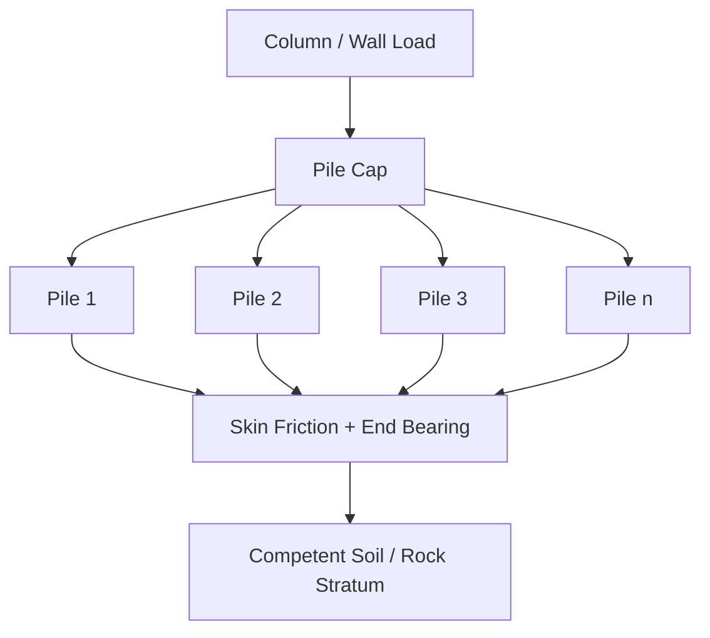

## Pile Cap Design

### Definition and Purpose

A pile cap is a thick, rigid reinforced concrete slab that sits atop a group of piles and distributes the superstructure's column or wall loads to the individual piles beneath it. The pile cap ensures that all piles in a group act together, sharing load proportionally, and provides the structural transition between the discrete pile foundation elements and the concentrated loads from columns or walls above.

Pile caps are used whenever:

- Bearing capacity of surface or shallow soil is inadequate for shallow foundations
- Loads must be transferred to deeper, more competent soil or rock strata via piles
- Structures are subject to significant uplift, lateral, or seismic forces requiring pile restraint
- A single pile cannot resist the full column load, requiring load-sharing across a pile group

### Load Path

The column load is delivered to the top of the cap, distributed among the piles based on pile stiffness and group geometry, and each pile transfers its share of load into the soil through a combination of skin friction (shaft resistance) and end bearing, depending on pile type and soil profile.

### Types of Pile Caps by Pile Count and Geometry

**Single-Pile Cap**

Used for light loads or where a single large-diameter pile suffices; cap primarily transfers moment and shear.

**Two-Pile Cap**

Requires a tie beam or strap in the perpendicular direction to resist any eccentric moment, since two piles alone cannot resist bending about the axis connecting them.

**Three-Pile Cap (Triangular)**

Provides inherent stability in both directions without needing tie beams, often economical for moderate loads.

**Four-Pile Cap (Square/Rectangular)**

One of the most common configurations; behaves similarly to a two-way slab supported on point supports (piles).

**Multi-Pile Cap (5+ piles)**

Used for heavy column loads; often analyzed using strut-and-tie modeling or finite element methods due to complex load paths.

### Design Approaches

**1. Beam Theory (Bending) Method**

Treats the pile cap as a flexural member (thick slab or beam), applicable when the cap's span-to-depth ratio is relatively large (thinner caps). Reinforcement is designed for bending moments computed from statics, similar to conventional footing design.

**2. Strut-and-Tie Method (STM)**

Used for deep, thick pile caps where "deep beam" behavior governs (typically when the shear span-to-depth ratio $a_v/d < 2$). The cap is idealized as a truss: concrete struts (compression) carry load from the column to the piles, and steel ties (tension reinforcement) complete the load path at the bottom of the cap.

$$\frac{a_v}{d} < 2 \implies \text{Deep beam / strut-and-tie behavior}$$

**[Inference]** The exact threshold ratio distinguishing "deep" from "shallow" pile cap behavior varies slightly between codes (ACI 318, CIRIA, Eurocode 2); the commonly cited value of 2 should be verified against the governing design code.

### Strut-and-Tie Model Fundamentals

In the STM approach for a typical 2-pile or 4-pile cap:

- **Struts**: Diagonal compression members running from the column face to each pile head, modeled as concrete compression fields.
- **Ties**: Horizontal tension reinforcement at the bottom of the cap connecting the base of the struts (i.e., directly over the piles), resisting the horizontal component of strut force.
- **Nodes**: Points where struts and ties meet (at column face and at pile centers), which must be checked for adequate bearing/nodal stress.

**Basic tie force derivation (two-pile cap under central column load):**

For a cap with column load $P$, pile spacing $s$, and cap effective depth $d$, the tension tie force $T$ is:

$$T = \frac{P \cdot s}{4 \cdot d}$$

(derived from the geometry of the compression strut angle between the column and each pile head)

Required tie reinforcement area:

$$A_s = \frac{T}{\phi \cdot f_y}$$

### Strut Capacity Check

Concrete struts must be checked for crushing capacity:

$$F_{ns} = f_{ce} \cdot A_{cs}$$

where:

- $f_{ce} = 0.85 \cdot \beta_s \cdot f_c'$ (effective compressive strength of the strut)
- $\beta_s$ = strut efficiency factor (typically 1.0 for prismatic struts in undisturbed zones, 0.75 for bottle-shaped struts with reinforcement, 0.60λ for bottle-shaped struts without reinforcement, per ACI 318 Appendix A / Chapter 23)
- $A_{cs}$ = cross-sectional area of the strut at its narrowest point (usually at the node)

### Punching (Two-Way) Shear Check

Punching shear is checked around the column (cap-to-column interface) and around individual piles (pile-to-cap interface), particularly for piles close to the column where the critical shear perimeter may overlap.

**Critical section at column:** located at $d/2$ from the column face, following standard two-way slab punching shear provisions (same form as mat foundation punching shear):

$$v_c = 0.33\sqrt{f_c'} \quad \text{(simplified single limit, SI units, MPa; refer to code for full multi-term expression)}$$

**Critical section at pile:** if the clear spacing between the column face and pile face is less than $d$, the piles are considered to contribute to a "punching cone" that overlaps with the column's critical perimeter, requiring a modified (often reduced) effective shear perimeter.

**[Unverified]** Some codes (e.g., CRSI, CIRIA C580, ACI 318 commentary) provide specific modification procedures for overlapping critical sections; the applicable procedure should be confirmed against the governing code and any local amendments.

### One-Way Shear Check

Checked as a wide beam across the full width of the cap, at a critical section located a distance $d$ from the column face (for a beam-theory-designed cap) or, for deep caps designed via STM, one-way shear may not govern separately since the strut-and-tie model inherently accounts for shear transfer.

$$V_c = 0.17\sqrt{f_c'} \times b_w \times d \quad \text{(SI units, MPa)}$$

### Design Procedure (Typical Workflow)

1. **Determine column loads** (axial, moment, shear) at the top of the cap, including all applicable load combinations.
2. **Determine number and arrangement of piles** based on individual pile capacity and required factor of safety (typically from geotechnical report).
3. **Check pile group capacity**: verify that the maximum pile reaction (including moment effects) does not exceed allowable pile capacity.
4. **Establish cap geometry**: pile spacing (commonly 2.5–3.0 pile diameters center-to-center, per most codes/practice), edge distance from pile center to cap edge (commonly ≥ 1 pile diameter, often more for driven piles due to installation tolerance).
5. **Select cap depth**: sized primarily by punching shear and strut-and-tie geometry requirements, since pile caps are typically shear-critical rather than flexure-critical.
6. **Determine design method**: beam theory for shallow caps, strut-and-tie for deep caps.
7. **Design flexural/tie reinforcement**.
8. **Check punching shear** at column and piles.
9. **Check one-way shear** (if applicable).
10. **Check bearing stress** at column-to-cap and pile-to-cap interfaces.
11. **Detail reinforcement**: bottom mesh/tie bars, top reinforcement (for uplift or moment reversal), dowels/pile embedment, and development lengths.
12. **Verify pile embedment into cap** and cap edge distances per code/manufacturer requirements.

### Pile Reaction Calculation for Eccentric/Moment Loading

For a pile group subjected to a vertical load $P$ and moments $M_x$, $M_y$ about the centroid of the pile group, the reaction on any individual pile $i$ is calculated similarly to an eccentrically loaded bolt/rivet group:

$$R_i = \frac{P}{n} \pm \frac{M_x \cdot y_i}{\sum y_i^2} \pm \frac{M_y \cdot x_i}{\sum x_i^2}$$

where:

- $n$ = total number of piles
- $x_i, y_i$ = coordinates of pile $i$ relative to the pile group centroid
- $\sum x_i^2, \sum y_i^2$ = sum of squares of pile coordinates about each axis

### Example: Four-Pile Cap Reaction Calculation

**Given:**

- Column load $P$ = 3,200 kN (vertical)
- Moment $M_x$ = 180 kN·m
- Four piles arranged in a square, each at $\pm 1.0$ m from the centroid in both $x$ and $y$

**Step 1 — Direct load per pile:**

$$\frac{P}{n} = \frac{3200}{4} = 800 \text{ kN}$$

**Step 2 — Moment contribution:**

$$\sum y_i^2 = 4 \times (1.0)^2 = 4 \text{ m}^2$$

$$\frac{M_x \cdot y_i}{\sum y_i^2} = \frac{180 \times 1.0}{4} = 45 \text{ kN}$$

**Step 3 — Maximum and minimum pile reactions:**

$$R_{max} = 800 + 45 = 845 \text{ kN}$$

$$R_{min} = 800 - 45 = 755 \text{ kN}$$

Both values must be checked against the allowable pile capacity (compression) and, if $R_{min}$ becomes negative under other load combinations, against allowable uplift capacity of the pile.

### Illustration: Four-Pile Cap Strut-and-Tie Model (svg_diagram)

<svg xmlns="http://www.w3.org/2000/svg" viewBox="0 0 600 420" font-family="Arial, sans-serif">
<text x="300" y="25" font-size="16" text-anchor="middle" font-weight="bold">Four-Pile Cap Strut-and-Tie Model (svg_diagram)</text>

<rect x="260" y="40" width="80" height="50" fill="#888" />
<text x="300" y="35" font-size="12" text-anchor="middle">Column Load P</text>
<line x1="300" y1="10" x2="300" y2="38" stroke="black" stroke-width="2" marker-end="url(#arrowdown2)" />

<rect x="100" y="90" width="400" height="220" fill="#c9a876" stroke="black" stroke-width="1.5" />

<circle cx="160" cy="150" r="22" fill="#666" />
<circle cx="440" cy="150" r="22" fill="#666" />
<circle cx="160" cy="250" r="22" fill="#666" />
<circle cx="440" cy="250" r="22" fill="#666" />
<text x="160" y="155" font-size="10" text-anchor="middle" fill="white">Pile 1</text>
<text x="440" y="155" font-size="10" text-anchor="middle" fill="white">Pile 2</text>
<text x="160" y="255" font-size="10" text-anchor="middle" fill="white">Pile 3</text>
<text x="440" y="255" font-size="10" text-anchor="middle" fill="white">Pile 4</text>

<g stroke="#a93226" stroke-width="3" stroke-dasharray="6,3">
<line x1="270" y1="90" x2="160" y2="150" />
<line x1="330" y1="90" x2="440" y2="150" />
<line x1="270" y1="90" x2="160" y2="250" />
<line x1="330" y1="90" x2="440" y2="250" />
</g>
<text x="150" y="380" font-size="12" fill="#a93226">- - - Struts (compression)</text>

<g stroke="#1a5276" stroke-width="3">
<line x1="160" y1="150" x2="440" y2="150" />
<line x1="160" y1="250" x2="440" y2="250" />
<line x1="160" y1="150" x2="160" y2="250" />
<line x1="440" y1="150" x2="440" y2="250" />
</g>
<text x="150" y="400" font-size="12" fill="#1a5276">— Ties (tension reinforcement)</text>
</svg>

### Pile-to-Cap Connection Detailing

- **Pile embedment depth into cap**: commonly 75–150 mm for cast-in-place piles or precast concrete piles, though requirements vary by code, pile type, and load direction (compression-only vs. uplift/moment-resisting connections).
- **Dowel bars/reinforcement**: required when piles must resist tension (uplift) or transfer moment into the cap; dowels extend from the pile into the cap and are lap-spliced or mechanically anchored.
- **Minimum edge distance**: from pile center to edge of cap, typically ≥ 1.0 to 1.5 pile diameters, to prevent edge punching/spalling failures.
- **Pile cutoff tolerance**: construction tolerances for pile head position and elevation must be accommodated in cap design (typically ±75 mm horizontal, per common driven-pile installation tolerances).

**[Unverified]** Specific embedment depths, edge distances, and tolerances vary significantly between local codes, pile manufacturers, and project specifications; values cited here are common industry practice ranges, not universal code minimums.

### Common Design Pitfalls

- **Treating deep pile caps with simple beam theory**, which underestimates shear capacity and can lead to unconservative or overly conservative designs depending on the geometry; STM is generally required for low shear-span-to-depth ratios.
- **Ignoring overlapping punching shear perimeters** between closely spaced piles and the column, leading to unconservative shear capacity estimates.
- **Neglecting uplift/tension pile capacity checks** in load combinations involving wind or seismic overturning.
- **Insufficient pile embedment or dowel development length**, causing pull-out or bond failure under moment/uplift.
- **Underestimating group effects on pile capacity** (pile group efficiency), which is a geotechnical rather than structural consideration but directly affects cap load distribution.

### Related Topics

- Strut-and-tie modeling fundamentals (ACI 318 Appendix A / Chapter 23)
- Pile group efficiency and geotechnical capacity of pile groups
- Deep foundation types: driven piles, bored/drilled piers, micropiles
- Combined pile cap and grade beam / tie beam design
- Lateral pile capacity and pile-soil interaction (p-y curves)
- Uplift and tension pile design
- Mat foundation design basics (comparison of shallow vs. deep foundation systems)
- Seismic detailing requirements for pile-to-cap connections