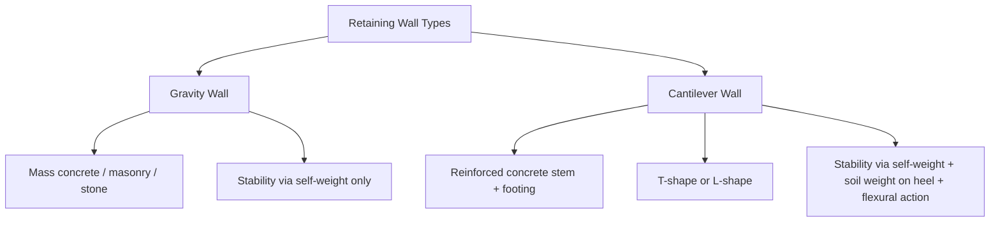

## Cantilever and Gravity Retaining Wall Design

### Definition and Purpose

Retaining walls are structures designed to resist lateral earth pressure and retain soil (or other material) at different elevations on either side. Gravity and cantilever retaining walls are two of the most fundamental types, differing primarily in how they achieve stability against overturning and sliding.

**Gravity Retaining Wall**: Relies primarily on its own mass (typically plain or lightly reinforced concrete, masonry, or stone) to resist overturning and sliding forces from retained soil.

**Cantilever Retaining Wall**: A reinforced concrete wall consisting of a vertical stem and a horizontal base slab (footing), shaped in an inverted T or L configuration. Stability is achieved partly through self-weight but significantly through the weight of soil resting on the heel portion of the footing, combined with the flexural (cantilever) action of the reinforced stem and footing.

### Geometry and Components

**Gravity Wall Components:**

- **Stem**: Trapezoidal cross-section, wide at base, narrow at top, relying on mass for stability.
- **Base/footing**: Sometimes minimal or absent in pure gravity walls; some designs include a small base for additional stability and bearing area.

**Cantilever Wall Components:**

- **Stem**: Vertical reinforced concrete wall, thinner than a gravity wall, resisting lateral pressure via bending.
- **Toe**: Portion of the base slab extending outward from the stem on the retained-soil side (front), primarily resisting bearing pressure and contributing minor overturning resistance.
- **Heel**: Portion of the base slab extending backward beneath the retained soil, carrying the weight of soil above it, which contributes significantly to overturning resistance.
- **Shear key** (optional): A vertical or inclined projection beneath the base slab, used to increase sliding resistance when friction alone is insufficient.

### Illustration: Cantilever Retaining Wall Cross-Section (svg_diagram)

<svg xmlns="http://www.w3.org/2000/svg" viewBox="0 0 600 420" font-family="Arial, sans-serif">
<text x="300" y="25" font-size="16" text-anchor="middle" font-weight="bold">Cantilever Retaining Wall Cross-Section (svg_diagram)</text>

<rect x="330" y="70" width="200" height="230" fill="#deb887" />
<text x="430" y="190" font-size="13" text-anchor="middle">Retained Soil (Backfill)</text>

<polygon points="300,70 330,70 330,300 300,300" fill="#999" stroke="black" stroke-width="1.5" />
<text x="315" y="60" font-size="11" text-anchor="middle">Stem</text>

<rect x="200" y="300" width="230" height="30" fill="#999" stroke="black" stroke-width="1.5" />
<text x="245" y="320" font-size="11" text-anchor="middle">Toe</text>
<text x="390" y="320" font-size="11" text-anchor="middle">Heel</text>

<rect x="290" y="330" width="30" height="30" fill="#777" stroke="black" stroke-width="1" />
<text x="305" y="375" font-size="10" text-anchor="middle">Shear Key</text>

<rect x="80" y="280" width="120" height="50" fill="#deb887" />
<text x="140" y="305" font-size="10" text-anchor="middle">Front Soil</text>

<g stroke="#a93226" stroke-width="2">
<line x1="360" y1="90" x2="332" y2="90" marker-end="url(#arrowleft)" />
<line x1="370" y1="150" x2="332" y2="150" marker-end="url(#arrowleft)" />
<line x1="380" y1="210" x2="332" y2="210" marker-end="url(#arrowleft)" />
<line x1="390" y1="270" x2="332" y2="270" marker-end="url(#arrowleft)" />
</g>
<text x="460" y="270" font-size="11" fill="#a93226">Lateral Earth Pressure (triangular)</text>

<line x1="390" y1="240" x2="390" y2="298" stroke="#1a5276" stroke-width="2" marker-end="url(#arrowdown3)" />
<text x="470" y="220" font-size="11" fill="#1a5276">Soil Weight on Heel</text>
</svg>

### Lateral Earth Pressure Theories

**Rankine Theory**

Assumes a smooth, vertical wall face and a frictionless soil-wall interface, with the failure surface forming a plane at an angle to the horizontal defined by the soil's internal friction angle $\phi$.

**Active earth pressure coefficient (Rankine):**

$$K_a = \tan^2\left(45° - \frac{\phi}{2}\right)$$

**Passive earth pressure coefficient (Rankine):**

$$K_p = \tan^2\left(45° + \frac{\phi}{2}\right)$$

**Coulomb Theory**

More general than Rankine, accounting for wall friction ($\delta$), wall inclination, and backfill slope angle ($\beta$), making it more applicable to real-world wall geometries.

$$K_a = \frac{\cos^2(\phi - \theta)}{\cos^2\theta \cdot \cos(\theta + \delta)\left[1 + \sqrt{\dfrac{\sin(\phi + \delta)\sin(\phi - \beta)}{\cos(\theta + \delta)\cos(\theta - \beta)}}\right]^2}$$

where:

- $\phi$ = soil internal friction angle
- $\theta$ = angle of the wall back face from vertical
- $\delta$ = wall friction angle
- $\beta$ = backfill slope angle from horizontal

**[Inference]** Coulomb's equation form varies slightly across textbooks depending on sign conventions for $\theta$ and $\beta$; the governing reference/code equation should be used directly for final design.

### Lateral Pressure Distribution and Resultant Force

For a wall of height $H$ retaining a soil of unit weight $\gamma$, the active pressure varies linearly with depth:

$$p_a(z) = K_a \cdot \gamma \cdot z$$

Total active thrust per unit length of wall (resultant of the triangular pressure distribution):

$$P_a = \frac{1}{2} \cdot K_a \cdot \gamma \cdot H^2$$

acting at a height of $H/3$ above the base.

**With surcharge load $q$ on the backfill surface (uniform):**

$$p_a(z) = K_a (\gamma z + q)$$

$$P_a = \frac{1}{2} K_a \gamma H^2 + K_a \cdot q \cdot H$$

**With groundwater present**, hydrostatic pressure must be added separately using the submerged unit weight of soil below the water table plus full hydrostatic pressure of water:

$$p_w(z) = \gamma_w \cdot z_w$$

where $z_w$ is depth below the water table and $\gamma_w$ is the unit weight of water.

### Stability Checks

**1. Overturning Stability**

Moments are taken about the toe (front edge of the footing):

$$FS_{overturning} = \frac{\sum M_{resisting}}{\sum M_{overturning}} \geq 1.5 \text{ to } 2.0$$

Resisting moments include wall self-weight, soil weight on the heel, and any surcharge weight on the heel, all multiplied by their respective moment arms from the toe. Overturning moments are generated by the lateral earth pressure resultant (and any surcharge lateral component) acting at its height above the base.

**2. Sliding Stability**

$$FS_{sliding} = \frac{\sum F_{resisting}}{\sum F_{driving}} = \frac{(\sum W) \cdot \tan\delta_b + c_a \cdot B + P_p}{P_a \cdot \cos\alpha} \geq 1.5$$

where:

- $\sum W$ = total vertical load (wall + soil weight)
- $\delta_b$ = friction angle between base and soil (often taken as $\frac{2}{3}\phi$ to $\phi$ depending on interface roughness)
- $c_a$ = adhesion between base and soil (often conservatively neglected or reduced from soil cohesion $c$)
- $B$ = base width
- $P_p$ = passive resistance in front of the wall (often neglected or reduced due to potential future excavation/disturbance)
- $P_a \cdot \cos\alpha$ = horizontal component of active thrust

**[Inference]** Minimum required factors of safety (commonly 1.5 for sliding, 1.5–2.0 for overturning) vary by code and regulatory jurisdiction; local code requirements govern the specific minimums for a given project.

**3. Bearing Capacity Check**

The resultant vertical force must fall within the middle third of the base (for no-tension soil bearing) or within code-permitted eccentricity limits. Maximum and minimum bearing pressures are calculated using the eccentric loading formula:

$$q_{max,min} = \frac{\sum W}{B} \left(1 \pm \frac{6e}{B}\right)$$

where $e$ is the eccentricity of the resultant vertical force from the centroid of the base, calculated as:

$$e = \frac{B}{2} - \bar{x}$$

with $\bar{x}$ = distance from the toe to the resultant force location, found by summing moments about the toe and dividing by total vertical load.

**Middle-third criterion:**

$$e \leq \frac{B}{6}$$

If satisfied, $q_{min} \geq 0$ (no tension develops at the heel).

### Example: Gravity Wall Stability Check

**Given:**

- Wall height $H$ = 4 m
- Backfill: $\gamma$ = 18 kN/m³, $\phi$ = 30°, level backfill ($\beta = 0$), no surcharge
- Gravity wall: trapezoidal, base width $B$ = 2.4 m, top width = 0.4 m, unit weight of concrete = 24 kN/m³
- Base-soil friction angle $\delta_b$ = 20° (i.e., $\tan\delta_b$ = 0.364)

**Step 1 — Active earth pressure coefficient:**

$$K_a = \tan^2(45° - 15°) = \tan^2(30°) = 0.333$$

**Step 2 — Total active thrust:**

$$P_a = \frac{1}{2}(0.333)(18)(4^2) = 47.95 \text{ kN/m}$$

acting at $H/3 = 1.33$ m above the base.

**Step 3 — Overturning moment about toe:**

$$M_{OT} = P_a \times 1.33 = 47.95 \times 1.33 = 63.8 \text{ kN·m/m}$$

**Step 4 — Wall self-weight (approximate as trapezoid):**

$$W = \left(\frac{0.4 + 2.4}{2}\right) \times 4 \times 24 = 134.4 \text{ kN/m}$$

**Step 5 — Resisting moment (approximate, weight acting near base centroid ≈ 1.1 m from toe for this geometry — exact value requires trapezoid centroid calculation):**

**[Inference]** The precise centroid location depends on the exact trapezoidal geometry (top/base width and their offset); a full calculation would decompose the trapezoid into a rectangle and triangle to locate the centroid accurately before finalizing $M_R$.

$$M_R \approx W \times \bar{x}_{wall}$$

**Step 6 — Factor of safety against overturning:**

$$FS_{OT} = \frac{M_R}{M_{OT}}$$

(computed once $\bar{x}_{wall}$ is determined; must be checked against the minimum required FS per governing code)

**Step 7 — Sliding check:**

$$FS_{sliding} = \frac{W \tan\delta_b}{P_a} = \frac{134.4 \times 0.364}{47.95} = 1.02$$

Since $1.02 < 1.5$, this gravity wall configuration would **not** satisfy typical sliding stability requirements, indicating a shear key, wider base, or passive resistance credit would be needed.

### Cantilever Wall Structural Design (Reinforced Concrete Elements)

Once overall stability (overturning, sliding, bearing) is confirmed, the structural elements are designed as reinforced concrete cantilever members:

**Stem Design**: Designed as a vertical cantilever fixed at the base, resisting the lateral earth pressure moment at the base of the stem:

$$M_{stem} = \frac{1}{2} K_a \gamma_{soil} h_{stem}^3 / 3 \quad \text{(for triangular pressure over the stem height)}$$

more precisely expressed using the thrust and its lever arm:

$$M_{stem} = P_{a,stem} \times \frac{h_{stem}}{3}$$

Reinforcement is placed on the tension face (soil side) of the stem, designed using standard flexural design equations.

**Heel Design**: The heel is designed as a cantilever fixed at the stem, loaded downward by the weight of soil and any surcharge above it, and upward by soil bearing pressure beneath it (net effect usually produces tension on the top face of the heel).

**Toe Design**: The toe is designed as a cantilever fixed at the stem face, loaded upward by the soil bearing pressure beneath it (tension typically develops on the bottom face of the toe).

**Shear Key Design** (if used): Designed to mobilize additional passive resistance; the key depth and location affect the failure surface geometry and passive pressure development, and is typically checked using established design charts or code equations relating key depth to the base and total passive resistance developed.

### Drainage and Backfill Considerations

- **Weep holes or drainage pipes** are typically provided through the stem to relieve hydrostatic pressure buildup behind the wall, since retaining wall design generally assumes drained (no water pressure) conditions unless explicitly designed otherwise.
- **Granular backfill with a filter/drainage layer** helps prevent pore pressure buildup and reduces the risk of frost action or long-term saturation-related pressure increases.
- **Geotextile filter fabric** is commonly used to prevent fines migration into drainage aggregate while allowing water passage.

**[Unverified]** Specific weep hole spacing, drainage pipe diameter, and filter fabric specifications vary by regional practice and governing code; typical spacing ranges cited in various references (e.g., 1.5–3 m horizontal spacing) should be confirmed against local design standards.

### Seismic Considerations

For seismic design, the Mononobe-Okabe method extends Coulomb's theory to include pseudo-static horizontal and vertical seismic coefficients ($k_h$, $k_v$):

$$K_{ae} = \frac{\cos^2(\phi - \theta - \psi)}{\cos\psi \cos^2\theta \cos(\delta + \theta + \psi)\left[1 + \sqrt{\dfrac{\sin(\phi + \delta)\sin(\phi - \beta - \psi)}{\cos(\delta + \theta + \psi)\cos(\beta - \theta)}}\right]^2}$$

where $\psi = \tan^{-1}\left(\dfrac{k_h}{1 - k_v}\right)$

**[Inference]** Application of the Mononobe-Okabe method, including whether dynamic increment forces are applied at $H/3$ or higher (some codes recommend 0.6H for the dynamic increment), varies by seismic design code; the governing code's specific provisions should be followed directly.

### Common Design Pitfalls

- **Neglecting passive resistance conservatively but then relying on it anyway** in sliding checks without accounting for potential future excavation in front of the wall.
- **Ignoring hydrostatic pressure** when drainage systems fail or are poorly maintained, which can substantially increase lateral pressure beyond design assumptions.
- **Underestimating surcharge loads** from nearby construction equipment, vehicular traffic, or adjacent structures/foundations near the wall.
- **Incorrect assumption of at-rest vs. active pressure conditions**: at-rest pressure ($K_0$) governs when the wall is restrained from moving (e.g., basement walls braced top and bottom), which produces higher pressures than active conditions and requires a different coefficient: $K_0 \approx 1 - \sin\phi$ (Jaky's formula, for normally consolidated soils).
- **Overlooking global (slope) stability** of the overall retained slope/wall system, which is a separate check from local wall stability (overturning/sliding) and often requires slope stability software or limit-equilibrium methods.

### Related Topics

- Rankine vs. Coulomb earth pressure theory comparison
- Mechanically stabilized earth (MSE) walls and reinforced soil systems
- Sheet pile and anchored retaining wall design
- Basement/below-grade wall design (at-rest earth pressure conditions)
- Global slope stability analysis (limit equilibrium methods)
- Seismic (Mononobe-Okabe) lateral earth pressure analysis
- Drainage design for retaining structures
- Mat foundation design basics
- Pile cap design (for deep-foundation-supported retaining structures)