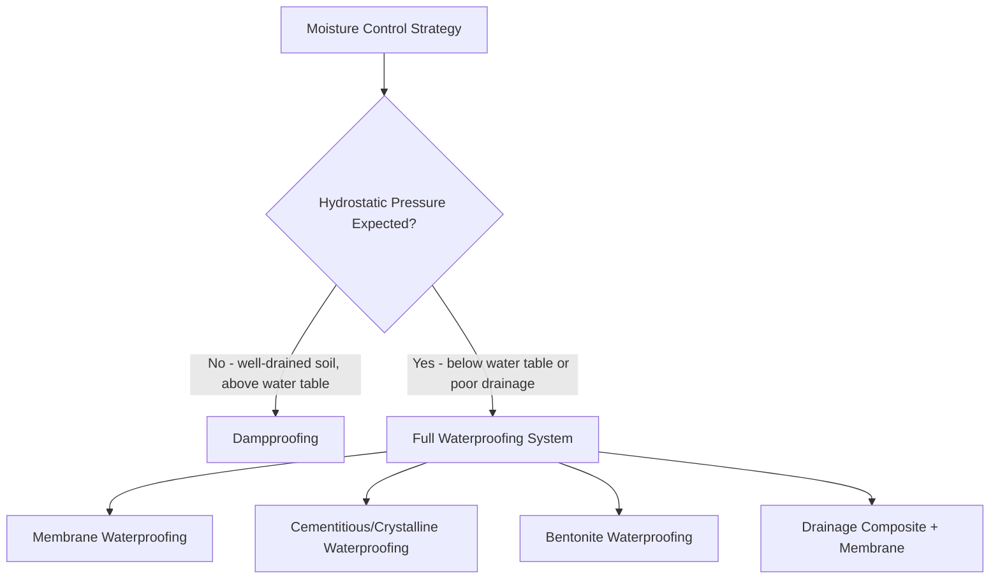

## Waterproofing and Drainage Detailing

### Definition and Purpose

Waterproofing and drainage detailing encompass the systems, materials, and construction details used to prevent water infiltration into below-grade and at-grade structural elements (foundations, basements, retaining walls) and to manage subsurface/surface water so it does not accumulate against structural elements or degrade soil-bearing performance. Proper detailing protects structural durability, prevents hydrostatic pressure buildup, controls moisture-related deterioration, and maintains habitable/usable below-grade space.

### Distinction: Waterproofing vs. Dampproofing

**Dampproofing**

A moisture-resistant (not fully waterproof) coating or membrane intended to resist moisture vapor transmission and minor soil moisture, but not designed to resist hydrostatic (standing water) pressure. Typically used above the water table in well-drained soils with no anticipated hydrostatic head.

**Waterproofing**

A fully water-resistant barrier system designed to withstand hydrostatic pressure from standing or flowing groundwater. Required below the water table, in poorly draining soils, or wherever water accumulation against the structure is anticipated.

**[Inference]** The specific threshold for choosing dampproofing versus full waterproofing (e.g., height of water table relative to floor slab, soil permeability class) is typically governed by local building code and geotechnical report recommendations rather than a single universal rule.

### Waterproofing System Types

**1. Membrane Waterproofing**

*Sheet-Applied Membranes*: Pre-manufactured rolls (rubberized asphalt, modified bitumen, or thermoplastic sheets such as PVC/TPO) adhered or mechanically fastened to the substrate, typically applied to the exterior (positive side) of foundation walls.

*Fluid-Applied Membranes*: Liquid rubber, polyurethane, or modified bitumen coatings applied by spray, roller, or trowel that cure into a seamless monolithic membrane, useful for complex geometries and penetrations.

**2. Cementitious Waterproofing**

Cement-based coatings (often modified with polymers) applied directly to concrete surfaces, forming a rigid waterproof layer. Effective for positive or negative-side application but less tolerant of structural movement/cracking than flexible membranes.

**3. Crystalline (Integral) Waterproofing**

Chemical admixtures added to concrete during batching, or applied as a surface treatment, that react with moisture and calcium hydroxide in the concrete to form insoluble crystalline structures within the pore network, blocking water pathways from within the concrete matrix itself. Can self-heal minor cracks as moisture reactivates the crystalline growth process.

**4. Bentonite (Clay) Waterproofing**

Sodium bentonite clay panels or sheets that swell upon contact with water, forming a dense, low-permeability barrier. Commonly used against blindside walls (where exterior excavation access is unavailable) and in below-grade applications where the bentonite is placed against the excavation face before concrete placement.

**5. Below-Slab Waterproofing/Vapor Barriers**

Polyethylene or reinforced vapor barrier sheets placed beneath slabs-on-grade to control both liquid water and water vapor transmission into the building.

### Positive-Side vs. Negative-Side Waterproofing

**Positive-Side (Exterior) Application**

Applied on the side of the structure facing the water source (typically the exterior face of a foundation wall, before backfilling). Preferred because it prevents water from reaching the structural concrete at all, protecting the concrete itself from saturation and freeze-thaw damage.

**Negative-Side (Interior) Application**

Applied on the interior face of a structure, opposite the water source—used when exterior access is not possible (e.g., retrofit projects, existing structures, or party-wall conditions). Generally considered less effective because water still penetrates and saturates the concrete, and the waterproofing must resist being pushed off the surface by hydrostatic pressure rather than being held in place against it.

**[Inference]** Industry preference strongly favors positive-side waterproofing where feasible; the relative performance disadvantage of negative-side systems is well documented in industry literature, though specific comparative failure rates are project- and product-dependent.

### Drainage System Components

**1. Perimeter Foundation Drain (French Drain / Footing Drain)**

A perforated pipe (typically PVC or corrugated HDPE) placed alongside the footing, surrounded by free-draining granular aggregate (commonly clean crushed stone) and wrapped in geotextile filter fabric to prevent soil fines from clogging the drainage aggregate and pipe perforations.

- Pipe is typically laid with perforations oriented downward or per manufacturer instruction (convention varies by system/region) and sloped to a positive gravity outlet or sump pump discharge point.
- Minimum slope is commonly cited as approximately 1% (1:100), though exact requirements depend on local plumbing/drainage code.

**2. Drainage Composite (Dimple Board / Drainage Mat)**

A geocomposite panel consisting of a dimpled or cuspated plastic core wrapped in geotextile fabric, installed against the waterproofing membrane on foundation walls. It creates a free-draining air gap that channels water downward to the footing drain while relieving hydrostatic pressure against the wall and protecting the waterproofing membrane from backfill damage during compaction.

**3. Weep Holes**

Small drainage openings (often formed with plastic tubes or open head joints in masonry) that allow water to escape from behind retaining walls, cavity walls, or veneer systems, relieving pressure buildup.

**4. Sump Pit and Pump System**

Used where gravity drainage to a positive outlet is not possible (e.g., high water table, flat site with no fall). Water collected by the foundation drain is directed into a sump pit, then mechanically pumped to grade or a storm system.

**5. Surface Grading and Swales**

Positive slope away from the building (commonly a minimum of 5% for the first several meters, per various residential/commercial codes) directs surface runoff away from the foundation, reducing the volume of water that must be managed by subsurface drainage systems.

**[Unverified]** Exact minimum grading slope and distance requirements vary between jurisdictions (e.g., IRC vs. IBC vs. local amendments); the applicable code should be consulted for specific numeric requirements on a given project.

### Illustration: Foundation Wall Waterproofing and Drainage Detail (svg_diagram)

<svg xmlns="http://www.w3.org/2000/svg" viewBox="0 0 600 420" font-family="Arial, sans-serif">
<text x="300" y="25" font-size="15" text-anchor="middle" font-weight="bold">Foundation Wall Waterproofing and Drainage Detail (svg_diagram)</text>

<line x1="40" y1="90" x2="560" y2="90" stroke="#555" stroke-width="1" stroke-dasharray="5,3" />
<text x="565" y="93" font-size="10">Grade</text>

<rect x="340" y="90" width="180" height="210" fill="#deb887" />
<text x="430" y="150" font-size="11" text-anchor="middle">Backfill (sloped away from wall)</text>

<rect x="300" y="90" width="40" height="210" fill="#999" stroke="black" stroke-width="1.5" />
<text x="320" y="85" font-size="10" text-anchor="middle">Foundation Wall</text>

<rect x="338" y="90" width="4" height="210" fill="#1a5276" />
<text x="470" y="230" font-size="10" fill="#1a5276">Waterproofing Membrane</text>

<rect x="342" y="90" width="10" height="210" fill="#f4d03f" opacity="0.8" />
<text x="470" y="250" font-size="10" fill="#7d6608">Drainage Composite</text>

<rect x="260" y="300" width="120" height="30" fill="#999" stroke="black" stroke-width="1.5" />
<text x="320" y="320" font-size="10" text-anchor="middle">Footing</text>

<circle cx="360" cy="315" r="10" fill="none" stroke="black" stroke-width="1.5" />
<text x="440" y="318" font-size="10">Perforated Drain Pipe</text>

<g fill="#aaa">
<circle cx="345" cy="305" r="2" />
<circle cx="352" cy="330" r="2" />
<circle cx="378" cy="308" r="2" />
<circle cx="382" cy="325" r="2" />
<circle cx="365" cy="298" r="2" />
</g>
<text x="440" y="335" font-size="10">Free-Draining Gravel</text>

<rect x="60" y="280" width="240" height="20" fill="#bbb" stroke="black" stroke-width="1" />
<text x="180" y="295" font-size="10" text-anchor="middle">Slab-on-Grade</text>

<rect x="60" y="298" width="240" height="3" fill="#1a5276" />
<text x="180" y="315" font-size="10" fill="#1a5276">Vapor Barrier</text>

<rect x="60" y="90" width="240" height="190" fill="#eef2f3" />
<text x="180" y="200" font-size="11" text-anchor="middle">Interior (Basement Space)</text>

<line x1="530" y1="95" x2="480" y2="105" stroke="#1a5276" stroke-width="2" marker-end="url(#arrowsurf)" />
<text x="500" y="80" font-size="9" fill="#1a5276">Surface runoff diverted away</text>
</svg>

### Design Procedure (Typical Workflow)

1. **Review geotechnical report**: identify water table elevation, seasonal high water table, soil permeability, and hydrostatic pressure expectations.
2. **Classify moisture exposure**: determine whether dampproofing or full waterproofing is required based on water table position relative to below-grade floor levels.
3. **Select waterproofing system type**: based on application side (positive/negative), substrate condition, budget, expected movement/cracking, and access constraints (blindside vs. open excavation).
4. **Detail wall-to-footing transition**: ensure continuous waterproofing coverage across cold joints, particularly at the wall-footing interface where a common failure point occurs.
5. **Design perimeter drainage system**: pipe size, slope, aggregate gradation, filter fabric wrap, and outlet/discharge strategy (gravity vs. sump pump).
6. **Detail penetrations**: pipe penetrations, tie rod holes, and other wall penetrations must be sealed with compatible waterproofing detailing (e.g., water stops, injection ports, or boot seals).
7. **Specify joint treatment**: construction joints, control joints, and expansion joints require waterstops (PVC, rubber, or bentonite strips) to maintain waterproofing continuity across discontinuities in the concrete.
8. **Coordinate surface grading**: ensure finish grading directs surface water away from the structure, complementing subsurface drainage.
9. **Specify protection board/drainage composite**: to protect membrane waterproofing from damage during backfill placement and compaction.
10. **Verify compatibility**: ensure waterproofing materials are chemically compatible with adjacent materials (insulation, adhesives, sealants) and do not degrade due to soil chemistry (e.g., sulfate attack considerations for concrete mix design).

### Waterstops at Joints

Waterstops are strips of material embedded across a construction or expansion joint to block water migration through the joint plane.

- **PVC waterstops**: Flexible ribbed or dumbbell-shaped strips embedded in concrete on both sides of a joint, commonly used in below-grade walls and slabs.
- **Rubber (natural or synthetic) waterstops**: Similar function to PVC, often used where greater flexibility or chemical resistance is needed.
- **Hydrophilic (swelling) waterstops**: Strips or injectable materials that expand upon contact with water, sealing the joint; commonly used at construction joints (cold joints) where a mechanical waterstop was not cast in, or as a supplementary seal.
- **Bentonite waterstops**: Similar principle to hydrophilic strips, using bentonite clay's swelling property.

### Common Failure Points and Detailing Considerations

- **Wall-to-footing cold joints**: One of the most common leak locations; requires either a keyed joint with waterstop or a properly lapped/continuous membrane detail across the joint.
- **Penetrations through waterproofed walls**: Pipe sleeves, conduit penetrations, and tie-rod holes must be individually detailed with boots, sealant, or hydrophilic collars.
- **Membrane laps and terminations**: Insufficient overlap at membrane seams or improper termination at the top of the waterproofing (above final grade) can allow water to bypass the system entirely.
- **Inside/outside corners**: Membrane materials must be detailed with reinforcing strips or pre-formed corner pieces at inside and outside corners, as these locations are prone to stress concentration and puncture during backfilling.
- **Clogged or improperly sloped drainage pipe**: Over time, insufficient filter fabric or poor aggregate gradation can allow fines to clog perforations, reducing drain effectiveness; inadequate slope prevents proper gravity flow to the outlet.

**[Inference]** While these are widely recognized failure points across general waterproofing literature and industry guidance, the relative frequency of each failure mode is project- and climate-specific and not universally quantified.

### Material Compatibility and Durability Considerations

- **UV exposure**: Many waterproofing membranes degrade under prolonged UV exposure and must be protected (backfilled promptly or covered) shortly after installation.
- **Chemical compatibility**: Some membrane types are incompatible with certain adhesives, insulation boards, or soil conditions (e.g., petroleum-based products can degrade certain rubberized asphalt membranes); manufacturer compatibility data should be verified.
- **Sulfate attack on concrete**: In sulfate-rich soils, appropriate sulfate-resistant cement types (per ACI 318 exposure category requirements) should be specified in addition to waterproofing measures, since waterproofing alone does not address chemical attack from soil in contact with unprotected concrete surfaces.
- **Freeze-thaw considerations**: In climates with significant freeze-thaw cycling, drainage systems must remain functional through frozen conditions, and insulation placement relative to the waterproofing/drainage system affects frost protection performance.

### Common Design Pitfalls

- **Specifying dampproofing where full waterproofing is required**, due to underestimating water table fluctuation or future site drainage changes (e.g., adjacent construction altering site hydrology).
- **Discontinuous waterproofing coverage** at transitions between wall and footing, or between different waterproofing systems (e.g., membrane wall system meeting a below-slab vapor barrier).
- **Omitting or under-sizing perimeter drainage**, relying solely on membrane waterproofing to resist hydrostatic pressure without providing a means to relieve that pressure.
- **Poor coordination between disciplines**: waterproofing details often fall at the intersection of structural, architectural, and civil (site drainage) design, and coordination gaps are a common source of failures.
- **Damaging membranes during backfill operations** due to insufficient protection board or careless compaction equipment operation near the wall.

### Related Topics

- Cantilever and gravity retaining wall design (structural interaction with drainage detailing)
- Mat foundation design basics (below-grade waterproofing considerations)
- Sulfate-resistant concrete mix design and exposure categories
- Slab-on-grade vapor barrier and vapor retarder design
- Site drainage and stormwater management design
- Basement wall structural design (at-rest earth pressure with drainage assumptions)
- Geotextile filter design and soil-drainage interface criteria
- Building envelope moisture management (above-grade wall systems)