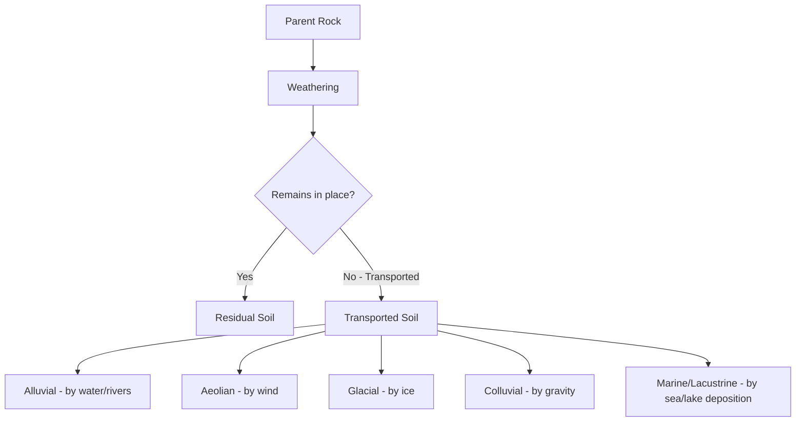
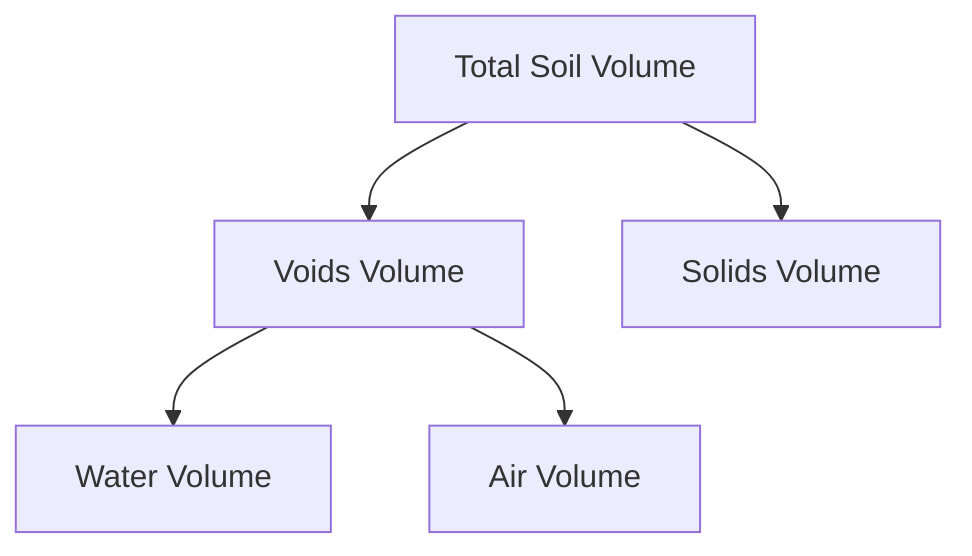

## Soil Formation, Composition, and Classification

### Definition and Scope

Soil, in geotechnical engineering, refers to the naturally occurring, unconsolidated or weakly cemented assemblage of mineral particles, organic matter, water, and air that overlies bedrock. Understanding how soil forms, what it is composed of, and how it is classified is foundational to nearly all subsequent geotechnical analysis, since soil behavior (strength, compressibility, permeability) is fundamentally governed by particle size, mineralogy, and structural arrangement established during formation.

### Soil Formation Processes

**1. Weathering of Parent Rock**

Soil originates from the breakdown of parent rock material through two primary weathering mechanisms:

*Physical (Mechanical) Weathering*: Breaks rock into smaller fragments without changing chemical composition, through processes such as:

- Freeze-thaw cycling (water expansion in rock fractures)
- Thermal expansion/contraction cycling
- Abrasion (wind, water, glacial action)
- Root wedging and biological activity
- Unloading/exfoliation (stress relief as overlying material erodes)

*Chemical Weathering*: Alters the mineral composition of rock through chemical reactions, including:

- Hydrolysis (reaction of minerals with water, particularly significant for feldspar breakdown into clay minerals)
- Oxidation (particularly of iron-bearing minerals)
- Carbonation (reaction with dissolved CO₂, significant for carbonate rocks)
- Dissolution (direct dissolving of soluble minerals)

**[Inference]** The relative dominance of physical versus chemical weathering in producing a given soil deposit depends heavily on climate (temperature, precipitation) and parent rock type; tropical climates generally favor chemical weathering while arid/cold climates favor physical weathering, though this is a generalized tendency rather than a strict rule.

**2. Transportation and Deposition (for Transported Soils)**

Weathered material may remain in place (residual soil) or be transported and deposited elsewhere by natural agents, which strongly influences resulting soil characteristics:

- **Alluvial soils**: Deposited by flowing water (rivers, streams); typically well-sorted by particle size due to varying water velocity, often stratified in layers.
- **Aeolian soils**: Deposited by wind (e.g., loess, dune sand); typically uniform, fine-grained, and often exhibit unique structural characteristics (e.g., loess's metastable structure prone to collapse upon wetting).
- **Glacial soils**: Deposited directly by glacial ice (till) or by glacial meltwater (outwash); till is typically poorly sorted (wide range of particle sizes), while outwash is better sorted.
- **Colluvial soils**: Moved by gravity (e.g., landslide deposits, talus slopes); typically poorly sorted and can contain large rock fragments mixed with fines.
- **Marine/Lacustrine soils**: Deposited in seas or lakes; often fine-grained, uniform, and can include significant organic content or unique mineralogy depending on depositional environment.

**Residual soils**, by contrast, remain at the location of parent rock weathering and often retain some structural relationship to the parent rock (relict structure), gradually transitioning with depth from soil to weathered rock to intact bedrock.

### Soil Composition (Phase Diagram)

Soil is a three-phase system consisting of solids, water, and air, commonly represented using a phase diagram for volumetric and weight relationships.

**Key Weight-Volume Relationships:**

$$e = \frac{V_v}{V_s} \quad \text{(void ratio)}$$

$$n = \frac{V_v}{V} \quad \text{(porosity)}$$

$$S = \frac{V_w}{V_v} \times 100\% \quad \text{(degree of saturation)}$$

$$w = \frac{W_w}{W_s} \times 100\% \quad \text{(water content)}$$

$$\gamma = \frac{W}{V} \quad \text{(unit weight)}$$

$$G_s = \frac{W_s}{V_s \cdot \gamma_w} \quad \text{(specific gravity of solids)}$$

**Relationship between void ratio and porosity:**

$$n = \frac{e}{1+e}$$

### Mineralogical Composition

**Coarse-Grained Soil Minerals**

Predominantly composed of primary (unweathered or minimally weathered) minerals such as quartz, feldspar, and mica, which are chemically stable and resistant to further weathering, giving coarse-grained soils (sands, gravels) relatively inert, non-plastic behavior.

**Fine-Grained Soil Minerals (Clay Minerals)**

Formed through chemical weathering and characterized by sheet-like crystalline structures:

- **Kaolinite**: 1:1 layer structure (one silica sheet + one alumina sheet), strongly bonded by hydrogen bonds between layers, resulting in low swelling potential and relatively low plasticity among clay minerals.
- **Illite**: 2:1 layer structure (alumina sheet sandwiched between two silica sheets), bonded by potassium ions between layers, exhibiting moderate plasticity and moderate swelling potential.
- **Montmorillonite (Smectite group)**: 2:1 layer structure similar to illite but with weak bonding between layers, allowing water molecules to enter the interlayer space readily, resulting in high swelling potential, high plasticity, and significant volume change behavior (shrink-swell behavior problematic for foundations).

**[Inference]** The specific swelling and plasticity behavior of a given clay deposit depends on the proportion of these minerals present, exchangeable cation type, and pore water chemistry; mineralogical identification (e.g., via X-ray diffraction) provides more definitive characterization than field/index testing alone, though index tests remain the standard practical proxy.

### Particle Size Classification

Soil particles are broadly categorized by size, with boundaries defined slightly differently across classification systems (USCS vs. AASHTO vs. others):

| Particle Type | Approximate Size Range (USCS) |
| --- | --- |
| Boulders | > 300 mm |
| Cobbles | 75 mm – 300 mm |
| Gravel | 4.75 mm – 75 mm |
| Sand | 0.075 mm – 4.75 mm |
| Silt | 0.002 mm – 0.075 mm |
| Clay | < 0.002 mm |

**[Unverified]** Exact size boundaries differ slightly between USCS, AASHTO, and international standards (e.g., BS, ISO); values shown reflect commonly cited USCS boundaries and should be cross-checked against the specific classification system governing a given project.

Note that "clay" as a particle size designation (based on size alone) differs from "clay" as a mineralogical/behavioral designation; fine particles below 0.002 mm may not necessarily exhibit clay mineral plasticity behavior, which is why the USCS also incorporates plasticity-based (Atterberg limit) criteria rather than relying on grain size alone for fine-grained soil classification.

### Grain Size Distribution and Gradation

Grain size distribution is typically determined via sieve analysis (coarse fraction) and hydrometer analysis (fine fraction), plotted as a cumulative percent passing curve on a semi-log scale.

**Coefficient of Uniformity:**

$$C_u = \frac{D_{60}}{D_{10}}$$

**Coefficient of Curvature:**

$$C_c = \frac{(D_{30})^2}{D_{10} \times D_{60}}$$

where $D_{10}$, $D_{30}$, $D_{60}$ represent the particle diameters at which 10%, 30%, and 60% of the sample (by weight) is finer.

**Well-graded soil criteria (per USCS):**

- Gravel: $C_u > 4$ and $1 \leq C_c \leq 3$
- Sand: $C_u > 6$ and $1 \leq C_c \leq 3$

Soils not meeting these criteria are classified as poorly graded (uniform or gap-graded).

### Atterberg Limits and Plasticity

For fine-grained soils, the Atterberg limits define moisture content boundaries between different consistency states:

- **Liquid Limit (LL)**: Water content at the transition between liquid and plastic states, determined via the Casagrande cup test or fall cone test.
- **Plastic Limit (PL)**: Water content at the transition between plastic and semi-solid states, determined by the thread-rolling test (soil crumbles when rolled into a 3 mm thread).
- **Shrinkage Limit (SL)**: Water content below which further moisture loss causes no additional volume change.

**Plasticity Index:**

$$PI = LL - PL$$

The plasticity index quantifies the range of water content over which the soil exhibits plastic behavior, and is a key parameter for both classification and behavior prediction (higher PI generally correlates with higher clay content and greater compressibility/swelling potential).

### Unified Soil Classification System (USCS)

The USCS is the most widely used engineering classification system, dividing soils into major groups based on grain size and plasticity:

**Coarse-Grained Soils** (more than 50% retained on No. 200 sieve):

- **G** = Gravel (more than 50% of coarse fraction retained on No. 4 sieve)
- **S** = Sand (more than 50% of coarse fraction passing No. 4 sieve)

Combined with secondary symbols:

- **W** = Well-graded
- **P** = Poorly graded
- **M** = Silty
- **C** = Clayey

Examples: GW (well-graded gravel), SP (poorly graded sand), SC (clayey sand)

**Fine-Grained Soils** (50% or more passing No. 200 sieve):

- **M** = Silt
- **C** = Clay
- **O** = Organic

Combined with:

- **L** = Low plasticity (LL < 50)
- **H** = High plasticity (LL ≥ 50)

Examples: CL (low-plasticity clay), MH (high-plasticity silt), OL (organic soil, low plasticity)

**Plasticity Chart (Casagrande Chart)**

Classification of fine-grained soils uses the plasticity chart, plotting PI against LL, with the empirical "A-line" separating clays (above the line) from silts (below the line):

$$PI_{A-line} = 0.73 \times (LL - 20)$$

Soils plotting above the A-line and with PI > 7 are classified as clays (C); soils plotting below the A-line or with PI < 4 are classified as silts (M). A "CL-ML" dual classification zone exists for soils with PI between 4 and 7 plotting above the A-line.

### AASHTO Classification System

An alternative system commonly used for highway/pavement subgrade evaluation, classifying soils into groups A-1 through A-7, with A-1 representing the best subgrade materials (granular, well-graded) and A-7 representing the poorest (highly plastic clays). Includes a Group Index (GI) calculation providing a finer-grained numerical rating within each group:

$$GI = (F_{200} - 35)[0.2 + 0.005(LL - 40)] + 0.01(F_{200} - 15)(PI - 10)$$

where $F_{200}$ = percent passing No. 200 sieve (as a whole number, not decimal)

**[Inference]** The AASHTO GI formula as commonly presented includes rules for zero/negative term handling (e.g., if any term is negative, it is taken as zero) that vary slightly in presentation across references; the current AASHTO M 145 standard should be consulted for the precise computational procedure.

### Example: USCS Classification Walkthrough

**Given laboratory data:**

- Percent passing No. 4 sieve = 95%
- Percent passing No. 200 sieve = 8%
- $C_u$ = 5.2, $C_c$ = 1.8

**Step 1 — Determine coarse vs. fine-grained:**

Since only 8% passes the No. 200 sieve (< 50%), this is a coarse-grained soil.

**Step 2 — Determine gravel vs. sand:**

Since 95% passes the No. 4 sieve, more than 50% of the coarse fraction passes No. 4, so this is classified as **sand**.

**Step 3 — Determine gradation (since less than 12% fines, gradation governs primary classification):**

For sand: requires $C_u > 6$ and $1 \leq C_c \leq 3$. Here $C_u = 5.2$, which does not exceed 6.

**Step 4 — Classification:**

Since the $C_u$ criterion for well-graded sand is not met, this soil classifies as **SP (poorly graded sand)**.

### Soil Structure and Fabric

**Single-Grained Structure**: Typical of coarse-grained soils (sands, gravels), where particles rest directly on one another without significant cohesive bonding, governed primarily by interlocking and friction.

**Flocculated Structure**: Common in clay deposits formed in saline (marine) environments, where edge-to-face particle attractions dominate, producing a loose, high-void-ratio, "house of cards" arrangement with relatively high initial strength but high compressibility upon disturbance.

**Dispersed Structure**: Common in clays formed or reworked in freshwater environments, or remolded clays, where particles align more face-to-face in a more parallel, oriented arrangement, generally producing lower permeability and different strength characteristics compared to flocculated structure.

**[Inference]** The specific engineering property differences attributed to flocculated versus dispersed structure (e.g., exact permeability or strength ratios) are soil-specific and best treated as general behavioral tendencies documented in soil mechanics literature rather than fixed universal values.

### Common Design/Classification Pitfalls

- **Relying on grain size alone to classify fine-grained soils**, without performing Atterberg limit tests, which can misclassify soils since particle size and plasticity behavior do not always correlate directly (particularly for silts versus clays of similar size).
- **Confusing dampproofing-relevant soil descriptions with engineering classification**, since colloquial soil descriptions (e.g., "loam," "topsoil") are agricultural/pedological terms, not engineering (USCS/AASHTO) classifications.
- **Ignoring organic content**, which significantly affects compressibility, strength, and classification (soils with high organic content require separate classification as Pt (peat) or O-group soils, and typically require special foundation treatment).
- **Applying laboratory index test results without considering natural water content and in-situ structure**, since remolding/disturbance during sampling can significantly alter measured behavior compared to true in-situ conditions, particularly for sensitive clays.
- **Overlooking regional/local soil classification system variations**, particularly for international projects where AASHTO, USCS, BS 5930, or other regional systems may apply different boundary criteria.

### Related Topics

- Index properties and Atterberg limits laboratory testing
- Grain size analysis: sieve and hydrometer testing procedures
- Soil phase relationships and weight-volume calculations
- Clay mineralogy and its influence on expansive soil behavior
- Effective stress principle and soil-water interaction
- Compaction and soil improvement techniques
- Consolidation and settlement behavior of fine-grained soils
- Shear strength parameters and failure criteria for classified soil types